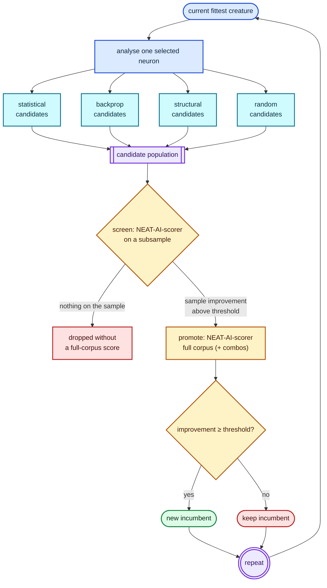
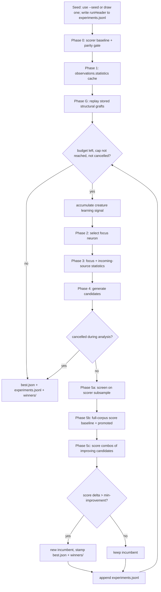
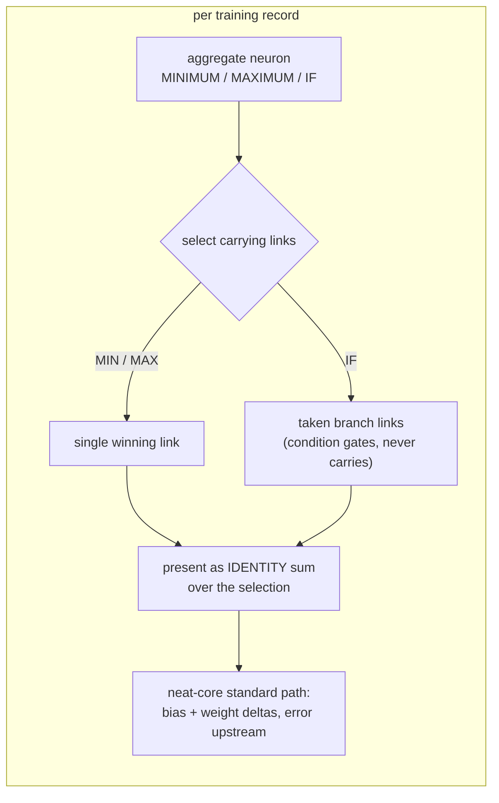
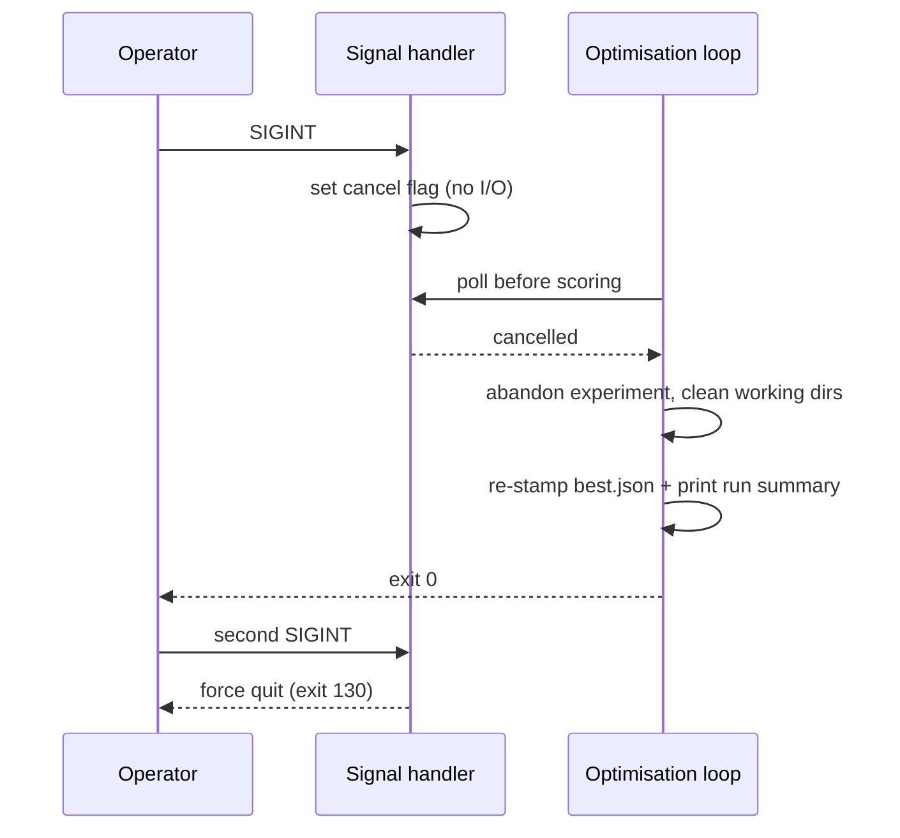

# NEAT-AI-Lamarck

> Experimental: teaching evolved NEAT-AI creatures that what they learn in life can be inherited. Adventurous mutations, sceptical scorer — Lamarck would be proud.

NEAT-AI-Lamarck is an experimental Rust optimiser for already-fit [NEAT-AI](https://github.com/stSoftwareAU/NEAT-AI) creatures.

It does **not** replace normal NEAT evolution. It takes the current fittest
creature, studies how that creature behaves across the training data, generates
small statistically informed / backpropagation-informed / exploratory variants,
and asks the existing [NEAT-AI-scorer](https://github.com/stSoftwareAU/NEAT-AI-scorer)
to decide whether any candidate is genuinely fitter.

The experiment is intentionally conservative: candidate generation may be
adventurous, but acceptance is not.

## Status

The optimiser described below is **built and running** against production
GRQ-scale creatures. The whole spine exists — Phase-0 parity gate, observations
cache, focus selection, backprop learning signals, nine candidate strategies,
two-phase screen/promote scoring, candidate combos, structural graft memory,
the experiment journal and the `report` subcommand.

Measured economics from a 45-minute production run live in
[`docs/baseline-economics.md`](docs/baseline-economics.md).

This document describes what the code does today. Known gaps are listed under
[Outstanding work](#outstanding-work), each with an issue.

## Core principle



Only the standard scorer may declare a winner, and only on the full corpus:
screening filters cheaply, it never accepts. `--screen-sample-rate 1` collapses
the two phases back into a single full-corpus batch.

## Why "Lamarck"?

The name is deliberately playful rather than biologically literal. The
experiment starts with an evolved creature, lets it "experience" its training
environment, and converts useful acquired information into heritable changes to
the creature.

## Related repositories

- [NEAT-AI](https://github.com/stSoftwareAU/NEAT-AI) — TypeScript evolutionary trainer and current backpropagation implementation.
- [NEAT-AI-core](https://github.com/stSoftwareAU/NEAT-AI-core) — shared Rust creature/network implementation used by this project.
- [NEAT-AI-scorer](https://github.com/stSoftwareAU/NEAT-AI-scorer) — authoritative Rust scorer. Its directory/batch scoring path evaluates Lamarck candidate populations.

This repository follows the Rust workspace/tooling conventions of
NEAT-AI-scorer where practical.

## Scope

Lamarck answers one practical question:

> Can information gathered from the training observations, the current
> creature's internal behaviour, and conventional backpropagation produce useful
> mutations faster than ordinary evolutionary search alone?

A successful mutation may come from statistics, backpropagation, a structural
hypothesis, or dumb luck. Lamarck only cares that the authoritative score
improves, and records enough to tell which strategies actually earn their cost.

It is **not**:

- a replacement for the normal NEAT evolutionary process;
- a wholesale rewrite of NEAT-AI training;
- an optimiser allowed to accept predicted improvements without full scoring;
- an online/live trading optimiser;
- an attempt to modify many unrelated areas of a creature at once.

## Runtime model

Lamarck runs alongside the normal evolutionary system on other machines, so the
supplied creature is **perishable**: while Lamarck works, evolution may discover
a new global champion elsewhere. The default wall-clock budget is therefore
**45 minutes** (`--timeout-seconds 2700`), and cheap repeatable experiments are
preferred over one expensive analysis that eats the window.

### Production scale target

The production creature is the GRQ champion (`../GRQ-cluster/network.json`):
about `2511` inputs, `1` output, `~1590` hidden neurons, `~21k` synapses,
`forwardOnly: true`. Streaming statistics, the 45-minute budget and cheap
candidate proposals all exist to stay viable at that scale.

## Usage

```bash
neat_ai_lamarck <creature.json> <training-data-dir> [OPTIONS]
neat_ai_lamarck report <experiments.jsonl>
```

A production-shaped invocation:

```bash
neat_ai_lamarck \
  ../GRQ-cluster/network.json \
  .lamarck/train-data \
  --scorer ../NEAT-AI-scorer/target/release/rust_scorer \
  --output-dir .lamarck \
  --timeout-seconds 2700 --candidates 100 --seed 1 \
  --focus-policy weighted --screen-sample-rate 0.05 \
  --grafts-path ~/.lamarck/grafts.json
```

### Required positional arguments

The run cannot start without them:

- current fittest creature JSON;
- training-data directory.

### Required, but defaulted

The run always uses these; the flag only overrides the value.

| Flag | Default | Purpose |
|------|---------|---------|
| `--scorer` | `rust_scorer` on `PATH` | NEAT-AI-scorer binary. Scoring is **mandatory** — safety invariant 3 lets only the scorer declare a candidate fitter, so a run that cannot spawn the binary aborts, at the Phase-0 gate or after 3 consecutive scorer failures when `--skip-phase0` is passed. |
| `--output-dir` | `.` | Holds `best.json`, `experiments.jsonl`, `winners/` and per-experiment working directories. |
| `--candidates` | `100` | Candidates generated per experiment. |
| `--timeout-seconds` | `2700` | Wall-clock budget (45 minutes). |
| `--min-improvement` | `1e-6` | Absolute score delta required to accept, strict `>`. |
| `--screen-sample-rate` | `0.05` | Scorer subsample for the screen phase. `1` (or `>= 1`) disables screening. |
| `--screen-promote-threshold` | `1e-6` | Minimum sample-score Δ before a candidate earns a full-corpus score. |
| `--focus-policy` | `weighted` | `weighted` \| `high-error` \| `random` \| `unsaturated`. |
| `--quick-sample-records` | `25000` | Record cap for `--quick` observations / focus / learning scans. |

### Genuinely optional

Leaving these unset changes behaviour.

| Flag | Effect when set |
|------|-----------------|
| `--seed` | Deterministic RNG seed. When unset a seed is drawn from OS entropy and recorded in the journal `runHeader`, so the run stays replayable. |
| `--max-experiments` | Stop after this many experiments, whichever of it and `--timeout-seconds` comes first. Unset = wall-clock bounded only. |
| `--focus-neuron` | Pin every experiment to one neuron UUID (debug / smoke); overrides `--focus-policy`. |
| `--structural-only` | Generate only synapse/neuron growth candidates. |
| `--quick` | Use the sampled `observations-quick.statistics` cache and cap focus/learning scans. Acceptance still uses the full corpus. |
| `--compute-correlations` | Compute the expensive input×input correlation matrix in observations. |
| `--skip-phase0` | Skip the Phase-0 parity gate. |
| `--preserve-losers` | Keep rejected candidate, promote, combo and graft working directories instead of deleting them. |
| `--grafts-path` | JSON store for structural graft memory; enables Phase-G replay and recording. Keep it outside any wiped work directory. |
| `--graft-replay-budget-seconds` | Wall-clock budget for Phase-G replay. Default: 10% of `--timeout-seconds`. |
| `--backprop-learning-rate` | Learning rate for `backprop` candidate proposals. Default: `0.01` (the NEAT-AI port value). Must be `> 0` — a non-positive or non-finite value aborts the run instead of reverting to the default. Recorded in the journal `runHeader` so an A/B arm is identifiable. |
| `--backprop-max-bias-adjustment-scale` | ± cap on one `backprop` bias step (`BackpropConfig::maximum_bias_adjustment_scale`). Default: `10`. On a focus whose blame mass saturates the cap the step is cap-bound at every learning rate, so this is the knob that resizes it — see [`docs/followup-economics.md`](docs/followup-economics.md). Must be `> 0`; a non-positive or non-finite value aborts the run. Recorded in the journal `runHeader`. |

## How a run works



### Phase 0 — authoritative baseline and parity

Before optimisation starts Lamarck scores the supplied creature with the
scorer (finite `score`/`error` required), computes its own whole-creature mean
squared error over the same training directory through the compiled network, and
compares the overlapping quantities within documented epsilon
(`lamarck/src/parity.rs`):

- **error:** abs `1e-6` or rel `1e-5`;
- **unpenalized score** `1 - error` vs `scorer.score + complexityPenalty`:
  abs `1e-5` or rel `1e-4`.

Unexplained disagreement aborts the run, which stops Lamarck optimising a subtly
different metric. `--skip-phase0` disables the gate.

### Phase 1 — `observations.statistics`

The training-data directory holds a one-time statistics cache,
`observations.statistics`. If it is absent, Lamarck scans the complete corpus
and writes it. `--quick` builds/reuses a sampled
`observations-quick.statistics` from the first `--quick-sample-records` records
(default `25000`) so smoke runs finish in minutes rather than about an hour on
GRQ-scale data. Full caches remain the production default.

The file is human-readable **JSON** carrying semver format and algorithm
versions plus enough identity metadata to reject stale caches: input observation
count, output count, record count, a deterministic corpus identity, creation
timestamp, and the cache mode. A statistics file for different training data is
never silently reused.

For every raw input observation, and every target, it records: count; mean;
variance and standard deviation; minimum and maximum; zero, non-zero and
non-finite counts; mean absolute value; RMS; population skewness and *excess*
kurtosis; and approximate 1/5/25/50/75/95/99% quantiles from a capped reservoir
sample.

Skewness (`m3 / m2^1.5`) and excess kurtosis (`m4 / m2² − 3`, so `0` for a
Gaussian column) come free from the same streaming pass — the Welford
accumulator carries the third and fourth central moments. Both report `0` for a
constant or empty column, where distribution shape is undefined. They are
consumed by the `stats_skew_bias` candidate strategy below; the cache
`algorithmVersion` is `1.1.0` since they were added, so a pre-`1.1.0` cache is
rejected as stale and regenerated.

Relationships: observation/target Pearson correlations are always collected. The
expensive input×input correlation matrix is opt-in via `--compute-correlations`
(default off, after [#22](https://github.com/stSoftwareAU/NEAT-AI-Lamarck/issues/22)
removed fields nothing consumed).

**Covariances are derived, never stored.** A covariance is exactly
`r · σ_a · σ_b` from fields the cache already writes, so storing it would
duplicate data with nothing extra to say — the same trap #22 cleared. Callers
that want one use `ObservationsStatistics::input_covariance` (input×input,
`None` unless `--compute-correlations` ran) or `input_target_covariance`
(input×target), which apply that identity to the stored correlation and standard
deviations.

### Phase G — structural graft memory

With `--grafts-path` set, Lamarck keeps a local JSON store of structural changes
that previously won: added synapses and added hidden-neuron bridges, each with
its attachment requirements and a helpful/harmful tally.

Before the experiment loop it classifies every stored graft against the opening
fittest (present / applicable / inapplicable), retires the inapplicable ones,
scores each applicable graft as a single, then scores dampened combinations of
the helpful ones, and applies the best accepted result. Persistently harmful
grafts are retired. New structural accepts are recorded back into the store —
for a combo accept, each structural member is recorded at its **solo** weights,
never the dampened merge, so replay cannot double-dampen.

### Phase 2 — select a focus neuron

Each iteration focuses on one non-input neuron. The default policy
(`--focus-policy weighted`) draws weighted-random by **error influence**: output
residual L1 mass, or hidden `|total blame|` decayed by distance to the nearest
output, so deep diluted neurons rarely win. Outputs are usually strongest but
are not chosen every time, and zero-signal neurons are never selected. The
selector also folds in each neuron's own accept history.

`high-error` always picks the single strongest neuron and sticks there — avoid
it in production. `random` and `unsaturated` remain available for A/B work, and
`--focus-neuron` pins a UUID for debug and smoke runs.

### Phase 3 — creature-specific analysis

Static observation statistics describe the dataset; hidden-neuron behaviour
depends on the incumbent and is measured against that creature. For the selected
neuron Lamarck collects streaming pre-activation and post-activation statistics
(mean, variance, standard deviation, min/max, near-zero and saturation
fractions) plus, for each incoming connection, source statistics and the
source's relationship with the neuron's learning/error signal. Raw observation
sources reuse `observations.statistics` where mathematically equivalent; hidden
sources are measured from the current creature.

#### Two scans per experiment

The analysis work is grouped by what it depends on, so an experiment walks the
training sample **twice**, not once per measurement (`lamarck/src/analysis.rs`):


Scan 1 is focus-independent; scan 2 needs the focus that the first scan's
signals select — everything in a group shares one activation per record. Each
measurement
keeps its own streaming accumulator, and the standalone `collect_*` / `refine_*`
functions drive those same accumulators, so a fused result is bit-identical to
the per-pass one. The residual ranking streams the sample rather than
materialising it as activation probes.

### Backpropagation

Lamarck ports NEAT-AI backprop behaviour by wiring creatures through neat-core's
`propagate_topological_loop` (the TS/WASM reverse-topo contract), then folding
the result into an analyse-without-apply `LearningSignal`.

- Config / LR / limits / sparse ratio: `lamarck/src/backprop.rs`
- Creature → `PropagateInput` layout + sparse RNG: `lamarck/src/propagate_layout.rs`
- Apply (optional): `apply_learnings` clones the creature and writes proposed
  bias/weight updates — optimisation still accepts only via the scorer
- Defaults use fixed `generations: 1.0` and `sparse_ratio: 1.0` for
  deterministic full-network signals under a seeded RNG

A hidden neuron has no natural target — blame comes from the propagated learning
signal, never an invented `expected_hidden - actual_hidden`.

#### Aggregate neurons (MINIMUM / MAXIMUM / IF)

neat-core's reverse-topological loop hands aggregate squashes back as
`PropagateOutcome::Special` and stops there — the TypeScript trainer runs a
per-squash custom `propagate` instead. Lamarck's equivalent is to linearise the
aggregate for each record: the neuron is presented to the loop as an `IDENTITY`
sum over exactly the links that produced that record's activation (issue #83).



Without this, an aggregate output ends the reverse-topo walk before anything is
accumulated: on the production GRQ creature (`MINIMUM` output) the whole
learning signal was empty — 0 of 1600 neurons and 0 of 21 889 synapses carried
any blame.

Parity fixtures live under `lamarck/tests/fixtures/backprop/` (tolerances about
`1e-9`–`1e-6`). Regenerate goldens:

```bash
LAMARCK_REGEN_BACKPROP_FIXTURES=1 cargo test -p neat_ai_lamarck --test backprop_parity
```

Optional Deno helper (sibling `../NEAT-AI`): `scripts/generate_backprop_parity_fixtures.ts`.

### Phase 4 — candidate generation

Every candidate is a descendant of the current incumbent carrying a small,
interpretable change. `--candidates` (default `100`) sets the population size,
sized to keep a ~10-core scorer box saturated. The generator front-loads
structural probes, then round-robins the remaining budget across the strategies
below; `--structural-only` restricts it to growth candidates.

| Journal tag | What it proposes |
|-------------|------------------|
| `backprop` | Bias, or the strongest incoming weight, stepped by the accumulated learning signal (absolute weight delta capped at `0.01`). Skipped entirely when no blame reached the focus — the batch slot goes to a strategy that can clear `--min-improvement` (issue #83). |
| `mean_error_bias` | Output-focus `bias += mean((target - post) * derivative)`, damped to a tenth and skipped when the neuron is saturated. |
| `stats_weight` | Weight nudge on the best incoming source, direction from its correlation with the error, magnitude scaled by the source's standard deviation. |
| `stats_bias` | Bias step scaled by the measured pre-activation spread, pushed away from saturation. |
| `stats_skew_bias` | Output-focus bias stepped a quarter of the way from the target's mean towards its median when `\|skewness\| ≥ 0.25`, damped by the target's excess kurtosis and skipped when the neuron is saturated. |
| `structural_add` | New upstream synapse from a residual-ranked unused source, weight from a fraction of the residual OLS coefficient. |
| `structural_add_neuron` | New hidden neuron bridging top residual sources into the focus, squash chosen from the residual sign and observation scale; falls back to splitting the strongest incoming synapse. |
| `structural_weaken` | Halves the weight of the smallest-magnitude incoming synapse. |
| `random` | Random bias or weight delta within ±0.05. |

There is no fixed quota for random controls — random accidents are valid
improvements and are accepted if they win. Candidate changes use measured source
scale and neuron behaviour rather than arbitrary absolute deltas, and each
strategy produces alternatives around its preferred direction instead of trusting
a single estimated optimum.

Every candidate records the strategy, a full-precision description of the exact
mutation, and the old/new value for scalar changes.

### Phase 5 — authoritative candidate scoring

The incumbent plus all candidates are written to a temporary directory:

```text
candidates-exp-7/
    baseline.json
    candidate-000.json
    candidate-001.json
    ...
```

Scoring runs in three steps:

1. **Screen** the full candidate directory with
   `rust_scorer --sample-rate 0.05 --sample-phase <n> …` (≈0.7–1s/creature on
   GRQ against ≈11s full). The sample phase rotates per experiment.
2. **Promote** only stems with sample Δ `> --screen-promote-threshold` into a
   full-corpus batch, so full-corpus time is not spent on sample noise. An empty
   screen ends the experiment without a full-corpus call.
3. **Combine** — when two or more promoted candidates each beat the baseline,
   their mutation deltas are merged into combination creatures (all pairs, then
   triples, budget-capped) and scored in one further full-corpus batch.
   Synapses newly stacked into the same target by `k` members are scaled by
   `k^-0.5` so a merge is not louder than the sum of its evidence. Conflicting
   edits to the same neuron or edge are skipped.

Scorer argv is the locked two-argument form plus the screen sampling flags only;
Lamarck never passes `--gpu` or `--cost`, so scorer defaults decide backend and
loss. Pass `--screen-sample-rate 1` to disable screening.

The incumbent is included in every scored batch, so a candidate is never
compared against a stale score. Acceptance uses the scorer JSON **`score`**
field (**larger-is-better**) from the **full-corpus** score only — never `error`
alone:

```text
candidate.score - baseline.score > 1e-6
```

(default absolute threshold, strict greater-than). GRQ `costOfGrowth` is `1e-7`,
so `1e-6` sits deliberately above growth noise.

An accepted winner becomes the incumbent immediately: `best.json` is rewritten
with the creature's `uuid`/`tags` re-attached and a run-summary `lamarck` tag,
a copy is kept under `winners/`, structural accepts are recorded into the graft
store, and creature-specific analysis is recomputed next iteration.

### Phase 6 — repeat until a stopping rule fires

The loop keeps selecting neurons and testing candidates until the first of four
stopping rules fires. A failed experiment simply moves on to another attempt.

| Stopping rule | Trigger | Reported as |
|---------------|---------|-------------|
| Wall-clock timeout | `--timeout-seconds` elapsed, checked between experiments. | `timeout` |
| Experiment cap | `--max-experiments N` experiments completed. Unset = wall-clock bounded only. | `max-experiments` |
| Cancellation | `SIGINT` (Ctrl-C) or `SIGTERM`. | `cancelled` |
| Scorer failure | Three consecutive scorer batches fail (`--skip-phase0` runs). | Run aborts with an error |

The stopping rule that ended the run is printed in the run summary as
`stopped on:`.

**Graceful cancellation.** `SIGINT`/`SIGTERM` only set a flag; the loop polls it
and stops through the normal exit path, so `best.json` is still re-stamped with
the run-summary `lamarck` tag and the summary is still printed. A signal that
arrives during analysis abandons the in-flight experiment before its scorer
batch (no working directory is written for it); one that arrives during scoring
stops the loop after that experiment has been journalled. Either way no
`candidates-exp-N/` directory is left behind, and the process exits `0`. A
**second** signal force-quits immediately with exit code `130`, for a run wedged
inside a long scorer batch.



The optimisation path is cumulative:

```text
C0 -> C1 -> C2 -> C3 -> ...
```

Every edge is an independently full-corpus-scored improvement.

## Outputs

Written under `--output-dir`:

```text
best.json           # best verified creature, tagged with the run summary
experiments.jsonl   # machine-readable experiment journal
winners/            # winner-NNNN.json per accepted improvement
```

Per-experiment working directories (`candidates-exp-N/`, `promote-exp-N/`,
`combos-exp-N/`, `phase0-baseline/`, `graft-replay/`) are deleted as the run
proceeds unless `--preserve-losers` is passed. The supplied creature file is
never modified: `best.json` starts as a verbatim copy of it.

## Experiment journal

`experiments.jsonl` is one JSON object per line, and is part of the experiment
rather than debug logging.

The **first line of each run** is a `runHeader` record carrying the
reproducibility contract (issue #71) — everything needed to replay the run:

| Field | Meaning |
|-------|---------|
| `record` | Always `runHeader`; absent on experiment records. |
| `timestampUnix` | Run start. |
| `seed` | Effective RNG seed — pass it back as `--seed` to replay. |
| `seedSource` | `supplied` (`--seed` given) or `drawn` (from OS entropy). |
| `version` | Lamarck version that wrote the journal. |
| `config` | Run knobs: `creature`, `trainingData`, `scorerPath`, `timeoutSeconds`, `maxExperiments`, `candidates`, `minImprovement`, `screenSampleRate`, `screenPromoteThreshold`, `focusNeuron`, `focusPolicy`, `statsMode`, `quickSampleRecords`, `computeCorrelations`, `structuralOnly`, `phase0Parity`, `preserveLosers`, `maxConsecutiveScorerFailures`, `graftsPath`, `graftReplayBudgetSeconds`. |

When `--grafts-path` is set, the Phase-G replay writes one `graftReplay` record
before the first experiment (issue #74). A replay can improve the incumbent with
no candidate stem at all, so it needs its own line or `report` cannot see it:

| Field | Meaning |
|-------|---------|
| `record` | Always `graftReplay`. |
| `timestampUnix`, `elapsedMs` | When the phase finished and how long it took. |
| `graftsApplied`, `accepted` | Grafts merged into the incumbent, and whether the incumbent improved. |
| `baselineScore`, `score`, `improvement` | Score before, score after, and the accepted Δ. |
| `scorerSuccesses`, `scorerFailures` | Scorer batches run during the phase. |
| `replayError` | Present when the phase aborted instead of completing. |

Every following line is one experiment:

| Field | Meaning |
|-------|---------|
| `experimentNumber`, `timestampUnix` | Sequence and wall-clock position. |
| `seed` | Effective run seed (matches the header). |
| `incumbentId` | Incumbent shape identity (`in…-out…-n…-s…`). |
| `baselineScore` | Authoritative baseline for this experiment. |
| `focusNeuron` | Selected neuron UUID. |
| `focusStats` | The focus scan that drove the experiment (issue #70) — structure (`squash`, `incomingCount`), activation statistics (`preMean`, `preVariance`, `preMin`, `preMax`, `postMean`, `postVariance`, `nearZeroFraction`, `saturationFraction`, `recordCount`), output residuals (`meanError`, `meanAbsError`, `meanAdjustedError`, `meanDerivative`) and backprop blame (`meanBlame`, `meanAbsBlame`, `blameCount`, `blameNoChange`). Error and blame fields are omitted when the scan produced none; the whole object is absent from journals written before the field existed. |
| `candidates[]` | Per candidate: `strategy`, `focusNeuron`, `mutation`, `oldValue`, `newValue`. |
| `screenScores`, `scores` | Sample-phase and full-corpus scores by stem. |
| `winner`, `improvement`, `accepted` | Outcome of the experiment. |
| `analysisMs`, `scorerMs` | Where the time went. |
| `scorerError` | Present when the batch failed. |
| `comboMembers`, `combosScored`, `combosDampened`, `comboDampen` | Combination-scoring detail. |
| `comboMemberIndices` | Indices into `candidates[]` of the accepted winner's members — one entry for a single, several for a merged `combo-NNN-kM`. Present only on an acceptance, and absent from journals written before issue #74. |

Summarise strategy economics from a journal with the `report` subcommand:

```bash
neat_ai_lamarck report experiments.jsonl
# or: scripts/report-experiments.sh experiments.jsonl
```

It emits per-strategy appearances/wins/acceptance rate, focus history,
improvement series, candidates per scorer-minute and per screen-minute,
analysis-time fraction, projected batches per 45 minutes, and combo totals.

`openingBaselineScore` is anchored on a **full-corpus** score only (issue #84):
the `scores.baseline` of the first experiment that actually promoted, which is
the score Phase-0 measured when it ran, because the incumbent cannot change
before the first acceptance. An experiment whose batch screened empty recorded
only a subsample baseline — that baseline swings by ~5e-3 between experiments,
thousands of times the accept threshold, so it is never used as the anchor. Both
`openingBaselineScore` and `totalScoreImprovement` (and with them
`relativeScoreImprovement`) are `null` until a full-corpus baseline exists,
rather than reporting a difference between two different quantities.

Wins are attributed from `comboMemberIndices`, so a merged combo win counts once
for **every** member strategy and is also carried in that row's `comboWins`
(issue #74). The `wins` column therefore sums to more than `acceptances` whenever
combos win. A combo win in a journal written before `comboMemberIndices` existed
names no members, so it cannot be attributed at all — those are counted in
`comboAcceptancesUnattributed` rather than silently dropped.

Phase-G replay gets its own `graftReplay` bucket — `replays`, `accepts`,
`graftsApplied`, `cumulativeImprovement`, `scorerFailures` and `replayErrors` —
which is `null` for a journal with no replay line.

`focusStats` is aggregated into a `focusStats` report object with three buckets —
`all`, `accepted` and `rejected` — each carrying `experiments`,
`meanIncomingCount`, `meanSaturationFraction`, `meanNearZeroFraction`,
`meanPostVariance`, `meanAbsBlame` (magnitudes, so signs cannot cancel out; null
when no experiment in the bucket recorded blame) and `squashCounts`. Comparing
`accepted` against `rejected` is how a finished run answers experimental
questions 4 and 6 below. The object is `null` for a journal with no focus
statistics.

## Safety invariants

These rules are non-negotiable:

1. The supplied fittest creature is never modified in place.
2. Lamarck's custom analysis cannot declare a creature fitter.
3. Every accepted candidate must be scored against the normal complete training dataset by NEAT-AI-scorer.
4. The incumbent is included in each candidate scoring batch as a control.
5. A candidate must improve by more than the configured meaningful-improvement threshold.
6. A failed experiment leaves the incumbent unchanged.
7. Creature topology/serialization must remain compatible with NEAT-AI-core and NEAT-AI-scorer.
8. The original creature is always recoverable.

## Reproducibility

All Lamarck-controlled randomness comes from one **effective seed**: the main
RNG is seeded from it, and the per-experiment backprop RNG is derived from it
deterministically. When `--seed` is omitted the effective seed is drawn from OS
entropy, logged (`seed … (drawn from OS entropy; replay this run with --seed …)`)
and recorded, so every run is replayable.

The effective seed and the run configuration are written as the first line of
`experiments.jsonl` — the `runHeader` record described in
[Experiment journal](#experiment-journal) — and the effective seed is repeated on
every experiment record. To replay a run, take `seed` from its header and pass it
as `--seed` with the same creature, training data and configuration.

The contract: given an identical starting creature, training data,
`observations.statistics`, configuration, software version and effective seed,
the RNG stream — and therefore candidate generation — repeats. One caveat
remains: the experiment count is wall-clock bounded and the screen phase is
derived from the experiment index, so a differently timed replay may run a
different number of experiments and reach a different point in that identical
stream.

## What we have learnt so far

From the 45-minute production-budget baseline in
[`docs/baseline-economics.md`](docs/baseline-economics.md) (single seed, GRQ
champion, 75 experiments):

- accepts are thin — 2 in 75 experiments, both from `random`, cumulative
  Δ ≈ `+2.11e-6`;
- scorer time dominates at ≈83% of the run, so full focused analysis before each
  batch is affordable;
- screening empties most batches (49/75), which is the point: expensive
  full-corpus promotes are skipped when the sample shows nothing;
- no strategy has earned removal — the sample is far too small to disable one.

The open experimental questions the journal is designed to answer:

1. Do statistically informed candidates beat ordinary random mutation often enough to justify their analysis cost?
2. How useful is conventional backpropagation when its proposed changes must survive whole-corpus evolutionary scoring?
3. Which mutation classes produce accepted improvements most often?
4. Are saturated/dead neurons particularly good targets?
5. Are observation correlations useful when adding or removing connections?
6. Does the propagated neuron blame/sensitivity predict successful mutation direction?
7. As the incumbent improves, how quickly does the hit rate fall?
8. Given the 45-minute useful-life constraint, how much analysis is economically justified before trying another candidate batch?

Questions 1–3 and 8 have a first single-seed answer. The follow-up campaign
for #75 — an output-focus slice, a backprop step A/B and a batch-size A/B,
118 further experiments — is written up in
[`docs/followup-economics.md`](docs/followup-economics.md). Its headline: **no
strategy has earned removal**, `--candidates` above ~29 buys nothing on this
creature, and `backprop` fails on a saturated step cap rather than on its
learning rate. Questions 4–7 need the arms wired up by
[#96](https://github.com/stSoftwareAU/NEAT-AI-Lamarck/issues/96) and still to be
run under [#98](https://github.com/stSoftwareAU/NEAT-AI-Lamarck/issues/98).

## Outstanding work

| Issue | Gap |
|-------|-----|
| [#69](https://github.com/stSoftwareAU/NEAT-AI-Lamarck/issues/69) | Unsuccessful candidates are re-scored across experiments instead of being remembered. |
| [#98](https://github.com/stSoftwareAU/NEAT-AI-Lamarck/issues/98) | Three economics arms are wired up (`multi-seed`, `output-neuron`, `backprop-cap` in `scripts/run-followup-economics.sh`) but still **unmeasured**: each needs the production creature and exclusive use of the scorer. |

## Repository layout

```text
NEAT-AI-Lamarck/
├── Cargo.toml
├── rust-toolchain.toml
├── neat-core.expected-version
├── quality.sh
├── deny.toml
├── SECURITY.md
├── .github/workflows/   # scorer-aligned quality gates
├── scripts/
├── docs/
│   ├── architecture.md
│   └── baseline-economics.md
└── lamarck/src/
    ├── lib.rs
    ├── main.rs              # CLI (optimise + report subcommand)
    ├── config.rs            # defaults and run options
    ├── analysis.rs          # the two fused per-experiment training scans
    ├── parity.rs            # Phase-0 scorer parity gate
    ├── observations.rs      # observations.statistics cache
    ├── focus.rs             # focus-neuron selection policies
    ├── backprop.rs
    ├── learning.rs
    ├── propagate_layout.rs
    ├── candidates.rs
    ├── structural.rs        # graph mutation primitives + residual ranking
    ├── combos.rs            # candidate merging and stacked-synapse dampening
    ├── grafts.rs            # structural graft store and phase-G replay
    ├── scorer.rs
    ├── run.rs
    ├── report.rs
    ├── tags.rs
    └── log.rs
```

## Development rules

- Rust edition 2024.
- Pin the Rust toolchain, matching NEAT-AI-scorer initially (`1.95.0`).
- Use TDD for behaviour changes.
- Keep dependencies modest and justified.
- Prefer streaming training-data analysis; the corpus is large.
- Preserve compatibility with NEAT-AI-core/NEAT-AI-scorer rather than duplicating their stable functionality.

## Build and quality gate

Clone **NEAT-AI-core** beside this repository:

```text
parent/
  NEAT-AI-core/
  NEAT-AI-Lamarck/
```

Local gate (mirrors CI):

```bash
./quality.sh < /dev/null
```

Requires **shellcheck**, **cargo-deny** (`cargo install cargo-deny --locked`),
and **codespell** (`pip install --user codespell`).

CI runs on pull requests to `Develop` and includes fmt/clippy/tests/docs,
cargo-deny, gitleaks, cargo-audit, dependency-review, Semgrep, markdownlint,
actionlint, SBOM, shellcheck, and codespell. Branch protection should require
the aggregator check **CI Required Checks**.

PRs also run an auto-format / housekeeping job
(`.github/workflows/auto-format.yml`, Issue #33). The job runs
`cargo fmt --all` and then `cargo update -p neat-core` so `Cargo.lock`
tracks the checked-out NEAT-AI-core path dependency (workers otherwise
rewrite the lock on every `cargo build` and `model_fetch` resets it). If the
working tree changes, the fix is committed and pushed back. The job
deliberately does **not** bump `neat-core.expected-version` — the
breaking-bump gate stays a human acknowledgement. The workflow is validated
by `scripts/check-auto-format-workflow.sh` (invoked from `quality.sh`).

A second PR job (`.github/workflows/version-increment.yml`) bumps the
`lamarck/Cargo.toml` patch version on source changes so remote `runlib`-style
installs rebuild; `scripts/check-version-increment-workflow.sh` validates it
from `quality.sh`.

### neat-core breaking-bump gate

The `neat-core` path dependency is unpinned. CI fails when the sibling
neat-core presents a breaking SemVer bump above
[`neat-core.expected-version`](./neat-core.expected-version). Clear the gate by
updating Lamarck for the change and bumping that baseline in the same PR.
