# NEAT-AI-Lamarck


> Experimental: teaching evolved NEAT-AI creatures that what they learn in life can be inherited. Adventurous mutations, sceptical scorer — Lamarck would be proud.

NEAT-AI-Lamarck is an experimental Rust optimiser for already-fit [NEAT-AI](https://github.com/stSoftwareAU/NEAT-AI) creatures.

It does **not** replace normal NEAT evolution. It takes the current fittest
creature, studies how that creature behaves across the training data, generates
small statistically informed / backpropagation-informed / exploratory variants,
and asks the existing [NEAT-AI-scorer](https://github.com/stSoftwareAU/NEAT-AI-scorer)
to decide whether any candidate is genuinely fitter.

The experiment is intentionally conservative: candidate generation may be
adventurous, but acceptance is not.

## Status

The optimiser described below is **built and running** against production
GRQ-scale creatures. The whole spine exists — Phase-0 parity gate, observations
cache, focus selection, backprop learning signals, nine candidate strategies,
two-phase screen/promote scoring, candidate combos, structural graft memory,
the experiment journal and the `report` subcommand.

Measured economics from a 45-minute production run live in
[`docs/baseline-economics.md`](docs/baseline-economics.md).

This document describes what the code does today. Known gaps are listed under
[Outstanding work](#outstanding-work), each with an issue.

## Core principle

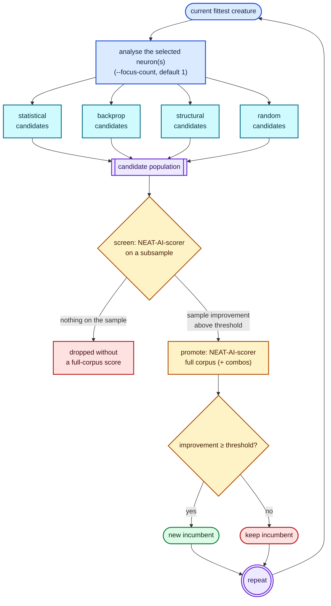

Only the standard scorer may declare a winner, and only on the full corpus:
screening filters cheaply, it never accepts. `--screen-sample-rate 1` collapses
the two phases back into a single full-corpus batch.

## Why "Lamarck"?

The name is deliberately playful rather than biologically literal. The
experiment starts with an evolved creature, lets it "experience" its training
environment, and converts useful acquired information into heritable changes to
the creature.

## Related repositories

- [NEAT-AI](https://github.com/stSoftwareAU/NEAT-AI) — TypeScript evolutionary trainer and current backpropagation implementation.
- [NEAT-AI-core](https://github.com/stSoftwareAU/NEAT-AI-core) — shared Rust creature/network implementation used by this project.
- [NEAT-AI-scorer](https://github.com/stSoftwareAU/NEAT-AI-scorer) — authoritative Rust scorer. Its directory/batch scoring path evaluates Lamarck candidate populations.

This repository follows the Rust workspace/tooling conventions of
NEAT-AI-scorer where practical.

## Scope

Lamarck answers one practical question:

> Can information gathered from the training observations, the current
> creature's internal behaviour, and conventional backpropagation produce useful
> mutations faster than ordinary evolutionary search alone?

A successful mutation may come from statistics, backpropagation, a structural
hypothesis, or dumb luck. Lamarck only cares that the authoritative score
improves, and records enough to tell which strategies actually earn their cost.

It is **not**:

- a replacement for the normal NEAT evolutionary process;
- a wholesale rewrite of NEAT-AI training;
- an optimiser allowed to accept predicted improvements without full scoring;
- an online/live trading optimiser;
- an attempt to modify many unrelated areas of a creature at once.

## Runtime model

Lamarck runs alongside the normal evolutionary system on other machines, so the
supplied creature is **perishable**: while Lamarck works, evolution may discover
a new global champion elsewhere. The default wall-clock budget is therefore
**45 minutes** (`--timeout-seconds 2700`), and cheap repeatable experiments are
preferred over one expensive analysis that eats the window.

### Production scale target

The production creature is the GRQ champion (`../GRQ-cluster/network.json`):
about `2511` inputs, `1` output, `~1590` hidden neurons, `~21k` synapses,
`forwardOnly: true`. Streaming statistics, the 45-minute budget and cheap
candidate proposals all exist to stay viable at that scale.

## Usage

```bash
neat_ai_lamarck <creature.json> <training-data-dir> [OPTIONS]
neat_ai_lamarck report <experiments.jsonl>
```

A production-shaped invocation:

```bash
neat_ai_lamarck \
  ../GRQ-cluster/network.json \
  .lamarck/train-data \
  --scorer ../NEAT-AI-scorer/target/release/rust_scorer \
  --output-dir .lamarck \
  --timeout-seconds 2700 --candidates 100 --seed 1 \
  --focus-policy weighted --screen-sample-rate 0.05 \
  --grafts-path ~/.lamarck/grafts.json
```

### Required positional arguments

The run cannot start without them:

- current fittest creature JSON;
- training-data directory.

### Required, but defaulted

The run always uses these; the flag only overrides the value.

| Flag | Default | Purpose |
|------|---------|---------|
| `--scorer` | `rust_scorer` on `PATH` | NEAT-AI-scorer binary. Scoring is **mandatory** — safety invariant 3 lets only the scorer declare a candidate fitter, so a run that cannot spawn the binary aborts, at the Phase-0 gate or after 3 consecutive scorer failures when `--skip-phase0` is passed. |
| `--output-dir` | `.` | Holds `best.json`, `experiments.jsonl`, `winners/` and per-experiment working directories. |
| `--candidates` | `100` | Candidates generated per experiment. |
| `--timeout-seconds` | `2700` | Wall-clock budget (45 minutes). |
| `--min-improvement` | `1e-6` | Absolute score delta required to accept, strict `>`. |
| `--screen-sample-rate` | `0.05` | Scorer subsample for the screen phase. `1` (or `>= 1`) disables screening. |
| `--screen-promote-threshold` | `1e-6` | Minimum sample-score Δ before a candidate earns a full-corpus score. Stays in force under `--screen-promote-gate noise-aware` as that gate's absolute floor. |
| `--screen-promote-gate` | `absolute` | Promote gate (issue #111). `absolute` is the pre-#111 run: promote on a bare `--screen-promote-threshold`. `noise-aware` prices the batch's own screen-Δ spread first and promotes on `Δ > max(k · σ̂, --screen-promote-threshold)`, so it can only ever promote a **subset** of what `absolute` does. Opt-in until a paired benchmark on accepts per wall-clock hour justifies moving the default — see [The promote gate](#the-promote-gate). Any other value aborts the run. |
| `--screen-promote-sigma-k` | `3` | σ̂ multiplier `k` for `--screen-promote-gate noise-aware`; ignored under `absolute`. Must be `> 0` — a non-positive or non-finite value aborts the run instead of reverting to the default. Recorded in the journal `runHeader` so an A/B arm is identifiable. |
| `--focus-policy` | `weighted` | `weighted` \| `high-error` \| `random` \| `unsaturated`. |
| `--baseline-reverify-interval` | `0` | Promote calls served from the run's **remembered** full-corpus baseline before one scores the incumbent again (issue #113). `0` is the pre-#113 run: every promote call carries the incumbent. A value `N >= 1` omits it from up to `N` consecutive promote calls — ≈20% of a promote call's creature-scores — then re-scores it and checks it against `--baseline-drift-epsilon`. Any accept off a remembered baseline is re-decided against a freshly scored pair before the incumbent is swapped. Recorded in the journal `runHeader`. See [The remembered baseline](#the-remembered-baseline). |
| `--baseline-drift-epsilon` | *auto* | Absolute baseline-score drift that **aborts the run** when baseline reuse is enabled (issue #113). **Omitted by default** — Lamarck auto-tunes from corpus size and Phase-0 error (`ε_f32 · error · log₂(N) · headroom`, clamped to `[1e-6, 1e-3]`). Pass an absolute value only for expert / A/B overrides; hosts (e.g. GRQ) must not ship a competing default. With the default `--baseline-reverify-interval 0` the canary is inactive (every promote is already self-paired). Accept safety is the paired re-score, not this epsilon. |
| `--focus-count` | `1` | Focus neurons an experiment proposes against (issue #109). The creature-wide learning and output-residual passes run **once per experiment** whatever this is, so `K > 1` amortises them over `K` focuses and splits `--candidates` between them. `0` aborts the run; `--focus-neuron` pins the focus and caps this at 1. See [Phase 2](#phase-2--select-the-focus-neurons). |
| `--quick-sample-records` | `25000` | Record cap for `--quick` observations / focus / learning scans. |
| `--analysis-memo-entries` | `16` | Focus-dependent entries the cross-experiment analysis memo may hold. `0` disables memoisation; every entry is dropped whenever the incumbent changes. See [Memoised analysis across experiments](#memoised-analysis-across-experiments). |
| `--analysis-threads` | `4` | Worker threads folding record chunks in the two analysis scans. The analysis is **bit-identical at every thread count** — only the wall clock moves. `0` aborts the run. Not `num_cpus` on purpose: the scorer owns the box whenever it runs. See [Parallel analysis scans](#parallel-analysis-scans). |

### Genuinely optional

Leaving these unset changes behaviour.

| Flag | Effect when set |
|------|-----------------|
| `--seed` | Deterministic RNG seed. When unset a seed is drawn from OS entropy and recorded in the journal `runHeader`, so the run stays replayable. |
| `--max-experiments` | Stop after this many experiments, whichever of it and `--timeout-seconds` comes first. Unset = wall-clock bounded only. |
| `--focus-neuron` | Pin every experiment to one neuron UUID (debug / smoke); overrides `--focus-policy`. |
| `--structural-only` | Generate only synapse/neuron growth candidates. |
| `--fixed-candidate-quotas` | Use the legacy fixed per-phase quotas instead of scaling them with `--candidates` (issue #108). Caps a batch at ~33 distinct candidates on the production creature whatever `--candidates` says; kept only for A/B benchmarking against pre-#108 runs. Scaled quotas are the default (`--scale-candidate-quotas` is accepted as a no-op for older scripts), so the budget binds until the generator is genuinely exhausted. |
| `--quick` | Use the sampled `observations-quick.statistics` cache and cap focus/learning scans. Acceptance still uses the full corpus. |
| `--compute-correlations` | Compute the expensive input×input correlation matrix in observations. |
| `--skip-phase0` | Skip the Phase-0 parity gate. |
| `--preserve-losers` | Keep rejected candidate, promote, combo and graft working directories instead of deleting them. |
| `--grafts-path` | JSON store for structural graft memory; enables Phase-G replay and recording. Keep it outside any wiped work directory. |
| `--graft-replay-budget-seconds` | Wall-clock budget for Phase-G replay. Default: 10% of `--timeout-seconds`. |
| `--backprop-learning-rate` | Learning rate for `backprop` candidate proposals. Default: `0.01` (the NEAT-AI port value). Must be `> 0` — a non-positive or non-finite value aborts the run instead of reverting to the default. Recorded in the journal `runHeader` so an A/B arm is identifiable. |
| `--backprop-max-bias-adjustment-scale` | ± cap on one `backprop` bias step (`BackpropConfig::maximum_bias_adjustment_scale`). Default: `10`. On a focus whose blame mass saturates the cap the step is cap-bound at every learning rate, so this is the knob that resizes it — see [`docs/followup-economics.md`](docs/followup-economics.md). Must be `> 0`; a non-positive or non-finite value aborts the run. Recorded in the journal `runHeader`. |
| `--failed-cache` | Skip candidates a previous experiment or run already scored as failures, and backfill the batch so the scorer still runs at full width. **Off by default** until the feature proves it saves more scorer time than it costs. The cache is rebuilt at startup from `experiments.jsonl` (or its `failed-candidates.cache.json` snapshot), so it survives across runs. Turning it on adds RNG draws during backfill; with it off the run's RNG stream and journal are unchanged. |
| `--failed-cache-max-entries` | Size cap on the failed-candidate cache; the oldest entries are evicted past it. Default: `50000`, a worst case of ~25 MiB resident. `0` disables the cache. |
| `--failed-cache-max-age-seconds` | Drop failed-candidate entries older than this. Entries age from insertion, not from last use. Default: `604800` (7 days). `0` keeps entries until the size cap evicts them. |
| `--failed-cache-tolerance-abs` | Absolute bound for treating two candidate values as the same proposal: they match when their difference is within `max(abs, rel × largest magnitude)`. Default: `1e-9`; this is the bound that matches deltas passing through zero, where a relative bound has no scale to work with. |
| `--failed-cache-tolerance-rel` | Relative bound for the same comparison, which carries the match at large magnitudes. Default: `1e-6`. Changing either tolerance invalidates an existing cache snapshot, which is then rebuilt from the journal. |
| `--failed-cache-stand-down-margin-ms` | Milliseconds the overhead inside the stand-down window must exceed the savings inside it by before the cache is stood down. Default: `1000` — below a second of wasted run time the estimate's own noise is the larger term. |
| `--failed-cache-stand-down-window` | Experiments in the rolling window the guardrail judges the cache over; a losing window stands the cache down for the rest of the run (logged, journalled as a `cacheStandDown` line, run continues). Default: `20`, long enough that a cold cache — which pays lookup cost before it holds anything to hit on — is not stood down before it can warm up. `0` disables the guardrail. |
| `--failed-cache-max-bytes` | Resident-footprint ceiling in bytes, enforced by evicting oldest-first and logged whenever it bites. Default: `25600000` (~25 MiB), the entry cap's own worst case. `0` disables the ceiling; `--failed-cache-max-entries` still bounds the cache. |

## How a run works

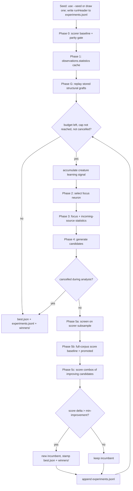

### Phase 0 — authoritative baseline and parity

Before optimisation starts Lamarck scores the supplied creature with the
scorer (finite `score`/`error` required), computes its own whole-creature mean
squared error over the same training directory through the compiled network, and
compares the overlapping quantities within documented epsilon
(`lamarck/src/parity.rs`):

- **error:** abs `1e-6` or rel `1e-5`;
- **unpenalized score** `1 - error` vs `scorer.score + complexityPenalty`:
  abs `1e-5` or rel `1e-4`.

Unexplained disagreement aborts the run, which stops Lamarck optimising a subtly
different metric. `--skip-phase0` disables the gate.

### Phase 1 — `observations.statistics`

The training-data directory holds a one-time statistics cache,
`observations.statistics`. If it is absent, Lamarck scans the complete corpus
and writes it. `--quick` builds/reuses a sampled
`observations-quick.statistics` from the first `--quick-sample-records` records
(default `25000`) so smoke runs finish in minutes rather than about an hour on
GRQ-scale data. Full caches remain the production default.

The file is human-readable **JSON** carrying semver format and algorithm
versions plus enough identity metadata to reject stale caches: input observation
count, output count, record count, a deterministic corpus identity, creation
timestamp, and the cache mode. A statistics file for different training data is
never silently reused.

For every raw input observation, and every target, it records: count; mean;
variance and standard deviation; minimum and maximum; zero, non-zero and
non-finite counts; mean absolute value; RMS; population skewness and *excess*
kurtosis; and approximate 1/5/25/50/75/95/99% quantiles from a capped reservoir
sample.

Skewness (`m3 / m2^1.5`) and excess kurtosis (`m4 / m2² − 3`, so `0` for a
Gaussian column) come free from the same streaming pass — the Welford
accumulator carries the third and fourth central moments. Both report `0` for a
constant or empty column, where distribution shape is undefined. They are
consumed by the `stats_skew_bias` candidate strategy below; the cache
`algorithmVersion` is `1.1.0` since they were added, so a pre-`1.1.0` cache is
rejected as stale and regenerated.

Relationships: observation/target Pearson correlations are always collected. The
expensive input×input correlation matrix is opt-in via `--compute-correlations`
(default off, after [#22](https://github.com/stSoftwareAU/NEAT-AI-Lamarck/issues/22)
removed fields nothing consumed).

**Covariances are derived, never stored.** A covariance is exactly
`r · σ_a · σ_b` from fields the cache already writes, so storing it would
duplicate data with nothing extra to say — the same trap #22 cleared. Callers
that want one use `ObservationsStatistics::input_covariance` (input×input,
`None` unless `--compute-correlations` ran) or `input_target_covariance`
(input×target), which apply that identity to the stored correlation and standard
deviations.

### Phase G — structural graft memory

With `--grafts-path` set, Lamarck keeps a local JSON store of structural changes
that previously won: added synapses and added hidden-neuron bridges, each with
its attachment requirements and a helpful/harmful tally.

Before the experiment loop it classifies every stored graft against the opening
fittest (present / applicable / inapplicable), retires the inapplicable ones,
scores each applicable graft as a single, then scores dampened combinations of
the helpful ones, and applies the best accepted result. Persistently harmful
grafts are retired. New structural accepts are recorded back into the store —
for a combo accept, each structural member is recorded at its **solo** weights,
never the dampened merge, so replay cannot double-dampen.

### Phase 2 — select the focus neurons

Each iteration focuses on `--focus-count` non-input neurons (default 1). The
default policy (`--focus-policy weighted`) draws weighted-random by **error
influence**: output residual L1 mass, or hidden `|total blame|` decayed by
distance to the nearest output, so deep diluted neurons rarely win. Outputs are
usually strongest but are not chosen every time, and zero-signal neurons are
never selected. The selector also folds in each neuron's own accept history.

`high-error` always picks the single strongest neuron and sticks there — avoid
it in production. `random` and `unsaturated` remain available for A/B work, and
`--focus-neuron` pins a UUID for debug and smoke runs.

#### Several focuses per experiment (`--focus-count`)

Most of the analysis phase is not focus-specific: the backprop learning signal
and the output-residual scan describe the **whole creature**, and the
improvement-signal ranking scores every eligible neuron. Spending all of that on
one focus amortises it over a single neuron — and if that neuron is saturated
with a dead gradient, over nothing at all.

`--focus-count K` draws `K` distinct focuses from the same ranking, runs the
focus-specific work (focus stats, incoming sources, residual refine) once per
focus, and merges the per-focus batches into one scored population.
`--candidates` is split between the focuses, largest share first.

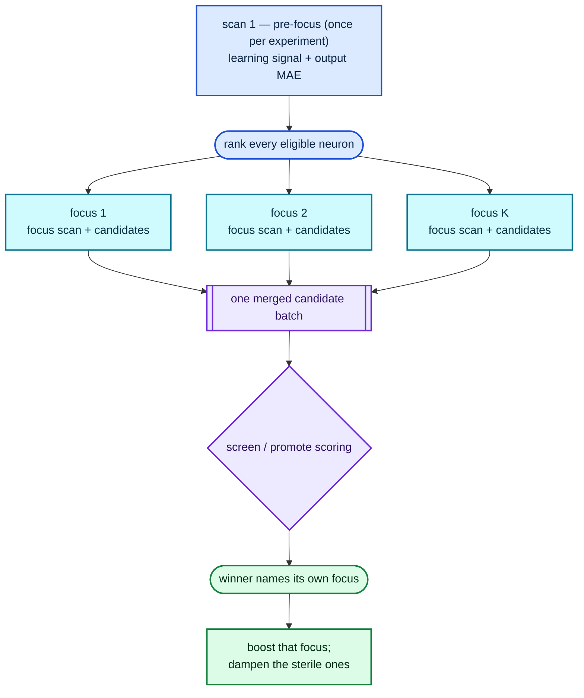

`K = 1` is the default and reproduces the pre-#109 run exactly, down to the
candidate stream for a given seed: the extra focuses are drawn only when they
are asked for, so the rng stream is untouched at `K = 1`.

Attribution follows the issue #74 member rule. Each candidate's provenance names
the focus it was proposed for, so an accepted winner boosts only **that**
focus's history in the weighted selector, and every other focus in the set is
dampened as sterile on its own candidates' full-corpus Δ.

### Phase 3 — creature-specific analysis

Static observation statistics describe the dataset; hidden-neuron behaviour
depends on the incumbent and is measured against that creature. For the selected
neuron Lamarck collects streaming pre-activation and post-activation statistics
(mean, variance, standard deviation, min/max, near-zero and saturation
fractions) plus, for each incoming connection, source statistics and the
source's relationship with the neuron's learning/error signal. Raw observation
sources reuse `observations.statistics` where mathematically equivalent; hidden
sources are measured from the current creature.

#### Two scans per experiment

The analysis work is grouped by what it depends on, so an experiment walks the
training sample **twice**, not once per measurement (`lamarck/src/analysis.rs`):


Scan 1 is focus-independent; scan 2 needs the focus that the first scan's
signals select — everything in a group shares one activation per record. Each
measurement
keeps its own streaming accumulator, and the standalone `collect_*` / `refine_*`
functions drive those same accumulators, so a fused result is bit-identical to
the per-pass one. The residual ranking streams the sample rather than
materialising it as activation probes.

#### Parallel analysis scans

Both scans are read-only reductions: each record contributes independently to a
set of accumulators. They therefore fold record chunks on `--analysis-threads`
workers (default 4, `lamarck/src/chunks.rs`).

Determinism comes from the **partition**, not the schedule. The sample is cut
into fixed 2048-record chunks — a function of the sample alone, never of the
thread count, the core count or the host — and the per-chunk partials are merged
in ascending **chunk order**, whichever worker finished first. One thread and
eight threads therefore fold the same partials in the same order and produce
bit-identical accumulators; `--seed` replay is unaffected. Every RNG draw
(`select_sparse`) happens on the calling thread before the workers start.

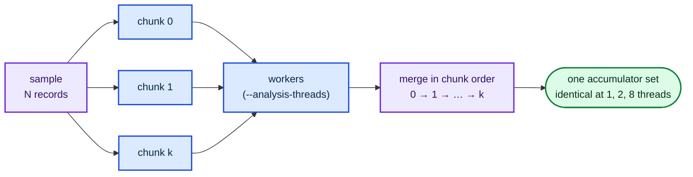

A creature that is not `forwardOnly` carries activation state from one record to
the next, so it is folded as a **single chunk** — correctness before speed.

Measured on the 10-core M4 host with a production-shaped sample (25 000 records
× 2 511 inputs, `cargo run --release --example analysis_threads_bench`): the
analysis phase runs 1.9× faster at 2 threads, 3.1× at the default 4, and 4.1× at
8. The thread count in force is recorded in the journal `runHeader` as
`analysisThreads`, so a parallel arm that turned out *slower* than a serial one
is identifiable from its journal alone.

#### Memoised analysis across experiments

The incumbent only changes when an experiment is **accepted**, and accepts are
rare — `docs/followup-economics.md` records 0 accepts in 118 experiments. So for
almost every experiment the creature that scan 2 describes is byte-identical to
the one the previous experiment described, and a repeated focus makes the whole
scan redundant. Lamarck memoises the two incumbent-invariant results
(`lamarck/src/memo.rs`):

| Cached | Key | Effect on a hit |
|--------|-----|-----------------|
| Focus stats + incoming sources + ranked sources | `(incumbent, focus, sample)` | Scan 2 is skipped entirely. |
| Per-output MAE | `(incumbent, sample)` | Scan 1 still runs for the learning signal; only the residual accumulation is skipped. |

The learning signal is **never** cached: it is driven by a per-experiment seeded
RNG (`select_sparse`) and is deliberately different every experiment.

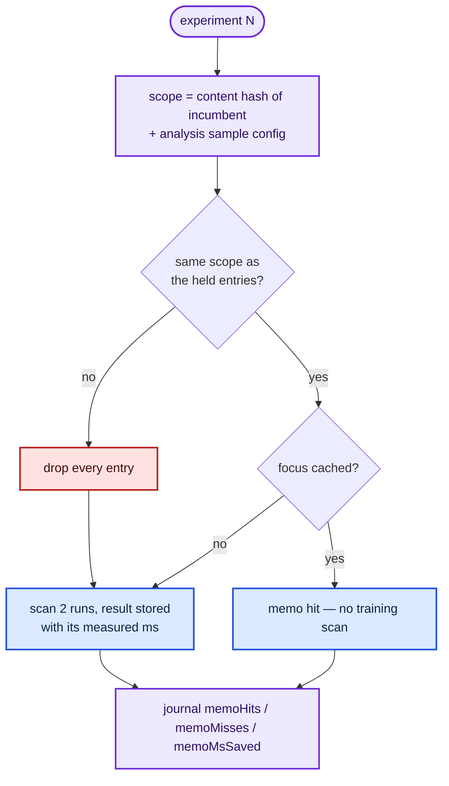

The scope is a **content** hash of the creature, not the journal's coarse
`incumbentId` (which counts neurons and synapses only): a weight-only accept
leaves that id unchanged, so keying on it would serve stale analysis to the very
experiment after an accept. Any incumbent change — an accepted candidate, a
Phase-G graft, a changed `--quick-sample-records` — is a changed scope, and a
changed scope drops every entry before the next lookup is answered. Debug builds
additionally assert the held scope still matches the incumbent at use time.

Memory is bounded by `--analysis-memo-entries` (default 16), evicted
least-recently-used; each entry holds one focus's statistics, incoming rows and
ranked sources, so the bound is the focus fan-in, never the creature's neuron
count. `memoHits`, `memoMisses` and `memoMsSaved` are journalled per experiment
and totalled by `report`, so the memo's value is auditable — and a hit rate that
stays at 100% across an accept is the signature of a stale cache.

### Backpropagation

Lamarck ports NEAT-AI backprop behaviour by wiring creatures through neat-core's
`propagate_topological_loop` (the TS/WASM reverse-topo contract), then folding
the result into an analyse-without-apply `LearningSignal`.

- Config / LR / limits / sparse ratio: `lamarck/src/backprop.rs`
- Creature → `PropagateInput` layout + sparse RNG: `lamarck/src/propagate_layout.rs`
- Apply (optional): `apply_learnings` clones the creature and writes proposed
  bias/weight updates — optimisation still accepts only via the scorer
- Defaults use fixed `generations: 1.0` and `sparse_ratio: 1.0` for
  deterministic full-network signals under a seeded RNG

A hidden neuron has no natural target — blame comes from the propagated learning
signal, never an invented `expected_hidden - actual_hidden`.

#### Aggregate neurons (MINIMUM / MAXIMUM / IF)

neat-core's reverse-topological loop hands aggregate squashes back as
`PropagateOutcome::Special` and stops there — the TypeScript trainer runs a
per-squash custom `propagate` instead. Lamarck's equivalent is to linearise the
aggregate for each record: the neuron is presented to the loop as an `IDENTITY`
sum over exactly the links that produced that record's activation (issue #83).

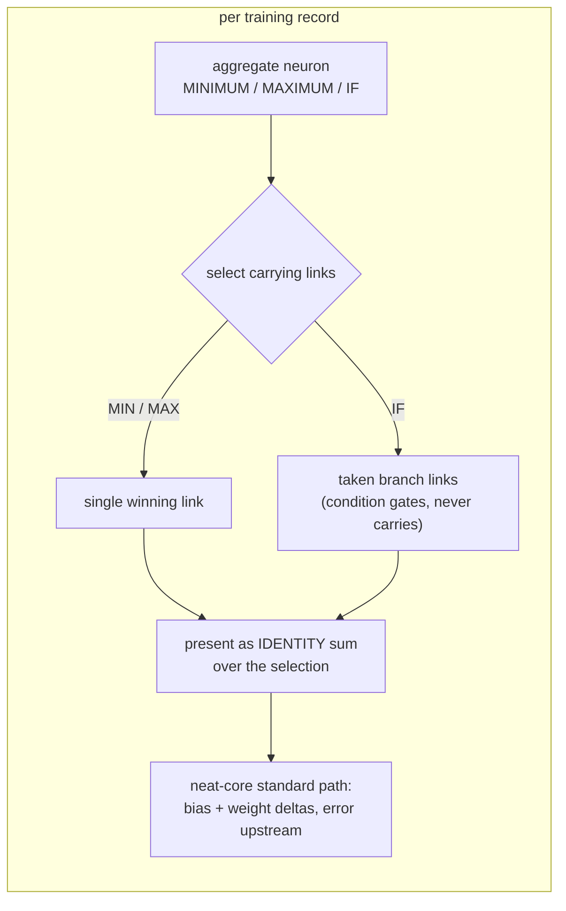

Without this, an aggregate output ends the reverse-topo walk before anything is
accumulated: on the production GRQ creature (`MINIMUM` output) the whole
learning signal was empty — 0 of 1600 neurons and 0 of 21 889 synapses carried
any blame.

Parity fixtures live under `lamarck/tests/fixtures/backprop/` (tolerances about
`1e-9`–`1e-6`). Regenerate goldens:

```bash
LAMARCK_REGEN_BACKPROP_FIXTURES=1 cargo test -p neat_ai_lamarck --test backprop_parity
```

Optional Deno helper (sibling `../NEAT-AI`): `scripts/generate_backprop_parity_fixtures.ts`.

### Phase 4 — candidate generation

Every candidate is a descendant of the current incumbent carrying a small,
interpretable change. `--candidates` (default `100`) sets the population size,
sized to keep a ~10-core scorer box saturated. The generator front-loads
structural probes, then round-robins the remaining budget across the strategies
below; `--structural-only` restricts it to growth candidates.

Those opening phases carry **fixed** quotas, and the round-robin fill that
follows them contributes at most three candidates per strategy, so on their own
they top out at ~33 on the production creature whatever `--candidates` says.
By default (issue #108) generation keeps going after them, sweeping the
ranked-source × weight-scale and ranked-source × squash grids a slice of every
family at a time, until the budget is met or the generator is genuinely
exhausted; `--fixed-candidate-quotas` reproduces the legacy ceiling for A/B
benchmarking. Each grid is visited in **weighted-random order** — a seeded
exponential race weighted by residual-correlation score (floored so unmeasured
sources stay drawable) — so the obvious pairings almost surely go first, yet
every pairing keeps a nonzero chance of an early draw each batch. Repeated
experiments therefore cover the whole grid in expectation with no cross-run
cursor to invalidate when an accept changes the incumbent. **Every** batch — default or scaled — drops duplicate proposals
rather than counting them, and the freed slot falls through to the next
strategy, so a batch of *N* is *N* distinct hypotheses (issue #119). Every
experiment logs — and journals, as `candidatesRequested` / `batchLimit` — which
of the three limits bound it:

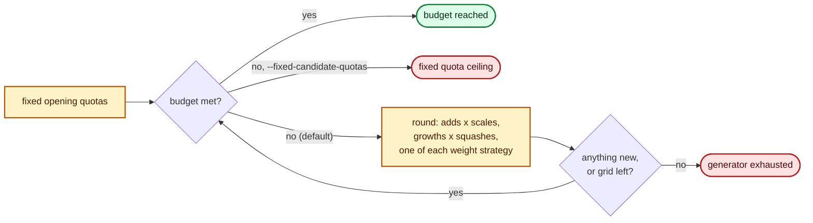

| Journal tag | What it proposes |
|-------------|------------------|
| `backprop` | Bias, or the strongest incoming weight, stepped by the accumulated learning signal (absolute weight delta capped at `0.01`). Skipped entirely when no blame reached the focus — the batch slot goes to a strategy that can clear `--min-improvement` (issue #83). |
| `mean_error_bias` | Output-focus `bias += mean((target - post) * derivative)`, damped to a tenth and skipped when the neuron is saturated. |
| `stats_weight` | Weight nudge on the best incoming source, direction from its correlation with the error, magnitude scaled by the source's standard deviation. |
| `stats_bias` | Bias step scaled by the measured pre-activation spread, pushed away from saturation. |
| `stats_skew_bias` | Output-focus bias stepped a quarter of the way from the target's mean towards its median when `\|skewness\| ≥ 0.25`, damped by the target's excess kurtosis and skipped when the neuron is saturated. |
| `structural_add` | New upstream synapse from a residual-ranked unused source, weight from a fraction of the residual OLS coefficient. |
| `structural_add_neuron` | New hidden neuron bridging top residual sources into the focus, squash chosen from the residual sign and observation scale; falls back to splitting the strongest incoming synapse. |
| `structural_weaken` | Halves the weight of the smallest-magnitude incoming synapse. |
| `random` | Random bias or weight delta within ±0.05. |

There is no fixed quota for random controls — random accidents are valid
improvements and are accepted if they win. Candidate changes use measured source
scale and neuron behaviour rather than arbitrary absolute deltas, and each
strategy produces alternatives around its preferred direction instead of trusting
a single estimated optimum.

Every candidate records the strategy, a full-precision description of the exact
mutation, and the old/new value for scalar changes.

### Phase 5 — authoritative candidate scoring

The incumbent plus all candidates are written to a temporary directory:

```text
candidates-exp-7/
    baseline.json
    candidate-000.json
    candidate-001.json
    ...
```

Those files are **compact** JSON: `rust_scorer` is their only reader, and on the
production creature the pretty-printer's indentation is ≈30% of the ~87 MB a
batch writes and the scorer then parses. The promote directory hard-links the
promoted files from the screen directory rather than copying them, falling back
to a copy when the link cannot be made. `best.json`, `winners/` and every other
human-facing artefact stay pretty-printed. What that was worth — including the
wall-clock null result — is measured in
[`docs/compact-batch-io.md`](docs/compact-batch-io.md).

Scoring runs in three steps:

1. **Screen** the full candidate directory with
   `rust_scorer --sample-rate 0.05 --sample-phase <n> …` (≈0.7–1s/creature on
   GRQ against ≈11s full). The sample phase rotates per experiment.
2. **Promote** only stems the promote gate admits into a full-corpus batch, so
   full-corpus time is not spent on sample noise. An empty screen ends the
   experiment without a full-corpus call. Which gate is in force is
   `--screen-promote-gate` — see [The promote gate](#the-promote-gate).
3. **Combine** — when two or more promoted candidates each beat the baseline,
   their mutation deltas are merged into combination creatures (all pairs, then
   triples, budget-capped) and scored in one further full-corpus batch **with
   the incumbent**, and each combo is judged against that incumbent score rather
   than the promote call's (see [Same-call deltas](#same-call-deltas)).
   Synapses newly stacked into the same target by `k` members are scaled by
   `k^-0.5` so a merge is not louder than the sum of its evidence. Conflicting
   edits to the same neuron or edge are skipped.

How well that screen predicts the full-corpus verdict is measured, from the
journals already in hand, in
[`docs/screen-calibration.md`](docs/screen-calibration.md): over 244 promotions
the rank correlation between screen Δ and full-corpus Δ is **-0.55**, and the
`1e-6` threshold sits at about **one** standard deviation of the screen's own
sampling noise.

#### The promote gate

`--screen-promote-gate` chooses how step 2 decides. **The default is unchanged
by issue #111** — `absolute` is exactly the pre-#111 run:

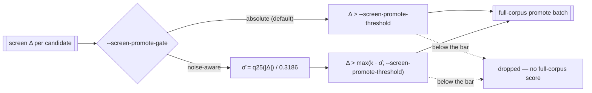

σ̂ is the **lower quartile of the batch's own absolute screen deltas**, rescaled
as if that quartile came from a half-normal. A low quantile is used on purpose:
a candidate batch is bimodal — structural proposals routinely move the score by
`5e-2` while weight/bias nudges move it by `~1e-8` — so the median or the
standard deviation would measure *proposal dispersion* rather than the
resolution floor the gate cares about. The `--screen-sample-rate` is **not**
applied a second time: σ̂ is measured on scores the run produced at its own rate,
so the rate is already inside the estimate.

Two properties hold whatever the batch looks like, both pinned by tests in
`lamarck/src/promote_gate.rs`:

- **Never weaker than `absolute`.** The threshold is a `max` with the floor, so
  the noise-aware gate promotes a subset of what the absolute gate promotes.
  Nothing here can make a candidate acceptable on sampled evidence — acceptance
  stays on the full corpus at `--min-improvement`.
- **A degenerate batch falls back rather than misfiring.** Fewer than four
  candidates, a non-finite delta, or a batch whose lower quartile is exactly
  zero yields no estimate, and the gate reverts to the absolute floor instead of
  dividing by zero or promoting everything.

Because a lost accept is invisible in production — nothing journals the
acceptance that never happened — the gate is replayed **offline** against the
journals in `docs/screen-calibration.md` before it can cost a run anything.
`lamarck/tests/promote_gate_replay.rs` asserts that both of the accepts issue #8
ever earned (`+1.11e-6` and `+1.00e-6`, each barely over the bar) would still
have been promoted, at every `k` from 1 to 5. A gate that drops either fails
`cargo test`.

Scorer argv is the locked two-argument form plus the screen sampling flags only;
Lamarck never passes `--gpu` or `--cost`, so scorer defaults decide backend and
loss. Pass `--screen-sample-rate 1` to disable screening.

The incumbent is included in every scored batch by default, so a candidate is
never compared against a stale score. `--baseline-reverify-interval` trades part
of that pairing for throughput under an explicit guard — see
[The remembered baseline](#the-remembered-baseline). Acceptance uses the scorer JSON **`score`**
field (**larger-is-better**) from the **full-corpus** score only — never `error`
alone:

```text
candidate.score - baseline.score > 1e-6
```

(default absolute threshold, strict greater-than). GRQ `costOfGrowth` is `1e-7`,
so `1e-6` sits deliberately above growth noise.

#### Same-call deltas

Both scores in that subtraction must come from the **same** scorer call. The
scorer partitions a creature's records by how many creatures share the call, so
the same creature on the same corpus scores differently in a directory of one,
two or three — `1.755e-7` relative on the production creature, a sizeable
fraction of a `1e-6` bar, and it moves the incumbent and the candidate by
different amounts (issue #130).

Every phase therefore scores the incumbent in its own call and subtracts locally:
the screen gate against the screen baseline, a promoted single against the
promote baseline, a combo against the incumbent re-scored **in the combo call**,
and the remembered-baseline accept against a freshly scored pair. A combo call
that returns no `baseline` fails loudly rather than borrowing the promote call's
number. The artefact, the rule and the upstream fix are recorded in
[`docs/scorer-batch-composition.md`](docs/scorer-batch-composition.md).

#### The remembered baseline

Between accepts the incumbent does not change, so its full-corpus score is a
constant the run already holds — established by the Phase-0 gate and by the last
accept. Scoring it again in every promote call is ≈20% of that call's
creature-scores, on the expensive tier. `--baseline-reverify-interval N` lets
the run reuse the number it knows (issue #113):

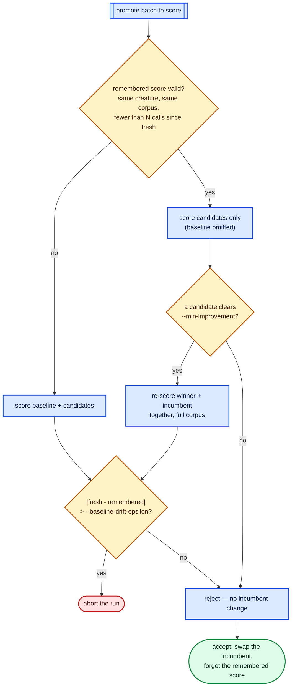

The pairing a promote call gives up is a guard as well as a cost — candidate and
baseline are otherwise scored by the same binary, on the same corpus, in the
same process, at the same moment — so three rules hold, each pinned by tests in
`lamarck/src/run.rs`:

- **The remembered score is keyed to what could invalidate it.** The creature's
  coarse `incumbentId` *and* its content fingerprint (a weight-only accept
  leaves the shape id untouched), plus a fingerprint of every `*.bin` in the
  training directory with its size and mtime. `docs/baseline-economics.md`
  records the corpus being deleted mid-run by GRQ `node.sh`, so "the data
  changed under the run" is history here, not a hypothetical.
- **Any accept is verified before the swap.** A winner proposed against a
  remembered baseline is re-scored *beside the incumbent* in one full-corpus
  call, and only that fresh pair can change `best.json`. A margin that exists
  only against the remembered number is withdrawn.
- **Drift aborts the run.** Whenever a fresh baseline lands while a remembered
  one is held — on the re-verification interval or on the accept path — the two
  are compared, and a disagreement beyond the (auto-tuned)
  `--baseline-drift-epsilon` stops the run rather than deciding anything. With
  `--baseline-reverify-interval 0` no score is remembered between promotes, so
  the canary is inactive; every promote is already self-paired.

The screen phase is deliberately untouched: its sample phase rotates per
experiment, so each screen scores the incumbent on a different stratum and that
sampled score is genuinely new information.

[`docs/baseline-reuse.md`](docs/baseline-reuse.md) measures what this is worth:
in the paired benchmark a promote call drops from 5.86 to 4.91 creature-scores
(**-16%**) and from 28.8 to 24.2 ms (**-16%**) at an unchanged cost per
creature-score, for **+4.9%** experiments completed in a fixed budget.
Projected onto a production run with the per-call costs #112 fitted, that is
≈6% of scorer time.

An accepted winner becomes the incumbent immediately: `best.json` is rewritten
with the creature's `uuid`/`tags` re-attached and a run-summary `lamarck` tag,
a copy is kept under `winners/`, structural accepts are recorded into the graft
store, and creature-specific analysis is recomputed next iteration.

### Phase 6 — repeat until a stopping rule fires

The loop keeps selecting neurons and testing candidates until the first of four
stopping rules fires. A failed experiment simply moves on to another attempt.

| Stopping rule | Trigger | Reported as |
|---------------|---------|-------------|
| Wall-clock timeout | `--timeout-seconds` elapsed, checked between experiments. | `timeout` |
| Experiment cap | `--max-experiments N` experiments completed. Unset = wall-clock bounded only. | `max-experiments` |
| Cancellation | `SIGINT` (Ctrl-C) or `SIGTERM`. | `cancelled` |
| Scorer failure | Three consecutive scorer batches fail (`--skip-phase0` runs). | Run aborts with an error |

The stopping rule that ended the run is printed in the run summary as
`stopped on:`.

**Graceful cancellation.** `SIGINT`/`SIGTERM` only set a flag; the loop polls it
and stops through the normal exit path, so `best.json` is still re-stamped with
the run-summary `lamarck` tag and the summary is still printed. A signal that
arrives during analysis abandons the in-flight experiment before its scorer
batch (no working directory is written for it); one that arrives during scoring
stops the loop after that experiment has been journalled. Either way no
`candidates-exp-N/` directory is left behind, and the process exits `0`. A
**second** signal force-quits immediately with exit code `130`, for a run wedged
inside a long scorer batch.

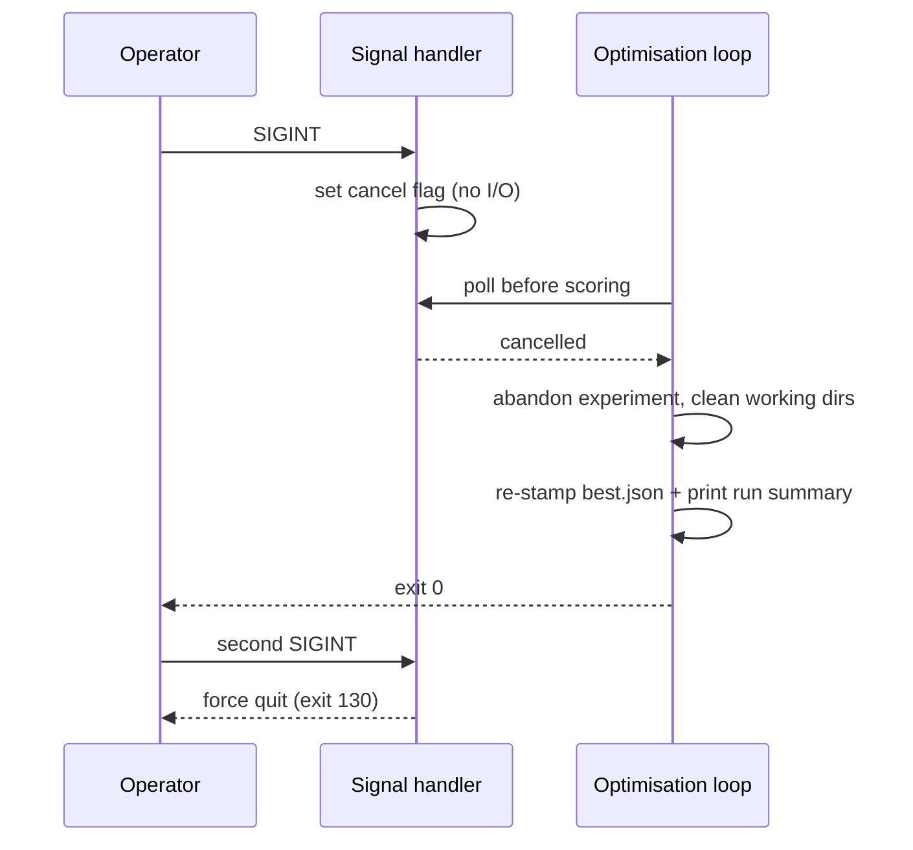

The optimisation path is cumulative:

```text
C0 -> C1 -> C2 -> C3 -> ...
```

Every edge is an independently full-corpus-scored improvement.

## Outputs

Written under `--output-dir`:

```text
best.json           # best verified creature, tagged with the run summary
experiments.jsonl   # machine-readable experiment journal
winners/            # winner-NNNN.json per accepted improvement
```

Per-experiment working directories (`candidates-exp-N/`, `promote-exp-N/`,
`combos-exp-N/`, `phase0-baseline/`, `graft-replay/`) are deleted as the run
proceeds unless `--preserve-losers` is passed. The supplied creature file is
never modified: `best.json` starts as a verbatim copy of it.

## Experiment journal

`experiments.jsonl` is one JSON object per line, and is part of the experiment
rather than debug logging.

The **first line of each run** is a `runHeader` record carrying the
reproducibility contract (issue #71) — everything needed to replay the run:

| Field | Meaning |
|-------|---------|
| `record` | Always `runHeader`; absent on experiment records. |
| `timestampUnix` | Run start. |
| `seed` | Effective RNG seed — pass it back as `--seed` to replay. |
| `seedSource` | `supplied` (`--seed` given) or `drawn` (from OS entropy). |
| `version` | Lamarck version that wrote the journal. |
| `config` | Run knobs: `creature`, `trainingData`, `scorerPath`, `timeoutSeconds`, `maxExperiments`, `candidates`, `minImprovement`, `screenSampleRate`, `screenPromoteThreshold`, `screenPromoteGate`, `screenPromoteSigmaK`, `baselineReverifyInterval`, `baselineDriftEpsilon`, `focusNeuron`, `focusPolicy`, `focusCount`, `statsMode`, `quickSampleRecords`, `computeCorrelations`, `structuralOnly`, `phase0Parity`, `preserveLosers`, `maxConsecutiveScorerFailures`, `graftsPath`, `graftReplayBudgetSeconds`, `backpropLearningRate`, `backpropMaxBiasAdjustmentScale`, `analysisMemoEntries`, `analysisThreads`. |

When `--grafts-path` is set, the Phase-G replay writes one `graftReplay` record
before the first experiment (issue #74). A replay can improve the incumbent with
no candidate stem at all, so it needs its own line or `report` cannot see it:

| Field | Meaning |
|-------|---------|
| `record` | Always `graftReplay`. |
| `timestampUnix`, `elapsedMs` | When the phase finished and how long it took. |
| `graftsApplied`, `accepted` | Grafts merged into the incumbent, and whether the incumbent improved. |
| `baselineScore`, `score`, `improvement` | Score before, score after, and the accepted Δ. |
| `scorerSuccesses`, `scorerFailures` | Scorer batches run during the phase. |
| `scorerCalls[]` | Every scorer invocation the phase made, in the shape described for an experiment below (issue #112). |
| `replayError` | Present when the phase aborted instead of completing. |

Scorer calls that belong to no experiment get their own line, so the per-call
cost model is fitted to **every** call a run made rather than to the subset the
experiment loop owns (issue #112). The Phase-0 baseline call is the standing
example — it runs before the first experiment:

| Field | Meaning |
|-------|---------|
| `record` | Always `scorerCalls`. |
| `timestampUnix` | When the line was written. |
| `stage` | Which part of the run made them: `phase0`, or `trailing` for a call left over when a run stopped mid-experiment. |
| `calls[]` | The calls themselves, in the shape described for an experiment below. |

Every following line is one experiment:

| Field | Meaning |
|-------|---------|
| `experimentNumber`, `timestampUnix` | Sequence and wall-clock position. |
| `seed` | Effective run seed (matches the header). |
| `incumbentId` | Incumbent shape identity (`in…-out…-n…-s…`). |
| `baselineScore` | Authoritative baseline for this experiment. |
| `focusNeuron` | Primary focus neuron UUID (the first of `focusNeurons`). |
| `focusNeurons` | Every focus this experiment proposed against (issue #109). Omitted for a single-focus experiment — `focusNeuron` already says it — and absent from journals written before the field existed. Each entry of `candidates[]` names its own `focusNeuron`, so a winner is attributable to one member of this set. |
| `focusStats` | The focus scan of the **primary** focus (issue #70) — structure (`squash`, `incomingCount`), activation statistics (`preMean`, `preVariance`, `preMin`, `preMax`, `postMean`, `postVariance`, `nearZeroFraction`, `saturationFraction`, `recordCount`), output residuals (`meanError`, `meanAbsError`, `meanAdjustedError`, `meanDerivative`) and backprop blame (`meanBlame`, `meanAbsBlame`, `blameCount`, `blameNoChange`). Error and blame fields are omitted when the scan produced none; the whole object is absent from journals written before the field existed. |
| `candidates[]` | Per candidate: `strategy`, `focusNeuron`, `mutation`, `oldValue`, `newValue`. |
| `candidatesRequested`, `batchLimit` | The `--candidates` budget this experiment asked for, and why the batch stopped growing (issue #108): `budget` (the budget bound it), `quota_ceiling` (the fixed opening quotas ran out — only under `--fixed-candidate-quotas`) or `exhausted` (every ranked source and squash was proposed). The achieved batch size is `candidates[].length`. Absent from journals written before the fields existed. |
| `screenScores`, `scores` | Sample-phase and full-corpus scores by stem. |
| `screenTiers` | What the screen tier and the promote gate did this experiment (issue #111): the `gate` in force, `screened` candidates, `promoted` candidates, the `threshold` they had to clear, and the `sigma` estimated for the batch (omitted under the absolute gate and when the batch was too degenerate to price its own noise). Absent when no screen phase ran, and from journals written before the field existed. |
| `baselineSource` | Which baseline decided this experiment's promote call (issue #113): `fresh` (the call carried the incumbent and scored it), `remembered` (it reused the run's carried full-corpus score) or `rememberedVerified` (it reused it *and* proposed an accept, so the winner and the incumbent were re-scored together before the swap). Omitted when no promote call ran, and absent from journals written before the field existed — so any accept is traceable to the baseline that decided it. |
| `winner`, `improvement`, `accepted` | Outcome of the experiment. |
| `analysisMs`, `scorerMs` | Where the time went. |
| `scorerCalls[]` | Every scorer invocation this experiment made (issue #112): `phase` (`screen` / `promote` / `combo`), `creatures` handed over, `sampleRate` when the call sampled, `elapsedMs`, and `failed` on a call that did not complete. `scorerMs` sums calls of different sizes, so it cannot be regressed on its own; the per-call creature count is what recovers the fixed per-call and marginal per-creature cost. Absent from journals written before the field existed. |
| `memoHits`, `memoMisses`, `memoMsSaved` | Analysis-memo accounting for this experiment (issue #106): lookups served from the memo, lookups recomputed, and the training-scan milliseconds the hits avoided. `memoMsSaved` counts whole scans skipped, measured on the miss that stored the entry — a cached output-MAE map saves only the residual accumulation inside a scan that still runs for the learning signal, so it is deliberately not counted. Journals written before the field existed read as `0`. |
| `scorerError` | Present when the batch failed. |
| `comboMembers`, `combosScored`, `combosDampened`, `comboDampen` | Combination-scoring detail. |
| `comboMemberIndices` | Indices into `candidates[]` of the accepted winner's members — one entry for a single, several for a merged `combo-NNN-kM`. Present only on an acceptance, and absent from journals written before issue #74. |
| `cacheSkipped`, `cacheBackfilled` | Proposals dropped by a failed-candidate cache hit, and replacement proposals accepted to refill the batch. Omitted unless `--failed-cache` is on. |
| `cacheDeduplicated` | Proposals dropped as near-duplicates of one already in the same batch. Counted apart from `cacheSkipped` because the cache is not what suppressed them, so the cache's savings cannot absorb them. |
| `cacheRebuildMs` | What loading or rebuilding the cache cost at startup, recorded once on the first experiment that ran with the cache on. A run cost, not an experiment cost, but part of what the cache has to earn back. |
| `cacheSize`, `cacheLookupMs`, `cacheMaintenanceMs` | Live cache entries after the experiment, time spent filtering and backfilling, and time spent in the cache's most recent age sweep. Omitted unless `--failed-cache` is on. |
| `cacheSavedMs`, `cacheSpentMs`, `cacheNetCumulativeMs`, `cacheResidentBytes` | The experiment's cache ledger: estimated scorer time its skips avoided, measured lookup + maintenance overhead, the run's cumulative saved − spent, and the resident footprint afterwards. Omitted unless `--failed-cache` is on. |

A `cacheStandDown` line is written if the cache stops paying — see
[Failed-candidate cache economics](#failed-candidate-cache-economics).

Summarise strategy economics from a journal with the `report` subcommand:

```bash
neat_ai_lamarck report experiments.jsonl
# or: scripts/report-experiments.sh experiments.jsonl
```

It emits per-strategy appearances/wins/acceptance rate, focus history,
improvement series, candidates per scorer-minute and per screen-minute,
analysis-time fraction, projected batches per 45 minutes, and combo totals.

The `candidateBatch` bucket reports the achieved batch size (issue #108):
`meanGenerated`, `minGenerated`, `maxGenerated`, the `requested` budget when
every experiment agreed on one, and how many experiments stopped at the
`quotaCeiling` or ran the generator `exhausted`. A journal written before those
fields existed still reports the sizes, with `requested` `null`.

`openingBaselineScore` is anchored on a **full-corpus** score only (issue #84):
the `scores.baseline` of the first experiment that actually promoted, which is
the score Phase-0 measured when it ran, because the incumbent cannot change
before the first acceptance. An experiment whose batch screened empty recorded
only a subsample baseline — that baseline swings by ~5e-3 between experiments,
thousands of times the accept threshold, so it is never used as the anchor. Both
`openingBaselineScore` and `totalScoreImprovement` (and with them
`relativeScoreImprovement`) are `null` until a full-corpus baseline exists,
rather than reporting a difference between two different quantities.

`focusHistory[]` counts every focus an experiment served, so at
`--focus-count K` one experiment contributes to `K` rows. Accepts and
`cumulativeImprovement` are credited to the focus the **winner** was proposed
against, read from `comboMemberIndices` → `candidates[].focusNeuron`; a win
spanning several focuses splits its Δ evenly between them. A journal with no
focus set, or one whose members cannot be resolved, falls back to `focusNeuron`
— so pre-#109 journals report exactly what they always did.

Wins are attributed from `comboMemberIndices`, so a merged combo win counts once
for **every** member strategy and is also carried in that row's `comboWins`
(issue #74). The `wins` column therefore sums to more than `acceptances` whenever
combos win. A combo win in a journal written before `comboMemberIndices` existed
names no members, so it cannot be attributed at all — those are counted in
`comboAcceptancesUnattributed` rather than silently dropped.

The `baselineReuse` bucket prices the remembered baseline (issue #113):
`freshPromoteCalls`, `rememberedPromoteCalls`, `verifiedAccepts`,
`baselineScoresSaved` (one full-corpus creature-score per omitted baseline),
`verificationCreatureScores` (two per verified accept — the pair) and
`netCreatureScoresSaved`, which subtracts the second from the first so the
saving is never over-claimed. A pre-#113 journal, or a run left at
`--baseline-reverify-interval 0`, reports every promote call as `fresh`.

The `analysisMemo` report bucket totals the memo columns — `hits`, `misses`,
`msSaved`, `hitRate` and `analysisMsSavedFraction` (saved milliseconds as a share
of analysis + saved time). A pre-memo journal, or a run started with
`--analysis-memo-entries 0`, reports zeros. Keep this accounting separate from
the candidate-level economics: the memo caches *incumbent analysis*, never a
candidate outcome, so no saving is counted twice.

Phase-G replay gets its own `graftReplay` bucket — `replays`, `accepts`,
`graftsApplied`, `cumulativeImprovement`, `scorerFailures` and `replayErrors` —
which is `null` for a journal with no replay line.

The `screenCalibration` bucket measures the screen against the full corpus from
the two score maps the journal already holds (issue #110). Every candidate
scored on **both** sides becomes a paired (screen Δ, full Δ) point, from which it
reports the Spearman rank correlation (`spearman`, plus `spearmanDistinct` over
`distinctPairs` — the same mutation re-proposed against the same focus is one
hypothesis, not several), the promote gate's precision (`promotionPrecision`,
`promotedImproved` / `promotedWorse` / `promotedClearingAcceptBar` /
`promotedMateriallyWorse`), the `fullDelta` spread of what was promoted, the
`screenNoise` floor (screen Δ among candidates the full corpus scored flat), the
`baselineSampleGap` (the same creature scored on the subsample and the corpus),
and the screen Δ of every `acceptedCandidates` entry. Only the intersection of
the two stem sets is paired: the remainder is counted in `screenOnlyCandidates`
(screened, never promoted) and `fullOnlyCandidates`, never dropped silently, and
`baseline` is excluded from both sides because it is the anchor the deltas are
measured against. A journal with screening disabled reports
`screenEnabled: false` and a `null` correlation rather than a fabricated one.
Run it over several journals with
`scripts/summarise-screen-calibration.sh JOURNAL...`; the measured result for
the journals in hand is
[`docs/screen-calibration.md`](docs/screen-calibration.md).

The `scorerCallCost` bucket decomposes scorer time into a **fixed** per-call cost
and a **marginal** per-creature cost (issue #112), fitted by least squares from
the journal's own `scorerCalls`: `calls`, `failedCalls`, `creaturesScored`, and a
`byPhase` map whose rows carry `calls`, `distinctSizes`, `meanCreatures`,
`meanMs`, `fixedMs` (the intercept), `marginalMsPerCreature` (the slope),
`rSquared` and `fixedMsShareAtMean`. Phases are **never** pooled: a sampled
screen call and a full-corpus promote call have different marginal costs, so one
line through both would report neither. A phase whose calls were all the same
size reports its means with a `null` decomposition rather than an intercept
invented from one point, and a journal written before `scorerCalls` existed
reports an empty bucket. The measured result on the production creature and
corpus — and the go/no-go it decided — is
[`docs/scorer-call-cost.md`](docs/scorer-call-cost.md).

The `promoteGateReplay` bucket answers "what would the noise-aware gate have
done to this journal?" without spending any box time (issue #111). It replays
`--screen-promote-gate noise-aware` at the default `k` over the journal's own
`screenScores`, reporting the gate the run actually used (`gateAsRun`, `null`
for a pre-#111 journal or a concatenation of arms that disagree), the
`replaySigmaK` and `replayFloor` it replayed with, `screened`, `promotedAsRun`
against `promotedUnderGate`, the `promotionsAvoided` between them, and — the
number that decides whether the gate is safe — `acceptsKept` against
`acceptsDropped`, with every accepted winner listed in `accepts[]` beside the Δ
it had and the Δ the gate demanded. The measured result for the journals in hand
is [`docs/promote-gate.md`](docs/promote-gate.md).

`focusStats` is aggregated into a `focusStats` report object with three buckets —
`all`, `accepted` and `rejected` — each carrying `experiments`,
`meanIncomingCount`, `meanSaturationFraction`, `meanNearZeroFraction`,
`meanPostVariance`, `meanAbsBlame` (magnitudes, so signs cannot cancel out; null
when no experiment in the bucket recorded blame) and `squashCounts`. Comparing
`accepted` against `rejected` is how a finished run answers experimental
questions 4 and 6 below. The object is `null` for a journal with no focus
statistics.

## Failed-candidate cache economics

The cache must not spend more time than it saves, and must not grow without
bound. Both are enforced in the code rather than asserted in a report: every
cache-on run keeps a ledger, and stands the cache down when it stops paying
(issue #92). Issue [#94](https://github.com/stSoftwareAU/NEAT-AI-Lamarck/issues/94)
measured a practical production pair and **left the flag off by default** —
see [`docs/failed-candidate-cache-economics.md`](docs/failed-candidate-cache-economics.md).

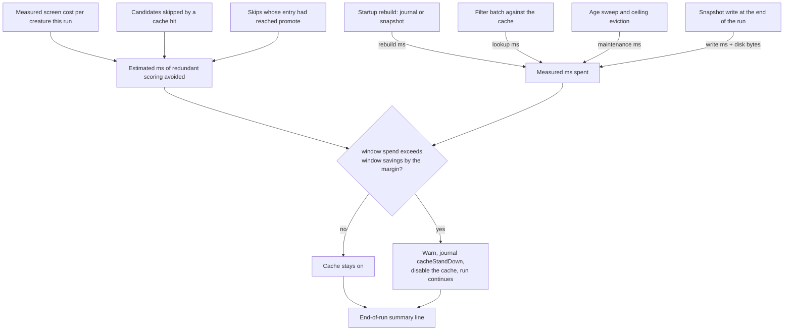

**Savings are estimated, spend is measured.** A skipped candidate was never
scored, so its cost is priced from this run's own measured screen phase —
`skipped × mean screen ms per scored creature` — never from a constant. The mean
divides by every creature the batch scored, the baseline included, so the
baseline's own cost cannot inflate it. In a run with screening off, the single
full-corpus batch *is* that first phase and is priced as such. Promote-phase
time is claimed only for a skip whose cache entry records that the candidate had
actually reached the promote phase; every other skip is priced at screen cost
only, which under-claims rather than over-claims. Only a genuine **cache hit**
counts as a skip — a proposal dropped for repeating one already in the same
batch is the generator's doing and is counted separately. Spend is accumulated
in microseconds because a whole-millisecond lookup timer truncates to zero on a
small batch, and an overhead that rounds to zero would let a losing cache look
free.

**`savedMs` is redundant scoring avoided, not wall clock removed.** The batch is
backfilled to full width, so a replaced skip converts redundant scoring into
fresh exploration rather than shortening the batch. `savedMs` is the quantity in
which issue #69's constraint is stated ("we spend more time than it saves in
redundant scoring") and is what the guardrail judges; the part that shortened
the scorer's work — the skips backfill could not replace — is reported
separately as `wallClockSavedMs` so the two are never confused.

**Stand-down.** The guardrail judges a **rolling window** of the most recent
`--failed-cache-stand-down-window` experiments: when the spend inside that
window exceeds the savings inside it by
`--failed-cache-stand-down-margin-ms`, Lamarck logs a warning, writes a
`cacheStandDown` journal line and disables the cache for the rest of the run.
The run continues and no snapshot is written: a cache that does not earn its
keep degrades to the cache-off behaviour instead of degrading the run. One-off
costs (the startup rebuild, the snapshot write) count in the run's cumulative
`netMs` but not in the window — they are sunk before the window opens, and
disabling a currently-profitable cache cannot un-spend them.

**Byte ceiling.** `--failed-cache-max-bytes` bounds the resident footprint. Past
it the cache evicts oldest-first — the ceiling is a bound, not a target — and
every bite is logged, because a silently truncated cache reads as a working one.

**End-of-run summary.** Every cache-on run ends with one parseable line:

```text
● failed-cache economics: entries=1240 hitRate=0.1832 savedMs=48210.5 wallClockSavedMs=0.0 spentMs=311.2 netMs=47899.3 peakMemoryBytes=634880 diskBytes=98304 standDown=false ceilingBites=0
```

## Safety invariants

These rules are non-negotiable:

1. The supplied fittest creature is never modified in place.
2. Lamarck's custom analysis cannot declare a creature fitter.
3. Every accepted candidate must be scored against the normal complete training dataset by NEAT-AI-scorer.
4. The incumbent is included in each candidate scoring batch as a control.
5. A candidate must improve by more than the configured meaningful-improvement threshold.
6. A failed experiment leaves the incumbent unchanged.
7. Creature topology/serialization must remain compatible with NEAT-AI-core and NEAT-AI-scorer.
8. The original creature is always recoverable.

## Reproducibility

All Lamarck-controlled randomness comes from one **effective seed**: the main
RNG is seeded from it, and the per-experiment backprop RNG is derived from it
deterministically. When `--seed` is omitted the effective seed is drawn from OS
entropy, logged (`seed … (drawn from OS entropy; replay this run with --seed …)`)
and recorded, so every run is replayable.

The effective seed and the run configuration are written as the first line of
`experiments.jsonl` — the `runHeader` record described in
[Experiment journal](#experiment-journal) — and the effective seed is repeated on
every experiment record. To replay a run, take `seed` from its header and pass it
as `--seed` with the same creature, training data and configuration.

The contract: given an identical starting creature, training data,
`observations.statistics`, configuration, software version and effective seed,
the RNG stream — and therefore candidate generation — repeats. One caveat
remains: the experiment count is wall-clock bounded and the screen phase is
derived from the experiment index, so a differently timed replay may run a
different number of experiments and reach a different point in that identical
stream.

`--analysis-threads` is deliberately **outside** that contract's inputs: the
analysis scans partition the sample into fixed record chunks and merge the
partials in chunk order, so the accumulators — and every candidate derived from
them — are bit-identical at any thread count (see
[Parallel analysis scans](#parallel-analysis-scans)). A replay may use a
different thread count than the run it replays. The value in force is recorded
in `runHeader.config.analysisThreads` anyway, because the wall clock is not
identical and a slow arm must be diagnosable after the fact.

## What we have learnt so far

From the 45-minute production-budget baseline in
[`docs/baseline-economics.md`](docs/baseline-economics.md) (single seed, GRQ
champion, 75 experiments):

- accepts are thin — 2 in 75 experiments, both from `random`, cumulative
  Δ ≈ `+2.11e-6`;
- scorer time dominates at ≈83% of the run, so full focused analysis before each
  batch is affordable;
- screening empties most batches (49/75), which is the point: expensive
  full-corpus promotes are skipped when the sample shows nothing;
- no strategy has earned removal — the sample is far too small to disable one.

And from the per-call scorer measurement in
[`docs/scorer-call-cost.md`](docs/scorer-call-cost.md) (issue #112): a scorer call
costs ≈9.9 s **before it scores its first creature** on a 5% sample, against
0.45 s per creature after that, so the fixed per-call cost is **24–29% of a
45-minute run**. Sampled calls carry five times the fixed cost of a full-corpus
call while doing a twentieth of the work — because the scorer read and decoded
the whole corpus before dropping 95% of the records. Issue #123 removed that:
[`docs/scorer-fixed-cost.md`](docs/scorer-fixed-cost.md).

The open experimental questions the journal is designed to answer:

1. Do statistically informed candidates beat ordinary random mutation often enough to justify their analysis cost?
2. How useful is conventional backpropagation when its proposed changes must survive whole-corpus evolutionary scoring?
3. Which mutation classes produce accepted improvements most often?
4. Are saturated/dead neurons particularly good targets?
5. Are observation correlations useful when adding or removing connections?
6. Does the propagated neuron blame/sensitivity predict successful mutation direction?
7. As the incumbent improves, how quickly does the hit rate fall?
8. Given the 45-minute useful-life constraint, how much analysis is economically justified before trying another candidate batch?

Questions 1–3 and 8 have a first single-seed answer. The follow-up campaign
for #75 — an output-focus slice, a backprop step A/B and a batch-size A/B,
118 further experiments — is written up in
[`docs/followup-economics.md`](docs/followup-economics.md). Its headline: **no
strategy has earned removal**, `--candidates` above ~29 bought nothing on this
creature under the then-default fixed quotas (scaled quotas, now the default,
lift that ceiling — their paired benchmark is still to run), and `backprop` fails on a saturated
step cap rather than on its learning rate. Questions 4–7 need the arms wired up by
[#96](https://github.com/stSoftwareAU/NEAT-AI-Lamarck/issues/96) and still to be
run under [#98](https://github.com/stSoftwareAU/NEAT-AI-Lamarck/issues/98).

## Outstanding work

| Issue | Gap |
|-------|-----|
| Failed-candidate cache ([#94](https://github.com/stSoftwareAU/NEAT-AI-Lamarck/issues/94) / [#158](https://github.com/stSoftwareAU/NEAT-AI-Lamarck/issues/158)) | Shipped **opt-in** (`--failed-cache`, off by default). The #94 pair was underpowered on accepts (0/0); exclusive-box 45-minute repeats are owed before considering default-on. [`docs/failed-candidate-cache-economics.md`](docs/failed-candidate-cache-economics.md). |
| [#98](https://github.com/stSoftwareAU/NEAT-AI-Lamarck/issues/98) | Five economics arms are wired up (`multi-seed`, `output-neuron`, `backprop-cap`, `candidate-quotas`, `focus-count` in `scripts/run-followup-economics.sh`) but still **unmeasured on an idle exclusive-box run**: each needs the production creature and exclusive use of the scorer. A shared-box **local calibration campaign** already has journals for an output-0 slice, a backprop-cap arm and a second seed — mined for screen/promote pairing only; see [`docs/screen-calibration.md`](docs/screen-calibration.md) and the campaign disambiguation in [`docs/followup-economics.md`](docs/followup-economics.md). |
| [#123](https://github.com/stSoftwareAU/NEAT-AI-Lamarck/issues/123) | **Fixed, pending release.** A sampled scorer call used to read and decode the whole corpus to score a twentieth of it; it now fetches only the records it scores, cutting the fixed cost of a screen call from **10 693 ms to 3 423 ms** ([`docs/scorer-fixed-cost.md`](docs/scorer-fixed-cost.md)). The change lives in NEAT-AI-core (`issue-scorer-sampled-read`) and NEAT-AI-scorer (`issue-lamarck-123-sampled-read`); a human must open those two PRs and cut a scorer release before a run picks it up ([#141](https://github.com/stSoftwareAU/NEAT-AI-Lamarck/issues/141)). The whole-run `scorerCallCost` re-measure on an idle box is owed then. |

## Repository layout

```text
NEAT-AI-Lamarck/
├── Cargo.toml
├── rust-toolchain.toml
├── neat-core.expected-version
├── quality.sh
├── deny.toml
├── SECURITY.md
├── .github/workflows/   # scorer-aligned quality gates
├── scripts/
├── docs/                # … measurement docs — see links throughout this README
└── lamarck/src/
    ├── lib.rs
    ├── main.rs              # CLI (optimise + report subcommand)
    ├── config.rs            # defaults and run options
    ├── analysis.rs          # the two fused per-experiment training scans
    ├── chunks.rs            # deterministic analysis chunking (issue #107)
    ├── memo.rs              # cross-experiment analysis memo (issue #106)
    ├── cancel.rs            # SIGINT/SIGTERM cancel token (issue #72)
    ├── parity.rs            # Phase-0 scorer parity gate
    ├── baseline.rs          # remembered full-corpus baseline (issue #113)
    ├── observations.rs      # observations.statistics cache
    ├── focus.rs             # focus-neuron selection policies
    ├── backprop.rs
    ├── learning.rs
    ├── propagate_layout.rs
    ├── candidates.rs
    ├── structural.rs        # graph mutation primitives + residual ranking
    ├── combos.rs            # candidate merging and stacked-synapse dampening
    ├── grafts.rs            # structural graft store and phase-G replay
    ├── scorer.rs
    ├── scorer_cost.rs      # fixed vs marginal per-call scorer cost (issue #112)
    ├── run.rs
    ├── report.rs
    ├── promote_gate.rs      # screen promote gate, incl. noise-aware (issue #111)
    ├── screen_calibration.rs # screen Δ vs full-corpus Δ (issue #110)
    ├── tags.rs
    └── log.rs
```

## Development rules

- Rust edition 2024.
- Pin the Rust toolchain, matching NEAT-AI-scorer initially (`1.95.0`).
- Use TDD for behaviour changes.
- Keep dependencies modest and justified.
- Prefer streaming training-data analysis; the corpus is large.
- Preserve compatibility with NEAT-AI-core/NEAT-AI-scorer rather than duplicating their stable functionality.

## Build and quality gate

Clone **NEAT-AI-core** beside this repository:

```text
parent/
  NEAT-AI-core/
  NEAT-AI-Lamarck/
```

### Cargo profiles (Issue #153)

Dev and release optimise for opposite goals (fleet guidance from
[VibeCoding#4159](https://github.com/stSoftwareAU/VibeCoding/issues/4159)):

| Profile | Goal | Settings |
| ------- | ---- | -------- |
| `dev` | Fast compile | `debug = "line-tables-only"` (panic file:line without full DWARF) |
| `release` | Fastest binary | `opt-level = 3`, `lto = "fat"`, `codegen-units = 1` |

Release binaries built and run on the same host also get
`-C target-cpu=native` from [`.cargo/config.toml`](./.cargo/config.toml)
(skipped for `wasm32`). An exported `RUSTFLAGS` — as in `./quality.sh` and CI —
replaces those config flags entirely, so the quality gate keeps
`-D warnings` without forcing `native` on CI runners.

```bash
cargo build                  # fast rebuilds while developing
cargo build --release        # production / GRQ host binary
```

Local gate (mirrors CI):

```bash
./quality.sh < /dev/null
```

Requires **shellcheck**, **cargo-deny** (`cargo install cargo-deny --locked`),
and **codespell** (`pip install --user codespell`).

CI runs on pull requests to `Develop` and includes fmt/clippy/tests/docs,
cargo-deny, gitleaks, cargo-audit, dependency-review, Semgrep, markdownlint,
actionlint, SBOM, shellcheck, and codespell. Branch protection should require
the aggregator check **CI Required Checks**.

PRs also run an auto-format / housekeeping job
(`.github/workflows/auto-format.yml`, Issue #33). The job runs
`cargo fmt --all` and then `cargo update -p neat-core` so `Cargo.lock`
tracks the checked-out NEAT-AI-core path dependency (workers otherwise
rewrite the lock on every `cargo build` and `model_fetch` resets it). If the
working tree changes, the fix is committed and pushed back. The job
deliberately does **not** bump `neat-core.expected-version` — the
breaking-bump gate stays a human acknowledgement. The workflow is validated
by `scripts/check-auto-format-workflow.sh` (invoked from `quality.sh`).

A second PR job (`.github/workflows/version-increment.yml`) bumps the
`lamarck/Cargo.toml` patch version on source changes so remote `runlib`-style
installs rebuild; `scripts/check-version-increment-workflow.sh` validates it
from `quality.sh`.

### neat-core breaking-bump gate

The `neat-core` path dependency is unpinned. CI fails when the sibling
neat-core presents a breaking SemVer bump above
[`neat-core.expected-version`](./neat-core.expected-version). Clear the gate by
updating Lamarck for the change and bumping that baseline in the same PR.
