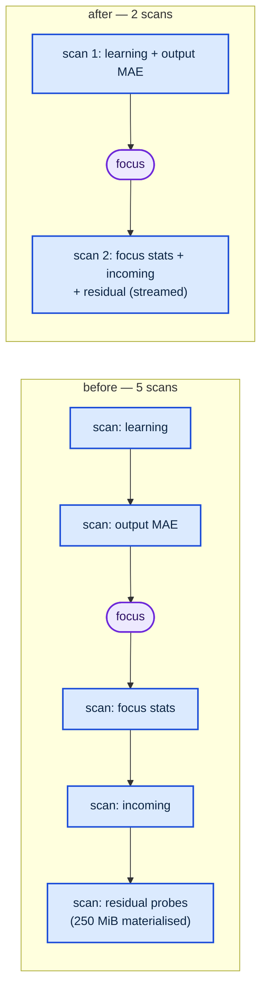

# Fuse the five per-experiment training-data scans into two (Issue #105)

## Summary

Every experiment used to walk the training sample **five times**, re-activating
the incumbent on each pass and opening its own `TrainingDataIterator`. Only two
of those passes are genuinely ordered: the first two choose the focus neuron,
the last three need the focus that choice produced. This change groups them into
**two scans** — `analysis::scan_pre_focus` and `analysis::scan_post_focus` — and
the run loop calls those instead. Closes #105.

Each measurement keeps its own streaming accumulator (`LearningScan`,
`OutputErrorScan`, `FocusStatsScan`, `IncomingSourceScan`, `ResidualScan`). The
existing public `collect_*` / `refine_*` functions drive the very same
accumulators over their own scan, so the fused and per-pass results share one
piece of arithmetic and cannot drift apart — the tests assert bit-identical
results for both.

The residual pass (`refine_sources_by_residual_with_observations`) now streams
the sample instead of materialising it as `Vec<ActivationProbe>`. It holds at
most two records back, because fewer than two rows discards the sample for the
synthetic-probe fallback and nothing must be activated in that case.



## Evidence

Backend/CLI change — no web interface to screenshot.

### Benchmark

`lamarck/examples/analysis_scan_bench.rs` (added) builds a synthetic creature
and sample, then times the analysis phase both ways over identical inputs.
Paired run, same creature, same records, same seed:

```bash
cargo run --release --example analysis_scan_bench -- both 25000 2511 4 12
```

`25 000` records × `2 511` inputs — production `--quick-sample-records` shape.
The box was busy during the run, so the table reports the **minimum** of 12
repeats per measurement (the least-noise estimator); medians move together.

| Pass (ms) | before (5 scans) | after (2 scans) |
|---|---|---|
| 1 learning | 866 | — |
| 2 output MAE | 33 | — |
| scan 1 (learning + MAE) | — | **889** |
| 3 focus stats | 33 | — |
| 4 incoming stats | 34 | — |
| 5 residual refine | 46 | — |
| scan 2 (focus + incoming + residual) | — | **35** |
| **analysis total** | **1039** | **928** |

- Analysis phase: **−10.7%** wall clock.
- The three post-focus passes (113 ms) collapse into one 35 ms scan — **−69%**,
  matching the issue's ~60% estimate for the passes that are scan-bound.
- The issue's headline estimate (~60% of the whole analysis phase) assumed the
  per-record cost is roughly even across the five passes. It is not: the
  learning pass costs ~25× a plain scan (866 ms vs ~34 ms) because it rebuilds a
  `PropagateInput` per record, so it dominates whatever fusion does. That
  remaining cost is a separate problem from this issue's scope.
- The learning pass itself is unchanged (866 ms before, 872 ms after) — the
  first cut of the accumulator was ~40% slower there and was fixed before
  merge; see `build_neuron_inputs` in `lamarck/src/propagate_layout.rs`.

### Peak RSS

```bash
/usr/bin/time -l analysis_scan_bench <mode> 25000 2511 4 1
```

| | peak RSS |
|---|---|
| before | 278.4 MB |
| after | 2.9 MB |

The `probes` materialisation is gone: the residual pass holds at most two
records instead of the whole sample.

## Test Plan

New tests in `lamarck/src/analysis.rs`:

- `fused_pre_focus_scan_matches_the_two_separate_passes` — runs the old
  per-pass path and the fused path over the same fixture and asserts the
  `LearningSignal` and per-output MAE are bit-identical.
- `fused_post_focus_scan_matches_the_three_separate_passes_on_an_output` and
  `..._on_a_hidden` — same equality check for `FocusNeuronStats`, incoming
  stats and ranked sources, on both focus kinds.
- `fused_post_focus_scan_matches_the_synthetic_probe_fallback` — one-record
  corpus, where both paths must fall back to synthetic probes.
- `fused_post_focus_scan_honours_the_record_limit` — `record_count` equals the
  configured `--quick-sample-records` cap.
- `fused_pre_focus_scan_skips_output_errors_when_not_requested`.
- `the_two_fused_scans_open_exactly_two_training_iterators` and
  `the_five_separate_passes_open_five_training_iterators` — the scan counter
  itself is pinned in both directions.

New test in `lamarck/src/run.rs`:

- `each_experiment_opens_at_most_two_training_scans` — a full scripted run with
  the weighted focus policy (so the output-MAE work is live) asserts
  `training_scans_opened() == 2 * experiments`.

Unchanged and still passing: `run::tests::recorded_seed_replays_the_candidate_stream`
(the candidate stream for a given seed does not move) and the rest of the suite.
`./quality.sh` passes.
