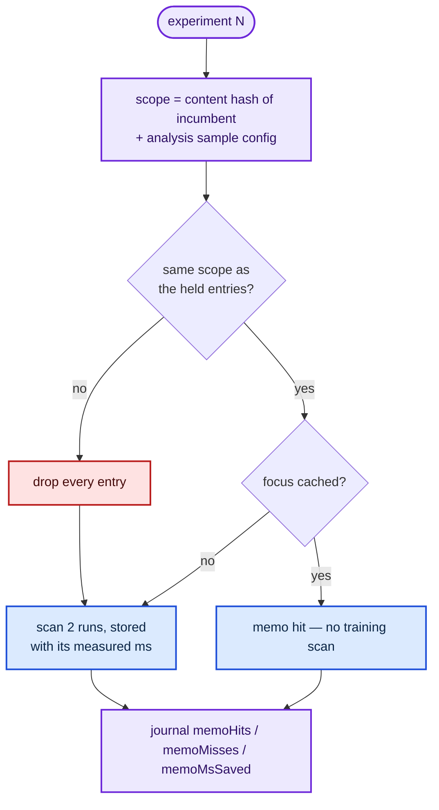

# Memoise incumbent-invariant analysis across experiments (Issue #106)

## Summary

The incumbent only changes when an experiment is **accepted**, and accepts are
rare — `docs/followup-economics.md` records 0 accepts in 118 experiments. So for
almost every experiment the creature the analysis phase describes is
byte-identical to the one the previous experiment described, yet the run loop
recomputed everything from scratch. This adds a cross-experiment memo
(`lamarck/src/memo.rs`) for the two analysis results that are pure functions of
what has not changed. Closes #106.

| Cached | Key | Effect on a hit |
|--------|-----|-----------------|
| Focus stats + incoming sources + ranked sources (`scan_post_focus`) | `(incumbent, focus, sample)` | The whole post-focus training scan is skipped. |
| Per-output MAE | `(incumbent, sample)` | Scan 1 still runs for the learning signal; only the residual accumulation is skipped. |

The learning signal is **not** cached: it is driven by a per-experiment seeded
RNG (`select_sparse`) and is deliberately different every experiment, exactly as
the issue requires.

### Keying and invalidation

The stale-cache failure mode — analysing creature *N* while proposing against
creature *N+1* — would degrade every candidate silently. Three guards:

1. **Content fingerprint, not `incumbentId`.** The journal's `incumbentId`
   counts neurons and synapses only, so a weight-only accept leaves it
   unchanged. The memo scope hashes every bias, weight, squash and uuid.
   `run::tests::an_accept_invalidates_the_memo_for_the_next_experiment` pins
   this: the accept it makes leaves `incumbentId` identical, and only the
   fingerprint invalidates.
2. **Scope checked at every lookup.** A changed creature, or a changed
   `--quick-sample-records` / `stats_mode` / training path, drops every entry
   before the lookup is answered — so *any* incumbent mutation path invalidates,
   not just the ones with an explicit call. Explicit `invalidate()` calls remain
   at the accept site and the Phase-G graft site.
3. **Runtime key check.** The loop debug-asserts the held scope still matches
   `incumbent_id(&incumbent)` and the creature fingerprint at use time, so a
   missed invalidation panics in test/debug builds.

Memory is bounded by `--analysis-memo-entries` (default 16), evicted
least-recently-used. `memoHits`, `memoMisses` and `memoMsSaved` are journalled
per experiment and totalled by `report` as an `analysisMemo` bucket, kept
separate from the candidate-level economics so no saving is double-counted.



## Evidence

Backend/CLI change — no web interface to screenshot.

### Paired benchmark

`lamarck/examples/analysis_memo_bench.rs` (added) runs the **real** optimisation
loop twice over identical inputs — same creature, same sample, same seed (7),
same wall-clock budget — with the memo off and on. The scorer is in-process
(local MSE over the same corpus) so both arms pay identical scoring cost and
only the analysis phase differs.

```bash
cargo run --release --example analysis_memo_bench -- 60 20000 128 24 1      # accept-free
cargo run --release --example analysis_memo_bench -- 60 20000 128 24 1e-6   # accept-heavy
```

**Accept-free stretch** (`min_improvement 1`) — the production regime the issue
targets (0 accepts in 118 experiments):

| Repeat | Experiments (memo off → on) | Memo hit rate | Scan ms saved |
|---|---|---|---|
| 1 | 223 → **262** (+17.5%) | 94.8% (497h/27m) | 2 343 ms |
| 2 | 235 → **247** (+5.1%) | 94.5% (467h/27m) | 2 635 ms |

**Accept-heavy** (`min_improvement 1e-6`, ~55% of experiments accept — the
worst case for a memo, since every accept invalidates it):

| Repeat | Experiments | Accepts | Δscore/wall-clock hour | Memo hit rate |
|---|---|---|---|---|
| 45s, memo off | 121 | 75 | 1.537e-1 | — |
| 45s, memo on | **137** | 84 | **1.649e-1** (+7.3%) | 28% |
| 60s, memo off | 160 | 89 | 1.309e-1 | — |
| 60s, memo on | **168** | 92 | **1.319e-1** (+0.8%) | 35% |

Every arm improves, in both regimes and both repeats. Reading it honestly:

- The **directly measured** number is `memoMsSaved` — 2.3–2.6 s of training-scan
  time avoided in a 60 s budget, ≈5% of the 49 s the analysis phase cost. That
  figure is measured on the miss that stored each entry, so it carries no
  run-to-run noise.
- The experiment-count spread (+5% to +17%) is wider than that saving justifies;
  the box was shared during the runs. The defensible claim is **≈5% more
  experiments per budget in an accept-free stretch**, not the 10–25% the issue
  estimated.
- The estimate was written before #105 landed. Fusing the five scans into two
  already removed most of the redundant scanning, and the remaining analysis
  cost is dominated by the learning pass (889 ms vs 35 ms for the post-focus
  scan in the #105 benchmark — ~4% of analysis). The memo eliminates that 4%
  scan ~95% of the time; it cannot do better without caching the learning
  signal, which the issue explicitly forbids.

### Behaviour is unchanged

`run::tests::the_memo_does_not_move_the_candidate_stream` runs the same seed
with the memo off and on and asserts identical focus choices, identical
journalled focus statistics and identical candidate streams — memoisation is an
optimisation, never a behaviour change.

## Test Plan

New tests in `lamarck/src/memo.rs`:

- `a_hit_returns_exactly_what_a_fresh_scan_produced` — stores a real
  `scan_post_focus` result, recomputes it, asserts the memo hit is field-for-field
  identical and that a hit banks the miss's measured cost.
- `a_structural_change_invalidates_every_entry`.
- `a_weight_only_change_invalidates_even_though_the_incumbent_id_matches` — the
  case the coarse journal id cannot see.
- `a_changed_sample_configuration_invalidates`.
- `an_explicit_invalidate_drops_the_entries`.
- `the_entry_cap_bounds_growth_across_many_focus_neurons` — 50 distinct focus
  neurons against a cap of 3.
- `eviction_takes_the_least_recently_used_focus`.
- `a_disabled_memo_never_stores_hits_or_counts` — `--analysis-memo-entries 0`
  journals zeros, never a phantom saving.
- `per_experiment_deltas_subtract_the_previous_snapshot`.

New tests in `lamarck/src/run.rs`:

- `an_unchanged_incumbent_reuses_the_focus_scan` — a 3-experiment run with a
  fixed focus opens `experiments + 1` training scans instead of `2 × experiments`
  (experiment 2 performs no MAE/focus/incoming scan at all), and the journalled
  focus statistics of experiments 1 and 2 are identical.
- `an_accept_invalidates_the_memo_for_the_next_experiment` — the experiment
  after an accept records zero hits and recomputes, even though the weight-only
  winner left `incumbentId` unchanged.
- `phase_g_graft_leaves_the_memo_cold_for_the_first_experiment` — Phase-G graft
  application invalidates; the first experiment analyses the grafted creature.
- `the_memo_does_not_move_the_candidate_stream` — memo off vs on, same seed,
  identical candidates.

New tests in `lamarck/src/report.rs`:

- `report_totals_the_analysis_memo_economics` — hits, misses, hit rate and the
  saved-milliseconds share.
- `report_reads_a_pre_memo_journal_as_zero_savings` — a journal written before
  the fields existed reports zeros rather than failing.

Modified test (documented): `each_experiment_opens_at_most_two_training_scans`
now sets `analysis_memo_entries = 0`. The #105 contract is "two scans per
*computed* experiment"; #106 removes scan two on a hit, so the test pins the
pre-memo count with the memo off and additionally asserts a disabled memo
journals zeros. No test was removed or commented out.

`./quality.sh` passes.
