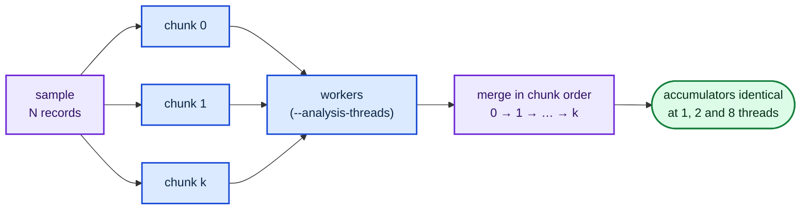

# Parallelise the per-experiment analysis scans across cores (Issue #107)

## Summary

The analysis phase was single-threaded on a 10-core box that is otherwise idle
while it runs — the scorer and the analysis alternate, they never overlap. Both
scans are read-only reductions over records, so this change folds them on
`--analysis-threads` workers (default `4`). Closes #107.

Determinism is kept by the **partition**, not the schedule:

- the sample is cut into fixed `2048`-record chunks (`lamarck/src/chunks.rs`) —
  a function of the sample alone, never of the thread count, the core count or
  the host;
- `map_chunks` hands chunks to whichever worker is free, but returns the
  partials **indexed by chunk**, so the caller always merges ascending chunk
  index;
- every accumulator gained an explicit `merge` (plain sums for the learning
  signal, output MAE, incoming stats and residual sums; Chan's parallel formula
  for the focus-stats Welford moments).

One thread and eight threads therefore fold the same partials in the same order
and produce bit-identical accumulators, so `--seed` replay is unaffected.

Two correctness boundaries the parallel region does not cross:

- **RNG stays sequential.** `select_sparse` is drawn once, on the calling
  thread, into a new `LearningPlan` that the per-chunk accumulators borrow. No
  worker touches the run's RNG.
- **Recurrent creatures are not chunked.** A creature that is not `forwardOnly`
  reads activations produced by a later neuron — its record N depends on record
  N−1 — so it is folded as a single chunk. Correctness first, speed second.

`--analysis-threads` is validated (`0` aborts the run rather than being clamped),
documented in the README run-knobs table, and recorded in the journal
`runHeader` as `analysisThreads`, so an arm that turned out *slower* than serial
is identifiable from its journal alone.



## Evidence

Backend/CLI change — no web interface to screenshot.

### Benchmark

`lamarck/examples/analysis_threads_bench.rs` (added) builds a
production-shaped creature and sample, then times both analysis scans at each
worker count over identical inputs. It **fingerprints every accumulator** and
fails the run if any thread count changed a number, so a faster arm that quietly
moved the analysis cannot be reported as a win.

```bash
cargo run --release --example analysis_threads_bench -- 25000 2511 12 10 1,2,4,8
```

`25 000` records × `2 511` inputs — the production `--quick-sample-records`
shape. The arms are interleaved inside one process and the table reports the
**minimum** of 10 repeats (the least-noise estimator); the box was shared with
another job throughout, so the ratios are the trustworthy figure, not the
absolute milliseconds.

| threads | pre-focus ms | post-focus ms | analysis ms | speed-up |
|---|---|---|---|---|
| 1 | 1017 | 28 | 1045 | 1.00× |
| 2 | 548 | 16 | 564 | **1.85×** |
| 4 (default) | 327 | 11 | 338 | **3.09×** |
| 8 | 248 | 8 | 256 | **4.08×** |

A second sweep (min of 12, heavier load) reproduced 1.97× / 3.47× / 4.50×.

**Before/after against the milestone branch.** The pre-change serial code
(commit `4b865dd`, issue #106) was built in a sibling worktree and timed on the
same sample with `analysis_scan_bench fused 25000 2511 12 10`: **960 ms** best
of 10, against **338 ms** for the default 4-thread arm — a **2.8×** cut in the
analysis phase. The single-worker arm matches the pre-change path within the
noise of the shared box (1045 ms vs 960 ms best-of-10; paired interleaved rounds
put them either side of each other).

Against the measured 26.9%–39.9% analysis share in
`docs/followup-economics.md`, a 3.1× cut to that share is roughly a **18%–27%
reduction in wall clock per experiment**, at the top of the issue's estimate.

The chunk reader reads a 64 KiB batch and decodes out of it rather than using
`SeekingRecordReader`, which seeks and reads a single record per call; measured
in isolation over the same sample it is faster than the previous streaming
iterator (23–34 ms vs 41–86 ms per pass), so parallelism is not paid for with a
slower read path.

### Not measured here

The issue also asks for a paired **whole-run** benchmark (journalled
`analysisMs`, experiments completed, score improvement per wall-clock hour at 1
thread vs the default). That needs the production creature and the `rust_scorer`
binary with exclusive use of the box, neither of which is available in this
environment — the same constraint `docs/followup-economics.md` records for the
exclusive-box arms. The per-experiment `analysisMs` and the new
`runHeader.config.analysisThreads` are what make that run readable from its
journal when the box is free.

## Test Plan

New tests in `lamarck/src/chunks.rs`:

- `chunks_partition_the_sample_exactly_once`, `a_chunk_stride_beyond_the_sample_is_one_chunk`,
  `an_empty_sample_has_no_chunks` — the partition covers every record once, with
  no overlap or gap.
- `reading_the_chunks_reproduces_the_sample_in_order` — six chunk strides,
  boundaries inside and across files, all reproduce the serial record order.
- `refilling_the_read_batch_does_not_drop_or_reorder_records` and
  `a_record_wider_than_the_read_batch_still_reads` — the batched reader's
  boundary cases.
- `a_capped_sample_reads_only_the_leading_records`,
  `a_ragged_file_fails_loudly_rather_than_truncating` — the cap and the
  fail-loud path.
- `map_chunks_returns_results_in_chunk_order_at_every_thread_count`,
  `map_chunks_surfaces_a_worker_failure`, `map_chunks_surfaces_a_worker_setup_failure`,
  `map_chunks_rejects_a_zero_worker_count` — ordering and failure surfacing.

New tests in `lamarck/src/analysis.rs` (the acceptance criterion):

- `the_pre_focus_scan_is_bit_identical_at_one_two_and_eight_threads` and
  `the_post_focus_scan_is_bit_identical_at_one_two_and_eight_threads` (both
  focus kinds) — exact equality of the `LearningSignal`, output MAE,
  `FocusNeuronStats`, incoming stats and ranked sources at 1, 2 and 8 threads.
- `the_test_fixture_really_spans_several_chunks` and
  `the_equality_fixture_is_order_sensitive` — guard the two tests above: the
  fixture crosses at least two chunk boundaries, and its values span twelve
  orders of magnitude so float addition is genuinely non-associative. Both
  equality tests were confirmed to **fail** when the chunk stride was
  temporarily made thread-dependent, and to pass again when it was restored.
- `a_capped_sample_folds_the_same_records_at_every_thread_count`,
  `a_multi_threaded_scan_still_counts_as_one_training_pass` (the #105 two-scan
  budget survives chunking), `a_scan_rejects_a_zero_thread_count`,
  `a_recurrent_creature_is_folded_as_one_chunk`.

New tests elsewhere:

- `run::tests::recorded_seed_replays_the_candidate_stream_at_every_thread_count`
  — the recorded seed regenerates the same focus and candidate stream at 1, 2
  and 8 threads.
- `run::tests::run_header_records_the_analysis_thread_count` — the field is
  journalled, round-trips, and an older journal without it still parses.
- `config::tests::the_default_analysis_thread_count_is_the_documented_one` and
  `a_zero_analysis_thread_count_is_rejected_loudly`.
- `backprop::tests::merging_two_signals_totals_both_sides`,
  `merging_an_empty_signal_changes_nothing`,
  `merging_a_differently_shaped_signal_fails_loudly`.

Unchanged and still passing: `run::tests::recorded_seed_replays_the_candidate_stream`,
`analysis::tests::fused_*` (the fused scans still match the standalone
`collect_*` / `refine_*` passes bit for bit), and the rest of the suite.
`cargo-deny` is clean — no dependency was added; the workers are
`std::thread::scope`. `./quality.sh` passes.
