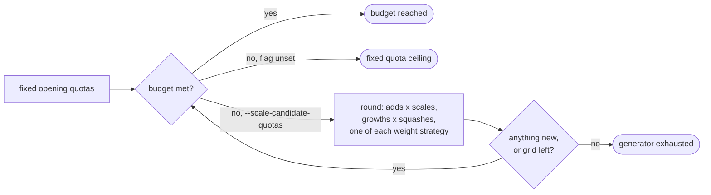

# Perf: scale the candidate-generator quotas so `--candidates` binds above 29

## Summary

`generate_candidates` filled a batch through fixed per-phase quotas, so
`--candidates` stopped binding at ~29 on the production creature and
`--candidates 100` (the default) bought nothing above 40. This adds a scaled
generator: once the fixed opening phases are spent it keeps sweeping the
ranked-source × weight-scale and ranked-source × squash grids, a slice of every
strategy family per round, until the budget is met or nothing new can be
proposed. Duplicate proposals are rejected rather than counted, and every batch
now reports which of three limits bound it — **budget reached**, **fixed quota
ceiling** or **generator exhausted**. Closes #108.

The scaling is **opt-in** behind `--scale-candidate-quotas`. Issue #108's own
risk section requires a paired production benchmark before the ceiling rises on
existing configs, and that benchmark needs the GRQ creature, exclusive use of
the scorer and the 21 GiB corpus — none of which exist on this machine. The
default path is byte-for-byte the pre-#108 generator; the arm that would justify
changing the default is wired up and documented instead of guessed at.



## Evidence

Backend/CLI change — no web interface to screenshot.

### Generator benchmark

`cargo run --release --example candidate_quota_bench` (new), on a
production-shaped synthetic creature: 2511 inputs, 12 hiddens, one output; the
minimum of 5 interleaved repeats on an Apple M4.

| `--candidates` | Fixed quotas | Distinct | Scaled quotas | Distinct | Generation (scaled) |
|----------------|--------------|----------|---------------|----------|---------------------|
| 12 | 12 (budget) | 11 | 12 (budget) | 12 | 1.2 ms |
| 29 | 27 (ceiling) | 22 | 29 (budget) | 29 | 3.4 ms |
| 40 | 27 (ceiling) | 22 | 40 (budget) | 40 | 4.5 ms |
| 60 | 27 (ceiling) | 22 | 60 (budget) | 60 | 5.9 ms |
| 100 | 27 (ceiling) | 22 | 100 (budget) | 100 | 9.1 ms |
| 120 | 27 (ceiling) | 22 | 120 (budget) | 120 | 10.1 ms |
| 240 | 27 (ceiling) | 22 | 240 (budget) | 240 | 19.7 ms |

- The budget binds at every count measured, to 240 — 8.9× the old ceiling.
- Generation costs ~0.08 ms per candidate, four orders of magnitude below the
  ~11 s per-experiment learning pass. The extra batch costs **screen time**, not
  generation time, which is precisely what the paired arm has to price.
- The *distinct* columns are a side finding: the fixed quotas propose 27
  candidates of which only **22 are distinct**, so five creatures per experiment
  are scored twice today. The scaled path drops duplicates instead of counting
  them, so a filled budget is N distinct hypotheses rather than N slots.

### Strategy mix, `--candidates 120`, fixed → scaled

| Strategy | Fixed | Scaled |
|----------|-------|--------|
| `structural_add` | 8 | 52 |
| `structural_add_neuron` | 6 | 30 |
| `stats_weight` | 3 | 12 |
| `stats_bias` | 3 | 12 |
| `random` | 3 | 12 |
| `structural_weaken` | 3 | 1 |
| `mean_error_bias` | 1 | 1 |

No family disappears (pinned by
`candidates::tests::a_scaled_batch_starves_no_strategy_family`). Two shifts are
expected and recorded: the mix tilts towards the structural families, whose
hypothesis space is what the extra budget sweeps, and `structural_weaken` falls
to 1 because it proposes one deterministic mutation, so its repeats are
duplicates. `backprop` appears in neither column — the benchmark supplies no
learning signal, so it proposes nothing on either side.

### What is *not* measured here

The economic half of the acceptance criteria — experiments, screen scores,
full-corpus promotions, promote-scores per scorer-minute, score improvement per
wall-clock hour — needs the production creature and the scorer. The arm is wired
up and gated on the same seed and wall budget on both sides:

```bash
QUOTA_SECONDS=900 QUOTA_CANDIDATES=100 \
  scripts/run-followup-economics.sh candidate-quotas
```

**Decision on the default:** `--candidates 100` stays, and
`--scale-candidate-quotas` stays off, until that arm shows the scaled side wins
on **promote rate and accepts-per-hour** — not on batch size. Written up as Arm
5 of `docs/followup-economics.md`.

## Test Plan

New tests in `lamarck/src/candidates.rs`:

- `the_candidate_budget_binds_until_genuine_exhaustion` — 12, 29, 60 and 120 all
  bind exactly, and report `BatchLimit::Budget`. Fails the moment a fixed
  constant re-caps the generator.
- `a_wide_creature_fills_a_far_larger_budget` — 240 binds on a 512-source
  creature while the fixed quotas still stop below 40.
- `an_exhausted_generator_reports_exhaustion_rather_than_the_budget` — a budget
  past what a two-source creature can support returns a partial batch labelled
  `Exhausted`, not a silent short batch.
- `a_scaled_batch_starves_no_strategy_family` — every strategy present at 29 is
  still present at 120.
- `a_scaled_batch_contains_no_duplicate_candidates` — all 120 mutations are
  distinct once a grown neuron's random UUID is normalised away.
- `scaling_the_quotas_leaves_a_small_batch_unchanged` — a batch under the old
  ceiling is proposal-for-proposal identical with the flag on.

New tests elsewhere:

- `run::tests::experiment_records_the_requested_budget_and_batch_limit` — an
  end-to-end run journals `candidatesRequested` / `batchLimit`, and an
  under-filled scaled batch names exhaustion.
- `report::tests::report_summarises_the_achieved_candidate_batch_size` and
  `a_journal_without_batch_fields_still_reports_the_sizes` — the `candidateBatch`
  bucket, including the pre-#108 journal case.
- `followup_economics_arms::the_candidate_quotas_arm_varies_only_the_quota_scaling`
  — the A/B pair shares seed, budget and `--candidates`; only the flag moves.

**Modified test (documented per the no-deleted-tests rule):**
`raising_the_candidate_budget_above_the_generator_ceiling_adds_nothing` is kept,
not converted. It still pins the fixed ceiling because that remains the
**default** path, and it gains an assertion that an under-filled default batch
reports `BatchLimit::QuotaCeiling` rather than failing silently. The
budget-binding property #108 asked for is asserted by the new tests above, which
is where it belongs while the scaling is opt-in.

`./quality.sh` passes (fmt, clippy `-D warnings`, cargo-deny, codespell,
shellcheck, 258 tests, rustdoc).
