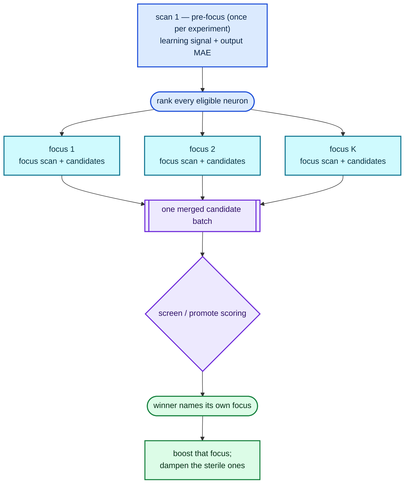

# Propose against several focus neurons per experiment (Issue #109)

## Summary

An experiment used to pick **one** focus neuron and spend the whole analysis
phase on it, even though most of that phase is not focus-specific: the backprop
learning signal and the output-residual scan describe the entire creature, and
the improvement-signal ranking scores every eligible neuron. All of that was
amortised over a single neuron — and, when that neuron was a saturated `TANH`
with a dead gradient, over nothing at all.

`--focus-count K` (default `1`) draws `K` distinct focuses from the same
ranking, runs the focus-specific work (focus stats, incoming sources, residual
refine) once per focus, splits `--candidates` between them and merges the
per-focus batches into one scored population. The creature-wide passes still run
**once** per experiment. Closes #109.

Attribution follows the issue #74 member rule: each candidate's provenance
already names its focus, so an accepted winner boosts only that focus's history
in the weighted selector, and every other focus in the set is dampened as
sterile on its **own** candidates' full-corpus Δ.

`K = 1` proposes exactly the pre-change stream. The flag ships opt-in at 1, exactly
as `--scale-candidate-quotas` did in #108: the throughput gain is measured
below, but accepts-per-hour is a production-box question.

## Evidence

Backend/CLI change — no web interface to screenshot. The evidence is the paired
benchmark and the test suite.

### Paired benchmark (`focus_fanout_bench`)

`cargo run --release --example focus_fanout_bench -- 60 20000 128 24 12 1,3 1 3`
— 128 inputs, 24 TANH hiddens, 20 000 records, 60 s wall budget, seed 7, in-process
MSE scorer, accept-free `min_improvement 1`. Best of three interleaved repeats:

| `--focus-count` | `--candidates` | Experiments | Candidates | Candidates/analysis-min | Promote scores/scorer-min |
|---|---|---|---|---|---|
| 1 | 12 | 380 | 4560 | 8955 | 9844 |
| 3 | 12 | 324 | 3888 | 7507 (0.84×) | 8537 |
| 3 | 36 | 180 | 6480 | **23 194 (2.59×)** | 9392 (0.95×) |

Holding the *total* batch at 12 makes `K = 3` slightly **worse**: the batch size
did not move, but the experiment now pays three focus scans instead of one. The
amortisation pays when each focus keeps its own share of the budget — at 12
candidates *per focus* the same shared learning pass produces **2.6× the
candidates per analysis-minute**, inside the 1.5×–3× the issue estimated, while
the promote rate holds at 0.95×, so the batch is not spread so thin that the
structural quotas stop firing.

Accept-rich regime (`min_improvement 1e-6`, 45 s, best of two): the throughput
result repeats (17 591 vs 5699 candidates/analysis-min, 3.1×) but `K = 1` still
won on improvement per wall-clock hour (1.73e-1 vs 1.64e-1) — after an accept the
memo is invalidated, so work spent on the focuses that did not win is discarded.
That is exactly why the default stays 1 and the production arm
(`scripts/run-followup-economics.sh focus-count`, seed 71) has to settle it.
Recorded as **Arm 6** in `docs/followup-economics.md`.

### K = 1 equivalence

`lamarck/tests/fixtures/focus/k1-candidate-stream.txt` was captured by running
the loop on the commit **before** this change (993f853) and re-parsing its
journal. `focus_count_one_reproduces_the_pre_change_candidate_stream` asserts the
new code reproduces it — same focus choices, same candidates, same order. A
stray rng draw in the multi-focus plumbing fails there.

The comparison is exact on structure (strategy, focus, target, squash,
grown-neuron UUID, ordering) and six significant figures on the proposal values:
the analysis reduction is not bit-identical across architectures, and the same
proposal reads `w=-0.04081369646976907` on aarch64 and `w=-0.04081369645778815`
on x86_64. `the_normaliser_redacts_drift_but_not_uuids_or_changed_values` pins
that the tolerance hides the drift and nothing else.

## Test Plan

New — `lamarck/tests/focus_count.rs`:

- `focus_count_one_reproduces_the_pre_change_candidate_stream` — golden stream
  from the pre-change commit.
- `focus_count_one_journals_no_focus_set` — a `K = 1` journal grows no
  `focusNeurons` field, and the `runHeader` records `focusCount`.
- `three_focuses_share_one_learning_pass_per_experiment` — scan counting: one
  pre-focus scan per experiment plus one focus scan per focus. An implementation
  that looped the whole analysis per focus fails here.
- `candidates_are_split_across_the_focus_set_and_tagged_with_their_focus`.
- `only_the_winning_focus_is_credited_with_the_accept` — a scripted winner in a
  `K = 3` batch; `report` credits one focus, the other two stay at zero.
- `a_zero_focus_count_aborts_the_run`, `a_pinned_focus_stays_a_single_focus`.

New — `lamarck/src/run.rs`:

- `a_candidate_budget_splits_across_the_focus_set` (shares always sum back to the
  budget), `a_merged_batch_reports_the_strictest_limit`,
  `only_a_multi_focus_experiment_journals_a_focus_set`.
- `a_focus_is_scored_on_its_own_candidates`,
  `an_accept_boosts_only_the_winning_focus`,
  `a_combo_winner_credits_every_member_focus`,
  `a_scorer_failure_dampens_the_whole_focus_set`.

New — `lamarck/src/focus.rs`:

- `exclusion_skips_already_chosen_focuses` (all four policies),
- `an_empty_exclusion_draws_exactly_as_before` (the rng contract behind `K = 1`).

New — `lamarck/src/report.rs`: `focusHistory` over a `K = 3` journal, a `K = 1`
journal and a pre-change journal with no focus set and no `comboMemberIndices`.

New — `lamarck/src/config.rs`: `focus_count_defaults_to_one_and_rejects_zero`.
New — `lamarck/tests/followup_economics_arms.rs`:
`the_focus_count_arm_varies_only_the_focus_count`.

`./quality.sh` passes (fmt, clippy `-D warnings`, `cargo deny`, full test suite,
README↔CLI parity, docs build).

## Documentation

- `README.md` — `--focus-count` in the flag table, Phase 2 renamed to *select the
  focus neurons* with a Mermaid fan-out diagram, `focusNeurons` /
  `focusCount` journal fields, and the `focusHistory` attribution rule.
- `docs/followup-economics.md` — Arm 6 with the numbers above and the production
  command.
