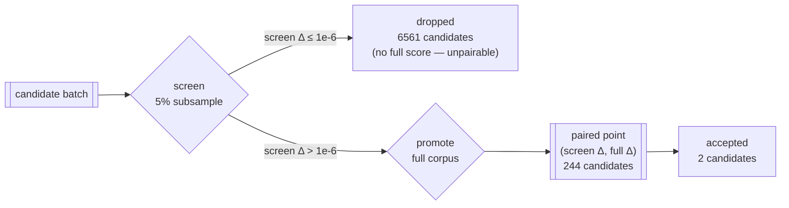

## Summary

Measured how well the 5% screen predicts the full-corpus verdict, from journals
already in hand — no box time, and no default flag changed. Closes #110.

`report` gains a `screenCalibration` section (`lamarck/src/screen_calibration.rs`)
that pairs every candidate carrying **both** a `screenScores` and a `scores`
entry into a (screen Δ, full Δ) point, then reports the Spearman rank
correlation, the promote gate's precision, the full-corpus spread of what it
promoted, the screen's empirical noise floor, the subsample-versus-corpus
baseline gap and the screen Δ of every accepted candidate.
`scripts/summarise-screen-calibration.sh` runs it over several journals and
emits the tables; `docs/screen-calibration.md` is the write-up.

The headline, over 222 experiments / 6805 screened candidates / 244 promotions /
**2** accepts:

- rank correlation **-0.549** (-0.502 on distinct points) — the screen's ordering
  is *inverted* among what it promotes, in every one of the eight journals,
- promote precision **15.2%**: 207 of 244 promotions made the creature worse, 104
  by more than the accept bar, and 3 cleared it,
- screen Δ noise floor **σ ≈ 1.06e-6** (137 pairs), so the `1e-6` threshold is a
  ~1σ gate — a coin flip. A 3σ gate would have cut promotions 59% (244 → 100)
  and kept both accepts.

The document states the limits as plainly as the numbers: the sample cannot
price `--screen-sample-rate` (every journal ran 0.05), cannot establish a
false-negative rate (a rejected candidate is never full-scored — the only handle
is **two** accepts), and 222 experiments are not 222 independent samples (244
pairs contain 136 distinct points).

## Evidence

Backend/CLI only — no web interface to screenshot. Evidence is the analysis
output over the journals in hand, produced by the committed script:

```bash
scripts/summarise-screen-calibration.sh \
  .lamarck-baseline-45/experiments.jsonl .lamarck-followup-75/*/experiments.jsonl
```

| Journal | Exps | Screened | Paired | Distinct | Rank ρ | ρ distinct | Precision | Cleared bar | Materially worse | Screen-Δ noise sd | Baseline gap sd |
|---------|------|----------|--------|----------|--------|------------|-----------|-------------|------------------|-------------------|-----------------|
| `.lamarck-baseline-45` | 75 | 1954 | 115 | 81 | -0.555 | -0.447 | 27% | 3 | 45 | 1.12e-6 | 1.49e-3 |
| `backprop-cap-tenth` | 14 | 462 | 10 | 10 | -0.317 | -0.317 | 0% | 0 | 4 | 7.52e-7 | 1.38e-3 |
| `backprop-lr-tenth` | 21 | 693 | 17 | 17 | -0.654 | -0.654 | 0% | 0 | 9 | 1.09e-6 | 1.39e-3 |
| `batch-100` | 28 | 924 | 26 | 25 | -0.449 | -0.463 | 3.8% | 0 | 11 | 8.98e-7 | 1.3e-3 |
| `batch-150` | 20 | 660 | 17 | 17 | -0.654 | -0.654 | 0% | 0 | 9 | 1.09e-6 | 1.39e-3 |
| `batch-40` | 18 | 594 | 14 | 14 | -0.509 | -0.509 | 0% | 0 | 7 | 6.94e-7 | 1.49e-3 |
| `output-focus` | 20 | 660 | 20 | 20 | -0.685 | -0.685 | 5% | 0 | 10 | 1e-6 | 1.53e-3 |
| `seed-2` | 26 | 858 | 25 | 25 | -0.343 | -0.343 | 16% | 0 | 9 | 1.25e-6 | 1.49e-3 |
| **pooled** | **222** | **6805** | **244** | **136** | **-0.549** | **-0.502** | **15.2%** | **3** | **104** | **1.06e-6** | **1.4e-3** |

What is paired, and what is deliberately not:



The rank correlations were cross-checked against an independent
implementation before the write-up; every per-journal ρ matched the Rust
output exactly.

`./quality.sh` passes (shellcheck, codespell, cargo-deny, fmt, clippy `-D
warnings`, 243 lib tests + integration tests, rustdoc), as does
`markdownlint-cli2`.

## Test Plan

Fixture-journal tests beside the analysis code, each asserting hand-computed
figures so an arithmetic or pairing error fails `cargo test`:

- `screen_calibration::tests::only_candidates_scored_on_both_sides_are_paired` —
  different stem sets pair only the intersection; the remainder is counted on
  both sides, never dropped.
- `..::the_baseline_stem_is_excluded_from_both_sides` — the anchor is not an
  observation; without the exclusion the correlation would be pinned near 1.
- `..::a_journal_without_a_screen_phase_reports_not_applicable` — `screenScores`
  absent gives `screenEnabled: false` and a `null` correlation, not a panic.
- `..::a_screen_map_without_a_baseline_fails_loudly` /
  `..::a_promote_map_without_a_baseline_fails_loudly` — a missing anchor errors
  rather than being skipped into a clean-looking result.
- `..::promotion_precision_and_spread_are_hand_computable` — precision,
  accept-bar counts and the interpolated quartiles.
- `..::tied_screen_deltas_share_an_averaged_rank`,
  `..::a_constant_side_reports_no_correlation` — tie handling and the undefined
  cases.
- `..::the_noise_floor_comes_from_candidates_the_full_corpus_scores_flat`,
  `..::the_header_accept_bar_sets_the_near_zero_band`,
  `..::the_baseline_sample_gap_measures_subsample_error_directly`.
- `..::every_accepted_candidate_reports_the_screen_delta_that_promoted_it` — a
  merged combo reports `null`, because it was assembled after the screen.
- `..::repeated_points_are_counted_once_for_the_sensitivity_check`,
  `..::disagreeing_run_headers_report_no_single_knob`.
- `report::tests::report_calibrates_the_screen_against_the_full_corpus`,
  `..::report_reads_a_journal_with_no_screen_phase`,
  `..::report_quotes_the_screen_knobs_from_the_run_header` — the section
  end-to-end from a journal file.
- `lamarck/tests/screen_calibration_doc.rs` — the document keeps naming tooling
  and report fields that exist, and keeps its "what this sample cannot support"
  section, which is the review gate against a confident recommendation drawn
  from two accepts.
