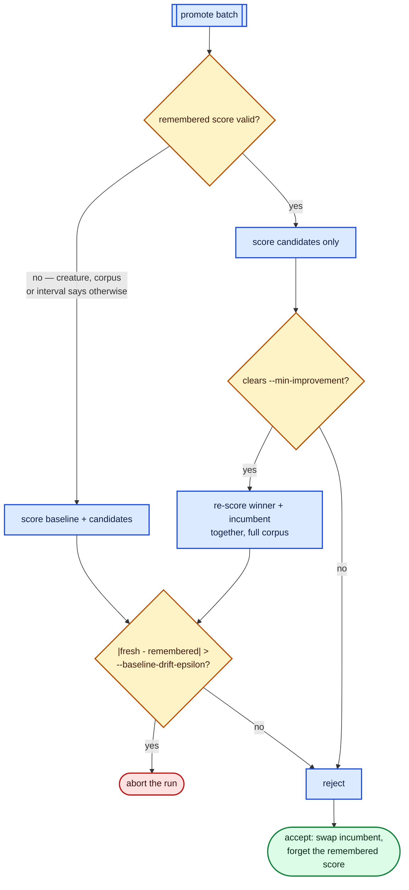

# Reuse the known full-corpus baseline in promote calls (Issue #113)

## Summary

Every promote call copied the incumbent into the promote directory, so the
scorer re-derived a constant the run already knew — the incumbent's full-corpus
score is established by the Phase-0 parity gate and by the last accept, and
between accepts the incumbent does not change. That baseline is ≈16–23% of a
promote call's creature-scores, on the expensive tier.

This change carries the authoritative score across experiments and lets a
promote call omit the incumbent, behind `--baseline-reverify-interval`
(**`0` by default — the pre-#113 run is unchanged**). The pairing a promote call
gives up is a guard as well as a cost, so three guards replace it:

1. **Keyed to what could invalidate it** — the creature's coarse `incumbentId`
   *and* its content fingerprint (a weight-only accept leaves the shape id
   untouched, so the id alone would be a false key), plus a fingerprint of every
   `*.bin` in the training directory with size and mtime.
2. **Every accept is verified before the swap** — a winner proposed against a
   remembered baseline is re-scored *beside the incumbent* in one full-corpus
   call, and only that fresh pair can rewrite `best.json`.
3. **Drift aborts the run** — whenever a fresh baseline lands while a remembered
   one is held, the two are compared and a disagreement beyond
   `--baseline-drift-epsilon` (default `1e-9`, three orders below
   `--min-improvement`) stops the run.

`select_winner`, `screen_promote_decision` and `collect_improvers` gained
`*_against` forms that take the baseline as a parameter, so a map with no
`baseline` key is decided by the same rule rather than defaulting to a score of
`0` (which would promote everything). The map-based forms keep their existing
`ScorerError::Missing` behaviour. The screen phase is deliberately untouched:
its sample phase rotates per experiment, so each screen's baseline score is
genuinely new information.

Closes #113.

## Evidence

Backend/CLI change — no web interface to screenshot. Evidence is the paired
benchmark and the test suite.

`lamarck/examples/promote_baseline_bench.rs` runs the real optimisation loop with
the arms alternated over three sweeps (same creature, corpus, seed and wall
budget; in-process scorer tiered like production — 5% corpus for screen, full
for promote), on an otherwise idle 10-core M4. Raw log:
[`docs/evidence/baseline-reuse/paired-sweeps.log`](../../evidence/baseline-reuse/paired-sweeps.log).

| Metric (median of 3 sweeps) | Paired (`0`) | Remembered (`25`) | Change |
|---|---|---|---|
| Promote creature-scores per call | 5.86 | 4.91 | **-16.2%** (exactly one creature) |
| Promote-phase ms per call | 28.8 | 24.2 | **-16.0%** |
| Experiments completed in the budget | 369 | 387 | **+4.9%** |
| ms per promote creature-score | 4.92 | 4.92 | unchanged |

The last row is the control: the cost of scoring one creature did not move, so
the promote call got cheaper only by carrying one creature fewer. All three
sweeps agree to ±0.6% on the experiment count.

Projected onto production with the per-call costs #112 fitted (≈5 490 ms per
creature on a full-corpus call), removing one creature from each of the #8
baseline run's 26 promote calls is ≈143 s of its 2 236 s of scorer time —
**≈6.4% of scorer time, ≈5% of a 45-minute run**. That is the lower half of the
issue's 5–10% estimate and is the honest number, because #112 measured the
promote call's fixed cost at only ≈6% of the call.

An earlier pair of sweeps taken while the box was busy swung the experiment
count by ±13% in **both** directions; that is why the harness alternates arms
and repeats, and why `docs/baseline-reuse.md` says the wall-clock row is valid
for an idle host only.

`./quality.sh` passes (fmt, clippy `-D warnings`, cargo-deny, codespell, 300+
tests, rustdoc).

## Test Plan

New tests, all calling the real functions:

- `lamarck/src/run.rs`
  - `promote_calls_omit_the_baseline_when_a_remembered_score_is_valid` — the
    saving itself: with reuse on, every promote directory after Phase-0 carries
    candidates only, and the journal records `baselineSource: remembered`.
  - `the_default_run_still_pairs_every_promote_call_with_a_fresh_baseline` —
    the opt-in property: at the default `0` nothing changes.
  - `a_drifted_baseline_aborts_the_run` — a fake scorer returns a moved baseline
    on the re-verification call; the run aborts naming
    `--baseline-drift-epsilon` instead of scoring against it.
  - `an_accept_whose_margin_needs_the_stale_baseline_is_withdrawn` — the false
    accept this issue's risk section names: a margin that exists only against
    the remembered score is withdrawn by the freshly scored pair, and nothing
    reaches `best.json`.
  - `a_real_improver_survives_verification_and_invalidates_the_remembered_score`
    — the positive control, plus the invalidation: the promote call after an
    accept carries the baseline again.
- `lamarck/src/baseline.rs` — validity keyed to the content fingerprint (not the
  coarse shape id) and to the corpus; interval bounding; drift as an absolute
  distance; a missing training directory is an error, not a constant key.
- `lamarck/src/scorer.rs` — `select_winner_against` and
  `screen_promote_decision_against` return exactly what the map-based forms do
  when the baseline is supplied rather than present, and the map-based forms
  keep their `ScorerError::Missing` failure; the baseline-free promote batch
  writes only the stems.
- `lamarck/src/config.rs` — reuse off by default; an interval enables it; a
  negative or non-finite `--baseline-drift-epsilon` is rejected loudly.
- `lamarck/src/report.rs` — the `baselineReuse` bucket counts fresh vs
  remembered promote calls and subtracts the verification's creature-scores, so
  the saving is never over-claimed; a pre-#113 journal reports zeros.
- `lamarck/tests/baseline_reuse_doc.rs` — `docs/baseline-reuse.md` ↔ code
  contract: the tooling it names exists, the flags and journal fields it quotes
  are current, all three guards are stated, and its limits section survives.

Modified existing tests: `select_winner_picks_best_qualifying` and
`screen_promote_stems_keeps_only_positive_deltas` were **extended** (not
weakened) to cover the parameterised forms alongside their original assertions;
`best_focus_delta` / `record_focus_outcomes` test call sites pass the baseline
that is now a parameter. No test was removed or disabled.
