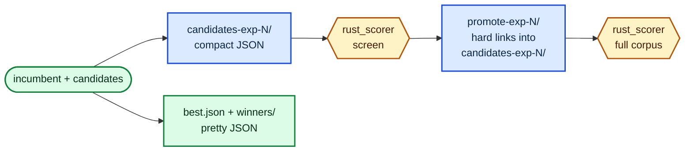

# Compact candidate batches and hard-linked promote directories (Issue #114)

## Summary

Scorer-facing batch files are now compact JSON, and the promote directory hard-links
the promoted files from the screen directory instead of copying them. `rust_scorer`
is the only reader of a batch file, so the pretty-printer's indentation was ~30% of
the bytes written, read and parsed on every experiment; a promote file is the screen
file's bytes at a second path, so a hard link presents it for free. Human-facing
artefacts are untouched — `best.json` and `winners/` stay pretty-printed. Closes #114.

- `write_candidate_batch` (`lamarck/src/candidates.rs`) writes `baseline.json` and
  every `candidate-NNN.json` compactly. The baseline keeps its `uuid` / `tags` via
  the new `serialize_creature_with_meta_compact` (`lamarck/src/tags.rs`) — the same
  document as the pretty form, minus the whitespace.
- `write_promote_batch` (`lamarck/src/scorer.rs`) links rather than copies, falling
  back to a copy when the link fails (existing destination, `EXDEV`, a filesystem
  with no links). A missing source still fails loudly: the fallback covers link
  failures, never a batch file that was never written.

Nothing mutates a batch file in place — batch files are written once and the
directory is deleted whole — so the shared inode is safe.



## Evidence

Backend/CLI change — no web interface to screenshot. The evidence is the paired
benchmark and the test suite.

`lamarck/examples/batch_io_bench.rs` writes a whole production-shaped batch in both
formats, interleaved and repeated, reporting the fastest run of each arm. Raw output:
[`docs/evidence/batch-io/batch-io-bench.log`](../../evidence/batch-io/batch-io-bench.log).
Full write-up, including the limits: [`docs/compact-batch-io.md`](../../compact-batch-io.md).

```bash
cargo run --release --example batch_io_bench -- 29 10
```

Creature: 2511 inputs, 1591 neurons, 23 479 synapses. Batch: baseline + 29 candidates
(the size the fixed opening quotas reach in production). Host: 10-core Apple M4, APFS.

| Arm | Bytes written | Write ms | Read ms | Parse ms |
|-----|---------------|----------|---------|----------|
| pretty (before) | 87 044 472 | 137–165 | 10.0–10.2 | 184–241 |
| compact (after) | 61 090 302 | 111–130 | 7.1–7.3 | 177–200 |
| **delta** | **-29.8%** | **-10% to -32%** | **-28%** | **-3% to -17%** |

Promote directory, 4 files presented a second time:

| Arm | Bytes written | ms |
|-----|---------------|-----|
| copy (before) | 8 145 386 | 0.5–0.6 |
| link (after) | 0 | 1.4 |

**What the numbers support.** Bytes are a real, repeatable ~30% cut: 87.0 MB → 61.1 MB
per experiment, ≈1.9 GB over a 75-experiment run, plus 8.1 MB of promote copies no
longer written per experiment.

**What they do not.** The issue projected 1%–4% of a 36–65 s experiment. The
measurement does not support that: ≈25 ms less serialisation and ≈15 ms less
scorer-side read-plus-parse is **well under 0.2% of one experiment**. Parse time is
dominated by 21 k full-precision floats, which both formats parse identically. This is
recorded as a **null timing result**, as the issue asked. The hard link is also not a
time saving on APFS, where `fs::copy` is already a copy-on-write clone (the link arm
measures slower at this batch size); its dependable win is the 8.1 MB, and on ext4 —
the production Linux box — a copy is a genuine byte copy.

## Test Plan

New tests, all in the existing suites run by `./quality.sh`:

- `lamarck/src/tags.rs::compact_round_trips_to_the_same_creature_and_tags_as_pretty` —
  the compact form parses to a `CreatureExport` and a JSON value equal to the pretty
  form, including the `score` / `error` / `lamarck` tags `stamp_acceptance` attaches.
- `lamarck/src/candidates.rs::batch_files_are_compact_and_parse_back_to_the_same_creatures` —
  every batch file is one line, parses back to the creature written, and is smaller
  than the pretty form.
- `lamarck/src/candidates.rs::compact_baseline_keeps_uuid_and_tags` — the compact
  baseline still carries the meta the scorer and the check-in path read.
- `lamarck/src/scorer.rs::write_promote_batch_hard_links_rather_than_copying` — the
  promote files share an inode with the screen batch.
- `lamarck/src/scorer.rs::link_or_copy_falls_back_to_a_copy_when_linking_fails` — an
  existing destination makes the link fail; the copy fallback produces an identical
  file on a separate inode rather than an error.
- `lamarck/src/scorer.rs::link_or_copy_fails_loudly_when_the_source_is_missing` — the
  fallback never masks a missing batch file.
- `lamarck/src/run.rs::batch_files_are_compact_while_best_and_winners_stay_pretty` —
  end to end over a real run: the batch is compact, `best.json` and
  `winners/winner-0001.json` are still pretty, and `promote-exp-1` is hard-linked.

`./quality.sh` passes (fmt, clippy with `-D warnings`, cargo-deny, spell check, full
test suite, docs).

## Security self-check

- No new external input surface: the change alters how creature JSON this process
  already produced is formatted, and links files inside the run's own output
  directory.
- No secrets, credentials or hidden files staged.
- No new dependency, no new SQL/shell/HTTP call.
- Failure handling is loud: a link failure falls back to a copy, and a copy failure
  returns an error naming both paths rather than continuing with a missing file.
