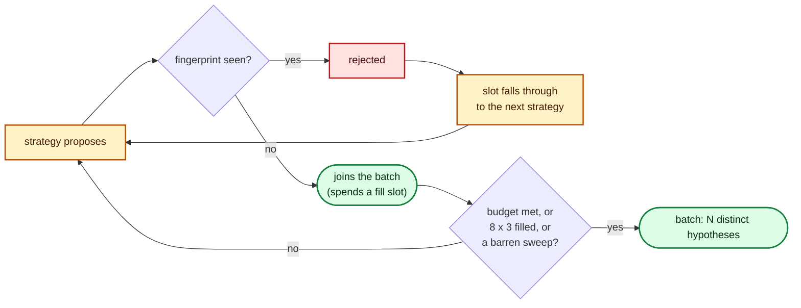

# Reject duplicate candidates on the default generator path (Issue #119)

## Summary

The structural fingerprint that normalises a grown neuron's random UUID away
ran only on the opt-in `--scale-candidate-quotas` path, so the **default**
batch billed screen time twice for the same hypothesis: 27 candidates per
experiment on the production creature, of which only **22 were distinct**. The
duplicates came from the round-robin fill re-proposing what the opening
structural phases had already emitted.

Duplicate rejection now runs on **every** batch, and a rejected proposal passes
its slot to the next strategy rather than shrinking the batch: the fill's
`8 x 3` budget counts candidates that *joined* the batch instead of attempts
made, and stops when a whole sweep of the strategy list adds nothing.
Closes #119.

## Evidence

Backend/CLI change — no web interface to screenshot. The evidence is the
generator benchmark, run before and after on the same machine with the same
binary (`cargo run --release --example candidate_quota_bench`, production-shaped
synthetic creature: 2511 inputs, 12 hiddens, one output; minimum of 5 repeats):

### Before

| `--candidates` | Fixed quotas | Distinct | Fixed generation |
|----------------|--------------|----------|------------------|
| 12 | 12 (budget) | 11 | 1.35 ms |
| 29 | 27 (ceiling) | **22** | 3.15 ms |
| 40 | 27 (ceiling) | **22** | 3.17 ms |
| 100 | 27 (ceiling) | **22** | 3.14 ms |
| 240 | 27 (ceiling) | **22** | 3.21 ms |

### After

| `--candidates` | Fixed quotas | Distinct | Fixed generation |
|----------------|--------------|----------|------------------|
| 12 | 12 (budget) | **12** | 1.47 ms |
| 29 | **29 (budget)** | **29** | 5.23 ms |
| 40 | 33 (ceiling) | **33** | 6.13 ms |
| 100 | 33 (ceiling) | **33** | 6.08 ms |
| 240 | 33 (ceiling) | **33** | 5.96 ms |

At the production `--candidates 29` that is **+2 screened creatures for +7
distinct hypotheses**, and zero duplicate screens. Priced with the measured
screen fit in [`docs/scorer-call-cost.md`](../../scorer-call-cost.md)
(9 898 ms fixed + 452 ms per creature), the screen call goes 22.1 s → 23.0 s
while the cost per **distinct** hypothesis falls **1.00 s → 0.79 s (-21%)**.
The 2 ms of extra generation (the fingerprint hash over a 23 479-synapse
creature) is under 0.02% of a 36–65 s experiment.

The `candidate-quotas` arm of `scripts/run-followup-economics.sh` — screen
scores, promotions and promote-scores per scorer-minute — is **not run here**:
like every arm under #98 it needs the production creature, the 21 GiB corpus
and exclusive use of the scorer, which this box does not have. The generator
measurement above is what can be produced without them, and it shows the
duplicate screens are gone rather than merely predicted.

The benchmark gained a `fixed generation` column so the default path's own
generation cost is reportable, not just the scaled path's.

## Test Plan

Added (both fail against the unfixed generator):

- `candidates::tests::the_default_batch_contains_no_duplicate_candidates` —
  a default batch of 29 on a production-width creature carries no repeated
  mutation identity (grown-neuron UUID normalised away). Failed before with
  `duplicate candidate in the default batch: structural_add_neuron|...`.
- `candidates::tests::rejecting_a_duplicate_frees_its_slot_rather_than_shrinking_the_batch`
  — the same batch still delivers its full 29 and reports `BatchLimit::Budget`.
  Failed before with `left: 27, right: 29 (limit QuotaCeiling)`.

Modified, deliberately:

- `lamarck/tests/fixtures/focus/k1-candidate-stream.txt` — the pre-#109 golden
  stream held two byte-identical `structural add input-1 -> h1
  w=0.001633605619369263` proposals in experiment 3 (the opening scaled add,
  re-proposed by the fill). The duplicate is gone and the `stats_bias` proposal
  that now fills the freed slot takes its place; **every other captured value
  across all three experiments is untouched**, so the fixture still guards
  against unintended drift. The edit is recorded in the test module's own doc
  comment.

No existing test was removed or disabled. `./quality.sh` passes: fmt, clippy
(`-D warnings`), cargo-deny, codespell, the shell gates, the full workspace
test suite and `cargo doc`.

Docs updated in the same change: `README.md` (flag table and the Phase-4
generation section — the ceiling now reads ~33 distinct, and dedup is described
as applying to every batch), `docs/followup-economics.md` (Arm 5 table, the
before/after comparison and the refreshed strategy mix) and `CHANGELOG.md`.
