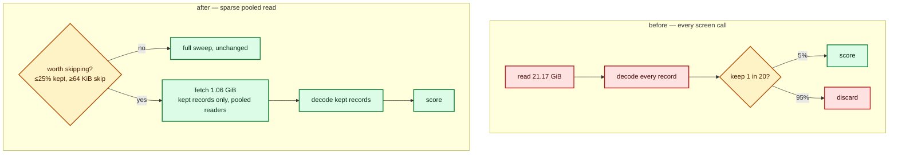

## Summary

Removed the fixed per-call scorer cost by the cheaper of the two shapes issue
#123 offered — the sample-path fix — so **no persistent scoring session was
built**: no wire protocol, no supervised process, none of a session's failure
modes. Closes #123.

**Root cause.** The scorer sub-sampled *after* decode. A screen call at
`--sample-rate 0.05` streamed all 21 GiB of the corpus through
`for_each_read_chunk`, decoded every record with `unpack_f32s_le`, and only then
dropped 95% of them. That is the cost a full-corpus call never shows — it has
~5.5 s of scoring per creature to hide its read behind — and it is why #112
measured a **5×** fixed-cost gap between the two.

**The fix.** A sampled directory call now fetches only the records it will
score. Lamarck's client side needed **no change** (same subprocess, same flags),
so the code lives in the two internal dependencies:

| Repository | Change | Branch |
|---|---|---|
| NEAT-AI-core | `training_bin_stream::for_each_sampled_read_chunk` — fetch only the records a `keep(global_record_index)` predicate selects, over a reader pool, delivered in corpus order; `sampled_read_is_worthwhile` declines the sparse path when it would lose | `issue-scorer-sampled-read` |
| NEAT-AI-scorer | `stream_io::sweep_corpus` picks the reader for every directory sweep (CPU, synchronous GPU, pipelined GPU); the stride stays owned by `sampling::SampleSpec` | `issue-lamarck-123-sampled-read` |

Both branches are pushed and pass their own `./quality.sh`. This worker's GitHub
writes are restricted to this repository, so it could **not** open those two
PRs — a human must, and must then cut the scorer release, which is why #141
exists and asks for `needs-human` triage. Nothing here pins this repo to a
commit or a pre-release to pull the fix in early.

## Evidence

Backend/CLI change — no web interface to screenshot. This is a performance
issue, so the evidence is before/after measurement with #112's own harness
(`scripts/measure-scorer-call-cost.sh` → `lamarck/examples/scorer_call_cost_bench.rs`
→ the `lamarck/src/scorer_cost.rs` regression), on the production creature
(2 511 inputs, 22 104 synapses) and the 21 GiB / 520-file production corpus, at
`--sample-rate 0.05`, 3 sweeps of 1/2/30 creatures. "Before" is
`NEAT_SCORER_SAMPLED_READ=off`, which takes the identical pre-change code path.

| Screen call | `fixedMs` | `marginalMsPerCreature` | mean call (11 creatures) | `r²` |
|---|---|---|---|---|
| before | **10 693 ms** | 597 ms | 17 260 ms | 0.786 |
| after | **3 423 ms** | 805 ms | 12 282 ms | 0.989 |

**The fixed cost of a screen call falls 68%.** Interleaved A/B under matched
load (1-minute average 33.9–35.3), one call each way, four pairs:

| Pair | `off` | `on` |
|---|---|---|
| 1 | 11 522 ms | 5 925 ms |
| 2 | 10 787 ms | 5 684 ms |
| 3 | 12 397 ms | 3 045 ms |
| 4 | 10 868 ms | 3 450 ms |
| **median** | **11 195 ms** | **4 567 ms** |

A 1-creature screen call is **59% faster**, every pair agreeing. Projected onto
the #75 run's call mix (75 screen calls), that is ≈**500 s of a 45-minute run —
~19%**, matching the "~20% with no protocol change" #112 predicted.

Raw logs: `docs/evidence/scorer-fixed-cost/{before,after}/rate-0_05.log` and
`docs/evidence/scorer-fixed-cost/interleaved-rate-0_05.log`.

**A negative result shaped the design.** Skipping bytes trades sequential
bandwidth for seeks, and single-threaded sparse reads *lose* that trade on this
corpus — 9.8–31.8 s against 5.0–6.2 s for reading everything. Sixteen readers do
it in 1.27 s. So the reader is a pool by construction, and the sparse path is
taken only when ≤ 25% of records are kept **and** the mean skip is ≥ 64 KiB.

**Scores do not move.** The sampled reader delivers the same records in the same
order (segment `k` is read by reader `k % readers` and pulled back in `k`
order), so a creature's error sum accumulates identically whatever the pool
size. The scorer's `sampled_read_parity` test asserts bit-identical
`score`/`error`/`recordCount`, and the production sweeps above report the same
baseline score with the reader on and off. Full-corpus calls — Phase-0 parity,
promote, acceptance — do not change reader at all.

**What this measurement cannot support.** The box was **not** idle — a live
production run held it throughout, at a 1-minute load of 20–37 — so the absolute
milliseconds are inflated and the fixed cost is a floor. The interleaved A/B is
the mitigation, not a substitute for the idle-box repeat #123 asked for. It is
also a per-call measurement: the acceptance criterion asking for the reduction
to show in `scorerCallCost` over a **real run's journal** needs the released
scorer and an exclusive box. Both are carried by #141.

## Test Plan

In this repository:

- Added `lamarck/tests/scorer_fixed_cost_doc.rs` — five tests pinning
  `docs/scorer-fixed-cost.md` to its committed evidence: every artefact it names
  exists, its headline `fixedMs` figures and all eight interleaved call times are
  the ones in the logs, the recorded `loadBefore`/`loadAfter` values are on the
  page, the caveats survive, and the decision *not* to build a session is not
  softened.
- `./quality.sh` passes.

In the dependency branches (run there, green):

- `neat-core`: `training_bin_stream::sampled` unit tests — delivered records are
  exactly a sequential sweep's kept set for every rate/phase/chunk-size/reader
  count; planned reads cover only the kept bytes; consecutive kept records
  coalesce; segments tile every record; ragged files, missing files, zero
  `record_bytes`/`read_buf_len` and `on_chunk` errors all fail loud; the
  worthwhile policy at its boundaries.
- `rust_scorer`: `stream_io` tests — a sampled sweep delivers exactly what the
  full sweep delivers over a production-shaped corpus, a full-corpus sweep reads
  every record, the policy gate, and trailing-byte reporting. Integration test
  `sampled_read_parity` — bit-identical `score`/`error`/`recordCount` between the
  two readers at three rate/phase combinations.
