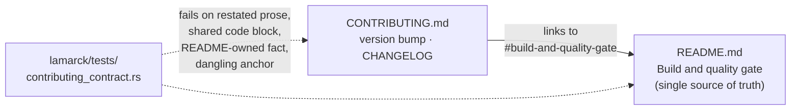

# De-duplicate the build/gate instructions (Issue #136)

## Summary

`CONTRIBUTING.md` and the README's *Build and quality gate* section maintained
the same instructions twice — the sibling-clone layout, the
`./quality.sh < /dev/null` gate, the prerequisites list, the Auto Format
workflow (including its deliberate non-bump of `neat-core.expected-version`)
and the Version Increment workflow. The copies agreed today, but nothing kept
them in step.

The README is now the single copy. It absorbed the two facts CONTRIBUTING owned
uniquely — that the `neat-core` path dependency resolves to
`../../NEAT-AI-core/neat-core`, and the prerequisites list including the pinned
Rust toolchain — and gained a `### Prerequisites` subsection so the local-gate
paragraph no longer restates the tools inside the README either.
`CONTRIBUTING.md` links into that section and keeps only what is genuinely
contributor-specific: the version-bump-before-PR habit and the CHANGELOG note.

A new contract test enforces the split, so a copy pasted back into
`CONTRIBUTING.md` fails CI instead of drifting silently — the same discipline
the repo already applies to the README ↔ CLI contract.

Closes #136.

## Evidence

Documentation and test change only — no web interface to screenshot, and no
runtime behaviour altered.



Contract tests fail against the pre-change documents and pass after it:

```text
# before (CONTRIBUTING.md at HEAD)
test contributing_does_not_restate_readme_owned_build_facts ... FAILED
test contributing_links_to_the_readme_build_and_quality_gate_section ... FAILED
test contributing_does_not_restate_readme_code_blocks ... FAILED
test contributing_does_not_restate_readme_prose ... FAILED
test result: FAILED. 2 passed; 4 failed

# after
test result: ok. 6 passed; 0 failed
```

Full suite and the pre-existing README contract are unaffected:

```text
cargo test --workspace --all-features -- --test-threads=2
test result: ok. 405 passed; 0 failed   (lib)
test result: ok.  40 passed; 0 failed   (readme_contract)
markdownlint-cli2: Summary: 0 issues in 0 files
```

`./quality.sh < /dev/null` stops at the codespell preflight on this machine —
`codespell` is not installed and the container has no `pip`, `pipx` or usable
`apt` to install it (`pip: command not found`). Every other stage was run
individually and passes: bash syntax, shellcheck, the neat-core version gate,
both workflow validators, the version-order checks, `cargo deny check`
(`advisories ok, bans ok, licenses ok, sources ok`), `cargo fmt --all --check`,
clippy with `-D warnings`, the full test suite, and `cargo doc` with
`RUSTDOCFLAGS="-D warnings"`. CI runs codespell for real; the changed prose adds
no new vocabulary beyond words already in both documents.

## Test Plan

New `lamarck/tests/contributing_contract.rs` (6 tests, all reading the two real
documents and asserting on their content):

- `contributing_links_to_the_readme_build_and_quality_gate_section` — the
  pointer exists.
- `contributing_readme_anchors_resolve_to_readme_headings` — every
  `README.md#anchor` CONTRIBUTING links to matches a README heading slug, so
  de-duplication cannot trade a stale copy for a dead link.
- `contributing_does_not_restate_readme_prose` — no 12-word run of words is
  shared between the documents (whitespace- and punctuation-normalised, so
  re-wrapping does not hide a copy).
- `contributing_does_not_restate_readme_code_blocks` — no fenced block body is
  repeated verbatim.
- `contributing_does_not_restate_readme_owned_build_facts` — CONTRIBUTING never
  names a README-owned build fact (`rust-toolchain.toml`, `shellcheck`,
  `cargo-deny`, `codespell`, `.cargo/config.toml`, `opt-level`,
  `line-tables-only`, `quality.sh`, `auto-format.yml`, `version-increment.yml`,
  `cargo fmt`, `neat-core.expected-version`).
- `contributing_keeps_the_contributor_specific_habits` — the version-bump and
  CHANGELOG material stays in CONTRIBUTING, so the file cannot be hollowed out
  to satisfy the checks above.

No existing test was modified or removed. No version bump: docs and tests only,
`lamarck/src/` untouched.
