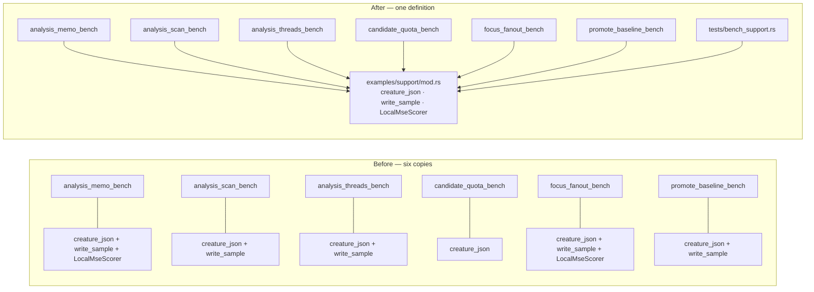

# Define the synthetic bench fixture once (Issue #138)

## Summary

The production-shaped benchmark fixture was copy-pasted across the example
benches: `creature_json()` in six of them, the deterministic xorshift
`write_sample()` in five, and the in-process `LocalMseScorer` in two. These
benches only mean anything when compared against each other, so a change to the
fixture — a `semanticVersion` bump, a different fan-in, a widened bias spread —
had to land identically on every copy or the numbers in
`docs/followup-economics.md`, `docs/baseline-reuse.md` and the README's
thread-scaling table would silently stop being comparable.

All three helpers now live in one place, `lamarck/examples/support/mod.rs`,
which each bench pulls in with `mod support;`. The extracted bodies are
byte-identical to the copies they replace, so every bench measures exactly what
it measured before — this is a de-duplication, not a re-measurement. No
per-bench flags were needed, so the "close the issue instead" escape in the
issue did not apply.

Net: 366 lines deleted, 338 added (126 of them the single shared fixture, 181
the new tests). Closes #138.

## Evidence

Backend/CLI-only change — no web interface to screenshot. Verified by tests and
by running every affected bench.

**The extracted bodies are unchanged.** Diffed the shared module's
`creature_json` / `write_sample` against the originals in `HEAD~1`, ignoring
comments and blank lines — identical.

**Every affected bench still runs.** Smoke-run on small arguments after the
extraction:

| Bench | Command | Result |
| --- | --- | --- |
| `analysis_scan_bench` | `-- both 200 16 3` | legacy 3 ms / fused 2 ms |
| `analysis_threads_bench` | `-- 200 16 3 1 1,2` | table emitted; "accumulators identical at every thread count: yes" |
| `candidate_quota_bench` | `-- 16 3 1 4` | fixed and scaled arms both 4 (budget reached) |
| `analysis_memo_bench` | `-- 2 200 16 3` | 204 experiments, memo 115h/293m |
| `focus_fanout_bench` | `-- 2 200 16 3 4 1` | 451 experiments, 1804 candidates |
| `promote_baseline_bench` | `-- 2 200 16 3` | 346 promote calls, remembered 332/14 |

**Quality gate.** `cargo fmt --all -- --check`, `cargo clippy --workspace
--all-targets --all-features -D warnings`, `cargo test --workspace
--all-features` (all suites green, including the 9 new tests), `cargo deny
check` and `RUSTDOCFLAGS="-D warnings" cargo doc` all pass. The `./quality.sh`
codespell preflight could not run in this container — `codespell` is not
installed and the image has no `pip`/`pipx` to install it (`/usr/bin/python3:
No module named pip`). As a substitute the new files were spell-checked with
`npx cspell`; the only unknown words are the repository's existing domain terms
(`hiddens`, `xorshift`) plus `unparseable`. CI runs codespell for real.

**Security self-check.** No new external input, no new dependency, no new
process/SQL/filesystem call on untrusted data. `write_sample` and
`creature_json` take `usize` arguments from the bench's own argv, exactly as
before. Nothing hidden or secret is staged.

## Test Plan

New `lamarck/tests/bench_support.rs` includes the shared module with
`#[path = "../examples/support/mod.rs"]` and calls it for real (9 tests):

- `creature_json_builds_the_documented_shape` — parses the fixture and asserts
  the whole documented rule: `semanticVersion 4.0.0`, `forwardOnly`, TANH
  hiddens with biases from `(h % 7) * 0.01 - 0.03`, the deterministic 4-input
  fan-in slice per hidden, and the single `IDENTITY` output `o1`.
- `creature_json_wraps_the_fan_in_when_inputs_are_scarce` — edge case: fewer
  inputs than the fan-in needs, so no synapse escapes the input width.
- `creature_json_is_deterministic` — same arguments, same JSON.
- `write_sample_emits_the_deterministic_xorshift_corpus` — asserts `0.bin` is
  `records * (inputs + 1) * 4` bytes and matches an independently
  re-implemented xorshift64 stream from seed `0x2545_F491_4F6C_DD1D`
  byte-for-byte, so a change to the writer fails here.
- `write_sample_is_reproducible_across_directories` — two directories, same
  bytes.
- `write_sample_handles_an_empty_corpus` — zero records writes an empty file.
- `local_mse_scorer_scores_every_candidate_in_the_directory` — scores two real
  candidates over a real corpus, asserts `score == 1 - error`, that the error
  is finite, and that a non-`.json` entry is skipped.
- `local_mse_scorer_reports_an_unparseable_candidate` — a malformed candidate
  fails loud with `ScorerError::Json` rather than being silently dropped.
- `every_bench_shares_one_corpus_definition` — guards the point of the
  extraction: the corpus a bench writes is the corpus the shared fixture
  defines.

No existing test was modified or removed. `README.md`'s repository-layout tree
gained a `lamarck/examples/` line pointing at the shared fixture, and the
change is recorded under **[Unreleased]** in `CHANGELOG.md`.
