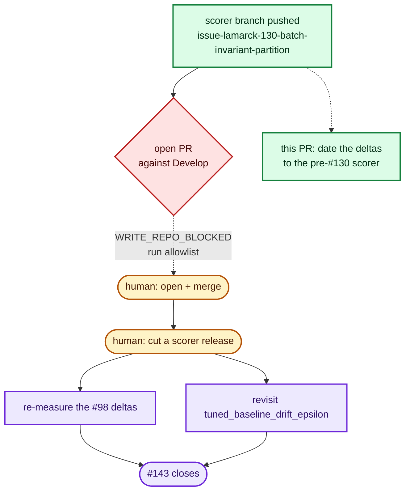

# Date the #98 economics deltas to the pre-#130 scorer (Issue #143)

## Summary

Refs #143. **This PR deliberately carries no closing keyword** — see
[Why this does not close #143](#why-this-does-not-close-143).

Issue #143 asks for two things: open the NEAT-AI-scorer PR for the pushed
`issue-lamarck-130-batch-invariant-partition` branch, then re-measure the #98
accept deltas against the released scorer. Both halves are human-gated and
neither could be done in this run (evidence below). What *could* be done, and is
done here, is stop the deltas the issue calls into question from reading as
settled while the fix is in flight.

`docs/followup-economics.md` reported every full-corpus Δ of the #98 campaign
without saying which scorer measured them. They were measured on the pre-#130
scorer, whose directory score depended on **which other creatures shared the
call** — a `6.7e-8` deterministic artefact that moved the incumbent and the
candidate by *different* amounts
([`docs/scorer-batch-composition.md`](../../scorer-batch-composition.md)).

That is not a rounding footnote. `stats_weight`'s best Δ, `+9.76e-7`, missed the
`1e-6` accept bar by `2.4e-8` — about a third of the artefact — so the campaign's
headline "0 accepts across five arms", and the per-strategy ordering under it,
are both provisional. The caveat now sits in `## Environment` ahead of every delta
table, with a pointer from the `## Verdict` table (the decision surface), and both
name #143 as the re-measurement that settles them.

## Evidence

Backend/CLI documentation change — no web interface to screenshot. Verified by
the test suite and `./quality.sh`.

### The upstream PR could not be opened from this run

`gh pr create` against the dependency repo is refused by the run allowlist, not
by a missing branch or a merge conflict:

```text
$ gh pr create --repo stSoftwareAU/NEAT-AI-scorer --base Develop \
    --head issue-lamarck-130-batch-invariant-partition ...
[SECURITY] [WRITE_REPO_BLOCKED] Refused pr-create to stSoftwareAU/NEAT-AI-scorer
from the agent subprocess — not on run allowlist [stsoftwareau/neat-ai-lamarck]
```

Read access confirms the branch is ready for a human to open in one click — it is
`1` ahead of and `0` behind `Develop`, touching five files, and no PR exists for
it:

| Check | Result |
| --- | --- |
| `compare/Develop...issue-lamarck-130-batch-invariant-partition` | ahead 1, behind 0 |
| Files | `AGENTS.md`, `README.md`, `rust_scorer/src/multi_score.rs`, `rust_scorer/tests/batch_composition_invariance.rs`, `rust_scorer/tests/bin_lib_single_source.rs` |
| Existing PR for that head | none |
| Scorer releases | none published |

Issue #143 has been labelled `needs-human` with a comment carrying the ready-to-paste
PR body, so the hand-off is actionable rather than a note in a transcript.

### Why the re-measurement is still owed



Both owed items need the **released** scorer binary, which does not exist yet:

- **Re-measuring the #98 deltas** needs a run of the production creature against
  the 21 GiB GRQ corpus with the fixed scorer. Policy forbids pinning this repo to
  a raw commit or a pre-release to pull the fix in early, so this waits on the
  release.
- **`baseline.rs::tuned_baseline_drift_epsilon`** (`lamarck/src/baseline.rs:58`)
  auto-tunes the re-verification tolerance from an `f32` association-noise model —
  the noise the scorer fix removes. Retuning it *now* would price the canary
  against a scorer Lamarck is not yet running, so it would make the drift gate
  wrong for the binary in use today. It is correct to leave it until the release
  lands.

### Quality gate

`./quality.sh < /dev/null` → `All quality checks passed!`

## Test Plan

Three tests added to `lamarck/tests/followup_economics_doc.rs`, following the
doc-contract pattern of the sibling `*_doc.rs` suites. The first two fail against
the pre-change document (verified by stashing the doc edit and re-running:
`test result: FAILED. 6 passed; 2 failed`), and all eight pass after it.

- `the_full_corpus_deltas_carry_their_scorer_provenance` — the caveat exists,
  precedes the first full-corpus Δ table, and reaches both the artefact document
  and #143; the `## Verdict` section carries the pointer too.
- `the_scorer_caveat_quotes_the_measured_artefact` — cross-document consistency:
  the magnitude the caveat prices the campaign against must be a figure
  `docs/scorer-batch-composition.md` actually measured.
- `the_scorer_caveat_holds_against_the_campaign_margin` — parses the best
  full-corpus Δ out of the `## Verdict` table and asserts the artefact really does
  exceed the margin by which it missed the accept bar. A re-measurement that
  clears the margin of the artefact fails this test and forces the caveat to be
  rewritten — which is exactly the check #143 owes.

## Why this does not close #143

The mandated `Closes #143` is intentionally omitted. #143 tracks the upstream PR,
the scorer release, and the re-measurement of the #98 deltas — none of which this
PR performs. Merging with a closing keyword would close an issue whose substantive
work is still outstanding and would cancel the `needs-human` hand-off that has been
raised on it. The issue stays open on purpose; a human closes it once the
re-measurement lands.
