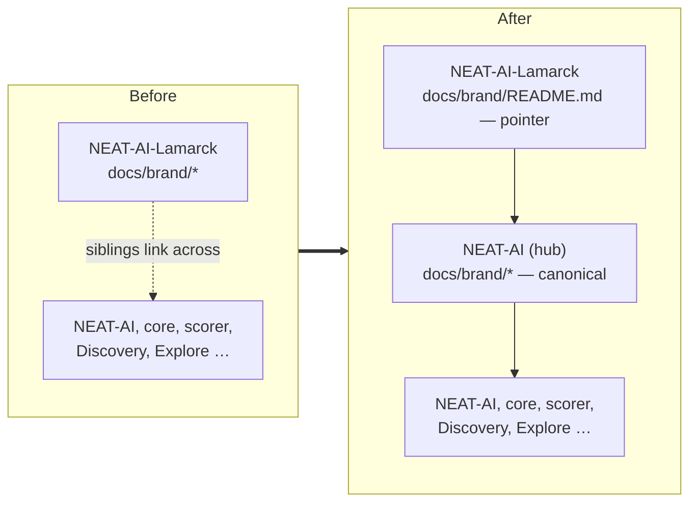

## Summary

Moves the NEAT-AI family brand set out of this repository and into the hub repo,
[stSoftwareAU/NEAT-AI](https://github.com/stSoftwareAU/NEAT-AI), leaving
`docs/brand/README.md` as a pointer. Closes #149.

The ten 1280×640 social previews and the transparent organic mark are
family-wide assets — one image per sibling repo — so hosting them inside the
Lamarck optimiser meant every other repo referenced a copy in an unrelated
project. Nothing in this repo's build, docs, or code consumed them
(`grep` for `brand` / `social-preview` finds no other reference), so the move is
a pure relocation.

### Cross-repo — merge order matters

The assets are added to the hub repo on branch
[`brand-social-previews-from-lamarck`](https://github.com/stSoftwareAU/NEAT-AI/compare/Develop...brand-social-previews-from-lamarck)
(commit `1d1ece4`), which is pushed but **not yet raised as a PR**: this run's
write allowlist covers only `stSoftwareAU/NEAT-AI-Lamarck`, so `gh pr create`
against `stSoftwareAU/NEAT-AI` was refused by the security wrapper. A human
needs to open and merge that PR **before** this one, so the artwork is never
absent from both repos. Issue #149 carries the same note and the
`needs-human` label for that step.

## Evidence

Documentation and asset change with no runtime or web surface, so no screenshot
applies. Verification is the test suite plus the local quality gate.

- `cargo test --test brand_pointer` — 3 passed. The same three tests failed
  before the move (artwork still present, pointer missing the hub link), so they
  fail for the right reason.
- `./quality.sh` — passes (fmt, clippy, cargo-deny, codespell, full workspace
  test run, rustdoc).
- On the hub side, `test/docs/BrandAssets.ts` asserts the catalogue and the
  directory list the same files, that every preview is 1280×640 (parsed from
  each PNG's IHDR chunk), and that the brand docs' links resolve.

## Test Plan

- Added `lamarck/tests/brand_pointer.rs`:
  - `no_brand_artwork_is_kept_in_this_repo` — walks `docs/brand/` and fails on
    any `.png`/`.jpg`/`.svg`/`.webp`, so a copy cannot creep back and drift from
    the hub set.
  - `the_pointer_names_the_hub_repository_brand_home` — the pointer links the
    canonical `NEAT-AI/docs/brand` URL.
  - `the_pointer_names_this_repos_social_preview` — the pointer still names
    `neat-ai-lamarck.png`, the image a maintainer uploads for this repo.
- No existing tests were modified or removed.
