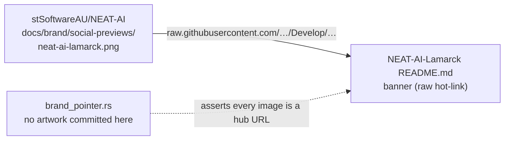

# Branding: hot-link `neat-ai-lamarck.png` as the README banner

## Summary

`README.md` now opens with this repository's own NEAT-AI family preview —
`neat-ai-lamarck.png` (the giraffe) — placed directly under the
`# NEAT-AI-Lamarck` heading. The image is hot-linked from the hub repository's
raw URL on the `Develop` branch, so when stSoftwareAU/NEAT-AI#3764 regenerates
the preview set at the same path this README picks the new artwork up with no
change here. No image file is committed to this repository, so the
`docs/brand/` no-artwork guard stays intact. Closes #151.

Banner URL (verified `HTTP 200`, 1280×640 PNG):
`https://raw.githubusercontent.com/stSoftwareAU/NEAT-AI/Develop/docs/brand/social-previews/neat-ai-lamarck.png`

`docs/brand/README.md` gains one sentence noting that the root README
hot-links that same preview; it remains a text-only pointer.

## Evidence

No web interface to screenshot — this is a Markdown-only change, and Playwright
MCP is not available in this run. Verified instead by:

- `curl` against the hot-linked URL: `200`, `image/png`, 98 912 bytes,
  `PNG image data, 1280 x 640` — the hub copy resolves and is the 1280×640
  social-preview render.
- `markdownlint-cli2` over the repo: `Summary: 0 error(s)` (the banner is plain
  Markdown image syntax, so MD033 inline-HTML is not engaged; MD041 is already
  relaxed).
- `./quality.sh` — full gate green (`All quality checks passed!`), including
  `cargo fmt --check`, clippy with `-D warnings`, and the whole test suite.

Before the README change the two new tests failed for the right reasons:

```text
the_readme_banner_follows_the_top_level_heading ... FAILED
  the first element under the README heading is not an image: "> Experimental: …"
every_readme_image_is_hot_linked_from_the_hub ... FAILED
  README.md embeds no brand banner at all
```

After the change, all five `brand_pointer` tests pass, as does the untouched
`readme_contract` suite (31 tests) that guards the README ↔ CLI flag contract.



## Test Plan

Added to `lamarck/tests/brand_pointer.rs`:

- `the_readme_banner_follows_the_top_level_heading` — the first non-empty line
  after `# NEAT-AI-Lamarck` is a Markdown image with non-empty alt text whose
  target is exactly the hub raw URL.
- `every_readme_image_is_hot_linked_from_the_hub` — every image in the README
  points at a `raw.githubusercontent.com/stSoftwareAU/NEAT-AI/` URL (a
  repo-relative target would mean artwork had been vendored back in), and at
  least one image exists.

Unchanged and still passing: the three existing `brand_pointer` tests
(no committed artwork, pointer names the hub, pointer names the preview) and
`lamarck/tests/readme_contract.rs`.
