# PR Summary — Issue #167

## Summary

CI had no basic-validity gate for TypeScript: nothing invoked `deno check` or
`tsc --noEmit`, so a syntax or type error in a repository `.ts` source (today
`scripts/generate_backprop_parity_fixtures.ts`) could land on `Develop`
unnoticed. Closes #167.

The gate is committed by this repository — there is no shared cross-repo
Action:

- **`scripts/typescript-check.sh`** — type-checks every `.ts` source under a
  root with `deno check`, pruning `target/`, `node_modules/` and `.git/`.
  Exit codes: `0` valid (or nothing to check), `1` a source failed `deno check`
  **or Deno is missing**, `2` invalid invocation. The missing-toolchain branch
  is checked before anything else so an absent Deno fails loud instead of
  reporting a vacuous pass.
- **`quality.sh`** — runs the gate's own WHAT test and then the gate, next to
  the existing shellcheck steps, so the local gate mirrors CI.
- **`.github/workflows/ci.yml`** — new `typescript-check` job ("TypeScript
  Validity") installs Deno via `denoland/setup-deno` pinned to a commit SHA,
  runs the WHAT test and the gate, and is listed in `ci-required`'s `needs`
  and its result table, so it blocks merge through the **CI Required Checks**
  aggregator.
- **`lamarck/tests/readme_contract.rs`** — `--root` added to `FOREIGN_FLAGS`;
  it is a helper-script flag now documented in the README, not a
  `neat_ai_lamarck` binary flag. Without this the README contract test fails.
- **`README.md` / `CHANGELOG.md`** — Deno added to the prerequisites, a new
  *TypeScript validity gate* subsection documents usage and exit codes, and the
  local-gate description now lists the step.

Basic validity only — this is not a style or lint requirement.

## Evidence

Backend/CLI change with no web interface, so no screenshot applies. Evidence is
the gate's own test run and the workflow wiring.

```mermaid
flowchart LR
    V[validation] --> Q[quality]
    V --> S[security]
    SH[shell-checks] --> R[ci-required]
    SP[spell-check] --> R
    TS[typescript-check<br/>deno check] --> R
    Q --> R
    S --> R
    R --> M[merge allowed]
```



`./scripts/test-typescript-check.sh` — the gate fails on broken TypeScript and
passes on valid TypeScript:

```text
OK   valid TypeScript → pass (exit 0)
OK   syntax error → fail (exit 1)
OK   type error → fail (exit 1)
OK   no TypeScript files → pass (exit 0)
OK   target/ excluded → pass (exit 0)
OK   repository sources → pass (exit 0)
OK   missing root → usage error (exit 2)
OK   unknown option → usage error (exit 2)
OK   --root without value → usage error (exit 2)
OK   --help → pass (exit 0)
OK   deno unavailable → fail (exit 1)
OK   all typescript-check WHAT assertions passed
```

`./scripts/typescript-check.sh` against the repository:

```text
🔎 Type-checking 1 TypeScript source(s) under: /…/NEAT-AI-Lamarck
Check /…/scripts/generate_backprop_parity_fixtures.ts
typescript-check: all TypeScript sources are valid
```

Before the script existed the same assertions all failed with exit 127
(command not found) — the gate was genuinely absent.

Rest of the gate: `cargo deny check` ok, `cargo fmt --check` clean,
`cargo clippy` with `-D warnings` clean, `cargo test --workspace
--all-features` 405 + integration tests pass, `cargo doc` with
`RUSTDOCFLAGS="-D warnings"` clean, `actionlint .github/workflows/ci.yml`
clean, `markdownlint-cli2` 0 issues. `codespell` could not run in this
container (`pip`/`codespell` not installed — pre-existing environment gap, not
introduced here); the CI **Spell Check** job runs it for real.

## Test Plan

- Added `scripts/test-typescript-check.sh` — runs the real
  `scripts/typescript-check.sh` against throwaway fixture roots and asserts
  exit codes only:
  - valid TypeScript → exit 0
  - unbalanced-brace syntax error → exit 1 (the regression the issue describes)
  - type mismatch → exit 1
  - directory with no `.ts` sources → exit 0
  - broken source under `target/` → exit 0 (prune list honoured)
  - the repository's own sources → exit 0
  - missing root / unknown option / `--root` with no value → exit 2
  - `--help` → exit 0
  - Deno absent (stubbed `PATH`) → exit 1, never a silent pass
- The test runs in `./quality.sh` and in the CI `typescript-check` job, so the
  gate cannot rot unnoticed.
- No existing tests were commented out or removed; `readme_contract.rs` gained
  one allowlist entry (`--root`) required by the new README documentation.
