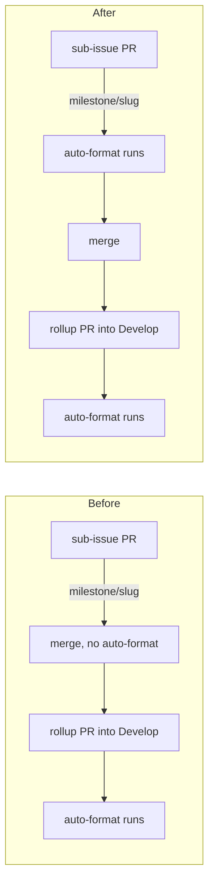

# PR Summary — Issue #168

## Summary

`.github/workflows/auto-format.yml` only fired on PRs into `Develop`, so
milestone sub-issue PRs — which target a shared `milestone/<slug>` branch —
merged into the milestone branch without the auto-format / lock-sync
housekeeping job ever running. Added `milestone/**` to the workflow's
`pull_request.branches` filter (matching the glob style already used by
`ci.yml`, Issue #89, where `**` also covers nested names), and taught
`scripts/check-auto-format-workflow.sh` to fail when that filter is missing so
the gap cannot silently return. Closes #168.

## Evidence

Backend/CI-only change — no web interface to screenshot. Evidence is the
validator and its new behaviour tests.

Trigger coverage before and after:



New WHAT test against the shipped workflow and generated fixtures:

```text
OK   shipped auto-format.yml passes (exit 0)
OK   no milestone branch filter → fail (exit 1)
OK   milestone only in a comment → fail (exit 1)
OK   block sequence 'milestone/*' → pass (exit 0)
OK   inline flow sequence 'milestone/**' → pass (exit 0)
OK   missing 'cargo fmt --all' → fail (exit 1)
OK   missing workflow file → error (exit 2)
OK   all check-auto-format-workflow WHAT assertions passed
```

The two milestone assertions failed before the fix (`expected exit 1, got 0`),
confirming they reproduce the reported gap.

`actionlint .github/workflows/auto-format.yml` passes, as does
`markdownlint-cli2` over the README change.

**Quality gate note:** `./quality.sh` runs green through every check up to the
codespell preflight, which fails on this container because `codespell` is not
installed and no `pip`/`pipx` is available to install it — a pre-existing
environment limitation unrelated to this change (`spell-check.sh` fails loud
rather than reporting a vacuous pass). The remaining stages were run
individually and all pass: `cargo deny check` (advisories/bans/licenses/sources
ok), `cargo fmt --all -- --check`, `cargo clippy --workspace --all-targets
--all-features -D warnings`, and `cargo test --workspace --all-features`. CI
runs codespell for real.

## Test Plan

- Added `scripts/test-check-auto-format-workflow.sh` — runs the real validator
  against the shipped workflow and generated fixtures, asserting exit codes:
  missing milestone filter fails, a milestone mention in a comment does not
  count, both `milestone/*` block-sequence and `milestone/**` inline
  flow-sequence forms pass, an unrelated rule (`cargo fmt --all`) still bites,
  and a missing file errors with exit 2.
- Wired that test into `quality.sh` ahead of the existing validator run.
- Extended `scripts/check-auto-format-workflow.sh` with rule 9 (milestone
  branch filter).
- Updated the README's auto-format section to document the milestone coverage
  and the new behaviour test.
