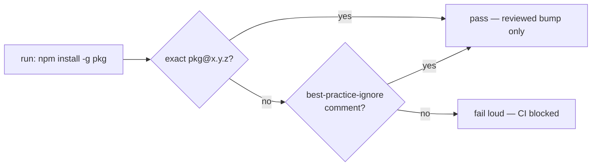

# Pin the CI install of `markdownlint-cli2` to an exact version (Issue #169)

## Summary

`.github/workflows/markdown-lint.yml`:61 installed `markdownlint-cli2` with no
version, so the job executed whatever the registry served at that instant. A
hijacked release would have run on the runner — with the workflow's
`GITHUB_TOKEN` and any secrets in scope — the moment it was published, with no
embargo: `uses:` SHA-pinning (Issues #24, #100) never inspects `run:` blocks,
and a `run:` block is not a manifest any dependency-quarantine tool can manage.

The install is now pinned to `markdownlint-cli2@0.23.2` (latest release,
published 2026-07-27, so well outside the 24h external-dependency quarantine),
and a new gate stops the class of defect rather than this one instance:
`scripts/check-workflow-npm-pins.sh` fails any workflow that installs a package
without an exact version. Closes #169.

Scope notes:

- **No Renovate config added.** The issue suggested a Renovate `customManagers`
  regex, but this repository runs no Renovate app and carries no
  `renovate.json` — adding one would be dead configuration that reads as
  automation while nothing bumps the pin. Bumping is instead a reviewed PR,
  documented in the README, and the gate keeps a float from creeping back.
- **No `--ignore-scripts`.** Per the issue, pinning is the fix; dropping
  postinstall scripts is a separate per-package judgement.
- `lamarck/tests/readme_contract.rs` gained `--dir`/`--verbose` in its
  `FOREIGN_FLAGS` allowlist because the README now documents the new script's
  flags, and that test asserts every `--flag` in the README is one the binary
  accepts or a known foreign flag.

## Evidence

Backend/CI change — no web interface to screenshot. Verified by running the new
gate and its behaviour test, plus the repository's quality gate.

The gate's decision path:



Gate over the repository's own workflows, after the pin:

```text
$ ./scripts/check-workflow-npm-pins.sh --verbose
OK   markdown-lint.yml:66: markdownlint-cli2@0.23.2
check-workflow-npm-pins: every workflow install is pinned to an exact version
```

Before the pin, the same gate failed loudly on the offending line — the
regression test `floating npm install -g → fail` reproduces exactly that state
against a fixture, and the whole suite failed its `repository workflows → pass`
assertion until `markdown-lint.yml` was pinned.

The pinned version lints the repository clean, so the pin is behaviour-neutral:

```text
$ markdownlint-cli2   # v0.23.2 (markdownlint v0.41.1)
Linting: 52 files
Summary: 0 issues in 0 files
```

Quality gate: `cargo deny`, `cargo fmt --check`, `cargo clippy` (warnings
denied), `cargo test --workspace --all-features` (22 suites, 0 failures),
`cargo doc`, shellcheck and `actionlint` all pass. `codespell` could not run in
this container (no `pip`/`ensurepip` available); the CI **Spell Check** job
covers it.

## Test Plan

- **Added** `scripts/test-check-workflow-npm-pins.sh` — runs the real gate
  against throwaway workflow fixtures and asserts exit codes and reported
  locations:
  - floating `npm install -g <pkg>` → exit 1 (the Issue #169 regression);
  - exact `<pkg>@x.y.z`, scoped `@scope/pkg@x.y.z` → exit 0;
  - caret range, `@latest` via `npx`, `${{ … }}` version expression → exit 1;
  - `# best-practice-ignore: BP-CI-INSTALL-PIN-…` suppression → exit 0;
  - `npm ci` / bare `npm install` (lockfile installs), flag values and paths →
    exit 0;
  - failure output names `file:line` and the offending package;
  - the repository's own workflows pass, and `--verbose` reports
    `markdown-lint.yml` pinned to an exact SemVer;
  - missing `--dir`, unknown option, `--dir` without a value → exit 2;
    `--help` → exit 0.
- **Modified** `lamarck/tests/readme_contract.rs` — allowlisted the helper
  script's `--dir`/`--verbose` flags so the README-contract test still passes.
  No existing assertion was removed or weakened.
- **Wiring**: both scripts run from `./quality.sh` and from the CI **Project
  Validation** job, which is gated by the **CI Required Checks** aggregator.
