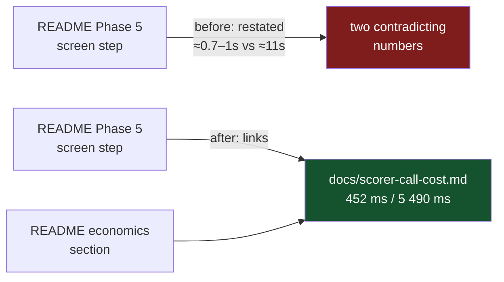

# Phase 5 links the measured scorer costs instead of restating them (Issue #172)

## Summary

`README.md`'s Phase 5 screen step quoted "≈0.7–1s/creature on GRQ against ≈11s
full". That line was written in PR #76, before the #112 fixed/marginal
decomposition existed, and was never reconciled against it: the measured
marginal costs in [`docs/scorer-call-cost.md`](../../scorer-call-cost.md) —
which the README itself cites as the source of truth further down the page —
are **452 ms/creature** screening and **5 490 ms/creature** promoting. Both
inline figures were roughly double the measurement, so a reader anchored on
whichever they met first was out by ~2× either way.

Following the README's own "link, do not restate" convention, the inline
figures are dropped and the step points at the measured document instead.
Closes #172.



## Evidence

Documentation change with no web interface to screenshot. The evidence is the
test suite: the three new contract tests fail against the README as it stood
and pass after the edit.

Before the README edit (`cargo test --test readme_contract`):

```text
---- phase_five_scoring_steps_restate_no_scorer_timings stdout ----
the Phase 5 scoring steps restate scorer timings ["0.7–1s", "11s"] —
link `docs/scorer-call-cost.md` instead of copying its numbers

---- phase_five_scoring_steps_link_the_measured_scorer_call_cost stdout ----
the Phase 5 scoring steps no longer point at the measured screen/promote costs

---- every_per_creature_cost_the_readme_quotes_matches_the_measurement stdout ----
README quotes "le-phase <n> …` (≈0.7–1s" (0.7 s/creature), which matches neither
measured marginal cost in docs/scorer-call-cost.md: [("screen", 0.452), ("promote", 5.49)]

test result: FAILED. 47 passed; 3 failed
```

After:

```text
test result: ok. 50 passed; 0 failed; 0 ignored; 0 measured; 0 filtered out
```

Full workspace suite: `cargo test --workspace --all-features` — 405 + 158
tests, 0 failures.

### Quality gate

`./quality.sh` stops at the codespell preflight because the container has no
`pip`/`pipx` to install `codespell` (`spell-check: codespell is not
installed.`). Every other stage was run individually and passes: bash syntax,
shellcheck, the TypeScript and workflow gates, `cargo deny check`
(`advisories ok, bans ok, licenses ok, sources ok`), `cargo fmt --check`,
`cargo clippy … -D warnings`, `cargo test --workspace --all-features`,
`cargo doc` with `RUSTDOCFLAGS="-D warnings"`, plus
`markdownlint-cli2@0.23.2` over all 55 markdown files (0 issues). CI runs the
codespell stage for real.

## Test Plan

New tests in `lamarck/tests/readme_contract.rs`:

- `phase_five_scoring_steps_restate_no_scorer_timings` — the Phase 5
  three-step scoring list contains no `s`/`ms` time figure at all, so the
  removed numbers cannot creep back in another form.
- `phase_five_scoring_steps_link_the_measured_scorer_call_cost` — dropping the
  numbers only helps if the reader is sent somewhere, so the steps must link
  `docs/scorer-call-cost.md`.
- `every_per_creature_cost_the_readme_quotes_matches_the_measurement` — the
  general guard: **every** per-creature cost the README quotes anywhere must be
  within 25% of a marginal cost parsed out of `docs/scorer-call-cost.md`'s own
  Result table. The bar is read from the doc rather than hard-coded, so
  re-measuring the doc moves the bar with it.

Helper unit tests covering the parsing these rest on (happy path, edge cases
and the error path): `ordered_list_after_returns_items_and_their_continuations`,
`ordered_list_after_panics_when_no_list_follows`,
`time_figures_finds_units_and_ignores_bare_numbers` (`0.05`, `5e-2`, `k^-0.5`
and `#111` are not timings), `trailing_seconds_reads_ranges_and_units`,
`per_creature_cost_claims_reads_both_phrasings_and_skips_other_creatures`,
`per_creature_cost_claims_is_empty_without_a_figure`, and
`measured_marginal_seconds_per_creature_reads_the_result_table`.

## Scope note

The same pre-#112 figures survive in `lamarck/src/config.rs` doc comments and
in several `docs/*.md` files. `docs/promote-gate.md` is already tracked by
issue #183; the rest are outside this issue's stated scope and were left
untouched.
