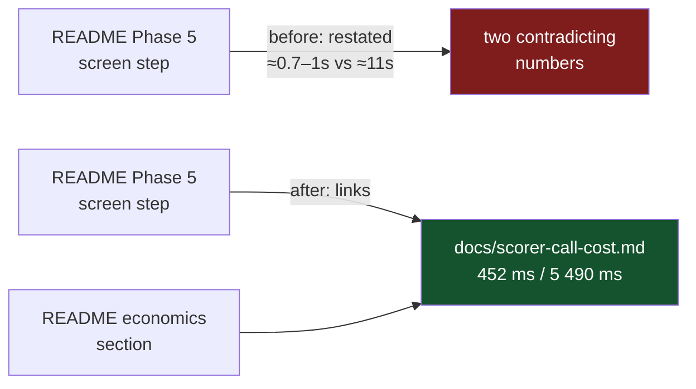

# Phase 5 links the measured scorer costs instead of restating them (Issue #172)

## Summary

`README.md`'s Phase 5 screen step quoted "≈0.7–1s/creature on GRQ against ≈11s
full". That line was written in PR #76, before the #112 fixed/marginal
decomposition existed, and was never reconciled against it: the measured
marginal costs in [`docs/scorer-call-cost.md`](../../scorer-call-cost.md) —
which the README itself cites as the source of truth further down the page —
are **452 ms/creature** screening and **5 490 ms/creature** promoting. Both
inline figures were roughly double the measurement, so a reader anchored on
whichever they met first was out by ~2× either way.

Following the README's own "link, do not restate" convention, the inline
figures are dropped and the step points at the measured document instead.
Closes #172.



## Evidence

Documentation change with no web interface to screenshot. The evidence is the
test suite: the new contract tests fail against the README as it stood and pass
after the edit. Re-checked by restoring the old wording in the working tree and
re-running `cargo test --test readme_scorer_cost_consistency`:

```text
test phase_five_cites_the_measured_scorer_call_cost_document ... FAILED
test phase_five_states_no_timing_the_measurement_contradicts ... FAILED

README Phase 5 states scorer timings docs/scorer-call-cost.md does not measure:
["`0.7` (= 700 ms)", "`1` (= 1000 ms)", "`11` (= 11000 ms)"] —
measured ms: [9898.0, 452.0, 1977.0, 5490.0]. Cite the document rather than
restating its numbers.

test result: FAILED. 9 passed; 2 failed
```

With the fix in place:

```text
test result: ok. 11 passed; 0 failed; 0 ignored; 0 measured; 0 filtered out
```

Full workspace suite: `cargo test --workspace --all-features -- --test-threads=2`
— 0 failures.

### Quality gate

`./quality.sh` stops at the codespell preflight because the container has no
`pip`/`pipx` to install `codespell` (`spell-check: codespell is not
installed.`; `/usr/bin/python3: No module named pip`). Every other stage was run
and passes: bash syntax, shellcheck, the TypeScript and workflow gates, the
lamarck version-order gate, `cargo deny check`, `cargo fmt --check`,
`cargo clippy … -D warnings`, `cargo test --workspace --all-features` and
`cargo doc` with `RUSTDOCFLAGS="-D warnings"`. CI runs the codespell stage for
real.

## Test Plan

New `lamarck/tests/readme_scorer_cost_consistency.rs`:

- `phase_five_states_no_timing_the_measurement_contradicts` — the regression
  test for this issue. It parses the per-phase fits out of
  `docs/scorer-call-cost.md`'s own `## Result` table and fails on any duration
  stated in README Phase 5 that is more than 5% away from a measured fixed or
  marginal cost. The bar is read from the document, not hard-coded, so
  re-measuring moves it and either side of the contradiction is caught.
- `phase_five_cites_the_measured_scorer_call_cost_document` — dropping the
  numbers only helps if the reader is sent somewhere, so Phase 5 must link
  `docs/scorer-call-cost.md`.
- `the_measured_result_table_still_parses_into_per_phase_fits` — guards against
  a vacuous pass: if the Result table stops parsing, that fails loudly instead
  of leaving the check with nothing to compare against.

Helper unit tests covering the parsing these rest on (happy path, edge cases and
the error path): `section_returns_only_the_requested_heading`,
`section_stops_at_a_deeper_heading_too`, `section_panics_on_a_missing_heading`,
`measured_costs_reads_bolded_space_grouped_cells` (bold cells, spaces grouping
thousands), `measured_costs_is_empty_when_the_table_carries_no_millisecond_cells`,
`durations_reads_the_pre_fix_phase_five_wording` (the `≈0.7–1s` range inherits
the unit written once at the right end), `durations_reads_both_units_and_ignores_bare_numbers`
and `durations_ignores_words_that_merely_start_with_a_unit_letter` (`0.05
sample` is not 50 ms).

No existing test was modified or removed.

## Reviewer notes

This branch was resumed after an earlier attempt. Two things were reconciled on
top of it:

- `origin/Develop` (PR #185) was merged in to clear the conflict flagged on the
  PR; the only real conflict was both branches inserting an entry at the top of
  the CHANGELOG's `### Fixed` list, and both entries are kept.
- The earlier attempt left the same contract implemented twice — a 320-line
  block appended to `lamarck/tests/readme_contract.rs` and the standalone
  `lamarck/tests/readme_scorer_cost_consistency.rs`. `readme_contract.rs` is
  back to its `Develop` content and the standalone file is the single copy: it
  matches the repo's one-file-per-doc-contract convention, keeps
  `readme_contract.rs` focused on the README ↔ CLI contract, and its Phase 5
  check is the stricter of the two (it catches `≈11s full`, which carries no
  `/creature` suffix).

## Scope note

The same pre-#112 figures survive in `lamarck/src/config.rs` doc comments and in
`docs/promote-gate.md`. Issue #183 already tracks that root cause; the
`config.rs` occurrences were recorded there rather than in a duplicate
follow-up, and both are outside this issue's stated scope.
