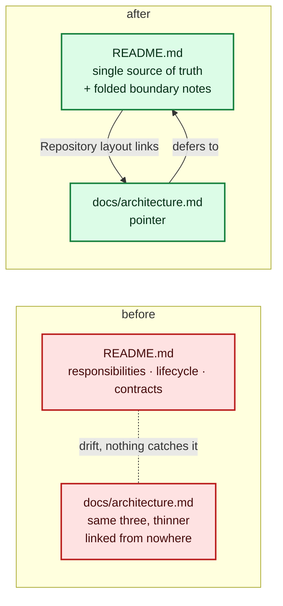

# `docs/architecture.md` becomes a pointer at the README (Issue #173)

## Summary

`docs/architecture.md` kept a second, thinner description of the architecture —
*Responsibilities*, *Iteration lifecycle*, *Locked contracts* — that the README
already owns more thoroughly in *Related repositories*, *How a run works* /
Phase 0–6 (with Mermaid diagrams) and *Safety invariants*. Nothing in the
repository linked to it, so a reader who found it by browsing `docs/` had no
signal it was the secondary copy, and the two hand-maintained copies were free
to drift.

The two notes that lived only in that file are folded into the README's
*Related repositories* (generic Lamarck code may migrate to NEAT-AI-core only
once the experiment proves useful and its interfaces stabilise; the scorer
alone decides fitness and Lamarck must not duplicate that authority), and its
*Design bias* framing is folded into *Runtime model* as the expected-value
sentence. `docs/architecture.md` is now a one-paragraph pointer at the README's
three owning sections, and the README's *Repository layout* links it so it is
discoverable rather than orphaned. Closes #173.

## Evidence

Documentation and test-only change — no web interface to screenshot. The
verification is the new contract test, which fails against the unfixed tree
(all five tests red before the edits: orphaned doc, no README link, seven
sections of its own, folded notes absent, layout link absent) and passes after.

Local gate: `cargo fmt --all -- --check`, `cargo clippy --workspace
--all-targets --all-features -D warnings`, `cargo test --workspace
--all-features` (405 + 156 tests, all green), `cargo deny check`, `cargo doc`
and `markdownlint-cli2 "**/*.md"` (0 issues) all pass. `./quality.sh` stops
early in this container at its codespell preflight — `codespell` is not
installed and there is no `pip`/`pipx` to install it (`/usr/bin/python3: No
module named pip`); the gate fails loudly rather than passing vacuously, and CI
runs it for real.

## Test Plan

New `lamarck/tests/architecture_pointer.rs`:

- `no_top_level_doc_is_orphaned` — every top-level `docs/*.md` is linked from
  at least one markdown file outside the PR-summary archive (the general fix
  for the orphan class, not just this file).
- `the_architecture_doc_points_at_the_readme` — the pointer resolves a link to
  `README.md`.
- `the_architecture_pointer_holds_no_sections_of_its_own` — it carries one `#`
  title, no sections, and at most eight non-blank lines, so it cannot regrow
  into a rival architecture doc.
- `related_repositories_keeps_the_folded_boundary_notes` — both folded notes
  survive in the README's *Related repositories*.
- `repository_layout_links_the_architecture_pointer` — *Repository layout*
  links the pointer.

Existing `lamarck/tests/docs_link_targets.rs` and
`lamarck/tests/readme_contract.rs` continue to pass, covering the new relative
links and the layout tree's `docs/` elision rule.
