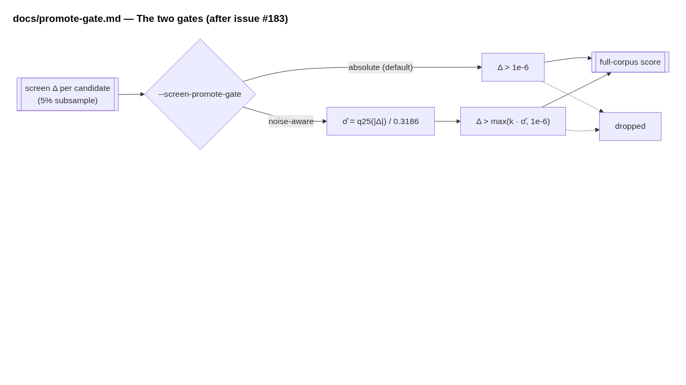
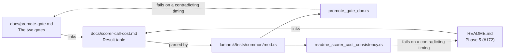

# Point `docs/promote-gate.md` at the measured scorer costs (Issue #183)

## Summary

`docs/promote-gate.md`'s *The two gates* section priced the two scorer calls
inline — "the expensive call, ~11 s per creature against ~1 s at 5%" — and its
Mermaid diagram labelled the full-corpus node `full-corpus score<br/>~11
s/creature`. Both are pre-#112 figures, written before the fixed/marginal
decomposition existed and roughly double what the least-squares fit in
[`docs/scorer-call-cost.md`](../../scorer-call-cost.md) reports (measured
2026-08-12, 15 calls): **452 ms** marginal per creature for the screen phase and
**5 490 ms** for the full-corpus promote phase.

The inline figures are dropped and the section now links that document as the
source of truth for both, exactly as #172 did to the README's Phase 5
walkthrough. Nothing else in the document changes — the replay tables, the
paired benchmark and the decision are untouched, and their wall-clock durations
(864 s, 891 s, the 900 s budget) are not per-creature scorer costs.

The "no timing the measurement contradicts" check now covers this document from
`lamarck/tests/promote_gate_doc.rs` — the repo's one-file-per-doc-contract home
for it — and the Result-table parsing both contracts need moved into the new
`lamarck/tests/common/mod.rs` so there is one implementation, not two copies.
The bar is parsed from `docs/scorer-call-cost.md` itself, so a re-measurement
moves it rather than needing the test edited.

Closes #183.

## Evidence

**The tests fail against the pre-fix wording.** Run before the document was
changed, both new tests failed and between them named all three figures the
issue reports:

```text
---- the_two_gates_section_states_no_timing_the_measurement_contradicts stdout ----
docs/promote-gate.md `## The two gates` states scorer timings
docs/scorer-call-cost.md does not measure:
["`11` (= 11000 ms)", "`1` (= 1000 ms)", "`11` (= 11000 ms)"]
— measured ms: [9898.0, 452.0, 1977.0, 5490.0].

---- the_two_gates_section_cites_the_measured_scorer_call_cost_document stdout ----
docs/promote-gate.md `## The two gates` does not link docs/scorer-call-cost.md
as the source of the screen-versus-promote cost
```

After the fix, `cargo test --test promote_gate_doc` reports 16 passed, 0 failed,
and the full workspace suite is green.

**The edited diagram renders.** The `## The two gates` Mermaid block, rendered
headlessly from the committed source — the full-corpus node no longer prices the
call:



Where the cost now comes from:



## Test Plan

Added to `lamarck/tests/promote_gate_doc.rs`:

- `the_two_gates_section_states_no_timing_the_measurement_contradicts` — every
  duration the section states, prose and Mermaid label alike, must be within 5%
  of a fixed or marginal cost the Result table measures.
- `the_two_gates_section_cites_the_measured_scorer_call_cost_document` — the
  section must keep linking `docs/scorer-call-cost.md`.

Added to `lamarck/tests/common/mod.rs` (moved from
`readme_scorer_cost_consistency.rs`, plus two new cases for the extracted
`timings_contradicting` helper):

- `section_*` (3), `measured_costs_*` (2) and `durations_*` (3) — the parsing
  the contracts rest on, including the pre-fix Phase 5 wording.
- `timings_contradicting_keeps_only_unmeasured_durations` and
  `timings_contradicting_is_empty_when_every_duration_is_measured`.

`lamarck/tests/readme_scorer_cost_consistency.rs` keeps its three README tests
unchanged in behaviour; no test was removed or weakened.

Gate: `./quality.sh` passes every stage except `codespell`, which is not
installed in this container ("spell-check: codespell is not installed") and runs
in CI. The remaining stages were run directly and pass: `cargo fmt --check`,
`cargo clippy --workspace --all-targets --all-features -D warnings`,
`cargo test --workspace --all-features` (all suites ok), `cargo deny check`
(advisories, bans, licenses, sources ok), `cargo doc` with
`RUSTDOCFLAGS="-D warnings"`, and `markdownlint-cli2@0.23.2` over the repo
(0 issues).
