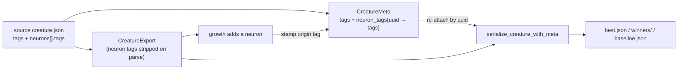

# Keep per-neuron tags on every check-in write (Issue #187)

## Summary

`best.json`, the `winners/` copies and each batch's `baseline.json` are rebuilt
from `neat_core::CreatureExport`, which carries no `NeuronExport.tags`. Every
check-in write therefore dropped the source creature's per-neuron provenance:
a GRQ-sampler creature with two neurons carrying `discovered` /
`discovery-comment` / `intelligentDesign` came back out of Lamarck with none,
while the creature-level tags survived.

`CreatureMeta` now also keeps `neurons[].tags`, parsed off the source JSON once
at start-up and keyed by neuron `uuid` — never by position, because structural
growth inserts and reorders neurons between writes. `serialize_creature_with_meta`
and `…_compact` re-attach them to each neuron on write; a neuron the source
never tagged gains no `tags` key, so untagged creatures are byte-unchanged.

Neurons **Lamarck itself grows** have no source provenance to keep, so they are
stamped with their own `lamarck` origin tag naming the strategy that grew them,
the focus neuron they were grown for and the experiment that accepted them —
`🦒 Lamarck · grown by 🧩 structural_add_neuron · 🎯 o1 · exp 42`. Both growth
paths are covered: an accept in the loop, and a Phase-G graft replay. Neurons
inherited from the source are never restamped — another program's `discovered`
/ `intelligentDesign` tags stay exactly as they arrived, the same boundary
`stamp_acceptance` already keeps at creature level (GRQ #3952).

Closes #187.

## Evidence

Backend/CLI change — there is no web interface to screenshot. The verification
is the test suite below plus the full quality gate.



Targeted run of the new and neighbouring tests:

```text
test run::tests::best_json_and_winners_preserve_per_neuron_tags ... ok
test run::tests::grown_neurons_carry_their_own_origin_tag ... ok
test tags::tests::extract_preserves_neuron_tags_keyed_by_uuid ... ok
test tags::tests::serialize_reattaches_neuron_tags_by_uuid ... ok
test tags::tests::serialize_leaves_untagged_neurons_alone ... ok
test tags::tests::neuron_tags_survive_edits_that_reorder_neurons ... ok
test tags::tests::stamp_new_neurons_tags_only_the_neurons_lamarck_added ... ok
test tags::tests::stamp_new_neurons_upserts_its_own_tag ... ok
test tags::tests::serialize_writes_the_origin_tag_of_a_grown_neuron ... ok
test tags::tests::neuron_origin_message_names_strategy_focus_and_experiment ... ok
test result: ok. 19 passed; 0 failed; 0 ignored; 0 measured; 396 filtered out
```

Full suite: `cargo test --workspace --all-features -- --test-threads=2` →
**415 lib tests + every integration binary pass, 0 failed**. `cargo clippy`
(with `-D warnings`), `cargo fmt -p neat_ai_lamarck -- --check`, `cargo deny
check` (advisories/bans/licenses/sources ok) and `RUSTDOCFLAGS="-D warnings"
cargo doc` are all clean.

**One gate could not run in this container:** `./quality.sh` stops at the
codespell preflight with `spell-check: codespell is not installed` — the image
has no `pip`/`pipx`/`brew`, so it cannot be installed here. Every later stage
was run by hand (listed above) and passes; CI runs the codespell job for real.
The `cargo fmt --all` diff seen locally is in an untracked leftover file in the
sibling `../NEAT-AI-core` checkout, not in this repository — this repo's own
`cargo fmt -p neat_ai_lamarck -- --check` is clean.

## Test Plan

New tests, all calling the real functions and asserting on the written document:

- `lamarck/src/tags.rs`
  - `extract_preserves_neuron_tags_keyed_by_uuid` — `neurons[].tags` are parsed
    off the source and keyed by neuron uuid; an unknown uuid has no entry.
  - `serialize_reattaches_neuron_tags_by_uuid` — both the pretty and the compact
    writer re-attach them, creature-level tags are untouched, and the document
    still parses back to the same creature.
  - `serialize_leaves_untagged_neurons_alone` — no empty `tags` key is invented.
  - `neuron_tags_survive_edits_that_reorder_neurons` — regression for the
    position-keyed failure mode: reversing the neuron list still gives each
    neuron its own tags.
  - `stamp_new_neurons_tags_only_the_neurons_lamarck_added` — only the grown
    neuron gets a `lamarck` origin tag; inherited neurons keep exactly what
    they arrived with.
  - `stamp_new_neurons_upserts_its_own_tag` — a second accept replaces the
    origin tag rather than stacking duplicates.
  - `serialize_writes_the_origin_tag_of_a_grown_neuron` — the origin tag reaches
    the written document.
  - `neuron_origin_message_names_strategy_focus_and_experiment` — exact wording.
- `lamarck/src/run.rs` (end-to-end, through `run_optimisation`)
  - `best_json_and_winners_preserve_per_neuron_tags` — reproduces the issue: a
    tagged source runs to an accept, and `best.json` **and** the `winners/` copy
    still carry both neurons' `discovered` / `discovery-comment` /
    `intelligentDesign` tags alongside the creature-level `lamarck` stamp. This
    test fails against the unfixed code (the neurons come back with no `tags`).
  - `grown_neurons_carry_their_own_origin_tag` — a scorer that rewards
    structural growth drives an accept that adds a neuron; the new neuron
    carries a `lamarck` origin tag naming strategy, focus and experiment, and
    the inherited neurons are not restamped.

No existing test was removed or modified.

### Scope note

Scorer-facing `candidate-NNN.json` files are deliberately left as they were:
they have never carried tags of any kind, `rust_scorer` is their only reader,
and issue #114 keeps that batch as small as possible. Provenance travels in
`CreatureMeta`, not in the candidate files, so nothing is lost when a winner is
read back.

### Security self-check

- Input validation: `from_creature_json` treats every field as optional and
  ignores malformed entries; a non-string tag value is stringified rather than
  trusted, exactly as the existing creature-level parser does.
- No secrets, no new dependency, no new shell/SQL/HTTP surface, no change to
  error text reaching a user.
