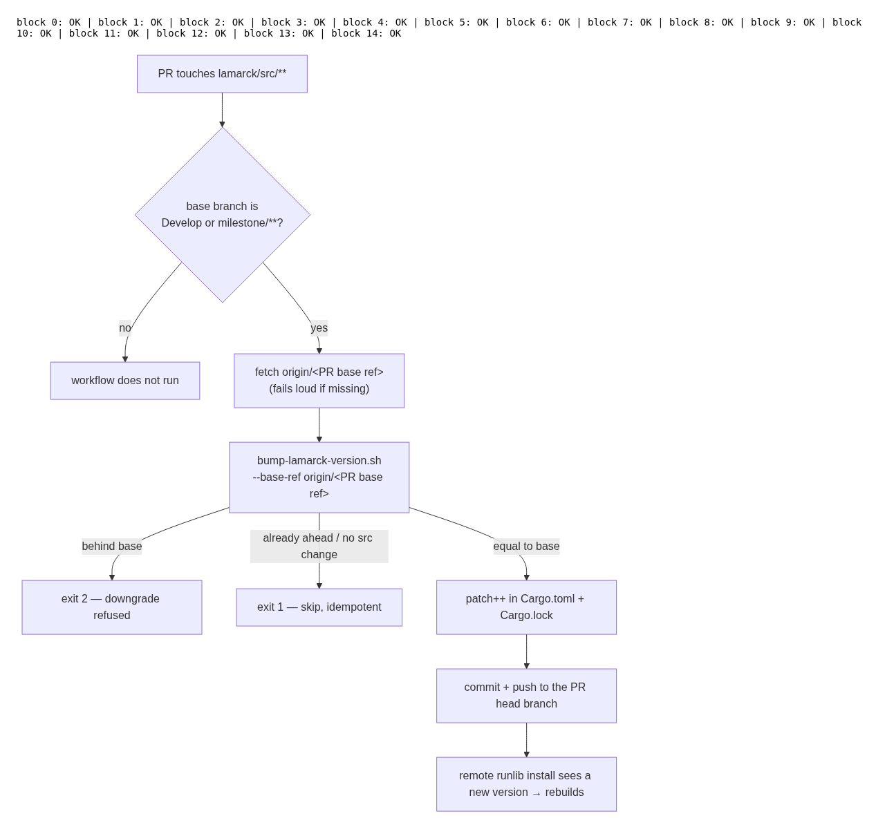
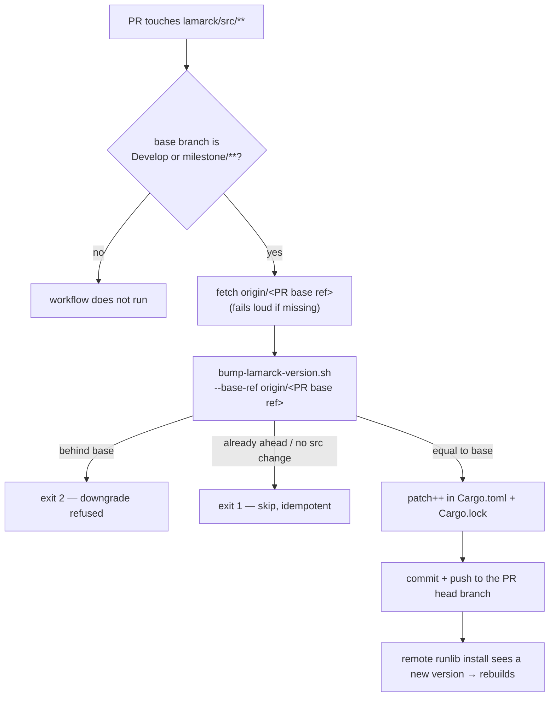

# Auto-increment the crate version on every source PR, milestone PRs included

## Summary

Remote `runlib`-style installs rebuild `neat_ai_lamarck` only when the crate
version changes, so a PR that ships source under an unchanged version leaves
unattended machines running the stale binary.
`.github/workflows/version-increment.yml` had two holes that did exactly that:

1. **Milestone PRs were never bumped.** The branch filter listed `Develop`
   only, but milestone sub-issue PRs target `milestone/<slug>` and merge
   without ever touching Develop — the same gap Issue #168 fixed for
   auto-format. The filter now also matches `milestone/**`.
2. **The base ref was hardcoded to `origin/Develop`.** Even with the filter
   widened, the second and later sub-issue PRs on a milestone branch would
   compare against Develop, read "version already ahead of base" and skip the
   bump, so several source PRs would merge under one version. The job now
   diffs against the branch the PR actually targets
   (`github.event.pull_request.base.ref`).

The base-branch fetch also stopped swallowing failures: `git fetch … || true`
turned an unresolvable base into a silent pass, so it now checks for the
remote-tracking ref and fails loudly when the fetch does not produce it.

`scripts/bump-lamarck-version.sh` already accepted `--base-ref`, so no change
was needed there — the new test pins that behaviour against a milestone base.

**Build fix carried in the same PR.** The first push of this branch went red on
`E0063: missing field` rather than on anything above: neat-core 0.9.9 (its
Issue #559) added `NeuronExport::id` and `CreatureExport::memetic`, and Lamarck
builds both types with struct literals, so every target stopped compiling. That
breakage is in `Develop` too — the `path` dependency tracks the sibling
checkout's head — and until it is fixed no PR in this repository can go green,
this one included. Neurons Lamarck grows (`structural`, `grafts`) are
identified by `uuid`, so they set `id: None`, which serialises away entirely;
merging a variant's neuron onto the base (`combos`) is a faithful copy and now
carries the variant's `id` through instead of dropping it.

Two further red checks from that first push are fixed here: the PR summary's
screenshot link used a repo-root-relative path, which `docs_link_targets` fails
because links must resolve relative to their own file (the rule PR #137
established), and the new README diagram names
`bump-lamarck-version.sh --base-ref`, which `readme_contract` read as a flag of
the `lamarck` binary — `--base-ref` joins the existing `FOREIGN_FLAGS`
allowlist beside the other `scripts/` helper flags.

Closes #190.

## Evidence

No web interface is involved — this is a CI workflow change. The one visual
surface is the new README diagram, rendered headlessly with Mermaid 11 (all 15
README blocks parse; the new block is the flowchart shown):



Behaviour of the fixed pipeline:



**The fixed workflow demonstrated itself on this PR.** The first push carried
no `lamarck/src/**` change, so **Auto-increment Versions** correctly skipped.
The build-fix push above does change `lamarck/src/**`, and the job bumped the
crate without being asked — commit `3b76416`
`chore: auto-increment versions for changed projects`, `0.1.23` → `0.1.24` in
both `lamarck/Cargo.toml` and `Cargo.lock`. That is exactly the behaviour the
issue asks for: source ships under a new version, so a remote `runlib` install
rebuilds instead of serving the stale binary.

Gate output (`./quality.sh`, new sections):

```text
WHAT: version-increment workflow validator behaviour (Issue #190)...
OK   shipped version-increment.yml passes (exit 0)
OK   no milestone branch filter → fail (exit 1)
OK   milestone only in a comment → fail (exit 1)
OK   base ref hardcoded to origin/Develop → fail (exit 1)
...
WHAT: lamarck version bump against the PR base branch (Issue #190)...
OK   milestone base, src changed → bump (0)
OK   milestone base bumps the manifest patch (0.1.24)
OK   re-run on bumped branch → skip (1)
OK   version behind base → error (2)
OK   missing base ref → error (2)
```

The build fix is evidenced by the workspace compiling and testing clean again:

```text
$ cargo clippy --workspace --all-targets --all-features -- -D warnings
    Finished `dev` profile

$ cargo test --workspace --all-features -- --test-threads=2
test result: ok. 417 passed; 0 failed   (lib)
...all 17 test binaries ok; 0 failed

$ cargo deny check
advisories ok, bans ok, licenses ok, sources ok

$ RUSTDOCFLAGS="-D warnings" cargo doc --workspace --no-deps
    Finished `dev` profile
```

`./quality.sh` passes end to end except `codespell`, which is not installed in
this container (`spell-check: codespell is not installed.` — no `pip`,
`pip3`, `python3 -m pip` or `pipx` on PATH to install it); the stages after it
were run directly, as quoted above. The CI **Spell Check** job installs and
runs it. `cargo fmt`, `clippy`, `actionlint` on the changed workflow and
`markdownlint-cli2` on the changed markdown all pass.

## Test Plan

Added — both run from `./quality.sh`:

- `scripts/test-check-version-increment-workflow.sh` — runs the real validator
  against generated workflow fixtures: shipped workflow passes; milestone glob
  stripped → fail; milestone only in a comment → fail; `milestone/*` block
  sequence and inline `branches: [Develop, "milestone/**"]` → pass; base ref
  rewritten to a hardcoded `origin/Develop` → fail; bump invocation removed →
  fail; missing file → exit 2.
- `scripts/test-bump-lamarck-version.sh` — runs `bump-lamarck-version.sh`
  inside throwaway git repositories and asserts on the version actually
  written: bump against a `milestone/demo` base (0.1.23 → 0.1.24 in both
  `lamarck/Cargo.toml` and `Cargo.lock`), idempotent re-run, `--check` writes
  nothing, patch roll-over past 9 (1.4.9 → 1.4.10), docs-only change skips,
  a version behind base exits 2 without rewriting the manifest, and an unknown
  base ref exits 2 rather than skipping silently.

Added for the neat-core 0.9.9 build fix — both fail to compile against the
unfixed code, which is exactly how the breakage presented:

- `lamarck/src/structural.rs::bridged_neuron_carries_no_runtime_id` — grows a
  bridge neuron through `add_neuron_bridge` and asserts the result: `id` is
  `None`, and the serialised document carries no `id` key for it, so a creature
  Lamarck writes still round trips against readers that predate the field.
- `lamarck/src/combos.rs::merge_preserves_the_runtime_id_of_a_copied_neuron` —
  merges a variant carrying a neuron with `id: Some(42)` and asserts the merged
  creature keeps `Some(42)` (plus its bias and squash), pinning copy-through
  rather than the silent drop `id: None` would have given.

Modified:

- `scripts/check-version-increment-workflow.sh` — two new rules (milestone
  branch filter present; base ref not hardcoded to `origin/Develop`).
- `lamarck/tests/readme_contract.rs` — `--base-ref` added to `FOREIGN_FLAGS`
  (a `scripts/bump-lamarck-version.sh` flag, not a `lamarck` binary flag).
- `lamarck/examples/batch_io_bench.rs`, `lamarck/src/tags.rs` — the remaining
  `NeuronExport` / `CreatureExport` literals updated for the new fields.
- No existing tests were removed or disabled.
