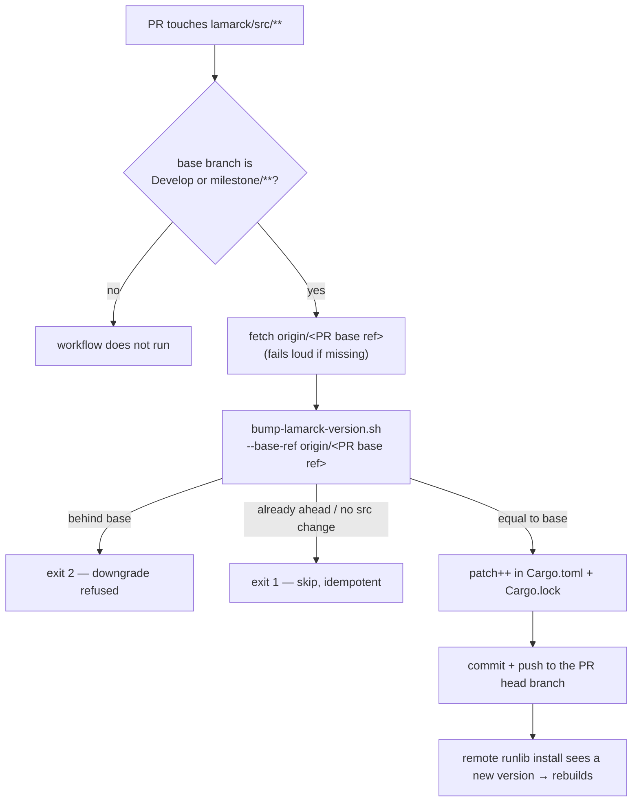

# Auto-increment the crate version on every source PR, milestone PRs included

## Summary

Remote `runlib`-style installs rebuild `neat_ai_lamarck` only when the crate
version changes, so a PR that ships source under an unchanged version leaves
unattended machines running the stale binary.
`.github/workflows/version-increment.yml` had two holes that did exactly that:

1. **Milestone PRs were never bumped.** The branch filter listed `Develop`
   only, but milestone sub-issue PRs target `milestone/<slug>` and merge
   without ever touching Develop — the same gap Issue #168 fixed for
   auto-format. The filter now also matches `milestone/**`.
2. **The base ref was hardcoded to `origin/Develop`.** Even with the filter
   widened, the second and later sub-issue PRs on a milestone branch would
   compare against Develop, read "version already ahead of base" and skip the
   bump, so several source PRs would merge under one version. The job now
   diffs against the branch the PR actually targets
   (`github.event.pull_request.base.ref`).

The base-branch fetch also stopped swallowing failures: `git fetch … || true`
turned an unresolvable base into a silent pass, so it now checks for the
remote-tracking ref and fails loudly when the fetch does not produce it.

`scripts/bump-lamarck-version.sh` already accepted `--base-ref`, so no change
was needed there — the new test pins that behaviour against a milestone base.

Closes #190.

## Evidence

No web interface is involved — this is a CI workflow change. The one visual
surface is the new README diagram, rendered headlessly with Mermaid 11 (all 15
README blocks parse; the new block is the flowchart shown):


Behaviour of the fixed pipeline:



Gate output (`./quality.sh`, new sections):

```text
WHAT: version-increment workflow validator behaviour (Issue #190)...
OK   shipped version-increment.yml passes (exit 0)
OK   no milestone branch filter → fail (exit 1)
OK   milestone only in a comment → fail (exit 1)
OK   base ref hardcoded to origin/Develop → fail (exit 1)
...
WHAT: lamarck version bump against the PR base branch (Issue #190)...
OK   milestone base, src changed → bump (0)
OK   milestone base bumps the manifest patch (0.1.24)
OK   re-run on bumped branch → skip (1)
OK   version behind base → error (2)
OK   missing base ref → error (2)
```

`./quality.sh` passes end to end except `codespell`, which is not installed in
this container (`spell-check: codespell is not installed.` — no `pip`,
`pip3`, `python3 -m pip` or `pipx` on PATH to install it). The CI **Spell
Check** job installs and runs it. `cargo fmt`, `clippy`, `actionlint` on the
changed workflow and `markdownlint-cli2` on the changed markdown all pass.

## Test Plan

Added — both run from `./quality.sh`:

- `scripts/test-check-version-increment-workflow.sh` — runs the real validator
  against generated workflow fixtures: shipped workflow passes; milestone glob
  stripped → fail; milestone only in a comment → fail; `milestone/*` block
  sequence and inline `branches: [Develop, "milestone/**"]` → pass; base ref
  rewritten to a hardcoded `origin/Develop` → fail; bump invocation removed →
  fail; missing file → exit 2.
- `scripts/test-bump-lamarck-version.sh` — runs `bump-lamarck-version.sh`
  inside throwaway git repositories and asserts on the version actually
  written: bump against a `milestone/demo` base (0.1.23 → 0.1.24 in both
  `lamarck/Cargo.toml` and `Cargo.lock`), idempotent re-run, `--check` writes
  nothing, patch roll-over past 9 (1.4.9 → 1.4.10), docs-only change skips,
  a version behind base exits 2 without rewriting the manifest, and an unknown
  base ref exits 2 rather than skipping silently.

Modified:

- `scripts/check-version-increment-workflow.sh` — two new rules (milestone
  branch filter present; base ref not hardcoded to `origin/Develop`).
- No existing tests were removed or disabled.
