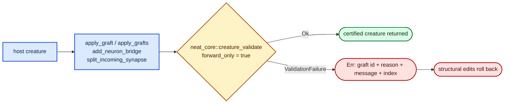

# Wire Lamarck graft output through `neat_core::creature_validate`

## Summary

Issue #192 held the #189 work until `neat_core::creature_validate` could
certify a creature. That blocker has cleared: **NEAT-AI-core#561 is closed and
PR NEAT-AI-core#565 is merged to `Develop`** (sibling head `86e19fe`,
neat-core `0.10.0`), so the function no longer ends in the unconditional
"not ported yet" failure. This PR implements #189 as written. Closes #192.

Every creature Lamarck *builds* is now certified by the shared validator after
the structure is final and before the value escapes, so a violation is
attributed to the graft or edit that caused it.

- **New `lamarck/src/validate.rs`** — `LAMARCK_VALIDATE_OPTIONS` and
  `validate_creature()`. The options are chosen deliberately and justified in a
  doc comment: `forward_only: true` (Lamarck only emits feed-forward creatures
  and `is_forward_edge` already refuses a backward edge at insertion; it also
  pins `feedback_loop` closed, which is why that field stays `None`), and
  `neurons` / `connections` left `None` because Lamarck *grows* structure and
  has no fixed expected counts. A failure is folded into the existing
  `Result<_, String>` channel carrying the `ValidationFailure` class, reason,
  message and `neuron_index` / `synapse_index` — never swallowed, never
  degraded to a log line.
- **`lamarck/src/grafts.rs`** — `apply_graft` certifies the assembled creature
  before returning `Ok`, prefixing the graft id. `apply_grafts` inherits the
  gate per step, so the first violation names the offending graft rather than
  the whole stack. The `is_present` passthrough is deliberately exempt: nothing
  was built there, and an externally supplied host's own defect is not this
  repo's bug to report (#189's "at output, not on load" rule).
- **`lamarck/src/structural.rs`** — `add_neuron_bridge` certifies the rewired
  creature and rolls the whole insert back on failure, so a refused edit leaves
  no partial rewire; `split_incoming_synapse` restores the edge it removed when
  the bridge is refused.
- **`lamarck/src/promote_gate.rs` — no change, deliberately.** It contains zero
  references to `CreatureExport`; it works on scores and deltas only, so no
  creature can reach promotion through it without having passed the graft or
  structural path.
- **`neat-core.expected-version` 0.9.0 → 0.10.0** — the core release carrying
  the completed validator is a pre-1.0 breaking bump, and
  `scripts/check-neat-core-version.sh` fails until the baseline is moved.

### Real bug the gate exposed

Wiring the validator in immediately failed **every** graft with
`Topology(SORT_FAILURE): 2) synapses not sorted`. Shared rule 25 requires
synapses sorted by their compiled `(from, to)` index pair, and Lamarck appended
each new edge at the end of the list. This was #189's stated expectation —
"expect to fix real bugs here rather than to loosen the rules" — so the rule was
not relaxed. New `structural::insert_synapse_ordered` places each edge in
canonical position; `add_synapse`, `add_neuron_bridge` and `apply_graft` all go
through it. Inserting a neuron shifts later compiled indices uniformly, which
preserves the relative order of the edges already present, so an ordered insert
is enough to hold the invariant. The helper resolves uuids through one
`HashMap` pass so the insert stays linear rather than quadratic.

## Evidence

Backend/library change — there is no web interface to screenshot. The evidence
is the test suite and the quality gate.



The failure a wired-up graft now produces, verbatim from
`graft_growing_an_unreachable_hidden_is_refused`:

```text
graft neuron:b1: ValidationError(NO_INWARD_CONNECTIONS): hidden neuron b1 has no inward connections [neuron 2]
```

`./quality.sh` passes every check except the codespell preflight, which reports
`spell-check: codespell is not installed.` — codespell is absent from this
container and cannot be installed (no `pip`, no `apt` privileges). It is not
affected by this change and CI installs it. Every other gate was run in full:
shellcheck, the TypeScript checks, the neat-core version gate (now green after
the baseline bump), the workflow validators, `cargo deny check`,
`cargo fmt --check`, `cargo clippy -D warnings`, `cargo test --workspace
--all-features`, and `cargo doc` with `RUSTDOCFLAGS="-D warnings"`.

## Test Plan

New integration tests in `lamarck/tests/creature_validation_gate.rs`:

- `tiny_fixture_is_certified_by_the_shared_validator` — the existing `grafts.rs`
  host passes.
- `applied_graft_output_passes_the_shared_validator` — a valid graft's output is
  certified, with the expected counters.
- `applied_graft_keeps_synapses_in_canonical_order` — regression for the
  `SORT_FAILURE` above; asserts the exact `(from, to)` order.
- `graft_growing_an_unreachable_hidden_is_refused` — a graft producing a hidden
  with no inward edge errors instead of returning a creature, and the error
  names the graft, the reason and the message.
- `apply_grafts_attributes_the_failure_to_the_offending_graft` — a good graft
  followed by a bad one names the bad one, not the earlier one.
- `valid_multi_graft_stack_still_applies` — valid grafts still stack unchanged.
- `neuron_bridge_output_is_certified` and `add_synapse_inserts_in_canonical_order`
  — the structural paths.
- `validation_failure_names_reason_message_and_index` — the error channel
  carries reason, message and index.
- `chosen_options_reject_a_recursive_edge` and
  `chosen_options_pin_no_expected_counts` — the chosen `ValidateOptions` are
  proven by behaviour, not by asserting on the constant.

New unit tests in `lamarck/src/validate.rs`
(`valid_creature_is_certified`, `unsorted_synapses_are_refused_with_the_synapse_index`,
`self_connection_is_refused_under_forward_only`) and in
`lamarck/src/structural.rs` (`ordered_insert_places_an_edge_mid_list`,
`ordered_insert_appends_the_greatest_key`,
`ordered_insert_keeps_a_run_of_same_source_sorted_by_target`,
`ordered_insert_sorts_a_dangling_endpoint_last`,
`refused_bridge_rolls_the_whole_insert_back`).

No existing test was commented out, weakened or removed. The whole suite
(420 lib tests plus the integration tests) passes.

## Pre-PR security self-check

- Input validation — `validate_creature` is itself a validation boundary; no new
  external input is accepted.
- Secrets — none staged; `git diff --cached --name-only` carries only source,
  tests, README, the version files and this summary.
- Injection surface — no new SQL, shell, filesystem or HTTP calls.
- Output encoding — failure text goes to the existing `Result<_, String>`
  channel and the existing logger.
- Authentication / authorisation — no endpoints or privileged operations.
- Error handling — failures name the rule and the index; no internal state or
  file paths are leaked.
- Dependencies — no new third-party dependency; the sibling `neat-core` path
  dependency baseline moved 0.9.0 → 0.10.0 and `cargo deny check` is clean.
