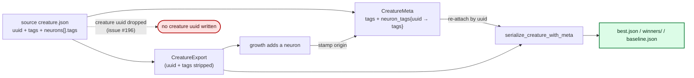

# Stop re-stamping the input creature's `uuid` on check-in writes

## Summary

`creature_value_with_meta` (`lamarck/src/tags.rs`) re-attached the creature
`uuid` read once off the input file to every check-in document Lamarck writes.
That uuid is a v5 **content hash** over the neurons (uuid, type, bias, squash,
frozen) and synapses (fromUUID, toUUID, weight, type, frozen) plus `input` — and
restructuring the creature is Lamarck's entire job, so from the first accept
onward the stamped uuid no longer described the creature carrying it.

The stale value reached `best.json`, `winners/winner-NNNN.json`, the Phase-G
`best.json`, the final re-stamped `best.json`, and the scorer-facing
`candidates-exp-N/baseline.json` (hard-linked on into `promote-exp-N/`).
Downstream it is not self-correcting: NEAT-AI's `makeUUID` short-circuits on a
uuid that is already present, and `Fitness.calculate` deduplicates its
evaluation queue by uuid, so a restructured creature wearing its parent's uuid
can be handed a score it never earned without ever being evaluated.

The fix is to emit **no** creature-level `uuid` and let the consumer derive it
from the content it actually received — what every other write path in the crate
(`width.rs`, `candidates.rs` candidate files, `grafts.rs`, `combos.rs`) already
does. A structurally identical creature re-derives the *same* uuid anyway, so
omitting it unconditionally is simpler than a conditional "drop it only when
something changed" and always correct.

Changed:

- `lamarck/src/tags.rs` — removed the `value["uuid"] = json!(uuid)` re-attach,
  the now-dead `CreatureMeta.uuid` field, and its extraction in
  `from_creature_json`.
- `lamarck/src/candidates.rs` — corrected the `write_candidate_batch` doc
  comment that claimed `baseline.json` keeps the original `uuid`.
- `README.md`, `docs/compact-batch-io.md`, `CHANGELOG.md` — same correction on
  every documented surface, plus a new paragraph explaining why the creature
  uuid is dropped while per-neuron `uuid` is preserved.
- `lamarck/Cargo.toml` — version bump `0.1.26` → `0.1.27`.

**Explicitly out of scope and unchanged:** creature `tags`,
`reattach_neuron_tags`, and per-neuron `uuid`. A tags-only pass is not a
structural change — tags are deliberately excluded from the uuid hash — and
per-neuron `uuid` is a different concept: a stable identity label that is an
*input* to the creature hash and the key per-neuron tags are stored under
(issue #187). A dedicated over-correction guard test pins that.

Closes #196.

## Evidence

Backend/CLI change with no web interface, so no screenshot applies. The
evidence is the test suite.

**Red first.** With the fix not yet applied, the two new `tags.rs` tests failed
on the stamped uuid:

```text
---- tags::tests::serialize_omits_the_creature_uuid_even_without_a_change stdout ----
thread '…' panicked at lamarck/src/tags.rs:867:9:
assertion failed: value.get("uuid").is_none()
…
  "tags": [ { "name": "name", "value": "Yara Richardson" } ],
  "uuid": "creature-4"
}
```

**Green after.** The new and inverted tests, and the guards that had to stay
green:

```text
test tags::tests::serialize_omits_the_creature_uuid_after_a_structural_change ... ok
test tags::tests::serialize_omits_the_creature_uuid_even_without_a_change ... ok
test tags::tests::dropping_the_creature_uuid_keeps_tags_and_every_neuron_uuid ... ok
test tags::tests::extract_preserves_tags ... ok
test tags::tests::extract_preserves_neuron_tags_keyed_by_uuid ... ok
test tags::tests::serialize_round_trips_original_tags_plus_lamarck ... ok
test tags::tests::compact_round_trips_to_the_same_creature_and_tags_as_pretty ... ok
test candidates::tests::compact_baseline_keeps_tags_and_drops_the_creature_uuid ... ok
test candidates::tests::compact_baseline_of_a_restructured_incumbent_has_no_uuid ... ok
```

Full workspace suite: `429 passed; 0 failed` (`cargo test --lib`), and
`cargo test --workspace --all-features -- --test-threads=2` green.

What the write path does now:



### Quality gate

`./quality.sh < /dev/null` passes every check **except** the codespell
preflight, which fails in this container because `codespell` is not installed
and cannot be: there is no `pip`, no `pip3`, no `ensurepip` module, and
`apt-get install codespell` is refused without root. The exact output was:

```text
spell-check: codespell is not installed.
…
spell-check: FAILED — fix the typos above or update .codespellrc
```

That is an environment limitation, not a repository failure — no typo was
reported. Every step after it was run explicitly and passed: `cargo deny check`,
`cargo fmt --all -- --check`, `cargo clippy --workspace --all-targets
--all-features` under `RUSTFLAGS="-D warnings"`, the full test suite, and
`RUSTDOCFLAGS="-D warnings" cargo doc --workspace --no-deps` — ending in
`All quality checks passed!`. CI runs the spell-check job for real.

## Test Plan

Added (`lamarck/src/tags.rs`):

- `serialize_omits_the_creature_uuid_after_a_structural_change` — grows a
  hidden neuron into the creature with the real `add_neuron_bridge` primitive
  (the same one `structural_add_neuron` uses), asserts the emitted document
  carries no `uuid` in **both** the pretty and compact forms, and asserts the
  emitted creature's neuron *and* synapse counts differ from the source so the
  test cannot pass on a no-op.
- `serialize_omits_the_creature_uuid_even_without_a_change` — the unconditional
  case: no uuid is written even when nothing was restructured.
- `dropping_the_creature_uuid_keeps_tags_and_every_neuron_uuid` — the
  over-correction guard. A tags-only pass must leave identity alone: creature
  tags (`name`, `score`, `error`, `lamarck`) survive, both `neurons[].tags`
  entries survive, and every per-neuron `uuid` is identical to the source's.
  This is what stops the fix becoming "strip everything" and regressing #187.

Added (`lamarck/src/candidates.rs`):

- `compact_baseline_of_a_restructured_incumbent_has_no_uuid` — writes a batch
  with `write_candidate_batch(..., Some(&meta))` from an incumbent that has been
  structurally grown, and asserts the resulting `baseline.json` carries no
  `uuid` while keeping its `score` tag. Non-vacuous: neuron and synapse counts
  are asserted to differ from the source.

Modified — three existing tests pinned the defect as intent; their `uuid`
assertions are inverted, their tags assertions untouched:

- `tags.rs::extract_preserves_uuid_and_tags` → `extract_preserves_tags`: the
  `meta.uuid` assertion is gone because the field no longer exists; the tag
  assertions stay.
- `tags.rs::serialize_round_trips_original_tags_plus_lamarck`:
  `assert_eq!(value["uuid"], "creature-1")` →
  `assert!(value.get("uuid").is_none())`.
- `tags.rs::compact_round_trips_to_the_same_creature_and_tags_as_pretty`: same
  inversion on the compact form.
- `candidates.rs::compact_baseline_keeps_uuid_and_tags` →
  `compact_baseline_keeps_tags_and_drops_the_creature_uuid`: same inversion; the
  `tags` and round-trip assertions stay.

No test was removed or commented out.

## Note for the reviewer — cross-repo twin

`lamarck/src/tags.rs` is a near-verbatim twin of the same file in
NEAT-AI-Backpropagation, which carries the identical defect; it is already
tracked there as `stSoftwareAU/NEAT-AI-Backpropagation#101`. That repository is
not a dependency of this one, and lifting the shared check-in metadata helper
into `neat-core` is a separate refactor, so this PR is scoped to the Lamarck
instance the issue names.
