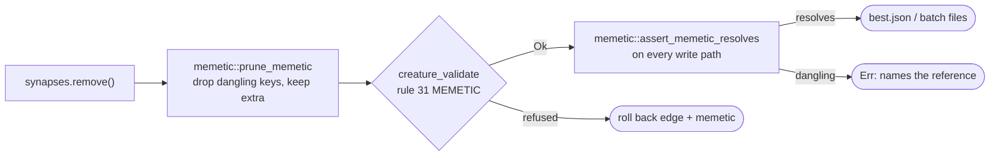

# Prune `memetic` on removal — `structural_add_neuron` stops silently dying

## Summary

`split_incoming_synapse` removed a synapse without pruning the creature's
`memetic` record. Rule 31 (`MEMETIC`) of `neat_core::creature_validate` checks
**referential integrity**, so a weight delta naming the removed edge made
`add_neuron_bridge` refuse the rewire; `structural.rs` restored the edge and
`candidates.rs:1141` swallowed the error with `.ok()?`. Net effect: on any
creature carrying a memetic weight for the chosen edge — which is exactly what a
Backprop or fine-tuning stage leaves behind — the whole `structural_add_neuron`
strategy **silently produced no candidate**, with no log line and no counter.

Fixed by pruning at the removal, and by refusing to write a dangling record at
all. Closes #197.

- **New `lamarck/src/memetic.rs`.** `prune_memetic()` drops only dangling keys;
  `assert_memetic_resolves()` is the write-path half. `MemeticExport::extra`
  (`generation` / `score` / `ancestry`), every bias whose neuron survives and
  every weight whose edge survives are kept — which is what rules out the blunt
  `memetic = None`.
- **`structural.rs`.** Prune immediately after `synapses.remove(syn_idx)`,
  before `add_neuron_bridge` certifies; the rollback branch restores the
  snapshotted `memetic` alongside the edge, so a refused split is a true no-op.
- **Write boundary.** `width::checked_creature_json{,_pretty}` and the
  `tags` check-in serialiser refuse a creature whose memetic names structure it
  no longer carries, so a *future* removal that forgets to prune cannot reach
  `best.json`, `winners/` or a scorer batch.
- **Untouched, deliberately.** Append paths (`add_synapse`, `apply_graft`,
  combo merges) keep the whole record — adding structure leaves every key
  resolvable — and a tags-only pass leaves both `memetic` and `uuid`
  byte-identical.



### Where the rule really belongs, and what that costs here

Resolving a memetic reference is not trivial: rule 31 reads a key as a runtime
id first — implicit inputs by their index, outputs forced to
`-(outputIndex + 1)` whatever the file declares, everything else by its declared
id **or a deterministic hash of its uuid** — and only then as a wire UUID.
Lamarck cannot reproduce the hash half without duplicating it, so
`lamarck/src/memetic.rs` mirrors the derivable half exactly and is
**conservative** about the rest: a numeric key inside NEAT-AI's derived-id range
that matches no declared id is *unverifiable* — never pruned, never refused.
Erring that way costs at worst the old behaviour for one exotic key shape;
erring the other way would destroy valid fine-tuning history or block a sound
write.

The shared home is `neat-core`, beside rule 31. A PR adding
`CreatureExport::prune_memetic()` / `MemeticExport::prune_to()` there is raised
from this run (branch `lamarck-197-memetic-prune`), and
**stSoftwareAU/NEAT-AI-Lamarck#199** tracks replacing this module's body with a
call to it once that release lands — Lamarck tracks the sibling path dependency
and its CI checks out `NEAT-AI-core` `Develop`, so the delegation cannot ship in
the same PR.

## Evidence

Backend/CLI change — no web interface to screenshot. The evidence is the tests,
which are red against the unfixed code.

**The bug, reproduced.** With the prune call commented out, the end-to-end test
fails exactly as the issue describes — not with a validation error, but with
*nothing happening*:

```text
  candidates: best Δ +0.000000e0 (candidate-000)  worst Δ +0.000000e0 (candidate-003)  >0: 0/4
  no candidate met the acceptance threshold
● experiment cap reached (4) — stopping
panicked at lamarck/src/run.rs: growth must be accepted, or best.json is only the verbatim source copy
```

and the unit tests name the rule that refused it:

```text
split_prunes_the_row_naming_the_removed_edge ... FAILED
  the split must produce a candidate, not vanish:
  "bridge input-0 -> grown-1 -> h1: ValidationError(MEMETIC):
   Memetic from id input-0 to id h1 has no matching synapses."
```

With the fix, the full gate is green: `cargo test --workspace --all-features`
**652 passed, 0 failed**, plus `cargo fmt --check`, `cargo clippy -D warnings`,
`cargo doc` and `cargo deny check`.

`./quality.sh` runs clean except its `codespell` preflight, which cannot run in
this container (no `pip`/`pipx`/`python3 -m pip`); CI runs that job for real.
Every other step of `quality.sh` was executed and passed.

## Test Plan

**New `lamarck/tests/memetic_prune.rs`** — the real entry points, asserting on
the creature handed back:

- `split_prunes_the_row_naming_the_removed_edge` — the split now **succeeds**,
  and the row naming the removed edge is gone while the untouched one stays.
- `split_prunes_the_id_keyed_entry_naming_the_removed_edge` — the same for the
  id-keyed weight form.
- `split_keeps_a_bias_whose_neuron_survives_and_every_extra_key` — `generation`,
  `score` and `ancestry` survive the prune (the test that rules out
  `memetic = None`).
- `a_refused_split_restores_the_memetic_it_pruned` — rollback is a true no-op.
- `appending_structure_keeps_the_whole_memetic_record` — over-correction guard
  for `add_synapse` and `apply_graft`.
- `a_tags_only_write_leaves_memetic_and_uuid_untouched` — over-correction guard
  for the tags pass.
- `the_write_boundary_refuses_a_dangling_memetic` /
  `the_write_boundary_accepts_a_pruned_creature`.

**New `run::tests::every_creature_written_for_a_memetic_creature_is_valid`** —
a full run over a fine-tuned creature with a scorer that certifies every file
it is handed: every batch creature and `best.json` must satisfy
`creature_validate(&written, &LAMARCK_VALIDATE_OPTIONS)`. This is the test that
catches *any* future removal path, not just this one.

**New unit tests in `lamarck/src/memetic.rs`** — prune drops only the dangling
bias / row / entry, keeps `extra`, is idempotent, keeps an emptied record, keeps
a bias keyed by an input index, follows the forced output id, keeps an
unverifiable derived-id key, and `assert_memetic_resolves` names the first
dangling reference.

**Docs.** README gains *Memetic records survive structure changes* — the
per-pass table (remove → prune, append → keep, tags → untouched) with a Mermaid
flow — and `memetic.rs` in the repository-layout tree.
