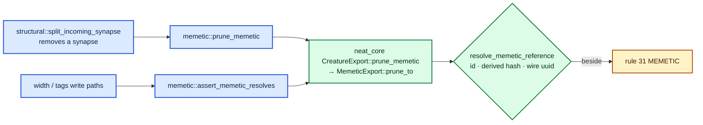

# Delegate `lamarck/src/memetic.rs` to neat-core's `CreatureExport::prune_memetic`

## Summary

`lamarck/src/memetic.rs` re-derived rule 31's memetic resolution vocabulary, but
it could only reproduce the *derivable* half. A neuron declaring no `id` still
has one — NEAT-AI's `deterministicIdFromUuid` folds its uuid into
`[1_000_000, 2_000_000_000)` — and that hash lives in `neat-core`. Lamarck
therefore treated **every** numeric key in that range as *unverifiable*: never
pruned, never refused. Conservative, but it left the Issue #197
silent-candidate-loss reachable for one exotic shape — an id-keyed memetic whose
key is a uuid-derived id, on a neuron declaring no `id`, whose edge was the one
removed.

neat-core 0.10.5 ships the shared home (`stSoftwareAU/NEAT-AI-core#576`,
merged and tagged `v0.10.5`), so both Lamarck boundaries now delegate:

- `prune_memetic` is a one-line call to `CreatureExport::prune_memetic()`.
  `StructureIndex`, `KeyTarget` and `DERIVED_ID_RANGE` are deleted.
- `assert_memetic_resolves` runs the *same* prune against a clone of the record
  and names the first reference it would drop, so the write-path guard cannot
  drift from rule 31 either. Error messages are unchanged.
- `neat-core.expected-version` records `0.10.5` (patch drift — not a breaking
  bump; the gate passed either way, but the file records the last-handled
  version and this PR handles 0.10.5's new API).

Behaviour change: a numeric key in the derived-id range is now resolved
**exactly** — kept when it hashes to a live neuron, pruned and refused when it
names nothing. Everything else is unchanged: `extra` (`generation` / `score` /
`ancestry`) survives verbatim, the record itself survives even when emptied,
malformed rows are left for rule 31 to report rather than quietly deleted, and
appends still prune nothing.

Closes #199.

## Evidence

Backend/CLI change only — no web interface to screenshot. Evidence is the test
suite plus the gate output below.

The two boundaries and where resolution now lives:



Quality gate — every step of `./quality.sh` passes except `codespell`, which is
**not installed in this container** (`no module named pip`, no root for
`apt-get`), so the script fails loud as designed:

```text
Running codespell preflight...
spell-check: codespell is not installed.
```

The remaining steps were run individually and all pass:

```text
cargo deny check         advisories ok, bans ok, licenses ok, sources ok
cargo fmt --all -- --check   OK
cargo clippy --workspace --all-targets --all-features -D warnings   clean
cargo test --workspace --all-features -- --test-threads=2   444 + 0 failed (lib), all suites ok
RUSTDOCFLAGS="-D warnings" cargo doc --workspace --no-deps   Generated
check-neat-core-version.sh   OK neat-core 0.10.5 matches handled baseline 0.10.5
check-lamarck-version-order.sh   OK (0.1.28 -> 0.1.29)
```

## Test Plan

Existing `memetic` tests are unchanged and still pass — same fixtures, same
assertions, same error strings — which is what proves the delegation is
behaviour-preserving for every shape Lamarck could already resolve.

Removed, as the issue directs: `prune_keeps_a_key_that_could_be_a_uuid_derived_id`.
It pinned the *conservative* behaviour ("key `1500000` is unverifiable, keep
it"), which is exactly what this PR replaces with exact resolution. The
`DERIVED_IDS` fixture drops that key with it.

Added in `lamarck/src/memetic.rs`:

- `prune_keeps_a_key_that_is_a_neurons_uuid_derived_id` — new `HASHED_IDS`
  fixture whose hidden neuron `h1` declares no `id`. Its bias and weight keyed
  by `1003273` (`deterministicIdFromUuid("h1")`) survive the prune and pass the
  write guard.
- `prune_drops_a_derived_range_key_that_names_nothing` — the regression test for
  the closed gap. Key `1500000` is in the same range but hashes to no neuron:
  `assert_memetic_resolves` refuses it, and the prune drops both its bias and
  its weight key. **Fails against the pre-fix code**, which kept it.
- `assert_leaves_a_malformed_row_to_rule_31` — a row missing `fromUUID` is a
  defect in the record as supplied, not something a removal caused; the guard
  must not claim it dangles.
