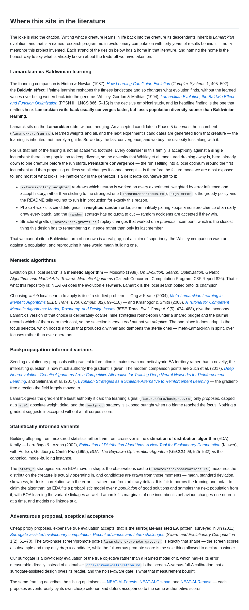
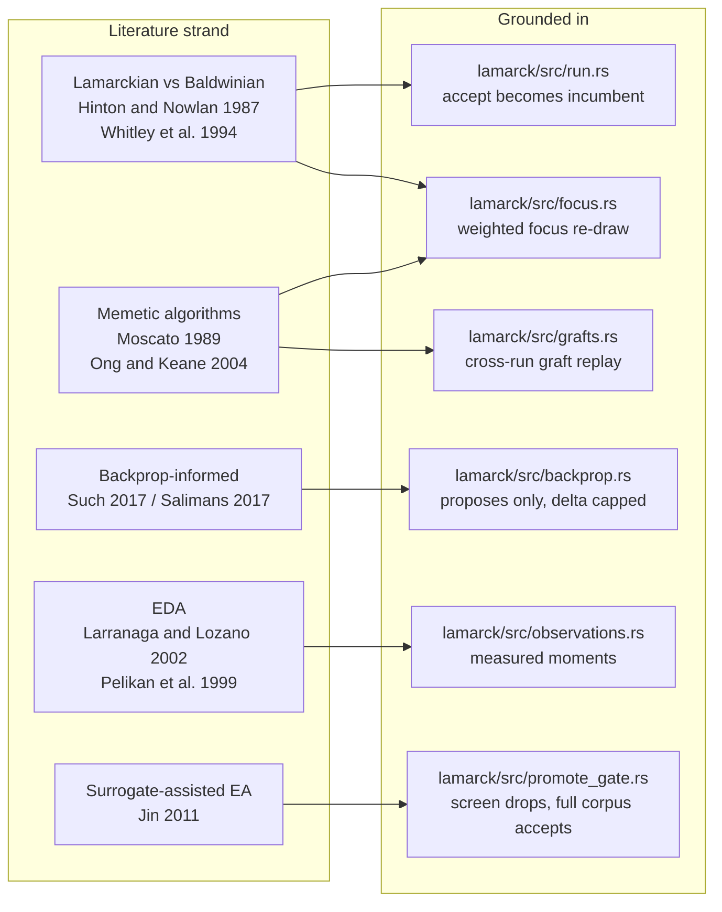

## Summary

The README made the Lamarck joke but never the citation, so a reader had no way
to learn that Lamarckian inheritance is a named forty-year-old research
programme — or that it carries a known cost. This adds a **Where this sits in
the literature** section to `README.md` that places each strand of the design in
its literature and, critically, states the Whitley et al. finding and our
position on it: **Lamarckian write-back converges faster but sheds population
diversity sooner than Baldwinian learning**, and Lamarck is squarely on the
Lamarckian side. Because every optimiser in this family is accept-only against a
single incumbent, that diversity loss is named as our real exposure (premature
convergence), together with the counterweights already in the generator —
weighted focus re-draw, weighted-random grid order, and cross-run structural
grafts. The gap is stated honestly too: there is no Baldwinian arm here to
compare against.

Strands and citations:

- **Lamarckian vs Baldwinian** — Hinton & Nowlan (1987); Whitley, Gordon &
  Mathias (1994).
- **Memetic algorithms** — Moscato (1989); Ong & Keane (2004); Krasnogor &
  Smith (2005).
- **Backpropagation-informed variants** — Such et al. (2017); Salimans et al.
  (2017).
- **Statistically informed variants (EDAs)** — Larrañaga & Lozano (2002);
  Pelikan, Goldberg & Cantú-Paz (1999).
- **Adventurous proposal, sceptical acceptance** — Jin (2011),
  surrogate-assisted EA.

Each subsection is anchored to code that exists (`run.rs`, `focus.rs`,
`grafts.rs`, `backprop.rs`, `observations.rs`, `promote_gate.rs`) and says where
the borrowed framing stops being an honest description — the `stats_*`
strategies fit marginals of one incumbent rather than a population model, and
the surrogate is a low-fidelity evaluation of the true objective rather than a
learned model of it.

🦒 The giraffe, the banner and the "Lamarck would be proud" tagline all stay —
a test pins them.

Docs-only: no behaviour, CLI surface or output format changed.

Closes #202.

## Evidence

The section as GitHub renders it — committed at
`docs/evidence/issue-202-literature-section.png`, linked here relative to this
file per Issue #137:



How each strand maps onto the code it is anchored to:



Test run (`cargo test -p neat_ai_lamarck --test literature_citations`):

```text
running 13 tests
test result: ok. 13 passed; 0 failed; 0 ignored; 0 measured; 0 filtered out
```

`markdownlint-cli2` over the repo: `Summary: 0 error(s)`. The full `./quality.sh`
gate passes.

Factual claims in the new section were checked against the code rather than
asserted: `MAX_BACKPROP_WEIGHT_DELTA = 0.01` (`lamarck/src/candidates.rs:90`),
nine candidate strategies (`lamarck/src/candidates.rs:49-57`), `high-error` as
the greedy policy that sticks on one neuron (`lamarck/src/focus.rs:146`), and
grafts replayed onto the current fittest from prior runs
(`lamarck/src/grafts.rs:1-8`).

## Test Plan

New integration test `lamarck/tests/literature_citations.rs` (13 tests) — a
README ↔ literature contract that guards the ways this decays:

- `the_readme_carries_a_literature_section` — the section exists and carries
  real prose (>200 words), not a stub heading.
- `the_literature_section_places_every_strand` — all five subsections present.
- `every_cited_work_carries_author_year_and_title` — each of the eleven cited
  works keeps the author, year and title fragment that make it findable and
  verifiable.
- `every_strand_cites_at_least_one_work` — no subsection drifts into commentary
  with no reference attached.
- `the_diversity_tradeoff_is_stated_explicitly` — the Whitley finding survives
  as a finding (diversity / converge / faster / Baldwin), not a name-drop.
- `the_readme_states_our_position_on_the_tradeoff` — the README says which side
  we are on and why the diversity half is our exposure (incumbent, premature
  convergence).
- `the_section_is_grounded_in_source_files_that_exist` — every
  `lamarck/src/*.rs` path the section points a reader at resolves on disk, so a
  rename cannot leave a dangling anchor.
- `the_giraffe_and_the_tagline_stay` — the banner giraffe and "Lamarck would be
  proud" are still there (Issue #202 acceptance).
- Five unit tests cover the test file's own helpers (`section`, `subsection`,
  `source_paths`) on happy path, missing-heading panic, and the
  no-match/edge cases.

No existing tests were modified or removed.
