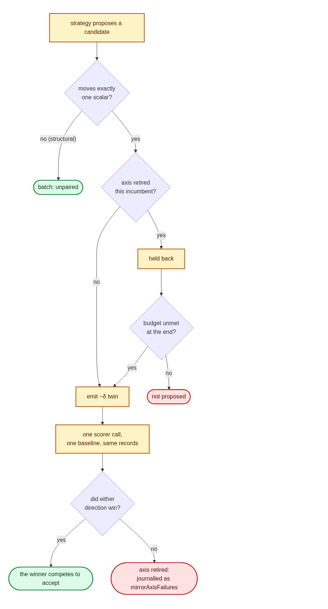

# Mirrored (antithetic) sampling for signed perturbation variants (Issue #203)

## Summary

A weight nudge or bias shift was scored only in the direction the strategy
guessed, so half of every local slope went unmeasured and the improvement
estimate carried the full noise of a single unpaired draw. At the effect sizes
this optimiser works at — fleet wins around `1e-04` — that noise is the
difference between finding a win and discarding it.

Following Salimans et al. 2017, every candidate that moves **exactly one
scalar** of the incumbent (one neuron bias or one synapse weight) now enters the
batch beside its `−δ` twin, so both halves are written into the same scoring
directory and priced by **one** scorer call against identical records.
Closes #203.

- **`lamarck/src/mirror.rs`** (new) — what a signed perturbation is, how its
  antithesis is built, how a journal's halves are re-paired, and what the pair
  measured. Structural candidates change the creature's shape, have no
  meaningful negation, and are never mirrored. A twin the hard bias/weight limit
  would clamp is not emitted at all: a clamped `−δ` is no longer the antithesis
  of `+δ`, so the pair could not cancel the noise it exists to cancel.
- **Journal** — both halves carry a `mirror` provenance entry (`axis`, signed
  `delta`, `role`). A pair that loses in **both** directions is an axis-level
  failure: the incumbent is at a local optimum along that axis, and the axis is
  journalled as `mirrorAxisFailures`.
- **Generation** — a retired axis loses its *priority*, not its right to a slot.
  A proposal on a retired axis is held back and admitted at the end of
  generation only if the rest of the generator could not fill the budget, so
  retirement can never shrink a batch below `--candidates`. An accept moves the
  incumbent and re-opens every axis at once.
- **`report`** — a new `mirror` bucket whose `mirrorWinRate` is the number the
  change is judged on: how often the `−δ` twin improved on a batch where the
  `+δ` proposal did not.
- **CLI** — on by default; `--no-mirrored-sampling` is the A/B arm the win rate
  is read against.

### Deliberate test changes

Two existing tests pin behaviour that a default-on batch change necessarily
moves. Neither assertion was weakened or removed:

- `lamarck/tests/focus_count.rs` now pins `mirrored_sampling: false`, for the
  same reason it already pins `scale_candidate_quotas: false`: its golden
  fixture is a candidate stream captured before `−δ` twins existed, and a twin
  takes a batch slot. Documented in that file's module doc.
- `lamarck/tests/cache_economics.rs` needed no change once retirement was made
  non-starving. Worth flagging for reviewers: mirroring suppresses re-proposals
  at the source, which is the same work the opt-in failed-candidate cache does
  one experiment later, so on a run with both on the cache sees fewer repeats to
  skip. Its stand-down guardrail already prices that and disables it if it stops
  paying. Noted in the README.

## Evidence

Backend/CLI change — there is no web interface to screenshot. The one visual
surface is the new README flowchart, rendered here from the README's own
Mermaid block in the container's headless Chromium and saved to
`docs/evidence/issue-203-mirrored-sampling-flow.png` (linked below relative to
this archived file). The Playwright MCP `browser_*` tools were not present in
this run's tool registry — `ToolSearch` for them returned "No matching deferred
tools found" — so the page was served on `127.0.0.1` and driven through the
container's own `playwright-core` instead. The render completed with an empty
`pageerror` list, which is the check that matters: the diagram is valid Mermaid
and will render on GitHub.



Behavioural evidence is the test suite, which drives real runs and reads their
journals back rather than inspecting source:

```text
cargo test --workspace --all-features -- --test-threads=2
   … 461 passed (lib) + every integration binary green, 0 failed
./quality.sh
   … fmt, clippy (-D warnings), cargo-deny, every script gate: pass
```

`./quality.sh` stops at its codespell preflight in this container — codespell is
not installed and there is no `pip` to install it, and the script fails loud
rather than reporting a vacuous pass. Every other gate it runs was executed
individually and passed: `cargo fmt --all -- --check`, `cargo clippy --workspace
--all-targets --all-features -D warnings`, `cargo deny check` (advisories, bans,
licences, sources ok), the full test suite, and `RUSTDOCFLAGS="-D warnings"
cargo doc`. `markdownlint-cli2` reports 0 issues across all 64 markdown files.

## Test Plan

New — `lamarck/tests/mirrored_sampling.rs` (end to end, one real run each):

- `both_halves_of_a_pair_are_scored_in_one_call` — every `original` journalled
  has its `mirror` twin in the same record, with the opposite delta, and both
  stems keyed in the same score map beside one `baseline`. Acceptance 1.
- `a_pair_that_loses_twice_is_journalled_as_an_axis_failure` — on a scorer where
  everything loses, axes are journalled in `mirrorAxisFailures`, and the report
  agrees that no mirror rescued anything. Acceptance 2.
- `report_measures_the_mirror_rescues_a_monotone_scorer_produces` — on a scorer
  monotone in the creature's scalars, exactly one half of every pair wins, so
  `bothLost` is zero and the rescues show up in `mirrorWinRate`. Acceptance 3.
- `mirroring_off_journals_no_pairs_and_reports_zeros` — the
  `--no-mirrored-sampling` arm journals no pair metadata and reports zeros.

New unit tests:

- `lamarck/src/mirror.rs` — a bias and a weight nudge are recognised as signed
  perturbations; a structural, multi-scalar, squash-changing or no-op candidate
  is not; the twin straddles the incumbent exactly and touches nothing else; a
  step the hard limit would clamp, or one below the plank constant, yields no
  twin; pairs are re-paired from a journal only when both halves reached the
  same map; both-sides-lose is an axis failure; the win rate is wins over
  losing originals.
- `lamarck/src/candidates.rs` —
  `signed_perturbations_are_generated_as_mirrored_pairs` (every paired candidate
  moves one scalar and its twin is in the same batch; structural candidates are
  never paired), `mirroring_off_emits_no_pairs`,
  `a_retired_axis_yields_its_slot_to_a_live_one`, and
  `retirement_never_shrinks_the_batch_below_the_budget` — retiring *every* axis
  the incumbent offers must still deliver the full budget.
- `lamarck/src/report.rs` —
  `report_states_the_mirror_win_rate_and_axis_retirements` over a journal
  holding a rescued pair, a both-sides-lose pair and an outright win, and
  `report_reads_an_unmirrored_journal_as_zero_pairs` for the pre-#203 shape.

## Security self-check

- Input validation: `signed_perturbation` rejects any candidate whose neuron or
  synapse count, uuid, squash or edge endpoints differ from the incumbent, and
  filters non-finite scalars; `mirror_candidate` refuses a non-finite or zero
  delta and any step outside the configured bias/weight limit.
- No secrets, no new dependency, no new shell/SQL/HTTP/filesystem call — the
  change reads and writes only the journal and candidate files the run already
  owned.
- Error handling: a pair whose halves did not both reach one score map is not
  reported at all rather than compared across two scorer calls; a score map with
  no `baseline` supports no comparison and yields none.
