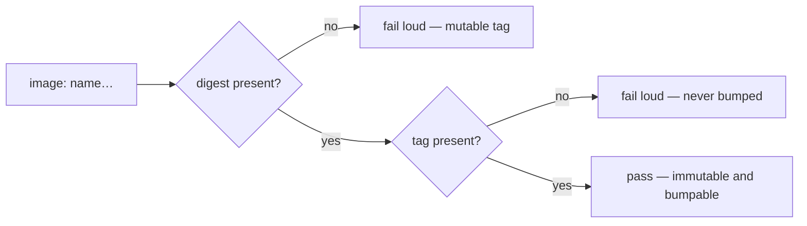

# Pin the Semgrep container by tag and digest (Issue #212)

## Summary

`.github/workflows/semgrep.yml` pinned the scanner container by bare digest —
`semgrep/semgrep@sha256:a9ea…` — with no tag. The digest makes the image
immutable, but every dependency updater resolves a bump from the *tag* and
rewrites the digest beside it, so a tagless pin has nothing to resolve from and
silently freezes at whatever the tag meant on the day it was written.

Re-pinned as
`semgrep/semgrep:1.86.0@sha256:a9ea2d5621c29d815d90c2a3b2f9571da8972ef4ff855c9e4902681730240e35`.
Docker Hub confirms that digest **is** the `1.86.0` multi-arch manifest
(`https://hub.docker.com/v2/repositories/semgrep/semgrep/tags/1.86.0/` returns
the same `sha256:a9ea…`), and Docker resolves `name:tag@digest` by digest and
ignores the tag — so the bytes that run are unchanged, and the tag is now
something an updater or a human can bump from.

To stop the class of fault returning, added
`scripts/check-workflow-container-pins.sh`: it fails any `image:` value in
`.github/workflows` that is missing either half of the pin (bare digest, bare
tag, malformed digest, or a tag supplied by a run-time expression), with an
in-source `# best-practice-ignore: BP-CONTAINER-PIN-<image>` escape for a
deliberate exception. The gate runs from `./quality.sh` and from the CI
**Project Validation** job, mirroring the existing install-pin gate
(Issue #169). Documented in README.md alongside it.

Closes #212.

## Evidence

Backend/CI-only change — no web interface to screenshot. The evidence is the
gate itself, run against the workflow before and after the fix.

Against the **unfixed** workflow, `./scripts/test-check-workflow-container-pins.sh`
went red on exactly the reported finding:

```text
FAIL repository workflows → pass (expected exit 0, got 1)
FAIL semgrep.yml:53: 'semgrep/semgrep@sha256:a9ea…' pins a bare digest with no
     tag — write 'semgrep/semgrep:<tag>@sha256:a9ea…' so dependency updaters
     can bump it
FAIL: 2 assertion(s) failed
```

After the re-pin, the same command passes:

```text
OK   repository workflows → pass (exit 0)
OK   semgrep container carries tag and digest
check-workflow-container-pins.sh: all assertions passed
check-workflow-container-pins: every workflow container image is pinned by tag and digest
```

What the gate enforces:



Quality gate: `./quality.sh < /dev/null` passes every stage **except** the
codespell preflight, which fails only because codespell is not installed in
this container and cannot be installed — `pip`, `pipx`, `python3 -m pip`,
`python3 -m ensurepip` are all absent and `apt-get` needs a password. Every
stage after that point was run individually in the foreground and passed:
`cargo deny check` (advisories/bans/licenses/sources ok),
`cargo fmt --all -- --check`, `cargo clippy --workspace --all-targets
--all-features -D warnings`, `cargo test --workspace --all-features`, and
`RUSTDOCFLAGS="-D warnings" cargo doc --workspace --no-deps`. `actionlint` and
`markdownlint-cli2` are clean on the changed files. The CI codespell job covers
the stage that could not run here.

## Test Plan

- Added `scripts/test-check-workflow-container-pins.sh` — drives the real gate
  against throwaway workflow fixtures and asserts exit codes and messages:
  - bare digest with no tag → exit 1 (the regression this issue reports)
  - bare tag with no digest → exit 1
  - `name:tag@sha256:<64 hex>` → exit 0
  - malformed digest, run-time expression tag, unpinned `services:` image → exit 1
  - registry port (`registry:5000/team/image@digest`) is not mistaken for a tag
  - quoted value with a trailing comment, and a commented-out `image:` line
  - `best-practice-ignore: BP-CONTAINER-PIN-…` suppression → exit 0
  - failure output names `file:line` and the exact remedy
  - the repository's own workflows pass, and `--verbose` reports the semgrep
    image as `name:tag@digest`
  - usage errors (`--dir` missing, unknown option, missing directory) → exit 2
- Wired both the gate and its test into `quality.sh` and
  `.github/workflows/ci.yml` (**Project Validation**).
