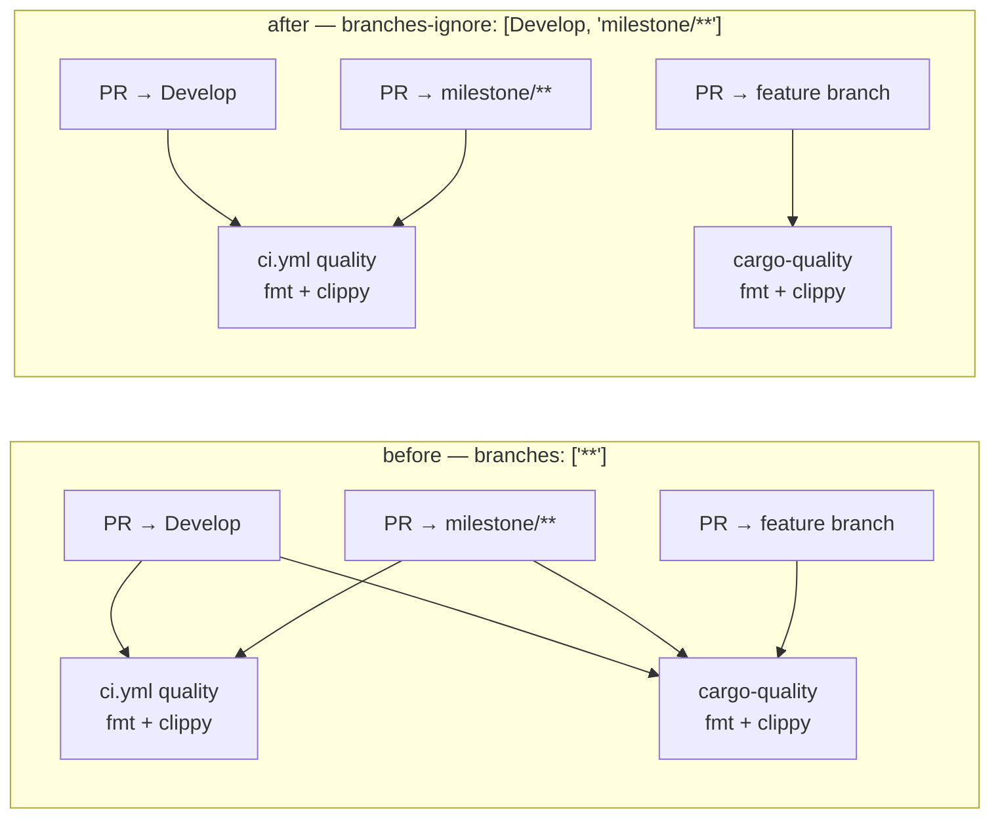

# Stop cargo-quality re-running ci.yml's fmt + clippy gate (Issue #213)

## Summary

`.github/workflows/cargo-quality.yml` exists to cover the feature-branch PRs
`ci.yml` skips, but its `branches: ["**"]` filter is a genuine wildcard: it also
matched `Develop` and `milestone/**`, the branches `ci.yml`'s `quality` job
already gates. Every PR into those branches — the majority in this repo — ran
the same `cargo fmt --all -- --check` and a near-identical clippy lint twice for
zero extra coverage.

The trigger is now `branches-ignore: [Develop, "milestone/**"]`, so `ci.yml`
stays the authoritative gate on that path (it feeds the `ci-required`
aggregator) and `cargo-quality.yml` covers only what `ci.yml` does not.

To stop the overlap returning, `scripts/check-cargo-quality-overlap.sh` reads
both workflows' own `pull_request` filters and fails when they intersect — and
equally when the exclusion is widened until no feature branch is covered at all,
since deleting the coverage is not a fix. It runs from `./quality.sh` and the CI
**Project Validation** job. Closes #213.

## Evidence

Backend/CI-only change — no web interface to screenshot. Coverage before and
after:



The new gate reproduced the defect before the fix and passes after it:

```text
# before the workflow edit
$ ./scripts/test-check-cargo-quality-overlap.sh
...
FAIL repository workflows → pass (expected exit 0, got 1)
FAIL: 1 assertion(s) failed

# after
$ ./scripts/check-cargo-quality-overlap.sh --verbose
OK   cargo-quality.yml: 'Develop' excluded — gated once, by ci.yml
OK   cargo-quality.yml: 'milestone/**' excluded — gated once, by ci.yml
OK   cargo-quality.yml: covers feature branch 'issue-213-fmt-gate'
OK   cargo-quality.yml: covers feature branch 'feature/stacked/pr'
check-cargo-quality-overlap: cargo-quality.yml covers only the branches ci.yml does not gate
```

`./quality.sh` passes end to end (`All quality checks passed!`), and
`actionlint` accepts both edited workflows. `codespell` is not installed in the
container image and `pip` is unavailable, so the spell-check stage was run
against an unpacked upstream `codespell` 2.4.3 wheel — `codespell: no typos
found`.

## Test Plan

- Added `scripts/check-cargo-quality-overlap.sh` — the gate itself.
- Added `scripts/test-check-cargo-quality-overlap.sh`, which runs the real gate
  against throwaway workflow fixtures and asserts exit codes and messages:
  - `branches: ["**"]` re-matching gated branches → exit 1 (the Issue #213
    regression, and the assertion that was red before the workflow edit);
  - `branches-ignore: [Develop, "milestone/**"]` → exit 0, in both inline and
    block-sequence form;
  - excluding only `Develop` → exit 1, naming the missing `milestone/**`;
  - `branches: ["*"]` → exit 1 (`*` misses `milestone/x` but still hits
    `Develop`);
  - no branch filter, and no `pull_request` trigger at all → exit 1;
  - `branches-ignore: ["**"]` → exit 1, reported as lost feature-branch
    coverage, not as a pass;
  - a `ci.yml` with no PR branch filter → exit 1 (fails loud rather than
    guessing);
  - a `push:` branch filter is not mistaken for the `pull_request` one;
  - the repository's own workflows → exit 0;
  - usage errors (missing file, unknown option, valueless `--ci`/`--quality`)
    → exit 2, `--help` → exit 0.
- Wired both scripts into `./quality.sh` and the CI **Project Validation** job,
  matching the existing `check-workflow-*` gate pattern.
