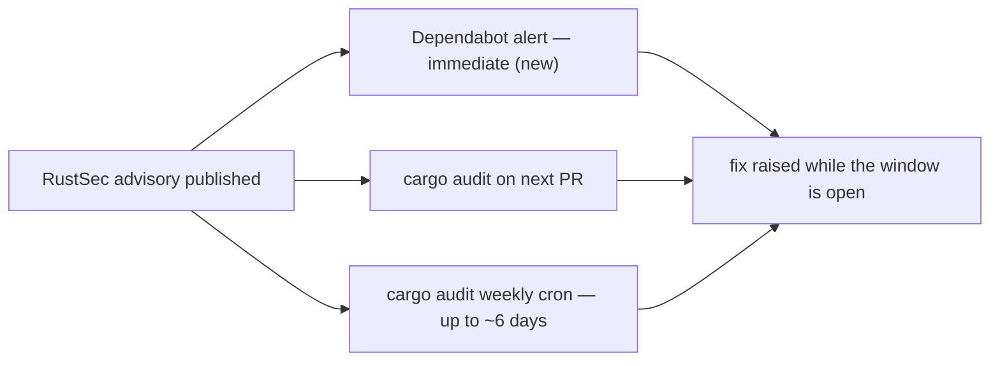

# PR Summary — Issue #215

## Summary

Every supply-chain gate in this repository was *pull*-based: `cargo audit` on
each pull request and on a weekly Monday cron
(`.github/workflows/cargo-audit.yml`), `rustsec/audit-check` on pull requests
inside `.github/workflows/security.yml`, and `dependency-review` against the PR
manifest. None of them hears about an advisory published against a dependency
**already** pinned in `Cargo.lock` — the lockfile does not change, only the
RustSec database does — so detection waited for the next PR or the next cron,
up to ~6 days.

This change adds `.github/dependabot.yml` registering the `cargo` ecosystem on a
weekly schedule, which activates GitHub's native Dependabot advisory feed and
closes that window. The entry carries a `cooldown` of `default-days: 7` so a
newly published version is quarantined for a week before a routine bump is
proposed; cooldown applies to *version* updates only, so security updates are
still raised immediately. It is additive: it complements the existing workflows
and replaces none of them. A new gate, `scripts/check-dependabot-config.sh`, keeps
the registration from being deleted or quietly reduced to a stub GitHub would
reject, and runs from `./quality.sh` and the CI **Project Validation** job.

Closes #215.

## Evidence

This is a CI-configuration and shell-gate change with no web interface, so
there is no screenshot to capture. The evidence is the gate's own behaviour
against throwaway fixtures, plus a real YAML parse of the new config.

The new gate, run against the repository's own config:

```text
$ ./scripts/check-dependabot-config.sh --verbose
OK   dependabot.yml: declares version: 2
OK   dependabot.yml: registers the 'cargo' ecosystem (update entry 1)
OK   dependabot.yml: 'cargo' entry scans '/'
OK   dependabot.yml: 'cargo' entry runs on a 'weekly' schedule
check-dependabot-config: dependabot.yml registers a usable 'cargo' advisory channel
```

The config parsed by a real YAML reader (`@std/yaml`), confirming the gate's own
parser reads the same structure GitHub will:

```json
{
  "version": 2,
  "updates": [
    {
      "package-ecosystem": "cargo",
      "directory": "/",
      "schedule": { "interval": "weekly", "day": "monday", "time": "06:00", "timezone": "Etc/UTC" },
      "open-pull-requests-limit": 5,
      "cooldown": { "default-days": 7 }
    }
  ]
}
```

Detection paths before and after — the alert arm is what this PR adds:



`actionlint .github/workflows/ci.yml` exits 0 with the two new validation steps,
`shellcheck -x -s bash` is clean on both new scripts, and
`markdownlint-cli2` reports 0 issues across the repository's Markdown.

<!-- vibe-quality-gate-skipped reason="environment: codespell and the neat-core sibling clone are absent in this container" -->

**Quality gate — partially blocked by the container, not by this change.**
`./quality.sh` ran in the foreground and passed every stage up to the codespell
preflight, including the two new steps. It then stopped with
`spell-check: codespell is not installed.` — `codespell`, `pip` and
`python3 -m pip` are all absent from this container. The Rust stages cannot run
here either: `../NEAT-AI-core` is an empty placeholder, so `cargo deny` and
`cargo fmt` both fail with
`failed to read .../NEAT-AI-core/neat-core/Cargo.toml (No such file or directory)`.
No Rust source is touched by this PR (the diff is CI config, two shell scripts
and docs), and CI runs all of these stages on the PR.

## Test Plan

- Added `scripts/test-check-dependabot-config.sh` — 23 assertions running the
  real gate against throwaway config fixtures:
  - **pass**: minimal cargo entry; unquoted scalars; cargo listed after another
    ecosystem; `directories` (plural); the repository's own config.
  - **fail (exit 1)**: absent config; `version: 1`; no `version` key; no
    `updates` list; no cargo entry; a cargo entry with no `schedule`, an
    unsupported `schedule.interval`, or no `directory`; a commented-out cargo
    entry.
  - **message content**: the absent-config failure names the expected path and
    the missing advisory feed; the missing-entry failure names
    `package-ecosystem`; the bad-interval failure names the accepted values.
  - **usage (exit 2)**: unknown option, `--config` with no value; `--help`
    exits 0.
- Wired both the WHAT test and the gate into `quality.sh` and the CI
  **Project Validation** job, matching the existing `check-*` / `test-check-*`
  pattern.
