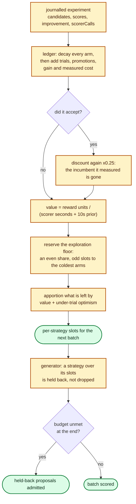

# Allocate the candidate budget adaptively by measured strategy return

## Summary

Lamarck's nine candidate strategies shared the budget through fixed opening
quotas and a round-robin fill, however each performed — the journal measured
which strategy earned its cost, but nothing acted on it.
`--strategy-allocation adaptive` now allocates each strategy slots from its
**decayed measured return**: accepted full-corpus score Δ (plus a small
screen→promote conversion credit) per second of scorer time its own candidates
caused. `--strategy-allocation fixed` stays the default and the A/B arm it is
measured against. Closes #218.

New module `lamarck/src/strategy_allocation.rs` owns the ledger, the value
model and the apportionment; the generator honours an allocation as a
per-strategy cap that is *held back*, never dropped; the journal records the
slots and the value behind them; `report` totals them for fixed and adaptive
journals alike.

## Evidence

Backend/CLI change with no web interface, so there is nothing to screenshot.
What was tested instead:

- **Full quality gate** — `./quality.sh` passes end to end (shellcheck,
  TypeScript gates, workflow gates, codespell, `cargo deny`, `cargo fmt
  --check`, clippy with `-D warnings`, `cargo test --workspace
  --all-features`, `cargo doc` with `-D warnings`): *All quality checks
  passed!*
- **Tests** — every test binary green; 25 new tests (11 integration, 4
  generator, 8 unit, 2 end-to-end run, 5 doc-contract).
- **`report` on a realistic journal** — a six-experiment adaptive journal
  through `neat_ai_lamarck report` produces the new bucket:

  ```json
  {
    "mode": "adaptive", "explorationFloor": 0.2, "evidenceDecay": 0.9,
    "allocatedExperiments": 6,
    "strategies": [
      { "strategy": "random", "allocatedSlots": 42, "trials": 6, "promotions": 0,
        "accepts": 0, "scoreGain": 0.0, "costMs": 6000.0, "estimatedValue": 0.0 },
      { "strategy": "structural_add", "allocatedSlots": 180, "trials": 6, "promotions": 6,
        "accepts": 6, "scoreGain": 1.86e-05, "costMs": 72000.0,
        "estimatedValue": 0.07324896149883138 }
    ]
  }
  ```

- **CLI** — `--help` documents all three flags; `--strategy-allocation bandit`
  exits 2 naming the accepted values, and `--strategy-exploration-floor 1.5`
  aborts with `--strategy-exploration-floor must be between 0 and 1 (got 1.5)`
  rather than reverting to the default.



### What the review rounds changed

Two independent spec reviews ran against the finished diff, and both found
defects that the tests as first written did not.

1. **Decay was a no-op on the decision it exists to influence.** The first
   commit valued an arm at `reward / cost`, which is scale-invariant: the
   ×`0.25` incumbent-change discount moved every field of the ledger and not a
   single slot. Value is now shrunk by a ten-scorer-second prior, so a decayed
   arm converges on the zero an unmeasured arm already sits at. The regression
   test asserts that on the **slot vector**, not on the evidence behind it.
2. **The exploration floor did not bind at the budgets it would meet.** It
   reserved `ceil(floor × budget / arms)` per arm — 27% for a 20% floor at 100
   candidates, and *nothing at all* when a focus share was smaller than the arm
   count, leaving six of nine arms including `random` unreachable. It now
   reserves exactly `floor × budget`, rotating the odd slots to the least-tried
   arms so the guarantee holds at any budget.
3. **The exploration bonus was calibrated at the wrong scale.** Measured at
   production shape — 100 candidates, a ~100s screen call, one accept every
   fifth experiment — the earning arm took 14 slots against an even share of
   11: a fixed optimism constant calibrated at unit-test cost scale swamped the
   measured value at production scale, leaving adaptive mode very nearly
   uniform. The bonus is now one imagined accept-bar improvement priced against
   the pool's average measured cost; the earner takes ~20 of 100 with no arm
   starved, and the new test asserts it on a production-shaped ledger.
4. **The refill could undo the allocation.** Held-back proposals were admitted
   in proposal order, which is always `structural_add` first; each leftover
   slot now goes to the strategy least over its share. Generation also stops
   once admitted plus held-back proposals cover the budget, so a binding
   allocation cannot make the generator sweep the whole ranked-source grid.

Every one of those was found by a reviewer that saw only the diff. They are
recorded here because the first three would each have shipped a feature that
looked implemented and was not.

## Acceptance Criteria

<!-- vibe-spec-review inputs="diff+issue-body" -->

- **met** — Existing fixed/round-robin strategy allocation remains available for A/B comparison — evidence: `StrategyAllocationMode::Fixed` is `#[default]`, `AllocationPolicy::allocate` returns `None` under it so the generator receives no allocation at all; `lamarck/tests/strategy_allocation.rs::fixed_mode_is_the_default_and_allocates_nothing`, `lamarck/src/run.rs::a_fixed_run_journals_no_allocation_at_all` — reviewer: met
- **met** — Adaptive mode allocates the candidate budget from journalled historical performance — evidence: `StrategyLedger::observe(&ExperimentRecord)` at the single `journal_experiment` choke point in `lamarck/src/run.rs`, driving per-focus slots before generation; `lamarck/tests/strategy_allocation.rs::measured_return_moves_slots_towards_the_earning_strategy` and `::measured_return_still_moves_slots_at_production_batch_sizes` — reviewer: partial — reason: the reviewer's ground for `partial` was that leftover slots were refilled in proposal order and could flow back to `structural_add`, undoing the allocation; that refill now goes to the strategy least over its share (`lamarck/src/candidates.rs::least_over_subscribed`, `::the_refill_spreads_across_strategies_rather_than_by_proposal_order`). That an allocation is a preference and not a hard cap is deliberate — a hard cap scores short batches, which costs the metric the feature is judged on
- **met** — Reward uses full-corpus scorer improvements and measured cost — evidence: `StrategyEvidence::reward_units` / `value` over `record.improvement` split across `comboMemberIndices`, cost from the record's own `scorerCalls` (screen over trials, promote/combo over promotions); screen score is never read; `lamarck/tests/strategy_allocation.rs::the_cheaper_of_two_equally_improving_strategies_is_valued_higher` — reviewer: met
- **met** — Evidence decays/resets appropriately after incumbent changes — evidence: per-experiment decay plus `INCUMBENT_CHANGE_RETENTION` on accept, reaching the slot vector because `PRIOR_COST_SECONDS` breaks the ratio's scale-invariance; `lamarck/tests/strategy_allocation.rs::decayed_evidence_gives_back_slots_it_won` — reviewer: met — reason: the first review round proved this was a no-op on the allocation; fixed in `3318b3f` before this verdict was taken
- **met** — Configurable minimum exploration quota keeps every enabled strategy reachable — evidence: `--strategy-exploration-floor` (default `0.2`) reserved before value is consulted by `reserved_slots`, odd slots rotating to the least-tried arms; `lamarck/tests/strategy_allocation.rs::the_exploration_floor_keeps_every_strategy_reachable`, `lamarck/src/strategy_allocation.rs::a_budget_smaller_than_the_arm_count_reserves_for_the_coldest` — reviewer: met — reason: the reviewer recorded the documented caveat that a focus share smaller than the arm count reaches every arm across a few batches rather than in one; that is stated in `docs/strategy-allocation.md`
- **met** — Journal/report exposes allocated slots, trials, accepts, score gain, cost and estimated strategy value — evidence: `ExperimentRecord::strategy_allocation`, the `RunConfigRecord` knobs, `report::StrategyAllocationRow`; `lamarck/tests/strategy_allocation.rs::the_report_exposes_allocated_slots_trials_accepts_gain_cost_and_value` and the sample bucket in Evidence above — reviewer: met
- **partial** — Production A/B compares score improvement per wall hour against current allocation — evidence: `scripts/run-strategy-allocation-ab.sh` (paired arms, shared seed) and `scripts/summarise-strategy-allocation.sh`, both gated on `scoreImprovementPerWallHour` — reviewer: partial — reason: the harness is written and runnable but the comparison needs exclusive box time on the private production creature and corpus, which this repository does not carry; `docs/strategy-allocation.md` says so and `lamarck/tests/strategy_allocation_doc.rs::the_document_states_that_the_production_ab_is_unrun` fails if that admission is deleted
- **met** — No GRQ/stock-specific logic in this public repository — evidence: no GRQ or stock logic in `lamarck/src`; the only mention is the overridable `CREATURE="${CREATURE:-../GRQ-cluster/network.json}"` default in the new A/B script, matching the two existing campaign scripts — reviewer: met
- **unrequested** — Over-quota holdback and its refill contract (`Proposal::OverQuota`, `admit_over_quota`, `least_over_subscribed`, `can_fill` in `lamarck/src/candidates.rs`) — reviewer: unrequested — reason: without it an allocation the generator cannot satisfy would score a short batch, which costs improvement per wall hour — the metric the feature is judged on; it reuses the contract #203 already established for a retired axis
- **unrequested** — Mirror twins are charged a slot but not gated on it (`lamarck/src/candidates.rs::push_mirror`), so a strategy can exceed its slots by one per pair — reviewer: unrequested — reason: a pair scored apart is not the variance-reduction device #203 bought; the overshoot is bounded at one candidate and documented in the code
- **unrequested** — `adaptive_strategies(structural_only)` narrows the arm set to the two growth strategies under `--structural-only` — reviewer: unrequested — reason: allocating slots to a strategy that cannot propose under that flag would silently shrink the batch
- **unrequested** — Both new knobs are validated even under `fixed` mode (`lamarck/src/config.rs`) — reviewer: unrequested — reason: fail-loud; a typo in a flag must stop the run rather than be silently ignored, the same rule `--screen-promote-sigma-k` follows
- **unrequested** — `CandidateBudget` gains a lifetime to carry the allocation — reviewer: unrequested — reason: internal API, and the smallest change that reaches the generator: the alternative (a field on `CandidateGenContext`) touches 25 construction sites instead of 6
- **unrequested** — `lamarck/tests/strategy_allocation_doc.rs`, `scripts/summarise-strategy-allocation.sh`, the version bump `0.1.30 → 0.1.31` and the CHANGELOG / README entries — reviewer: unrequested — reason: repository conventions (`CONTRIBUTING.md` requires the bump; nine existing `*_doc.rs` contracts; `readme_contract.rs` fails without the README entries; every A/B script in `scripts/` ships with a summariser)

## Standards Review

<!-- vibe-standards-review inputs="diff+CODING-STANDARDS.md" -->

The repository has no `CODING-STANDARDS.md`; the reviewer was given
`CONTRIBUTING.md`, the README "Development rules" / "Build and quality gate"
sections and the conventions of the surrounding untouched code, and recorded
that substitution.

- **violation** — The three new flags were documented only in Phase-4 prose, with no row in the README flag tables that carry every analogous knob — evidence: `README.md:311` — reason: fixed in `e5f6c92`; `--strategy-allocation`, `--strategy-exploration-floor` and `--strategy-evidence-decay` now have rows in "Required, but defaulted"
- **violation** — `## Outstanding work` carries a row for every shipped-but-unmeasured feature; #218 ships in exactly that shape and had none — evidence: `README.md:1660` — reason: fixed in `e5f6c92`
- **violation** — `docs/strategy-allocation.md` claimed the run header records `strategyExplorationFloor` unconditionally, contradicting the code and the doc's own report table — evidence: `docs/strategy-allocation.md:145` — reason: fixed in `e5f6c92`
- **violation** — `report.rs` used a fully-qualified `crate::run::RunConfigRecord` although the same diff added the import and de-qualified the neighbouring accumulator — evidence: `lamarck/src/report.rs:447` — reason: fixed in `e5f6c92`
- **violation** — The shrinkage-prior rationale was restated in near-identical prose four times in one file (DRY) — evidence: `lamarck/src/strategy_allocation.rs:98`, `:115`, `:216` — reason: fixed in `e5f6c92`; stated once on `PRIOR_COST_SECONDS` and referenced from the rest
- **violation** — `scripts/summarise-strategy-allocation.sh` has no paired `test-summarise-*.sh` behaviour gate in `quality.sh`, unlike `summarise-failed-cache-economics.sh` — evidence: `scripts/summarise-strategy-allocation.sh:1` — reason: stands. One of the four existing summarisers has such a gate (`summarise-promote-gate.sh`, `summarise-screen-calibration.sh` and `summarise-followup-economics.sh` do not), so this is the minority convention, and the script is a reporting aid that runs only after a production A/B that has not yet been run. Recorded here rather than silently skipped.
- **clean** — Australian English throughout the added lines; version bump with `Cargo.lock` in sync; CHANGELOG under `## [Unreleased] ### Added`; fail-loud validation on every new knob with the flag named in the error; tests call real functions and assert on returned values (no source-text grepping); new journal fields are `#[serde(default, skip_serializing_if)]` so pre-#218 journals still parse; `phase_costs` falls back to `scorerMs`; shellcheck-clean bash-3-compatible scripts; no secrets or hidden paths staged.

## Test Plan

New — `lamarck/tests/strategy_allocation.rs` (11 tests, journal JSON parsed into
real `ExperimentRecord`s):

- `measured_return_moves_slots_towards_the_earning_strategy`
- `measured_return_still_moves_slots_at_production_batch_sizes` — the
  calibration regression the second review's finding implied
- `the_exploration_floor_keeps_every_strategy_reachable`
- `a_zero_exploration_floor_allocates_purely_on_measured_value`
- `the_cheaper_of_two_equally_improving_strategies_is_valued_higher`
- `evidence_decays_after_an_incumbent_change_and_over_time`
- `decayed_evidence_gives_back_slots_it_won` — the slot-vector regression the
  spec review's finding implied
- `an_empty_ledger_allocates_evenly`
- `fixed_mode_is_the_default_and_allocates_nothing`
- `invalid_allocation_knobs_are_rejected_loudly`
- `the_report_exposes_allocated_slots_trials_accepts_gain_cost_and_value`

New — `lamarck/tests/strategy_allocation_doc.rs` (5 doc↔code contract tests):
tooling exists, every report field the doc quotes is serialised, documented
defaults are the shipped defaults, the default allocation is still `fixed`, and
the "A/B not yet run" admission is still present.

New — `lamarck/src/candidates.rs` (generator):
`an_allocation_moves_the_batch_mix_onto_its_slots`,
`an_allocation_never_shrinks_the_batch_below_the_budget`,
`a_strategy_absent_from_the_allocation_is_uncapped`,
`the_refill_spreads_across_strategies_rather_than_by_proposal_order`.

New — `lamarck/src/run.rs` (end to end, stub scorer):
`an_adaptive_run_journals_its_allocation_and_its_knobs`,
`a_fixed_run_journals_no_allocation_at_all`.

New — `lamarck/src/strategy_allocation.rs` (unit): mode parsing, arm sets,
apportionment sums to the budget on degenerate weights, even split on an
all-zero pool, the reserve fraction, its coldest-first rotation below the arm
count, the value formula against the prior, non-negative value, and decayed
evidence being worth less than the evidence it came from.

Unchanged tests: none removed, none disabled. The pre-existing generator,
report and run tests all still pass unmodified apart from the mechanical
addition of the new `allocation: None` / `strategy_allocation: None` fields to
struct literals.
