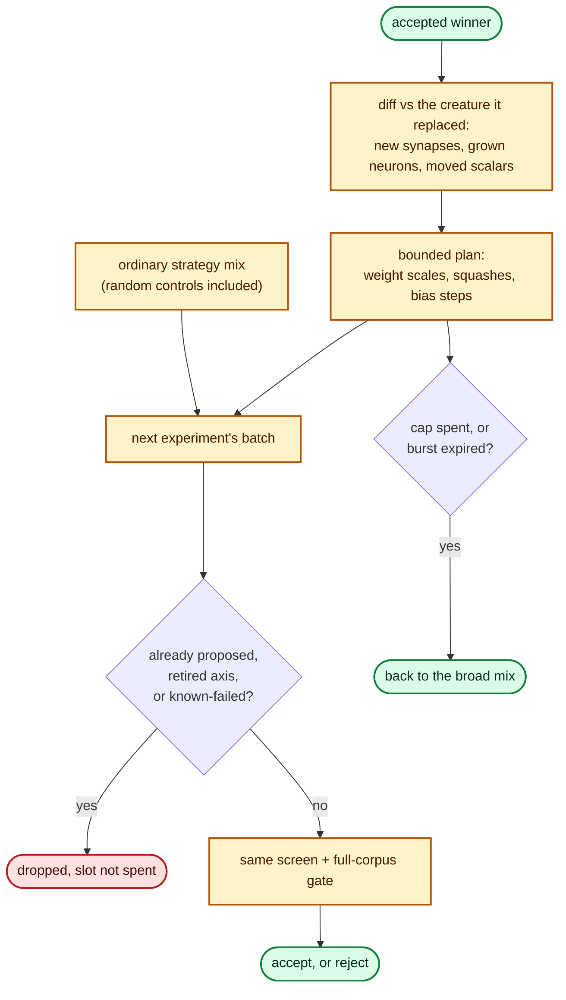

# Exploit accepted mutations with bounded local follow-up searches (Issue #219)

## Summary

An accepted candidate is stronger evidence than a merely useful focus: the
authoritative scorer has just confirmed real gradient or structure at one place
in the creature. Until now the run returned straight to the broad strategy mix
and could only reach that neighbourhood again by chance.

`lamarck/src/followup.rs` turns a win into a **bounded plan** of neighbouring
hypotheses — nearby weight scales around the winning move, alternate squashes
for a neuron it grew, a partial back-off of the winning step — which the next
experiment **adds** to its ordinary batch. Probes are ordinary batch members:
same screen, same full-corpus gate, and no path to an acceptance any other
candidate does not take. Off by default (`--followup-candidates 0`), which is
the arm an on-run is measured against.

Closes #219.

## Evidence

Backend/CLI change — no web interface to screenshot. Evidence is the test suite
plus the `report` subcommand's own output.



`neat_ai_lamarck report` on a two-experiment journal whose second experiment
carried a two-probe burst (one probe won, one ordinary candidate won earlier):

```json
"followUp": {
  "bursts": 1,
  "burstExperiments": 1,
  "followupCandidates": 2,
  "ordinaryCandidates": 4,
  "followupAccepts": 1,
  "ordinaryAccepts": 1,
  "mixedAccepts": 0,
  "unattributedAccepts": 0,
  "followupImprovement": 3e-06,
  "ordinaryImprovement": 4e-06,
  "followupMs": 200.0,
  "ordinaryMs": 600.0,
  "followupGainPerWallHour": 0.054,
  "ordinaryGainPerWallHour": 0.024
}
```

Full workspace suite: 28 test targets, all green
(`cargo test --workspace --all-features -- --test-threads=2`). `cargo fmt`,
`cargo clippy --workspace --all-targets --all-features -- -D warnings`,
`cargo deny check` and `RUSTDOCFLAGS="-D warnings" cargo doc` all pass.

<!-- vibe-quality-gate-skipped reason="codespell unavailable in this container (no pip/pipx to install it); every other ./quality.sh stage was run individually and passed" -->

`./quality.sh` stops at its `scripts/spell-check.sh` stage because `codespell`
is not installed in this container and cannot be installed (no `pip`, `pipx` or
`brew`). Every other stage of the gate was run individually and passed: bash
syntax, shellcheck, the TypeScript gates, all `scripts/test-*.sh` WHAT suites,
`cargo deny check`, `cargo fmt --all -- --check`, the clippy line the gate uses,
`cargo test --workspace --all-features`, and the `-D warnings` doc build. CI
runs codespell on the PR. Added prose was checked by hand for American spelling
and carries none (`neighbourhood`, `behaviour`, `apportioned`).

## Acceptance Criteria

<!-- vibe-spec-review inputs="diff+issue-body" -->

- **met** — Accepted candidates can emit a bounded local follow-up search plan — evidence: `lamarck/src/followup.rs::FollowUpPlan::from_accept`, tests `followup::tests::the_candidate_cap_bounds_the_whole_burst` and `followup::tests::the_experiment_cap_expires_the_burst` — reviewer: met
- **met** — Follow-up provenance links back to the parent winner — evidence: `lamarck/src/followup.rs::FollowUpLink`, test `run::tests::an_accept_emits_follow_up_probes_that_face_the_normal_gate` — reviewer: met
- **met** — Journal/report separates ordinary and follow-up trials and their returns — evidence: `lamarck/src/report.rs::FollowUpStats`, tests `report::tests::report_separates_follow_up_trials_from_ordinary_ones` and `report::tests::a_burst_spanning_two_experiments_counts_once` — reviewer: partial — reason: the reviewer found the burst count journalled before the failed-cache filter (so a cache-skipped probe was counted as a candidate absent from `candidates[]`) and the summary line hidden when every probe deduplicated away; both were fixed in `efdc285` and the count is now taken from the batch that was actually scored
- **met** — No follow-up can bypass full-corpus scorer acceptance — evidence: probes are appended to `candidates` before `write_candidate_batch`; test `run::tests::an_accept_emits_follow_up_probes_that_face_the_normal_gate` asserts every probe stem appears in the experiment's full-corpus `scores` — reviewer: met
- **partial** — A/B measure incremental score gain per wall hour and whether follow-up improves on simply starting the next ordinary experiment — evidence: `lamarck/src/report.rs::FollowUpStats::followup_gain_per_wall_hour` vs `ordinary_gain_per_wall_hour`, test `report::tests::report_separates_follow_up_trials_from_ordinary_ones` — reviewer: partial — reason: the per-arm rates are measured from one journal, but the whole-run counterfactual ("versus simply starting the next ordinary experiment") is the on/off `--followup-candidates` pair compared on the existing `scoreImprovementPerWallHour`, which needs two runs on the production creature and an idle box — the same standing gap as every other arm in `docs/followup-economics.md`. The doc comment and README now say so instead of implying the single-journal pair answers it
- **met** — Generic implementation only; no private GRQ feature logic — evidence: `lamarck/src/followup.rs` derives probes from `CreatureExport` diffs and the generic `NEURON_GROWTH_SQUASHES` list — reviewer: met
- **unrequested** — `--followup-experiments`, a second flag the issue does not name — evidence: `lamarck/src/main.rs:141` — reviewer: unrequested — reason: the issue's "hard cap on follow-up candidates/**time** per win" needs a time bound, and an experiment is this run's unit of wall clock; a candidate cap alone bounds proposals but not how long a burst lingers
- **unrequested** — `mixedAccepts` / `unattributedAccepts` buckets — evidence: `lamarck/src/report.rs:614` — reviewer: unrequested — reason: crediting a combo that merged a probe with an ordinary candidate to either arm would over-claim the A/B the issue asks for; these two buckets are how the improvement is withheld instead
- **unrequested** — `candidate_fingerprint` lifted from `Batch::fingerprint` to a public free function — evidence: `lamarck/src/candidates.rs:185` — reviewer: unrequested — reason: the "deduplicate against already-tested hypotheses" guardrail needs the batch's own dedup key from outside the generator; duplicating the hash would have been the alternative
- **unrequested** — `RunConfigRecord.followup_experiments` recorded as `0` on the off arm — evidence: `lamarck/src/run.rs:527` — reviewer: unrequested — reason: matches the existing `screenPromoteSigmaK` precedent — a journal must not imply a knob the run could not have used; covered by `run::tests::run_header_records_the_follow_up_arm`

## Standards Review

<!-- vibe-standards-review inputs="diff+CODING-STANDARDS.md" -->

- **violation** — CONTRIBUTING "Version bumping": every binary-affecting change bumps the patch version — evidence: `lamarck/Cargo.toml:3` — reason: fixed here, bumped to `0.1.31` with `Cargo.lock` in sync
- **violation** — Fail fast before expensive work: `followup_budget()?` ran after the Phase-0 scorer call — evidence: `lamarck/src/run.rs:1205` (pre-fix) — reason: fixed here, hoisted beside `focus_count()?` / `promote_gate()?` so a bad arm aborts before a full-corpus score is spent
- **violation** — Documented invariant bypassed: probes never consulted `dead_axes`, so a burst could re-open an axis issue #203 had retired — evidence: `lamarck/src/run.rs:1786` (pre-fix) — reason: fixed here; `FollowUpPlan::emit` now takes the retired axes and skips them, covered by `followup::tests::a_probe_on_a_retired_axis_is_not_proposed`
- **violation** — Docs match code: the journal-header `config` field list omitted the two new serialised knobs — evidence: `README.md:1296` — reason: fixed here, both listed with the off-arm behaviour
- **violation** — Docs match code: the mirrored-sampling section claimed the signed-perturbation family is exhaustive, but probes move one scalar and are not mirrored — evidence: `README.md:865` — reason: fixed here, recorded as an explicit exemption with its rationale
- **violation** — DRY: `incumbent_uuids` rebuilt twice per experiment — evidence: `lamarck/src/run.rs:1793` with `lamarck/src/followup.rs:258` (pre-fix) — reason: fixed here; built once and passed in via `BatchContext`. The reviewer's larger suggestion — returning `Batch`'s own `seen` set from `CandidateBatch` — was not taken: batches are merged across focuses, so the merge would have to union the sets, and that refactor touches the generator's hot path for a saving small beside one scorer call
- **violation** — Test coverage: the `RunConfigRecord` follow-up fields, the `unattributed_accepts` branch, and the `alternate_squashes` `current: None` branch were unasserted — evidence: `lamarck/src/run.rs:527`, `lamarck/src/report.rs:614`, `lamarck/src/followup.rs:384` — reason: fixed here — `run_header_records_the_follow_up_arm`, `an_unresolvable_winner_is_counted_as_unattributed`, `a_neuron_without_a_squash_is_offered_every_alternative`
- **violation** — CONTRIBUTING "Changelog": no `[Unreleased]` entry — evidence: `CHANGELOG.md:26` — reason: fixed here
- **violation** — Naming: "follow-up" already names the unrelated #75 economics campaign — evidence: `lamarck/src/followup.rs:1`, `docs/followup-economics.md` — reason: **stands**. The issue's own vocabulary is "local follow-up searches", and renaming the flags would diverge from it; instead the README section and the module doc both open with an explicit disambiguation pointing at the #75 campaign
- **clean** — Australian English throughout the added prose and doc comments (`neighbourhood`, `behaviour`, `apportioned`); the `color:` tokens are Mermaid `classDef` syntax
- **clean** — Errors surface with context: `followup_budget` returns `Err(String)` naming the flag and value, propagated to a non-zero exit; no catch-and-ignore
- **clean** — No silent fallback: `probe_candidate` returns `None` for a vanished uuid/edge, a non-finite step, a step past the hard bias/weight limit or a sub-plank-constant move, rather than clamping a probe into a different hypothesis
- **clean** — Tests call real functions on real data and assert on returned values; no source-text greps
- **clean** — Journal back-compatibility: every new field is `serde(default)` / `skip_serializing_if`, asserted by `report_reads_a_journal_without_follow_ups_as_the_off_arm`
- **clean** — Opt-in A/B discipline: `DEFAULT_FOLLOWUP_CANDIDATES = 0`, exercised end to end by `run::tests::follow_ups_are_off_by_default`
- **clean** — Exhaustive `CandidateStrategy` matches updated everywhere, so the new variant cannot fall through silently
- **clean** — No secrets, credentials or hidden files staged

## Test Plan

New tests, all calling real functions and asserting on results:

`lamarck/src/followup.rs`

- `a_new_synapse_is_probed_at_nearby_weights` — probes scale the winning weight.
- `a_grown_neuron_is_probed_with_alternate_squashes` — the winner's own squash is not re-proposed.
- `a_neuron_without_a_squash_is_offered_every_alternative` — the `current: None` branch.
- `a_moved_weight_is_probed_further_and_backed_off` — further along, and half-way back.
- `follow_up_provenance_links_back_to_the_parent_winner` — the link and strategy on every probe.
- `the_candidate_cap_bounds_the_whole_burst` / `the_experiment_cap_expires_the_burst` — both hard caps.
- `a_probe_the_batch_already_holds_is_deduplicated` — no scorer slot for a question already asked.
- `a_probe_on_a_retired_axis_is_not_proposed` — the #203 guard is respected.
- `a_zero_budget_plans_nothing` / `an_unchanged_winner_plans_nothing` — the off arm and the empty diff.
- `a_probe_whose_target_vanished_is_skipped` / `a_probe_past_the_weight_limit_is_dropped` — dropped, never faked or clamped.

`lamarck/src/run.rs`

- `an_accept_emits_follow_up_probes_that_face_the_normal_gate` — an accept plans a burst, the probes join the next batch, and **every probe stem appears in the full-corpus `scores` map**: the no-bypass criterion.
- `follow_ups_are_off_by_default` — no burst and no probe without the flag.
- `a_follow_up_winner_boosts_the_focus_it_inherited` — regression test for the focus-credit defect the spec review found; observed failing against the unfixed code (`assertion left == right failed: the focus that earned the win is boosted even though it was not drawn`) and passing after.
- `run_header_records_the_follow_up_arm` — encode, decode and legacy-parse of both header knobs.

`lamarck/src/config.rs`

- `the_follow_up_budget_is_off_by_default_and_rejects_a_zero_span` — happy path, off path, and the error path naming the flag.

`lamarck/src/report.rs`

- `report_separates_follow_up_trials_from_ordinary_ones` — per-arm candidates, accepts, apportioned time and both gain-per-wall-hour rates.
- `a_burst_spanning_two_experiments_counts_once` — one win is one burst.
- `a_mixed_winner_is_credited_to_neither_arm` — no over-claiming a shared win.
- `an_unresolvable_winner_is_counted_as_unattributed` — the pre-#74 journal path.
- `report_reads_a_journal_without_follow_ups_as_the_off_arm` — an arm that never ran reports `null`, not `0.0`.
