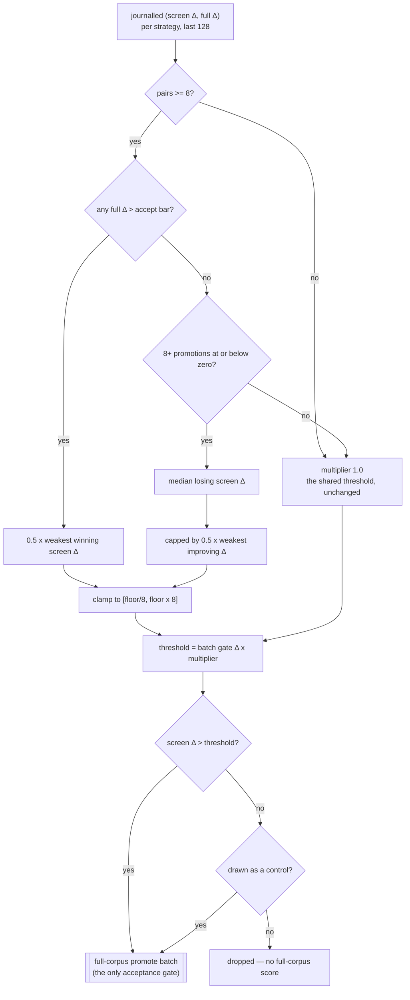

## Summary

Lamarck screened every candidate family against one shared
`--screen-promote-threshold`, but a weight nudge, a structural add, a random
change and a backprop step do not share a relationship between sampled Δ and
full-corpus Δ. One gate therefore over-buys full-corpus calls for the noisy
families and prematurely drops the families whose sample signal is weak but
whose promoted precision is good.

This adds **per-strategy screen threshold calibration**, opt-in behind
`--screen-threshold-mode per-strategy` (`shared` — the pre-#220 gate — stays the
default and the A/B arm). Each family's threshold is derived from its own
journalled `(screen Δ, full Δ)` window and applied as a bounded multiplier on
whatever the batch's own promote gate resolved, so it composes with the absolute
and noise-aware gates rather than replacing either. A minimum
`--screen-control-rate` of below-threshold candidates is promoted anyway, which
is what keeps the calibration's false negatives measurable.

Closes #220.

## Evidence

Backend/CLI change — no web interface to screenshot. The evidence is the test
suite and the journal/report surfaces it asserts on.

The estimator, and where each guardrail binds:

What landed:

- `lamarck/src/screen_thresholds.rs` — the ledger, the estimator (win margin,
  the braked loss quantile, the shared fallback), the control draw, the journal
  record and the offline replay.
- `lamarck/src/run.rs` — the calibrated gate in the screen phase, the
  `screenThresholds` journal field, and the ledger fed by every journalled
  experiment (under both modes, so the two A/B arms carry the same evidence).
- `lamarck/src/screen_calibration.rs` — `screenCalibration.byStrategy` rows:
  screened/paired, precision, full-Δ spread, control promotions and the false
  negatives among them, promote cost, and the threshold that family's own
  evidence recommends.
- `lamarck/src/report.rs` — the `screenThresholdReplay` bucket and two
  run-summary lines.
- `docs/screen-thresholds.md`, README, CHANGELOG, and
  `scripts/run-screen-threshold-ab.sh` / `scripts/summarise-screen-thresholds.sh`
  for the paired production A/B.

Quality gate: `./quality.sh` passes every stage **except** its codespell
preflight, which fails because `codespell` is not installed in this container
and cannot be (`pip`/`pipx` are absent) — an environment gap, not a finding
about this change. Everything after that stage was run by hand and passes:
`cargo deny check` (advisories/bans/licenses/sources ok), `cargo fmt --all --
--check`, `cargo clippy --workspace --all-targets --all-features -D warnings`,
`cargo test --workspace --all-features -- --test-threads=2` (32 test binaries,
all green), and `RUSTDOCFLAGS="-D warnings" cargo doc`. `markdownlint-cli2`
reports 0 issues across all 71 markdown files. CI runs codespell on the PR.

## Acceptance Criteria

<!-- vibe-spec-review inputs="diff+issue-body" -->

- **met** — Report screen-vs-full calibration by strategy — evidence:
  `lamarck/src/screen_calibration.rs::by_strategy` →
  `screenCalibration.byStrategy`, asserted by
  `lamarck/tests/screen_thresholds.rs::report_states_the_calibration_by_strategy_and_prices_it`
  — reviewer: met
- **met** — Configurable strategy-specific thresholds/quotas derived from
  measured history — evidence: `--screen-threshold-mode`,
  `lamarck/src/screen_thresholds.rs::calibrated_multiplier` fed by
  `ScreenThresholdLedger::observe` — reviewer: met — reason: thresholds, not
  quotas; the criterion is an "or", and the reviewer confirmed it satisfiable
  that way.
- **met** — Minimum control-promotion rate below threshold for false-negative
  measurement — evidence: `control_quota` rounds up,
  `lamarck/tests/screen_thresholds.rs::a_calibrated_run_promotes_controls_below_the_threshold`
  and `::controls_are_rounded_up_so_the_rate_is_a_minimum` — reviewer: met
- **met** — Fall back to the current global threshold when evidence is
  insufficient — evidence:
  `lamarck/tests/screen_thresholds.rs::an_uncalibrated_strategy_falls_back_to_the_shared_threshold`,
  `lamarck/src/screen_thresholds.rs::tests::a_thin_window_keeps_the_shared_threshold`
  — reviewer: met
- **partial** — Journal the threshold/model version used for every candidate —
  evidence: `screenThresholds.candidates[]` per screened candidate, asserted by
  `lamarck/tests/screen_thresholds.rs::every_candidate_is_journalled_with_its_threshold_and_model_version`
  — reviewer: partial — reason: the record is written only under
  `per-strategy`, so a `shared` run still journals just `screenTiers.threshold`
  and no model version, and a post-screen combo — which no screen threshold
  ever judged — has no entry. Kept deliberately: the repo's convention (#218's
  `strategyAllocation`) is that an opt-in feature journals nothing on the
  default path, and `the_shared_threshold_run_is_unchanged` pins that promise.
- **partial** — Compare full-corpus scorer calls saved and score improvement per
  wall hour against the current shared gate — evidence:
  `screenThresholdReplay` (`lamarck/src/screen_thresholds.rs`),
  `scripts/run-screen-threshold-ab.sh` — reviewer: partial — reason: the offline
  replay prices both arms on the same journal, but no production A/B has been
  run — it needs exclusive box time on the private corpus. Recorded as unrun in
  `docs/screen-thresholds.md` and the README's outstanding-work table, and
  test-pinned, exactly as #111 and #218 shipped.
- **met** — Generic public-library implementation only — evidence:
  `lamarck/src/screen_thresholds.rs` is a self-contained public module with no
  creature-, corpus- or scorer-specific constants — reviewer: met
- **unrequested** — The screen ledger accumulates under `shared` mode too, where
  it is never read — evidence: `lamarck/src/run.rs:1319` — reviewer: unrequested
  — reason: kept, so there is one journalling path and `report` (which rebuilds
  the ledger from the journal alone) derives what a calibrated run would apply;
  the comment that justified it inaccurately has been corrected in this diff.
- **unrequested** — `--screen-control-rate 0` under calibration is refused at
  startup rather than allowed — evidence: `lamarck/src/config.rs::screen_threshold_policy`
  — reviewer: unrequested — reason: kept — it is how the "minimum
  control-promotion rate" criterion is enforced rather than merely defaulted,
  and a calibrated gate that cannot measure its own false negatives is the
  failure mode the issue's guardrail names.
- **unrequested** — `projectedScoreImprovementPerWallHour`, a counterfactual
  rate synthesised from a per-creature cost model — evidence:
  `lamarck/src/screen_thresholds.rs` — reviewer: unrequested — reason: kept — it
  is how the "score improvement per wall hour against the shared gate"
  comparison is expressed offline; both its assumptions (kept accepts still
  land, marginal cost only) are now stated in the field's rustdoc and the doc.
- **unrequested** — Combo-call time was folded into per-strategy `promoteMs` —
  evidence: `lamarck/src/screen_calibration.rs::promote_call_ms` — reviewer:
  unrequested — reason: removed in this diff; a combo is assembled after the
  screen and carries no strategy, so its call is charged to nobody.

Correctness findings the Spec reviewer raised beyond the criteria, and what
happened to each:

- **Loss-quantile ratchet (fixed).** The loss sample is censored by the gate in
  force, so its median always sits above that gate and the branch could ratchet
  a family to the `8×` clamp on its own past tightening. It is now capped by
  half the weakest screen Δ the family has *improved* on, and declined outright
  when the screen scored that improvement at or below zero —
  `lamarck/src/screen_thresholds.rs::tests::the_loss_quantile_never_rises_past_a_measured_improvement`
  and `::an_invisible_improvement_blocks_the_loss_branch`.
- **"Every winner the strategy has ever shown" (fixed).** The window is 128
  observations, so the claim was wrong; the module docs and
  `docs/screen-thresholds.md` now say "in the window".
- **Replay does not model which stems the control draw would promote
  (documented).** It is pessimistic in the safe direction; `acceptsDropped` now
  says so in its rustdoc and in the doc's field table.
- **`promoteSecondsSaved` prices marginal creature cost only (documented).**
  The fixed per-call cost from `docs/scorer-fixed-cost.md` is not modelled, and
  both the field and the doc now state it.

## Standards Review

<!-- vibe-standards-review inputs="diff+CODING-STANDARDS.md" -->

The repository has no `CODING-STANDARDS.md`; the reviewer was given the diff
plus `CONTRIBUTING.md` and the conventions the surrounding code establishes.

- **violation** — Silent fallback: `screened_candidates` returned an empty batch
  when `screenScores` carried no `baseline`, turning a malformed batch into
  "nothing to promote" where every neighbouring module fails loudly on the same
  condition — evidence: `lamarck/src/run.rs:1038` (pre-fix) — reason: fixed here
  — it now returns `Err` naming the missing anchor, matching
  `screen_thresholds.rs` and `promote_gate.rs`.
- **violation** — A comment asserted an invariant this diff falsified: the
  screen batch line logs the shared gate's count while calibration decides the
  promoted set afterwards — evidence: `lamarck/src/run.rs:2164` (pre-fix) —
  reason: fixed here — the comment now says what the line does, and the
  calibration line logs the promoted count and the controls in it.
- **violation** — `screenTiers.promoted` (post-calibration) and
  `screenTiers.threshold` (pre-calibration) contradict each other under
  calibration, and the README row documenting them was not updated — evidence:
  `lamarck/src/run.rs:2194`, `README.md:1476` — reason: fixed here — both fields
  now carry rustdoc saying which side of calibration they sit on, and the README
  row states it and points at `screenThresholds`.
- **violation** — DRY: `control_stems` was duplicated byte-for-byte in
  `screen_thresholds.rs` and `screen_calibration.rs`, and `strategy_label`
  re-implemented `strategy_of` — evidence: `lamarck/src/screen_thresholds.rs:404`,
  `lamarck/src/screen_calibration.rs:444` (pre-fix) — reason: fixed here — both
  live in `screen_thresholds.rs` and `screen_calibration.rs` imports them.
- **violation** — The README claimed three properties were "pinned by tests"
  while the first — "calibration never makes the screen authoritative" — had no
  test — evidence: `README.md:1180` — reason: fixed here by writing the missing
  test rather than softening the claim:
  `lamarck/tests/screen_thresholds.rs::calibration_never_makes_the_screen_authoritative`
  drives a run whose sample loves every candidate and whose full corpus hates
  them, and asserts nothing is accepted.
- **violation** — The `--screen-control-rate` README row said "Recorded in the
  journal `runHeader`" unconditionally, while the code records it only under
  `per-strategy` — evidence: `README.md:313` — reason: fixed here.
- **clean** — CONTRIBUTING compliance (patch bump `0.1.32 → 0.1.33` with
  `Cargo.lock` in sync, CHANGELOG under `## [Unreleased]` → `### Added`);
  Australian English throughout the diff; `cargo fmt`, `cargo clippy -D warnings`
  and `shellcheck -x -s bash` clean; tests call real functions and assert on
  results rather than grepping source; loud configuration faults with validation
  called from both `main.rs` and `run_optimisation_cancellable`; backwards-
  compatible journal fields (`serde(default, skip_serializing_if)`) with the
  default mode unchanged; docs coverage (new doc linked from README and
  `docs/screen-calibration.md`, flag table, journal-field table, report section
  and layout tree all updated); no hidden files or secrets staged, quoted
  heredoc in the summariser, and both scripts validate every path before use.

## Test Plan

Unit tests — `lamarck/src/screen_thresholds.rs`:

- `a_thin_window_keeps_the_shared_threshold` — insufficient evidence is the
  shared threshold exactly, one observation short of the minimum included.
- `the_win_margin_keeps_every_winner_the_family_has_shown` — the threshold sits
  a factor of two below the weakest measured winner.
- `a_winner_the_screen_could_not_see_lowers_the_threshold` — a win at a
  non-positive screen Δ opens the gate to the bounded minimum.
- `a_family_that_never_converts_pays_the_median_loss` — hand-computed median.
- `the_loss_quantile_never_rises_past_a_measured_improvement`,
  `an_invisible_improvement_blocks_the_loss_branch` — the brake on the censored
  loss sample, in both of its forms.
- `a_family_with_no_usable_statistic_falls_back`,
  `the_multiplier_is_clamped_both_ways` — the fallback and both clamps.
- `shared_mode_leaves_the_batch_gate_alone` — evidence that would move a
  per-strategy threshold is present and deliberately ignored.
- `per_strategy_thresholds_bind_per_family_and_are_journalled`,
  `an_unattributed_candidate_keeps_the_shared_threshold`.
- `controls_are_rounded_up_so_the_rate_is_a_minimum`,
  `a_control_promotes_a_below_threshold_candidate_and_says_so`,
  `controls_are_drawn_from_the_whole_rejected_set` (64 seeds reach all 8).
- `the_ledger_pairs_journalled_experiments_per_strategy`,
  `the_window_bounds_what_a_strategy_remembers`,
  `a_control_promotion_feeds_the_window_as_false_negative_evidence`.
- `the_replay_counts_the_promotions_calibration_would_have_avoided`,
  `the_replay_reports_an_accept_calibration_would_have_dropped`,
  `a_screen_map_without_a_baseline_fails_loudly`.

End-to-end tests — `lamarck/tests/screen_thresholds.rs` (real runs, journal read
back):

- `every_candidate_is_journalled_with_its_threshold_and_model_version`.
- `an_uncalibrated_strategy_falls_back_to_the_shared_threshold`.
- `a_calibrated_run_promotes_controls_below_the_threshold` — a batch nothing
  cleared still buys full-corpus scores, and each control is below its own
  threshold and present in `scores`.
- `the_shared_threshold_run_is_unchanged` — same scorer, no calibration record,
  no full-corpus call.
- `calibration_never_makes_the_screen_authoritative` — a sample that loves every
  candidate and a full corpus that hates them accepts nothing.
- `report_states_the_calibration_by_strategy_and_prices_it`.
- `calibration_without_controls_is_refused` — the configuration guardrail.

Doc contract — `lamarck/tests/screen_thresholds_doc.rs`: the tooling the
document names exists, every report field it tabulates is serialised, its
constants are the shipped constants, its guardrail wording survives, and its
"not yet run" status is pinned to the absence of a production A/B.

Unchanged suites re-run green, including `lamarck/tests/readme_contract.rs`
(new flags documented, new module in the layout tree) and
`lamarck/tests/screen_calibration_doc.rs`.
