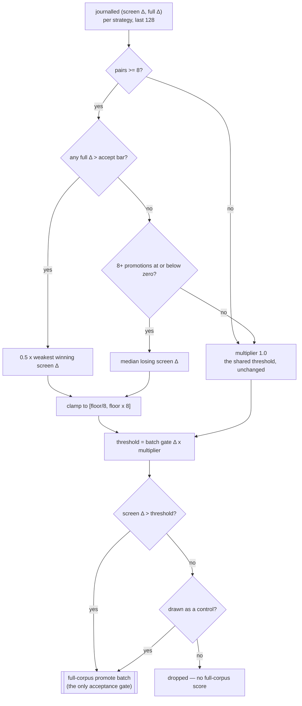

## Summary

Lamarck screened every candidate family against one shared
`--screen-promote-threshold`, but a weight nudge, a structural add, a random
change and a backprop step do not share a relationship between sampled Δ and
full-corpus Δ. One gate therefore over-buys full-corpus calls for the noisy
families and prematurely drops the families whose sample signal is weak but
whose promoted precision is good.

This adds **per-strategy screen threshold calibration**, opt-in behind
`--screen-threshold-mode per-strategy` (`shared` — the pre-#220 gate — stays the
default and the A/B arm). Each family's threshold is derived from its own
journalled `(screen Δ, full Δ)` window and applied as a bounded multiplier on
whatever the batch's own promote gate resolved, so it composes with the absolute
and noise-aware gates rather than replacing either. A minimum
`--screen-control-rate` of below-threshold candidates is promoted anyway, which
is what keeps the calibration's false negatives measurable.

Closes #220.

## Evidence

Backend/CLI change — no web interface to screenshot. The evidence is the test
suite and the journal/report surfaces it asserts on.

The estimator, and where each guardrail binds:

What landed:

- `lamarck/src/screen_thresholds.rs` — the ledger, the estimator, the control
  draw, the journal record and the offline replay.
- `lamarck/src/run.rs` — the calibrated gate in the screen phase, the
  `screenThresholds` journal field, and the ledger fed by every journalled
  experiment (under both modes, so the two A/B arms carry the same evidence).
- `lamarck/src/screen_calibration.rs` — `screenCalibration.byStrategy` rows:
  screened/paired, precision, full-Δ spread, control promotions and the false
  negatives among them, promote cost, and the threshold that family's own
  evidence recommends.
- `lamarck/src/report.rs` — the `screenThresholdReplay` bucket and two
  run-summary lines.
- `docs/screen-thresholds.md`, README, CHANGELOG, and
  `scripts/run-screen-threshold-ab.sh` / `scripts/summarise-screen-thresholds.sh`
  for the paired production A/B.

Quality gate: `./quality.sh` passes every stage **except** its codespell
preflight, which fails because `codespell` is not installed in this container
and cannot be (`pip`/`pipx` are absent) — an environment gap, not a finding
about this change. Everything after that stage was run by hand and passes:
`cargo deny check` (advisories/bans/licenses/sources ok), `cargo fmt --all --
--check`, `cargo clippy --workspace --all-targets --all-features -D warnings`,
`cargo test --workspace --all-features -- --test-threads=2` (32 test binaries,
all green), and `RUSTDOCFLAGS="-D warnings" cargo doc`. `markdownlint-cli2`
reports 0 issues across all 71 markdown files. CI runs codespell on the PR.

## Acceptance Criteria

<!-- vibe-spec-review inputs="diff+issue-body" -->

PLACEHOLDER_SPEC

## Standards Review

<!-- vibe-standards-review inputs="diff+CODING-STANDARDS.md" -->

PLACEHOLDER_STANDARDS

## Test Plan

Unit tests — `lamarck/src/screen_thresholds.rs`:

- `a_thin_window_keeps_the_shared_threshold` — insufficient evidence is the
  shared threshold exactly, one observation short of the minimum included.
- `the_win_margin_keeps_every_winner_the_family_has_shown` — the threshold sits
  a factor of two below the weakest measured winner.
- `a_winner_the_screen_could_not_see_lowers_the_threshold` — a win at a
  non-positive screen Δ opens the gate to the bounded minimum.
- `a_family_that_never_converts_pays_the_median_loss` — hand-computed median.
- `a_family_with_no_usable_statistic_falls_back`,
  `the_multiplier_is_clamped_both_ways` — the fallback and both clamps.
- `shared_mode_leaves_the_batch_gate_alone` — evidence that would move a
  per-strategy threshold is present and deliberately ignored.
- `per_strategy_thresholds_bind_per_family_and_are_journalled`,
  `an_unattributed_candidate_keeps_the_shared_threshold`.
- `controls_are_rounded_up_so_the_rate_is_a_minimum`,
  `a_control_promotes_a_below_threshold_candidate_and_says_so`,
  `controls_are_drawn_from_the_whole_rejected_set` (64 seeds reach all 8).
- `the_ledger_pairs_journalled_experiments_per_strategy`,
  `the_window_bounds_what_a_strategy_remembers`,
  `a_control_promotion_feeds_the_window_as_false_negative_evidence`.
- `the_replay_counts_the_promotions_calibration_would_have_avoided`,
  `the_replay_reports_an_accept_calibration_would_have_dropped`,
  `a_screen_map_without_a_baseline_fails_loudly`.

End-to-end tests — `lamarck/tests/screen_thresholds.rs` (real runs, journal read
back):

- `every_candidate_is_journalled_with_its_threshold_and_model_version`.
- `an_uncalibrated_strategy_falls_back_to_the_shared_threshold`.
- `a_calibrated_run_promotes_controls_below_the_threshold` — a batch nothing
  cleared still buys full-corpus scores, and each control is below its own
  threshold and present in `scores`.
- `the_shared_threshold_run_is_unchanged` — same scorer, no calibration record,
  no full-corpus call.
- `report_states_the_calibration_by_strategy_and_prices_it`.
- `calibration_without_controls_is_refused` — the configuration guardrail.

Doc contract — `lamarck/tests/screen_thresholds_doc.rs`: the tooling the
document names exists, every report field it tabulates is serialised, its
constants are the shipped constants, its guardrail wording survives, and its
"not yet run" status is pinned to the absence of a production A/B.

Unchanged suites re-run green, including `lamarck/tests/readme_contract.rs`
(new flags documented, new module in the layout tree) and
`lamarck/tests/screen_calibration_doc.rs`.
