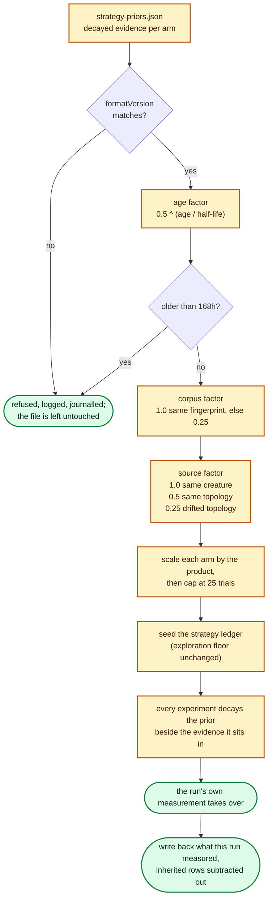

## Summary

Lamarck runs are deliberately short because the supplied champion goes stale, so
every 45-minute run re-discovered which mutation families are currently
productive even though earlier journals already measured it.

This adds **transferable operator priors**, opt-in behind `--strategy-priors
seed` (`off` — a cold start — stays the default and is the A/B arm). A seeded
run reads a versioned `strategy-priors.json`, discounts it for age, corpus
fingerprint and source-creature drift, caps it at 25 trials per arm, seeds the
#218 strategy ledger with it, and writes back **what it measured** at the end.
Only operator-level aggregates travel — trials, screen→promote conversions,
accepts, full-corpus score gain and measured scorer cost, per strategy — so no
historical candidate can be replayed, and every candidate is still generated,
screened and scored exactly as on a cold start. The #218 exploration floor is
untouched.

Closes #221.

## Evidence

Backend/CLI change — no web interface to screenshot. The evidence is the test
suite and the journal/report surfaces it asserts on.

How far a prior is trusted, and where each guardrail binds:

Command output — the full suite after the final edit (`cargo test --workspace
--all-features`): **34 test binaries green**, including the 13 new behavioural
tests in `lamarck/tests/strategy_priors.rs` and the 6 doc-contract tests in
`lamarck/tests/strategy_priors_doc.rs`. `cargo fmt --all -- --check`,
`cargo clippy --workspace --all-targets --all-features -D warnings`,
`cargo deny check` and `RUSTDOCFLAGS="-D warnings" cargo doc` all pass.

<!-- vibe-quality-gate-skipped stage="codespell" reason="codespell is not installed in this container and there is no pip/pipx to install it (`pip: command not found`, `python3: No module named pip`); every other ./quality.sh stage was run and passes — the stages before codespell via ./quality.sh itself, and cargo-deny / fmt / clippy / test / doc individually afterwards. CI runs codespell on the PR." -->

## Acceptance Criteria

<!-- vibe-spec-review inputs="diff+issue-body" -->

- **met** — versioned portable prior format — evidence: `lamarck/src/strategy_priors.rs:68` (`STRATEGY_PRIORS_FORMAT_VERSION`), `load_priors` refuses any other version; `lamarck/tests/strategy_priors.rs::the_prior_format_is_versioned_and_round_trips_through_disk` — reviewer: met
- **met** — prior confidence decays with age and source/corpus mismatch — evidence: `lamarck/src/strategy_priors.rs::confidence`; `tests/strategy_priors.rs::confidence_decays_with_age_and_expires_at_the_maximum`, `::changed_training_data_or_a_drifted_incumbent_reduce_confidence` — reviewer: partial — reason: the reviewer found the write-back re-stamped inherited evidence with today's timestamp and the ending incumbent, laundering both discounts across a chain; fixed in this diff — a run now persists only `StrategyLedger::measured_evidence`, with the seeded rows subtracted back out
- **met** — current-run evidence can dominate quickly — evidence: `tests/strategy_priors.rs::current_run_evidence_overrides_a_stale_prior_within_a_few_experiments` (five experiments overturn a full-confidence prior) — reviewer: met — reason: the reviewer noted this only bites under `--strategy-allocation adaptive`; the run now warns when seeding under the fixed split, and README/`docs/strategy-priors.md` state the dependency
- **met** — report separates prior-driven and fresh evidence — evidence: `strategyAllocation.priors` plus `strategies[].priorTrials` / `priorShare` in `lamarck/src/report.rs`; `tests/strategy_priors.rs::the_report_separates_prior_driven_from_fresh_evidence` — reviewer: partial — reason: the reviewer reproduced inherited accepts and gain leaking into the measured columns because `push_priors` seeded the totals ledger; fixed here (only the decayed ledger is seeded) and the test now asserts the seeded arm reports `accepts == 0` and `scoreGain == 0.0` against a prior that carried both
- **partial** — A/B compare cold-start vs prior-seeded score improvement per wall hour — evidence: `scripts/run-strategy-priors-ab.sh`, `scripts/summarise-strategy-priors.sh`, `docs/strategy-priors.md` "Status: not yet run" — reviewer: partial — reason: the paired protocol is scripted and documented but unrun; it needs exclusive box time on the private production creature and corpus, which this repository does not carry (the same status #218 and #220 shipped with)
- **met** — no exact historical candidate is accepted/replayed without normal scorer evaluation — evidence: the format holds five counters per strategy label plus a shape id and two hashes (`lamarck/src/strategy_priors.rs::StrategyPriors`); `tests/strategy_priors.rs::the_prior_format_carries_no_candidate_or_creature_payload` — reviewer: met
- **met** — guardrail: exponential decay / maximum age — evidence: `0.5^(age/half-life)` and a hard zero past `STRATEGY_PRIORS_MAX_AGE_HOURS = 168`; `tests/strategy_priors.rs::confidence_decays_with_age_and_expires_at_the_maximum` — reviewer: partial — reason: the reviewer's objection was the write-back laundering the bound, which this diff now fixes
- **met** — guardrail: corpus fingerprint awareness — evidence: `PriorSource::training_key` matched exactly or discounted to `CORPUS_MISMATCH_CONFIDENCE`, with an unfingerprintable corpus counting as a mismatch — reviewer: met
- **met** — guardrail: incumbent/topology drift reduces confidence — evidence: `1.0` / `0.5` / `0.25` on creature fingerprint, shape id, drift; `tests/strategy_priors.rs::changed_training_data_or_a_drifted_incumbent_reduce_confidence` — reviewer: partial — reason: the reviewer noted `incumbentId` is a coarse shape id, so a rewired creature with identical counts reads as "same topology"; that is the repo's existing journal identity (`run.rs::incumbent_id`) and the content fingerprint above it is what separates a genuinely different creature, so it stands
- **met** — guardrail: exploration floor remains mandatory — evidence: the #218 floor is untouched; `tests/strategy_priors.rs::a_seeded_prior_moves_the_opening_allocation` asserts every arm still takes floor slots with a prior seeded — reviewer: met
- **met** — guardrail: generic optimiser evidence only, no private application metadata — evidence: `PriorSource` is a coarse shape id and two opaque `u64` hashes; the no-payload test asserts the encoded file carries none of `mutation` / `newValue` / `focusNeuron` / `neurons` / `synapses` — reviewer: met
- **partial** — proposal item: full-corpus score gain **distribution** — evidence: `scoreGain` is the summed Δ per arm — reviewer: partial — reason: only the sum travels, not moments or quantiles; the five counters give the rates the allocator actually consumes, and a distribution would widen the format without a consumer
- **missing** — proposal items: strategy **subtype** trials/accepts, and useful parameter buckets (structural-add weight-scale / squash classes) — reviewer: missing — reason: parameter buckets carry the scalars the no-replay guardrail forbids, and subtypes are not journalled today; both are proposal suggestions ("evidence such as"), not acceptance criteria, so they are left out rather than traded against the guardrail
- **unrequested** — `--strategy-priors-path` — reviewer: unrequested — reason: consecutive runs use different output directories, so without it no chain of evidence can exist; the A/B script needs it to point a warm-up and its measured run at one file
- **unrequested** — a `strategyPriors` journal line is written even when nothing was seeded — reviewer: unrequested — reason: without it a refused or absent prior is indistinguishable from the cold-start control arm in the journal, which is what the A/B is comparing

## Standards Review

<!-- vibe-standards-review inputs="diff+CONTRIBUTING.md" -->

This repository has no `CODING-STANDARDS.md`; `CONTRIBUTING.md` plus the
conventions of the neighbouring modules were the standards the reviewer was
given.

- **violation** — `scripts/summarise-strategy-priors.sh` crashed on a cold-start report, where `priors` serialises as `null` (`dict.get("priors", {})` returns `None`) — evidence: `scripts/summarise-strategy-priors.sh:71` — reason: fixed here (`.get("priors") or {}`), and the summariser was run against synthetic cold-start and refused-prior reports to confirm
- **violation** — the documented "a refusal is journalled, never mistaken for a cold start" path had no test — evidence: `lamarck/tests/strategy_priors.rs` — reason: fixed here — `::an_unreadable_priors_file_is_refused_and_never_overwritten` drives a real run against a version-mismatched file
- **violation** — `report` dropped unrecognised prior arm labels silently, against `CandidateStrategy::parse`'s own contract — evidence: `lamarck/src/report.rs:513` — reason: fixed here — `StrategyPriorsReport::unknown_arms` carries them, covered by `::the_report_names_prior_arms_this_build_does_not_recognise`
- **violation** — the rejection journal line claimed `formatVersion: "1.0.0"` and `writtenUnix: 0` for a file it never read — evidence: `lamarck/src/run.rs:828` — reason: fixed here — both fields are now `Option` and `None` on that path
- **violation** — the corpus was fingerprinted (and a misleading warning logged) even under the default `--strategy-priors off` — evidence: `lamarck/src/run.rs:1449` — reason: fixed here — `prior_source` is computed inside the guarded functions, so an untouched run does no extra work and says nothing
- **violation** — the module doc said the cap is worth "a couple of batches" where the constant, the doc and the README say "a quarter of one production batch" — evidence: `lamarck/src/strategy_priors.rs:36` — reason: fixed here
- **violation** — `PriorSeed`'s doc comment described one arm; the type is the whole per-strategy map — evidence: `lamarck/src/strategy_priors.rs:195` — reason: fixed here
- **clean** — Australian English throughout code, comments and docs; tests call real APIs (`run_optimisation` against a real scorer and creature, `report_from_journal` over real journal JSON, `load_priors`/`write_priors` round-trips) and never grep source text; every new `pub` item documented; errors surfaced rather than swallowed (unreadable/version-mismatched priors log **and** journal, an invalid half-life aborts under both modes, an unusable half-life reads as zero confidence); no hidden or credential paths staged; version bumped `0.1.33 → 0.1.34` with a `[Unreleased] → Added` CHANGELOG entry; README flag table, feature section, journal-line note, layout tree and outstanding-work row all updated; `strategy_priors.rs` is a small focused module mirroring `strategy_allocation.rs` and `failed_cache/rebuild.rs` down to the format-version refusal wording; the new `JournalLine::StrategyPriors` arm added to every exhaustive match

## Test Plan

- `lamarck/tests/strategy_priors.rs` (new, 13 tests) — versioned round-trip plus loud refusal of a corrupt or future-version file; no candidate/creature payload in the format; age decay and expiry at the maximum age; corpus and topology discounts; a seeded prior moving the opening allocation while the exploration floor still binds; fresh evidence overturning a full-confidence prior in five experiments; the per-arm trial cap; the report separating inherited from measured evidence (a seeded arm reports zero accepts and zero gain against a prior that carried both); unrecognised arm labels reported; a cold-start journal reporting no priors bucket; mode parsing and half-life validation; and two end-to-end runs — one that persists its evidence for the next to open with, and one that refuses an unreadable file and leaves it untouched.
- `lamarck/tests/strategy_priors_doc.rs` (new, 6 tests) — `docs/strategy-priors.md` names tooling that exists, quotes only report fields `report` emits, states the shipped discounts and cap, keeps the "default reads and writes nothing" and no-replay claims true, and keeps its "not yet run" A/B status.
- `lamarck/src/strategy_priors.rs` unit tests — unknown labels reported not dropped, zero/non-finite confidence seeding nothing, the cap scaling the whole evidence row, a future timestamp read as fresh, an unusable half-life trusting nothing.
- Existing suites unchanged and green, including `strategy_allocation`, `readme_contract`, `docs_link_targets` and `promote_gate_replay` (the last updated only for the new `JournalLine` variant).
