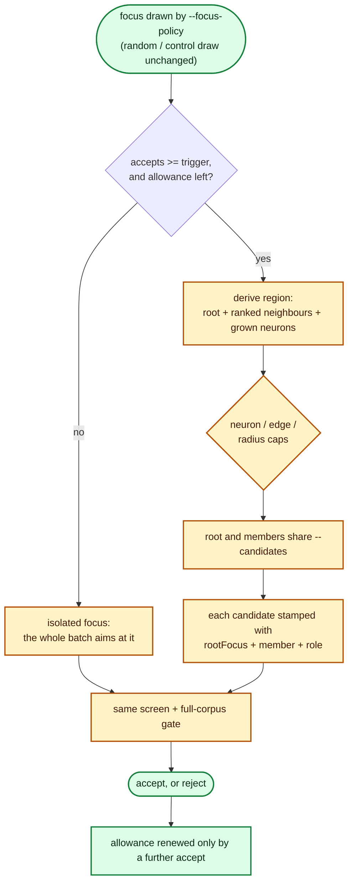

# 🔭 Expand around repeatedly successful focus regions (Issue #222)

## Summary

A focus the scorer keeps rewarding may be one neuron of a useful local subgraph,
but the run treated every focus as an isolated scalar target and could reach the
structure beside it only by drawing it independently. This adds **bounded
focus-neighbourhood expansion** (`lamarck/src/neighbourhood.rs`): a focus that
has earned `--focus-neighbourhood-accepts` measured acceptances derives a small
region — itself, the neighbours reached along its highest-impact incoming and
outgoing edges, and any neuron an accepted structural mutation recently grew —
and the ordinary generator proposes against each member in turn, sharing the
same `--candidates` budget.

Expansion changes only **where** the batch is aimed. Every candidate faces the
same screen and full-corpus gate, and carries a `neighbourhood` provenance link
naming the root focus and the member it actually targeted. Off by default
(`--focus-neighbourhood-neurons 0`), which is the isolated-focus arm the feature
is measured against. Closes #222.

## Evidence

Backend/CLI change with no web interface to screenshot; the evidence is the test
suite and the journal/report output it asserts on.

- `cargo test --workspace --all-features` — **all green** (546 lib tests, every
  integration suite), including 24 new tests for this change.
- `cargo fmt --all -- --check`, `cargo clippy --workspace --all-targets
  --all-features -- -D warnings`, `cargo deny check`, and
  `RUSTDOCFLAGS="-D warnings" cargo doc --workspace --no-deps` — all clean.
- `./quality.sh` — every stage passes **except** the `codespell` preflight,
  which fails because `codespell` is not installed in this container and cannot
  be installed (no `pip`/`pipx` available). Exact output:
  `spell-check: codespell is not installed.` Every stage after it was run
  individually and passes; CI runs the spell-check job for real.

The end-to-end behaviour, from `run::tests::a_rewarded_focus_expands_into_a_bounded_neighbourhood`:
experiment 1 accepts on focus `o1`, experiment 2 derives the region, aims part of
the batch at `h1`, and journals both.

## Acceptance Criteria

<!-- vibe-spec-review inputs="diff+issue-body" -->

- **met** — Configurable focus-neighbourhood expansion, default off initially —
  evidence: `lamarck/src/config.rs::DEFAULT_FOCUS_NEIGHBOURHOOD_NEURONS = 0`,
  `focus_neighbourhood_limits()`, five CLI flags in `lamarck/src/main.rs`,
  `run::tests::focus_neighbourhood_expansion_is_off_by_default` (the off arm
  writes no `neighbourhood` field at all) — reviewer: met
- **met** — Expansion triggered by measured focus success or explicit policy,
  not private domain knowledge — evidence: `lamarck/src/neighbourhood.rs`
  (`accepts < limits.accepts` gate) fed by the run's own
  `WeightedFocusSelector::history` accept count in `lamarck/src/run.rs`;
  `neighbourhood::tests::a_focus_without_measured_success_is_not_expanded` and
  `a_zero_accept_trigger_is_the_explicit_policy_arm` — reviewer: met
- **met** — Hard limits on neurons/edges and graph radius — evidence:
  `neighbourhood::tests::the_neuron_cap_bounds_the_region`,
  `the_edge_cap_bounds_the_region`, `the_radius_bounds_the_region` — reviewer:
  met — reason: the reviewer flagged a caveat that the edge budget was spent on
  edges into input neurons, which could starve a first-layer focus of any
  region at all; fixed in this diff (inputs are skipped, not charged) and
  covered by `heavy_input_edges_do_not_consume_the_edge_budget`
- **met** — Candidate provenance records root focus and actual targeted
  member(s) — evidence: `CandidateProvenance::neighbourhood`
  (`lamarck/src/candidates.rs`), stamped once the batch is final in
  `lamarck/src/run.rs`, asserted per candidate in
  `run::tests::a_rewarded_focus_expands_into_a_bounded_neighbourhood` —
  reviewer: partial — reason: the reviewer's two objections were (a) `role` is
  relative to the neuron the member was reached from rather than to the root,
  and (b) the field's doc claimed "every candidate", which is untrue for
  follow-up probes. Both are now stated accurately in the doc comments and the
  README; the recorded root and member were correct throughout
- **met** — Compare isolated-focus vs neighbourhood-focus wins/hour — evidence:
  `report::NeighbourhoodStats` (`neighbourhoodWinsPerWallHour` vs
  `isolatedWinsPerWallHour`, with the gain pair beside them),
  `report::tests::report_compares_neighbourhood_focus_against_isolated_focus` —
  reviewer: met
- **met** — Report whether successful follow-ons occur on the original focus or
  adjacent structure — evidence: `rootAccepts` / `adjacentAccepts` in
  `lamarck/src/report.rs`, printed by `print_run_summary`, covered by
  `a_win_on_the_original_focus_is_reported_separately` and
  `a_win_by_another_drawn_focus_is_not_credited_to_the_root` — reviewer: partial
  — reason: the reviewer proved `rootAccepts` counted *any* non-adjacent win in
  an expanded experiment — a follow-up probe, or a candidate from a second focus
  under `--focus-count 2` — as a win "on the original focus". It now requires
  every winning member to carry the region link naming the root, and probes are
  excluded from the arms entirely; both fixed and tested in this diff
- **met** — Maintain random/control focus selection so expansion cannot
  permanently monopolise the run — evidence: the focus draw in
  `lamarck/src/run.rs` is untouched and members are only appended to the set;
  per-root allowance renewed only by a strictly greater accept count
  (`neighbourhood::tests::a_root_cannot_expand_beyond_its_allowance`,
  `a_fresh_accept_renews_the_allowance`), with the reader-side check
  `report::tests::a_root_expanding_across_experiments_counts_once` — reviewer:
  met
- **unrequested** — region members join the weighted focus history, so a member
  that wins becomes likelier to be drawn on its own later — reviewer:
  unrequested — reason: a consequence of reusing the #109 multi-focus path
  rather than a separate mechanism; it is symmetric (a sterile member is
  dampened exactly as a barren drawn focus is) and it is how the issue's
  local-subgraph hypothesis gets tested by the selector rather than asserted.
  Kept, and now documented in the README section
- **unrequested** — expansion applies to a `--focus-neuron` pinned root, so a
  pinned run also proposes against the region members — reviewer: unrequested —
  reason: the pin selects *which* focus, and expansion is a separate opt-in
  flag; making the pin suppress an explicitly requested expansion would be the
  more surprising behaviour. Documented on both the `--focus-neuron` and
  `--focus-count` rows and in the new README section
- **unrequested** — score gain per wall hour is reported beside the wins/hour
  pair the issue asked for, along with `roots`, `members`, `mixedAccepts`,
  `excludedAccepts` and `unattributedAccepts` — reviewer: unrequested — reason:
  the same shape every other arm in `report` already carries (`followUp`,
  `mirror`, `strategyAllocation`); without the mixed/excluded/unattributed
  buckets an accept the arms cannot claim would silently vanish from the A/B
- **unrequested** — a zero `--focus-neighbourhood-edges` / `-radius` /
  `-experiments` with expansion on aborts the run — reviewer: unrequested —
  reason: the house rule for every A/B knob in this repo (`--focus-count`,
  `--followup-experiments`, `--screen-control-rate` all do the same): a run that
  silently ignored the flag would invalidate the arm it was set for
- **unrequested** — the remembered grown-neuron list is truncated to the
  region's neuron cap — reviewer: unrequested — reason: the list exists only to
  rank a region's members, so a deeper history could never be used; keeping a
  second knob for it would be an unused configuration surface

## Standards Review

<!-- vibe-standards-review inputs="diff+CODING-STANDARDS.md" -->

The repository has no `CODING-STANDARDS.md`; the reviewer was given the diff and
`CONTRIBUTING.md`, which is where this repo's contributor standards live, plus
the standing project rules (Australian English, fail-loud, real-code tests,
docs-owe-a-change).

- **violation** — the crate version was not bumped for a binary-affecting change
  — evidence: `lamarck/Cargo.toml:3` — reason: fixed here, `0.1.33` → `0.1.34`
  with `Cargo.lock` in sync
- **violation** — no `[Unreleased]` changelog entry for a user-visible feature —
  evidence: `CHANGELOG.md:7` — reason: fixed here, an `### Added` entry for #222
- **violation** — the README and module doc claimed a region holds "any neuron an
  accepted structural mutation recently grew", but growth is only a ranking
  preference inside the radius — evidence: `README.md:1067`,
  `lamarck/src/neighbourhood.rs:8` — reason: fixed here; both now say growth is
  a preference, not an exemption
- **violation** — the ranking was documented as preferring grown neurons over
  "equally-weighted" ones when growth is in fact the primary sort key —
  evidence: `lamarck/src/neighbourhood.rs:235`, `README.md:339`,
  `lamarck/src/main.rs:163` — reason: fixed here in all three places
- **violation** — `is_adjacent`'s doc claimed an unlinked candidate came from an
  unexpanded experiment, which is false for follow-up probes; probes were being
  folded into the isolated arm and contaminating the headline rate — evidence:
  `lamarck/src/report.rs:998` — reason: fixed here; probes are a third bucket
  (`excludedCandidates` / `excludedAccepts` / `excludedMs`) priced in neither
  arm, covered by `a_follow_up_probe_is_excluded_from_both_arms`
- **violation** — `NeighbourhoodLedger::expand` silently returns `None` for a
  zero edge budget or radius, while the config layer documents those as faults —
  evidence: `lamarck/src/neighbourhood.rs:249` — reason: the loud rejection is
  kept where a run can hit it (`LamarckConfig::focus_neighbourhood_limits`, and
  `main.rs` exits non-zero); `NeighbourhoodLimits` now documents explicitly that
  those two values reach nothing, so a library caller is told rather than
  surprised
- **violation** — `--focus-neuron` and `--focus-count` flag rows were not
  updated for their new interaction with expansion — evidence: `README.md:333`,
  `README.md:320` — reason: fixed here, both rows now name it and link to the
  section
- **violation** — `wins_per_wall_hour` duplicated `gain_per_wall_hour` — evidence:
  `lamarck/src/report.rs:829` — reason: fixed here; both delegate to one
  `per_wall_hour`
- **violation** — `NeighbourhoodMember::grown` was written and never read outside
  the module — evidence: `lamarck/src/neighbourhood.rs:76` — reason: fixed here;
  the journal record now carries `grown`, so a reader can tell whether a region
  was built around structure the scorer had already paid for
- **violation** — `NeighbourhoodLedger::limits()` had no direct test — evidence:
  `lamarck/src/neighbourhood.rs:227` — reason: fixed here,
  `the_ledger_reports_its_limits`
- **clean** — Australian English throughout code, flags, JSON field names and
  prose; loud failure on every config fault with the flag named and tested;
  `Option<f64>` rates so an unmeasured arm is `null` rather than `0.0`;
  journal back-compatibility via `#[serde(default, skip_serializing_if)]` with a
  pre-#222 replay test; tests drive real functions against tempdir fixtures with
  no source-text grepping, no sleeps and no absolute timing thresholds; scope
  discipline — every file outside the six touched modules gains only the single
  mechanical `neighbourhood: None` provenance field; no hidden files or secrets
  staged

## Test Plan

New tests (24), all in-tree beside the code they cover:

- `lamarck/src/neighbourhood.rs` (16) — off by default; the measured-success
  trigger and the zero-trigger policy arm; the region's members and their roles
  in both directions; the neuron, edge and radius caps each binding
  independently; `heavy_input_edges_do_not_consume_the_edge_budget` (the
  starvation regression); grown-neuron preference and its journalling;
  provenance for root, member and stranger; the journal record; the per-root
  allowance and its renewal by fresh evidence only; an isolated focus yielding
  no region; `the_ledger_reports_its_limits`.
- `lamarck/src/config.rs` (2) — expansion off by default and each dead limit
  rejected by name; a zero accept trigger accepted as the policy arm.
- `lamarck/src/run.rs` (2) — `a_rewarded_focus_expands_into_a_bounded_neighbourhood`
  (end to end: accept → region → member in the focus set → per-candidate
  provenance → journal encoding) and `focus_neighbourhood_expansion_is_off_by_default`.
- `lamarck/src/report.rs` (6) — the isolated-vs-neighbourhood A/B arithmetic; a
  win on the original focus reported separately; a combo spanning both arms
  credited to neither; a follow-up probe excluded from both arms; a win by
  another drawn focus not credited to the root; one root expanding twice counted
  once; a pre-#222 journal read as the isolated arm.

Existing tests were neither modified nor removed; the only edits to other test
files are the mechanical `neighbourhood: None` provenance field.
