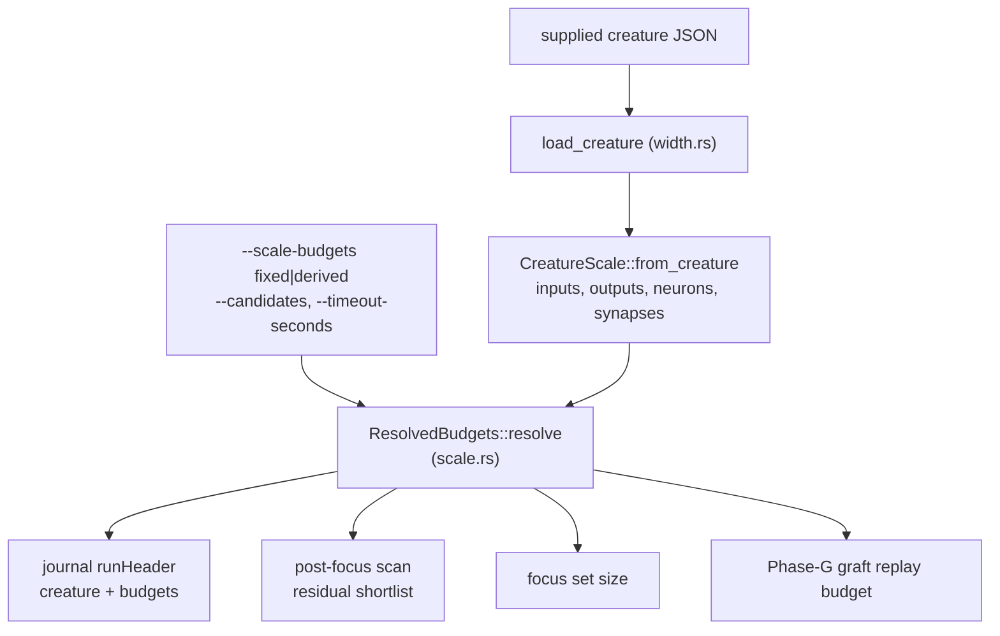

## Summary

The README described a production creature of ~2 511 inputs and ~1 590 hidden
neurons as the *design target*, while the same GRQ champion has since been
observed near 7 363 neurons and 49 000 synapses. Budgets calibrated at the older
shape were quietly covering less and less of it — the run still completes, it
just spends its analysis on a smaller slice of a bigger creature.

This adds `lamarck/src/scale.rs`: `CreatureScale` reads the supplied creature's
dimensions and `ResolvedBudgets` resolves the run's budgets from them and from
the wall clock. **Every** run now journals both in the `runHeader` under
`creature` and `budgets`, including the resolved Phase-G graft-replay budget,
which previously read `null` whenever the default fraction was used.
`--scale-budgets derived` (opt-in; `fixed` reproduces the pre-#223 literals and
is the arm it is measured against) derives the focus count and the structural
residual limits sublinearly from the creature's own width.
`docs/scale-sensitivity.md` is the inventory, and the README's GRQ dimensions
are now a dated historical example rather than a target.

Closes #223.

## Evidence

Backend/CLI change — no web interface to screenshot. The evidence is the paired
benchmark, the journal, and the tests.

**Paired benchmark** (`lamarck/examples/scale_budgets_bench.rs`), synthetic
creatures, in-process scan, no scorer, best of three repeats per arm:

```text
cargo run --release --example scale_budgets_bench -- 8000 3 "2511:1590:12,2511:4852:9"

shape (in:hidden:fan)    neurons  synapses     fixed ms   derived ms     ratio
2511:1590:12                4102     20670          225          226     1.00x
  shortlist fixed=48 (+16 hidden), derived=128 (+32 hidden); ranked sources=4101
2511:4852:9                 7364     48520          665          669     1.01x
  shortlist fixed=48 (+16 hidden), derived=172 (+43 hidden); ranked sources=7363
```

Widening the shortlist from **0.65 %** to **2.3 %** of the larger creature's
ranked sources cost **under 1 %** more scan time — inside this host's
run-to-run drift across three independent runs (665/669, 657/659, 677/677 ms).
The scan is dominated by the per-record forward pass, so the fixed literal was
not buying speed; it was the coverage a smaller creature happened to need.

**How a run resolves its budgets:**



**Gate.** `cargo fmt --check`, `cargo clippy --workspace --all-targets
--all-features -D warnings`, `cargo deny check`, `RUSTDOCFLAGS="-D warnings"
cargo doc` and the full test suite (36 binaries, 0 failures) all pass.

<!-- vibe-quality-gate-skipped reason="codespell absent from the container" -->
`./quality.sh` stops at its `scripts/spell-check.sh` stage: codespell is not
installed in this container and there is no `pip`, `pip3` or `ensurepip` to
install it (`/usr/bin/python3: No module named pip`). Every other stage — the
bash/shellcheck gates, the TypeScript gates, the workflow-pin gates, the version
gates, `cargo deny`, `fmt`, `clippy`, `test`, `doc` — was run and passes. CI
runs the spell check on the PR.

## Acceptance Criteria

<!-- vibe-spec-review inputs="diff+issue-body" -->

- **partial** — Inventory scale-sensitive constants/defaults and document whether each is dimensionless, measured, or size-dependent — evidence: `docs/scale-sensitivity.md`, pinned to the code by `lamarck/tests/scale_sensitivity_doc.rs::the_inventory_quotes_the_fixed_literals_the_code_uses` — reviewer: partial — reason: the reviewer showed the document overclaimed ("every constant in the crate") while omitting the structural per-round quotas and the failed-cache economics thresholds; the claim is now scoped to what the audit examined and the missing entries (`candidates.rs` quotas, `failed_cache/economics.rs` margin and window, `filter.rs` backfill multiple, `parity.rs` batch, `config.rs` neighbourhood limits, `screen_thresholds.rs` calibration window) were added, but exhaustiveness is asserted for the issue's named areas only.
- **partial** — Where sensible, derive budgets from creature size and remaining wall-clock budget — evidence: `lamarck/src/scale.rs` (`ResidualLimits::derived`, `derived_focus_count`), wired at `lamarck/src/run.rs` (post-focus scan and focus set) — reviewer: partial — reason: budgets are resolved once at run start, so they use the *total* wall clock rather than the remaining one, and the derivations sit behind an opt-in flag whose default reproduces the old literals. Re-resolving mid-run is a behavioural change the run-economics A/B has to justify first.
- **met** — Journal creature dimensions and resolved budgets for every run — evidence: `lamarck/tests/scale_budgets.rs::every_run_journals_the_creature_it_was_handed_and_the_budgets_it_resolved` and `::a_derived_run_journals_the_budgets_its_own_creature_earned` — reviewer: met
- **met** — Add tests that exercise materially different creature sizes — evidence: `lamarck/tests/scale_budgets.rs::derived_budgets_grow_with_the_creature_they_are_handed` (4/2, 2511/1590, 2511/4852) and `::a_derived_scan_examines_more_of_a_wide_creature_than_a_fixed_one` (a real 2 000-input `scan_post_focus`) — reviewer: met — reason: the reviewer noted the end-to-end `run_optimisation` test uses a small creature and the large sizes are exercised at unit level; that is accurate and deliberate — a full run at 7 363 neurons is a benchmark, not a unit test.
- **partial** — Re-benchmark on a current large creature and update measured economics — evidence: `lamarck/examples/scale_budgets_bench.rs` and the measured table in `docs/scale-sensitivity.md` — reviewer: partial — reason: the benchmark uses a *synthetic* creature at the current shape with an in-process scan and no scorer, measures the shortlist only (focus count is held at one), and the scorer-priced numbers in `docs/scorer-call-cost.md`, `docs/baseline-economics.md` and `docs/followup-economics.md` are still at the 2025-10 shape. Re-measuring those needs the real creature and exclusive scorer time; the document records that as owed and the README carries an outstanding-work row.
- **met** — Keep all public code generic; GRQ dimensions cited only as external benchmark evidence — evidence: `lamarck/src/scale.rs` holds only gains, floors and ceilings; the reviewer's grep found `2511`/`1590`/`4852`/`7363` in `lamarck/src` only inside `#[cfg(test)]` fixtures, with the dated dimensions in `docs/scale-sensitivity.md` and `README.md` — reviewer: met
- **unrequested** — `ResidualRefine` parameter object, plus new `limits` parameters on `refine_sources_from_probes` / `ResidualScan::new` and a new public `residual` field on `ScanBudget` — reviewer: unrequested — reason: the residual limits have to reach the scan somehow, and adding an eighth argument to `refine_sources_by_residual_with_observations` trips `clippy::too_many_arguments`, which the gate treats as an error; the bundle is the smallest change that carries the limit.
- **unrequested** — `creature_json_with_fan_in` on the shared bench fixture (`lamarck/examples/support/mod.rs`) — reviewer: unrequested — reason: the benchmark needs a creature matching the current synapse count as well as the neuron count; delegating `creature_json` to it keeps the existing fixture byte-identical, which `lamarck/tests/bench_support.rs::creature_json_with_fan_in_extends_the_fixture_without_moving_it` pins.
- **unrequested** — the `--scale-budgets` mode switch itself rather than changing the default behaviour — reviewer: unrequested — reason: this repo ships every behavioural change opt-in until a paired A/B on score improvement per wall hour justifies the default (#108, #111, #218, #219, #220, #221, #222). Changing the default here without that measurement would be the same unmeasured assumption the issue is about.
- **unrequested** — crate version bump 0.1.35 → 0.1.36 and the CHANGELOG entry — reviewer: unrequested — reason: required by `CONTRIBUTING.md` for any binary-affecting change, and enforced by `scripts/check-lamarck-version-no-downgrade.sh` in the gate.

## Standards Review

<!-- vibe-standards-review inputs="diff+CODING-STANDARDS.md" -->

- **violation** — the README's `runHeader` field table did not list the two new header blocks or the new `scaleBudgets` config key — evidence: `README.md:1597` — reason: fixed here; the table now carries `creature` and `budgets` rows and `scaleBudgets` in the `config` row.
- **violation** — `ResidualRefine::with_limits` was a public builder with no caller — evidence: `lamarck/src/structural.rs:725` — reason: dead code, removed here; the derived path goes through `ScanBudget::with_residual`.
- **violation** — the benchmark's module doc claimed the run-economics measurement "is an arm of `scripts/run-followup-economics.sh`", which has no `--scale-budgets` arm — evidence: `lamarck/examples/scale_budgets_bench.rs:13` — reason: fixed here; the doc now states plainly that no A/B script exists yet, and the README's outstanding-work table records it, as it does for #218/#220/#221.
- **violation** — `write_sample` was re-implemented in the new test, with its parameters in a different order from the shared writer — evidence: `lamarck/tests/scale_budgets.rs:56` — reason: fixed here; both new test files now include the shared fixture via `#[path = "../examples/support/mod.rs"]`, the route `bench_support.rs` already uses.
- **violation** — the creature fixture was hand-copied into both new test files, so the doc contract could pass against a stale topology — evidence: `lamarck/tests/scale_sensitivity_doc.rs:37`, `lamarck/tests/scale_budgets.rs:32` — reason: fixed here by the same shared-fixture include.
- **violation** — an explicit `--focus-count 1` under `derived` was dropped with no message, contradicting the method's own doc — evidence: `lamarck/src/scale.rs:321` — reason: fixed here; `focus_count_superseded` now compares the recorded configured value against the resolved one with no special case, and the run logs the supersession. It cannot abort, as the reviewer suggested: clap always supplies a value, so operator silence is indistinguishable from an explicit default — that reasoning is now in the method's doc.
- **violation** — `ResolvedBudgets::resolve` read the raw `config.focus_count` field, bypassing the validation that rejects `0` — evidence: `lamarck/src/scale.rs:290` — reason: fixed here; `resolve` returns `Result` and goes through `LamarckConfig::focus_count()`, so the public API cannot hand back a zero-focus budget.
- **violation** — `refine_sources_by_residual` built a `ResidualRefine` struct literal instead of calling the constructor defined below it — evidence: `lamarck/src/structural.rs:681` — reason: fixed here.
- **violation** — `ScanBudget`'s doc claimed the residual limits apply to it generally, but `scan_pre_focus` never reads the field — evidence: `lamarck/src/analysis.rs:114` — reason: fixed here; the field doc names `scan_post_focus` as its only reader.
- **clean** — Australian English throughout the added lines; every public item documented under `#![warn(missing_docs)]`; tests call real functions and assert on results (`scan_post_focus` output, a parsed journal from a real `run_optimisation`); `lamarck/Cargo.toml` bumped with `Cargo.lock` in sync and ahead of `origin/Develop`; CHANGELOG entry under `[Unreleased] → Added`; errors surfaced (`--scale-budgets` parse failure exits 2, header and scan errors propagate with `?`); no hidden, secret or scratch files staged (19 files); doc comments state reasons rather than restating code.

Three further findings the spec reviewer raised were justifications that did not
match the code, and are corrected in the same way:
`scan_post_focus` runs *per focus*, so a derived focus count **multiplies** with
the derived shortlist rather than amortising it (`lamarck/src/scale.rs`, plus a
warning block in `docs/scale-sensitivity.md`); more synthetic probe rows widen
the fallback sample but do not cure rank deficiency; and the analysis memo's
footprint is O(inputs + neurons), not fan-in bounded — `lamarck/src/memo.rs` no
longer claims otherwise.

## Test Plan

Added:

- `lamarck/tests/scale_budgets.rs` — six tests: the journalled header on both
  arms, pre-#223 header back-compatibility, fixed budgets identical across
  4/2, 2511/1590 and 2511/4852 creatures, derived budgets growing with the
  creature, and a real `scan_post_focus` on a 2 000-input creature proving the
  derived arm re-scores strictly more sources than the fixed one.
- `lamarck/tests/scale_sensitivity_doc.rs` — five tests pinning
  `docs/scale-sensitivity.md` to the code: the tooling it names exists, the
  literals it quotes are the shipped ones, the derived budgets in its measured
  table are the ones the code resolves for those shapes, its "opt-in" status
  matches the shipped default, and both arms resolve the budgets it says are
  journalled.
- `lamarck/src/scale.rs` — eight unit tests over `sublinear_budget` (floor,
  ceiling, √ growth, non-finite gain), `CreatureScale`, fixed-mode invariance
  across sizes, and the focus-count caps.
- `lamarck/tests/bench_support.rs::creature_json_with_fan_in_extends_the_fixture_without_moving_it`
  — the fan-in variant reproduces the shared fixture byte for byte at fan-in
  four, and builds the denser creature above it.

Modified: call sites only (`lamarck/src/analysis.rs`, `lamarck/src/candidates.rs`
and `lamarck/src/structural.rs` tests, `lamarck/examples/analysis_scan_bench.rs`)
for the new `ResidualLimits` parameter. No existing test was removed or
weakened.
