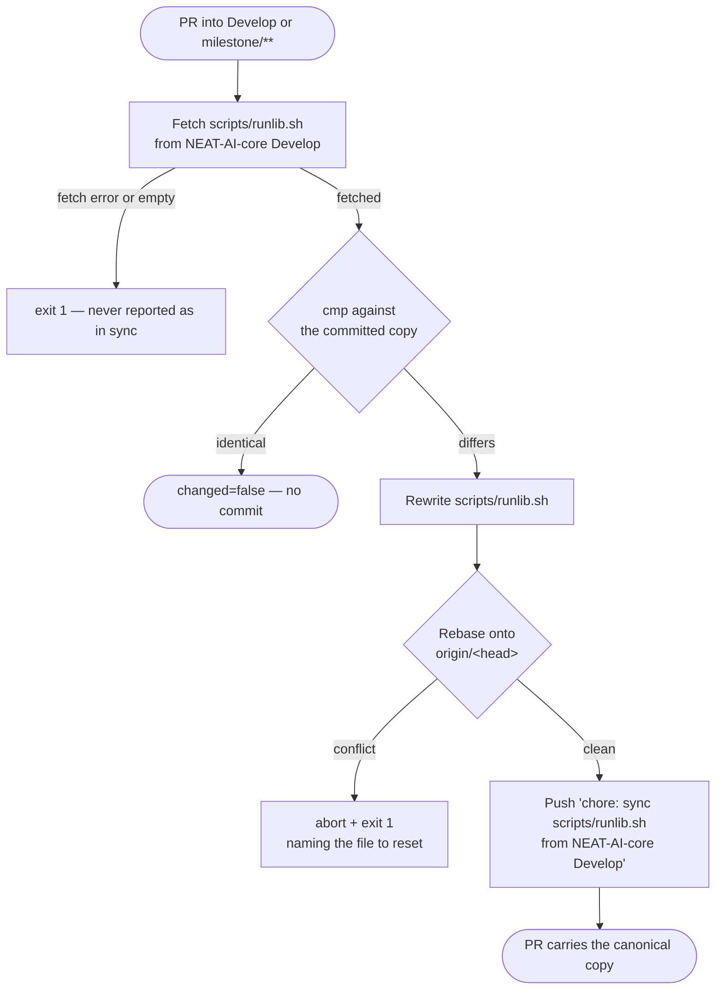

# Adopt the canonical NEAT-AI-core `runlib.sh` with a family-sync CI job

## Summary

`scripts/runlib.sh` is now a byte-identical copy of NEAT-AI-core `Develop`'s
canonical script (NEAT-AI-core#680), and a new `family-sync` CI job keeps it
that way: on every PR into `Develop` or `milestone/**` it fetches core's copy,
compares it with `cmp`, and rewrites, rebases and pushes a refresh when it
differs. Closes #234.

Three supporting changes were needed to make that work honestly:

- `lamarck/Cargo.toml` drops its explicit `[[bin]]` table. It restated cargo's
  auto-discovery default exactly, but the canonical script treats an explicit
  `[[bin]]` as a shape it cannot read without cargo — so it fell back to
  `cargo metadata` on *every* invocation instead of taking its no-cargo
  already-installed fast path. Target discovery is unchanged (proven below).
- `scripts/check-family-sync-workflow.sh` + its behaviour test fail CI when the
  job is misdeclared, which is what the issue's **Failure Detection** section
  asks for.
- `scripts/test-runlib.sh` now pins the canonical contract instead of the
  superseded local script's.

## Evidence

This is a CLI/CI change with no web interface, so there is no screenshot. The
evidence is command output, below.

### The copy is byte-identical

```text
$ gh api repos/stSoftwareAU/NEAT-AI-core/contents/scripts/runlib.sh?ref=Develop | cmp - scripts/runlib.sh
(no output — identical, 25,416 bytes)

56af6127ec398c1558b2dab4356111caa13d0bc943e0cb06fd581cfb004e8989  scripts/runlib.sh
56af6127ec398c1558b2dab4356111caa13d0bc943e0cb06fd581cfb004e8989  (core Develop)
```

### A stale copy is refreshed — the workflow's own `run:` blocks, executed

The two `run:` scripts were extracted from `.github/workflows/family-sync.yml`
and executed verbatim against a scratch branch carrying a deliberately edited
`runlib.sh`:

```text
############ CASE 1: STALE copy on the PR branch ############
::notice::scripts/runlib.sh differs from stSoftwareAU/NEAT-AI-core@Develop — refreshing it
@@ -647,5 +647,3 @@
 if [[ "${BASH_SOURCE[0]}" == "${0}" ]]; then
   runlib_install
 fi
-
-# a downstream edit that must not survive
changed=true
refreshed sha: 56af6127ec398c1558b2dab4356111caa13d0bc943e0cb06fd581cfb004e8989
committed  sha: 56af6127ec398c1558b2dab4356111caa13d0bc943e0cb06fd581cfb004e8989
RESULT: stale copy was refreshed to byte-identical ✅   (executable bit preserved)

############ CASE 2: already in sync (idempotent) ############
OK   scripts/runlib.sh is byte-identical to stSoftwareAU/NEAT-AI-core@Develop
changed=false

############ CASE 3: fetch error ############
gh: Not Found (HTTP 404)
::error::could not fetch scripts/does-not-exist.sh from stSoftwareAU/NEAT-AI-core@Develop
fetch-error exit code: 1

############ CASE 4: diff trouble (unreadable canonical file) ############
::error::could not diff scripts/runlib.sh against the canonical copy (diff exit 2)
rc=1
```

### The `[[bin]]` removal is behaviour-preserving

Real `cargo metadata --no-deps` target lists, with the NEAT-AI-core sibling
checked out, before and after — byte-for-byte identical, including
`{"name":"neat_ai_lamarck","kind":["bin"]}`:

```text
$ cargo metadata --no-deps --format-version 1 | jq -c '[.packages[0].targets[]|{name,kind}]|sort_by(.name,.kind|tostring)'
# HEAD (no [[bin]])          → 44 targets, bin neat_ai_lamarck present
# origin/Develop ([[bin]])   → 44 targets, identical list
```

### Flow



## Acceptance Criteria

<!-- vibe-spec-review inputs="diff+issue-body" -->

- **met** — Byte-identical copy; a stale copy on a PR branch is refreshed by CI
  — evidence: `cmp` against the live core `Develop` copy is identical (sha
  `56af6127…`), and the workflow's own `run:` blocks refresh a deliberately
  stale copy back to that sha (Evidence, Case 1) — reviewer: met
- **met** — `./scripts/runlib.sh` installs `~/.cargo/bin/neat_ai_lamarck` and
  `.neat_ai_lamarck.version`, removes `target/`; a second run prints
  `[neat_ai_lamarck] already installed v<x>` and runs no cargo command —
  evidence: `scripts/test-runlib.sh` 17/17, including
  `already-installed ran no cargo command (not even metadata)`,
  `the version stamp is written beside it` and
  `target/ is removed after a successful install` — reviewer: met
- **partial** — Tests and quality checks pass — evidence: every shell, workflow
  and cargo stage passes (see Test Plan); `./quality.sh` nonetheless stops at
  `check-neat-core-version.sh` — reviewer: met — reason: I depart from the
  reviewer's `met` and report `partial`, because the full gate does not run to
  completion. The stop is pre-existing and unrelated — core `Develop` is 0.20.0
  against a recorded baseline of 0.17.0, and this diff touches neither
  `neat-core.expected-version` nor `check-neat-core-version.sh` (confirmed by
  an empty `git diff origin/Develop...HEAD` over both). The same failure occurs
  on an unmodified Develop checkout. Recorded on #235, which owns that root
  cause; every stage after it was run individually and passes.
- **unrequested** — `lamarck/Cargo.toml` drops its explicit `[[bin]]` table —
  reviewer: unrequested — reason: required to satisfy criterion 2 without
  editing the canonical script, which the copy contract forbids. With the table
  present, `cargo metadata` runs on every invocation (measured). Target
  discovery is unchanged.
- **unrequested** — `scripts/check-family-sync-workflow.sh` and
  `scripts/test-check-family-sync-workflow.sh` (new) plus their wiring in
  `ci.yml` and `quality.sh` — reviewer: unrequested — reason: the issue's
  **Failure Detection** section requires the repo's workflow-check scripts to
  fail CI when the job is misdeclared, and no existing script covers
  family-sync. The reviewer read this as only "loosely traceable"; recording
  the departure rather than hiding it.
- **unrequested** — `scripts/test-runlib.sh` rewritten from 2 assertions to 17
  — reviewer: unrequested — reason: the old assertions pinned the superseded
  local script, whose already-installed path *did* run `cargo metadata`. They
  could not express criterion 2's "runs no cargo command" at all.
- **unrequested** — `lamarck/tests/readme_contract.rs` adds `--bin` to
  `FOREIGN_FLAGS` — reviewer: unrequested — reason: pre-existing red test.
  PR #237 added "It builds `--bin neat_ai_lamarck` only" to the README;
  `--bin` is a cargo flag, not a Lamarck one. Verified red on an unmodified
  Develop README. Blocks criterion 3; no test is weakened.
- **unrequested** — `README.md` gains a "Canonical `runlib.sh` and the
  family-sync job" section with a Mermaid diagram, and `CHANGELOG.md` gains an
  `[Unreleased]` entry — reviewer: unrequested — reason: the issue asked only
  for the install-path note (already present). `CONTRIBUTING.md` requires the
  CHANGELOG entry, and the existing entry had become false — it still said
  "Family-sync from NEAT-AI-core still waits on core#680".

## Standards Review

<!-- vibe-standards-review inputs="diff+CODING-STANDARDS.md" -->

No `CODING-STANDARDS.md` exists in this repo; the reviewer used
`CONTRIBUTING.md`, `README.md` conventions and the surrounding
scripts/workflows, and said so.

- **violation** — `CHANGELOG.md` had no entry for this change, and its existing
  `[Unreleased]` text was now false — evidence: `CHANGELOG.md:16-17` —
  reason: fixed here; added a #234 entry and corrected the #236 entry, which
  claimed family-sync "still waits on core#680" and described the superseded
  "skips `cargo build`" behaviour.
- **violation** — a failed `git ls-remote` was reported as "branch deleted" —
  evidence: `.github/workflows/family-sync.yml:130` — reason: fixed here. Only
  exit 2 means "no matching ref"; a transport or auth failure now fails the job
  instead of skipping the push and exiting 0, and stderr is no longer
  discarded. This was the repo's own "absence of a failure is not success"
  rule, breached in the file whose header cites it.
- **violation** — `diff -u … || true` discarded exit 2 (trouble) exactly like
  exit 1 (files differ) — evidence:
  `.github/workflows/family-sync.yml:101` — reason: fixed here; trouble now
  fails the job.
- **violation** — GNU-only `sed 's/…/\n/'` in two test fixtures; BSD/macOS
  `sed` emits a literal `n` — evidence:
  `scripts/test-check-family-sync-workflow.sh:49,55` — reason: fixed here.
  The push-trigger fixture passed for the wrong reason on macOS and the
  `paths:` rule had no macOS coverage at all. Both now use `awk`, and each
  fixture was verified to trip its intended rule and only that rule.
- **violation** — README, the workflow header and the validator's own OK
  message claimed the job runs on "every PR"; the branch filter is `Develop`
  and `milestone/**` — evidence: `README.md:2213`,
  `scripts/check-family-sync-workflow.sh:87` — reason: fixed here by correcting
  the wording rather than widening the filter, which follows the repository
  convention set by `ci.yml` and `version-increment.yml`.
- **violation** — a rebase conflict failed with no diagnostic — evidence:
  `.github/workflows/family-sync.yml:141` — reason: fixed here; the conflicted
  rebase is aborted and the error names the file to reset.
- **clean** — Australian English throughout the added prose (`behaviour`,
  `artefact`, `honoured`, `synchronised`); the only American spellings are the
  GitHub `synchronize` event name and the `AUTHORIZATION` header. `shellcheck
  -x` clean on all five changed shell files. `set -euo pipefail` in every
  script and every multi-line `run:`. `actionlint` clean; both `uses:` pinned
  to 40-char SHAs with version comments (reusing the repo's existing audited
  pins); top-level `permissions: contents: read` with job-scoped
  `contents: write`; checkout credential persistence disabled; no `${{ github.* }}`
  interpolated into a `run:` — `head.ref` goes through `env:`. Tests execute
  real code and assert exit codes, stdout and side effects. bash 3.2-safe array
  expansion; `du -sk` and `pwd -P` rather than GNU-only flags. `markdownlint`
  and `codespell` clean. No hidden or secret paths staged.

## Test Plan

Added / rewritten:

- `scripts/test-runlib.sh` — 17 assertions against the real
  `scripts/runlib.sh`. The already-installed cases run against **this repo's
  own manifests**, so a manifest change that pushes the crate off the canonical
  no-cargo fast path fails here. Covers: no cargo command at all on a second
  run; bin path on stdout; the `already installed v<x>` stderr line; missing
  stamp, missing binary and stale stamp all rebuild; first install writes the
  binary and the stamp and removes `target/`, naming the bytes freed.
- `scripts/test-check-family-sync-workflow.sh` — 25 assertions. Mutates the
  shipped workflow one rule at a time (missing trigger, added `push:` trigger,
  added `paths:` filter, lost milestone glob, milestone in a comment only,
  `write-all`, no `contents: write`, lost fork guard, checkout credential
  persistence re-enabled, floating action tag, wrong canonical repo, swallowed fetch error,
  removed empty-fetch guard, no `cmp`, no guard, guard lost on the pushing step
  only, nothing pushes, no rebase, broken auth chain, no strict bash, wrong
  commit subject) and asserts the validator's exit code.
- `scripts/check-family-sync-workflow.sh` — new 16-rule validator, wired into
  `ci.yml` and `quality.sh`; `family-sync.yml` added to `ci.yml`'s
  `required_files`.
- `lamarck/tests/readme_contract.rs` — `--bin` added to `FOREIGN_FLAGS`;
  `readme_contract` now 40/40 (was 39/40 on Develop).

Full results:

| Stage | Result |
| --- | --- |
| `scripts/test-runlib.sh` | 17 passed, 0 failed |
| `scripts/test-check-family-sync-workflow.sh` | 25 passed |
| `scripts/check-family-sync-workflow.sh` | 16 rules OK |
| All other `scripts/*check*.sh` + `spell-check.sh` | 19/19 pass |
| `shellcheck -x`, `actionlint`, `markdownlint-cli2`, `codespell` | clean |
| `cargo deny check` | advisories / bans / licenses / sources ok |
| `cargo fmt --all -- --check` | clean |
| `cargo clippy --workspace --all-targets --all-features -D warnings` | clean |
| `cargo test --workspace --all-features` | 36 test binaries, 0 failures |
| `RUSTDOCFLAGS="-D warnings" cargo doc` | clean |

`./quality.sh` stops at `check-neat-core-version.sh` — pre-existing and
unrelated (core `Develop` 0.20.0 vs recorded baseline 0.17.0); this diff
touches neither of that gate's inputs, and the same failure reproduces on an
unmodified Develop checkout. Every stage after it was run individually and is
listed above. Recorded with evidence on
[#235](https://github.com/stSoftwareAU/NEAT-AI-Lamarck/issues/235), which owns
that root cause.
