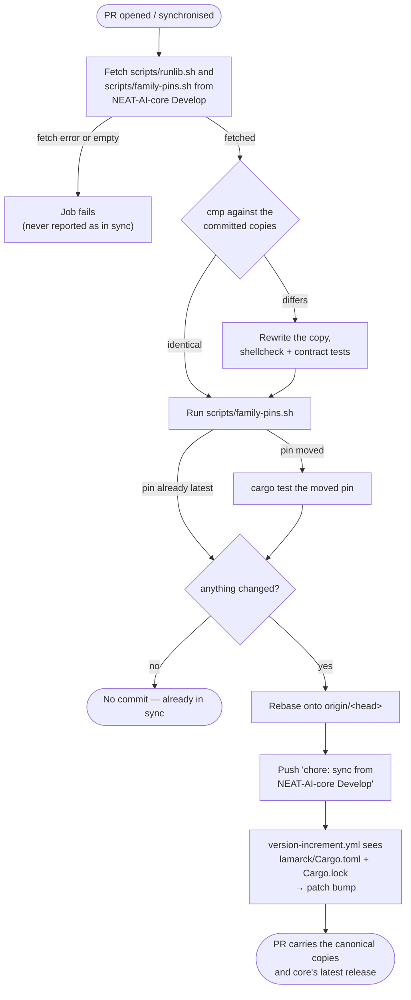

# Pin neat-core to a release tag and refresh the pin on every PR

## Summary

`neat-core` is no longer a sibling `path` dependency that tracks core's head.
`lamarck/Cargo.toml` now carries a git dependency pinned to core's latest
release tag, and the `family-sync` job moves that pin to the newest release on
every PR — so the workspace builds in a bare clone and core releases arrive
through this repository's own PR, compiled and tested where they land.
Closes #235.

- **`lamarck/Cargo.toml`** — `neat-core = { git = "https://github.com/stSoftwareAU/NEAT-AI-core", tag = "v0.22.5" }`,
  on one line (the form `family-pins.sh` rewrites); `Cargo.lock` regenerated and
  now records the resolved commit `771ad136…`.
- **`scripts/family-pins.sh`** — a byte-identical copy of NEAT-AI-core
  `Develop`'s canonical script (NEAT-AI-core#681), never edited here.
- **`.github/workflows/family-sync.yml`** — syncs *both* canonical scripts,
  re-lints and re-runs their contract tests where refreshed bytes arrive, then
  runs `family-pins.sh`; a moved pin is compiled and tested in the same job, and
  the refreshed scripts, the moved pin and the updated `Cargo.lock` travel in
  one commit.
- **`scripts/bump-lamarck-version.sh`** — now triggers on `lamarck/Cargo.toml`
  and `Cargo.lock` as well as `lamarck/src`, the same paths
  `version-increment.yml` already filtered on. A pin move touches only the
  first two, so without this the pin moved at an unchanged crate version and
  remotes kept the stale binary.
- **`.github/dependabot.yml`** — excludes `neat-core`: a Dependabot PR moving
  the git-tag pin would race the sync commit that carries the matching
  `Cargo.lock` change and version bump.
- **Sibling checkout retired** — `.github/actions/setup-neat-core` is deleted
  and removed from `ci.yml`, `auto-format.yml`, `cargo-quality.yml`,
  `security.yml` and `sbom.yml`.
- **Baseline gate removed** — `scripts/check-neat-core-version.sh` and
  `neat-core.expected-version` guarded an unpinned path dependency that no
  longer exists. Its job (catching a breaking core release) is now done where
  the pin moves: the family-sync job compiles and tests it.
- **`deny.toml`** — allows the one `stSoftwareAU/NEAT-AI-core` git source;
  every other git source stays denied (`cargo deny check` fails otherwise).
- **`auto-format.yml`** — no longer runs `cargo update -p neat-core`; a second
  mover would race the commit carrying the matching `Cargo.lock` bump, and
  `check-auto-format-workflow.sh` now fails CI if it reappears.

## Evidence

Backend/CI change — no web interface to screenshot. The evidence is command
output and tests.

**The workspace builds with no `NEAT-AI-core` checkout beside it.** This
container has no sibling clone (`ls ../../` → `pr-branch-update  s1  s2`):

```text
$ cargo build --workspace
   Compiling neat-core v0.22.5 (https://github.com/stSoftwareAU/NEAT-AI-core?tag=v0.22.5#771ad136)
   Compiling neat_ai_lamarck v0.1.37 (…/NEAT-AI-Lamarck/lamarck)
    Finished `dev` profile [unoptimized + debuginfo] target(s) in 8.80s
```

**A pin behind core's latest release is moved, and `Cargo.lock` follows.** The
shipped pin was temporarily set back to `v0.22.0` and the real script run:

```text
$ ./scripts/family-pins.sh
[family-pins] neat-core v0.22.0 → v0.22.5 (lamarck/Cargo.toml)
[family-pins] 1 pin(s) moved; Cargo.lock updated
$ grep -n 'neat-core = ' lamarck/Cargo.toml
30:neat-core = { git = "https://github.com/stSoftwareAU/NEAT-AI-core", tag = "v0.22.5" }
$ ./scripts/family-pins.sh   # idempotent: already latest, exits 0 changing nothing
```

**The full gate passes**: `./quality.sh < /dev/null` → `All quality checks
passed!` (shellcheck, both canonical-script contract suites, every workflow
validator, codespell, `cargo deny check`, fmt, clippy with `-D warnings`, the
whole test suite, rustdoc). `actionlint` is clean and `markdownlint-cli2` finds
0 issues.



**A pin-only change now bumps the crate version.** The regression case added
to `scripts/test-bump-lamarck-version.sh` was observed failing against the
unwidened script (`expected '0', got '1'` — "no changes under lamarck/src") and
passing after it:

```text
OK   moved pin, no src change → bump (0)
OK   a moved pin bumps the manifest patch (0.5.2)
OK   a moved pin syncs Cargo.lock (0.5.2)
```

Reviewer note — one conditional: the pushed sync commit triggers
`version-increment.yml` only when the push is made with the configured App
token; a push made with the default `GITHUB_TOKEN` starts no new workflow run,
so the bump then rides the next push to the branch. The job says so out loud
(`::warning::` in the push step) rather than leaving it to be found after
merge, and that same re-trigger gap is why a moved pin is compiled and tested
inside the family-sync job itself.

## Acceptance Criteria

<!-- vibe-spec-review inputs="diff+issue-body" -->

- **met** — The workspace builds with no `NEAT-AI-core` checkout beside the repo — evidence: `lamarck/Cargo.toml:30` git-tag pin, `Cargo.lock:197` `source = "git+…?tag=v0.22.5#771ad136…"`, and `cargo build --workspace` resolving through `$CARGO_HOME/git/checkouts/` with no sibling clone present — reviewer: met
- **partial** — A PR whose pin is behind core's latest release receives a CI commit moving the tag and `Cargo.lock`, followed by the patch bump — evidence: `.github/workflows/family-sync.yml:144-199` (move, build, stage, push) and `scripts/test-bump-lamarck-version.sh::moved pin, no src change → bump` — reviewer: partial — reason: the reviewer verified the move but proved the bump half broken — `scripts/bump-lamarck-version.sh` short-circuited on `lamarck/src` only, so a pin-only change exited 1 "no bump needed". Fixed in this diff: the script now triggers on `lamarck/src`, `lamarck/Cargo.toml` and `Cargo.lock` (the same paths `version-increment.yml` filters on), with a regression case observed failing before the fix. One conditional remains, recorded in Evidence: when the sync push falls back to `GITHUB_TOKEN`, no workflow re-runs on it, so the bump rides the next push — `family-sync.yml:186-192` now warns loudly in exactly that case.
- **met** — Tests and quality checks pass — evidence: `./quality.sh < /dev/null` → `All quality checks passed!`, re-run after the final edit; `cargo deny check` → `sources ok`; `actionlint` clean — reviewer: met
- **unrequested** — the family-sync job runs `cargo test --workspace --all-features` on a moved pin (`family-sync.yml:158-160`, `timeout-minutes: 30`) — reviewer: unrequested — reason: kept. The issue's failure detection says "the CI build fails on a breaking core release", and a push made with the default `GITHUB_TOKEN` starts no new workflow run — without this, a breaking release merges with CI green.
- **unrequested** — the "Gate the refreshed scripts" step re-lints and re-runs the contract tests of a refreshed copy (`family-sync.yml:128-142`) — reviewer: unrequested — reason: kept, same re-trigger gap: the refreshed bytes are gated where they arrive or not at all.
- **unrequested** — `check-auto-format-workflow.sh` now *prohibits* moving the pin rather than requiring it (`scripts/check-auto-format-workflow.sh:85-94`) — reviewer: unrequested — reason: kept. Deleting the old `cargo update -p neat-core` step follows from the issue; leaving the rule that demanded it would have failed CI, and a rule that its reappearance is refused is the one-mover invariant the issue's design depends on.
- **unrequested** — `scripts/test-family-pins.sh` (136 lines) — reviewer: unrequested — reason: kept, matching `test-runlib.sh` from #234; `quality.sh` and the family-sync refresh step both need a contract to run against the copied script.
- **unrequested** — `deny.toml` `allow-git` entry — reviewer: unrequested — reason: required consequence, not creep: `unknown-git = "deny"` fails `cargo deny check` on the new git source.
- **unrequested** — `.github/dependabot.yml` excludes `neat-core` — reviewer: unrequested — reason: raised by the Standards reviewer; Dependabot bumps cargo git-tag pins, which would make it a second mover racing the sync commit.

## Standards Review

<!-- vibe-standards-review inputs="diff+CODING-STANDARDS.md" -->

- **violation** — the "moved pin ⇒ patch bump" promise could not fire — evidence: `scripts/bump-lamarck-version.sh:112` (`git diff --quiet … -- "$SRC_PATH"`) — reason: fixed here; the trigger is now `lamarck/src`, `lamarck/Cargo.toml` and `Cargo.lock`, and `scripts/test-bump-lamarck-version.sh` carries the regression case (observed red, then green).
- **violation** — the new auto-format guard matched one spelling only — evidence: `scripts/check-auto-format-workflow.sh:85` — reason: fixed here; `-p`, `--package` and a direct `family-pins.sh` invocation all fail now, with a fixture each.
- **violation** — `.github/dependabot.yml:21-22` still described `neat-core` as a sibling path dependency, and nothing stopped Dependabot moving the pin — reason: fixed here; the comment is corrected and an `ignore: dependency-name: neat-core` entry added.
- **violation** — `docs/scorer-fixed-cost.md:187-189` still claimed this repo assumes a sibling layout — reason: fixed here.
- **violation** — two `### Added` headings inside one `## [Unreleased]` — evidence: `CHANGELOG.md:9` and `:44` — reason: fixed here; the new entry is merged into the existing `### Added`.
- **violation** — weak validator rules: rule 8 matched any mention of `family-pins.sh`, rule 16 read only the first `add` line, rule 17 accepted a `cargo build` anywhere in the job — evidence: `scripts/check-family-sync-workflow.sh:152-159, 257-274, 280-286` — reason: fixed here; rule 8 looks only at fetch-target declarations, rule 16 scans every `git add` line, rule 17 requires the build inside the step that runs `family-pins.sh`. Three fixtures (including a decoy `add` step and a build parked in an unrelated step) cover them.
- **violation** — `scripts/test-family-pins.sh` covers only error paths; no test moves a pin — evidence: `scripts/test-family-pins.sh:17-21` — reason: stands. A hermetic happy path is not reachable: the copied script only treats `https://github.com/stSoftwareAU/NEAT-AI-*` URLs as family pins, so a local `git init` fixture is never recognised, and a networked variant dies in the trailing `cargo update` outside a workspace. The move is covered where it runs — the family-sync job — and was exercised by hand here (`v0.22.0 → v0.22.5`, recorded in Evidence). The script's own home, NEAT-AI-core, owns its happy-path suite.
- **clean** — the copy contract (both canonical scripts verified byte-identical to core `Develop` with `cmp`); fail-loud discipline in the new workflow (fetch error, empty fetch, `diff` fault, unreachable origin, rebase conflict); bash 3.2 compatibility (no `mapfile`, guarded empty-array expansion, BSD-safe `sed`); workflow rules (40-char SHA pins with version comments, least-privilege `permissions:`, checkout credentials not persisted, `milestone/**` in every branch filter, `set -euo pipefail` in every multi-line `run:`, `github.*` values passed through `env:`); Australian English throughout; no hidden paths staged beyond `.github/**`; docs updated together (README, CONTRIBUTING, CHANGELOG, `quality.sh`, `ci.yml` required files, the repo-layout tree) with no dangling references to the deleted gate.

## Test Plan

- **Added `scripts/test-family-pins.sh`** (15 assertions, hermetic — no
  network, no cargo): `--help` and usage errors exit 0/2; a manifest with no
  family pin, a commented-out pin and a non-family git pin are left
  byte-for-byte alone; a multi-line family pin fails loud naming the file and
  the line rather than reading as "already current". Wired into `quality.sh`
  and the CI **Shell Script Quality** job, and re-run by `family-sync.yml`
  whenever the copied script is refreshed.
- **Extended `scripts/check-family-sync-workflow.sh`** with four new rules
  (both canonical scripts fetched; `family-pins.sh` actually run;
  `lamarck/Cargo.toml` + `Cargo.lock` staged; a moved pin compiled) and
  **`scripts/test-check-family-sync-workflow.sh`** with a fixture per rule —
  each mutates the shipped workflow one way and asserts the validator exits 1.
  All four fixtures were observed failing the validator, and the shipped
  workflow passing it.
- **Inverted the `neat-core` rule in
  `scripts/check-auto-format-workflow.sh`** (auto-format must *not* move the
  pin) with a new fixture in `scripts/test-check-auto-format-workflow.sh` that
  reintroduces `cargo update -p neat-core` and asserts exit 1.
- **`lamarck/tests/contributing_contract.rs`** — the README-owned-facts list
  named the deleted `neat-core.expected-version`; it now names
  `family-sync.yml`.
- Existing suites unchanged and green, including `readme_contract.rs` and the
  repository-layout contract that tracks the top-level file list.
