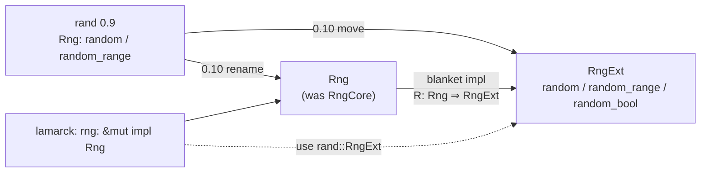

## Summary

Dependabot PR #243 bumped `rand` from 0.9.5 to 0.10.2 and turned the **Quality
Checks** job red: rand 0.10 renamed `RngCore` to `Rng` and moved the generator
helpers (`random`, `random_range`, `random_bool`) onto a new `RngExt` trait, so
23 draws across the crate no longer resolved. This PR carries the bump *and*
the migration, so the workspace compiles, lints and tests clean on rand 0.10.2.
Closes #244.

The migration is import-only. `RngExt` is blanket-implemented for every `Rng`
(`impl<R: Rng + ?Sized> RngExt for R {}`, rand-0.10.2 `src/rng.rs:321`), so the
`rng: &mut impl Rng` bounds throughout `candidates.rs`, `focus.rs`,
`propagate_layout.rs`, `screen_thresholds.rs` and `structural.rs` are unchanged
— only the `use` lines moved. No call site, seed or draw order changed.

`StdRng` now draws through `chacha20` instead of `rand_chacha` with identical
output, and the lockfile resolves a single `rand` (0.10.2) — `neat-core` does
not pull rand in, so there is no split-version interop to reconcile.

`lamarck/Cargo.toml` goes to 0.1.39 (binary-affecting change), with `Cargo.lock`
in step.

## Evidence

Backend/CLI change with no web interface, so no screenshot applies. The
evidence is the gate:

- `./quality.sh` — **all quality checks passed** (cargo-deny, `cargo fmt
  --check`, `cargo clippy --workspace --all-targets --all-features -D
  warnings`, `cargo test --workspace --all-features`, `cargo doc` with
  `RUSTDOCFLAGS=-D warnings`). 559 lib tests plus the integration and doc-gate
  suites, 0 failures.
- Before the migration, on the same tree with only the version bump applied:
  `cargo check --workspace --all-targets` failed with **19 `E0599` errors in
  the lib and 23 in the lib tests** ("no method named `random_range` found for
  mutable reference `&mut impl Rng`"), plus an `E0689` ambiguous-numeric
  `sqrt`, matching PR #243's CI log exactly. After the migration the same
  command is clean.
- The seed-stability tests that already existed
  (`candidates::tests::weighted_slot_order_puts_heavy_slots_first_and_is_seed_stable`,
  `focus`, `analysis`) pass unchanged, which is what confirms the draw
  behaviour survived the 0.9 → 0.10 move.

## Test Plan

- Added `structural::tests::random_uuid_v4_is_rfc4122_shaped_and_seed_reproducible`
  — pins the `random_uuid_v4` contract across the trait move: 8-4-4-4-12 hex
  grouping, the v4 version nibble, the `10xx` variant nibble, one seed redrawing
  the same uuid and a different seed drawing a different one. `random_uuid_v4`
  had no direct coverage before; it was only exercised incidentally by the
  bridge tests.
- No existing test was modified, commented out or removed.
- Full suite: `cargo test --workspace --all-features -- --test-threads=2` — all
  green.

## Notes for the reviewer

This supersedes Dependabot PR #243, which carries the same manifest bump without
the code migration and cannot go green on its own.
