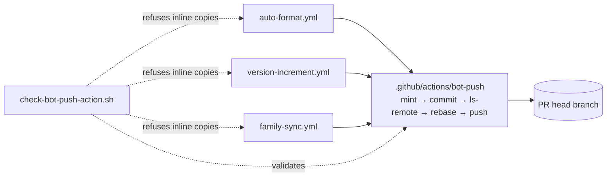

## Summary

`auto-format.yml`, `version-increment.yml` and `family-sync.yml` each carried
their own copy of the push-token mint and commit/push steps. All three now
call one composite action, `.github/actions/bot-push`, which takes the branch,
the commit message, `add-paths` (empty stages every tracked modification), the
App secrets and `ACTIONS_PUSH`. The App → `ACTIONS_PUSH` → `GITHUB_TOKEN` chain
and the auth-header construction now live in that one file, along with the
absolute `git`/`base64` paths, hooks disabled on every git call, the split
between a deleted branch and an unreachable origin, and the rebase before push.
Closes #252.

Because there is now one implementation, auto-format and version-increment get
the hardened handling that only family-sync had. Previously, version-increment
treated any `ls-remote` failure, including a network error, as "branch gone"
and exited green. Neither job rebased onto a concurrent bot push. The rebase
also gained `--autostash`, so a tracked change outside `add-paths` cannot
block it.

`scripts/check-bot-push-action.sh`, run from `quality.sh` and CI, stops the
copies coming back. It validates the action and fails when any workflow
carries its own push logic (`create-github-app-token`, `extraheader` or
`push origin`), or calls the action without the push secrets. The three
existing workflow validators now require the push to go through the action.

## Evidence

This is a CI-only change with no UI.

- `./quality.sh < /dev/null` passes in full, and `actionlint` passes. actionlint
  also checks each call against the local action's declared inputs.
- `scripts/test-check-bot-push-action.sh`: 25 cases. Each one mutates the action
  or a copy of the workflows to break a single rule, then asserts the exit
  code.
- Smoke test, not committed: the action's `run:` script was extracted and run
  against a local bare `origin`.
  - Concurrent remote commit: rebased and pushed, and only `add-paths` was
    committed.
  - Empty `add-paths`: staged tracked modifications.
  - Deleted branch: `::notice::` and exit 0.
  - Unreachable origin: `::error::` and exit 1.
  - Genuine conflict: `::error::`, exit 1, and no rebase left behind.
  - The first smoke run showed that an unstaged tracked change blocked the
    rebase, which is why `--autostash` was added.

## Test Plan

- Added `scripts/check-bot-push-action.sh` and its behaviour test
  `scripts/test-check-bot-push-action.sh`, wired into `quality.sh` and
  `ci.yml`.
- `scripts/check-family-sync-workflow.sh` (and its test):
  - The pushing step is now recognised as `uses: ./.github/actions/bot-push`.
  - The rebase and auth-chain rules became one "push goes through the action"
    rule.
  - Pin staging is read from `add-paths:`, including `${{ env.VAR }}`
    references.
- `scripts/check-auto-format-workflow.sh` and
  `scripts/check-version-increment-workflow.sh` (and their tests) now require
  delegation to the action. Each has a hand-rolled-push case that must fail.
- README has a new "Shared bot-push action" section with a sequence diagram,
  and there is a CHANGELOG entry.
