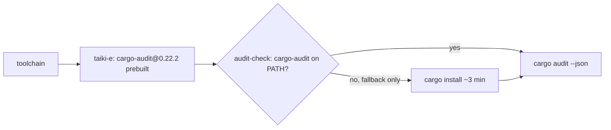

# PR Summary — Issue #253: stop compiling cargo-audit on every security run

## Summary

`security.yml` installs a prebuilt `cargo-audit@0.22.2` from
`taiki-e/install-action` (already SHA-pinned in `ci.yml`) before running
`rustsec/audit-check`. The action's `findOrInstall` checks PATH first and only
falls back to `cargo install cargo-audit` when the tool is missing. With the
binary already on PATH, the compile never runs.

Closes #253

## Evidence (CI-only change)

| | Before | After |
|---|---|---|
| cargo-audit source | `cargo install` compile on every run | prebuilt upstream release binary |
| Measured cost (from the issue) | median 3.1 min × 6.7 runs/week ≈ 18 min/week | download of a few seconds, with no compile |
| Poisoning / staleness risk | n/a | none: an exact version pin and no cache |

`RUSTUP_TOOLCHAIN: stable` is kept, because it still governs the `cargo audit`
call and the fallback path (PR #361).

## Scope decision: family-sync caching not added

The issue also suggested caching in `family-sync.yml`. That was investigated
and deliberately left out:

- Every Actions cache in this repo is PR-scoped (`refs/pull/N/merge`). No
  workflow saves on `Develop` except CodeQL, so one PR can never restore
  another PR's cache.
- family-sync compiles only when the neat-core pin moves. That happens once per
  PR, because the bot pushes the moved pin and later runs are no-ops.
- A cache saved on that single run would almost never be restored. It would
  add save overhead and eat into the cache quota for no measurable gain.

## Test Plan

- [x] `actionlint .github/workflows/security.yml` is clean.
- [x] `scripts/check-workflow-npm-pins.sh` passes (the tool install is pinned
      to an exact version).
- [x] The action SHA was reused from the existing `ci.yml` pin (v2.81.10); its
      manifest ships a prebuilt cargo-audit 0.22.2.
- [x] `./quality.sh` passes.
- [ ] After merge-candidate CI: the `security` job shows no `cargo install cargo-audit` compile.
