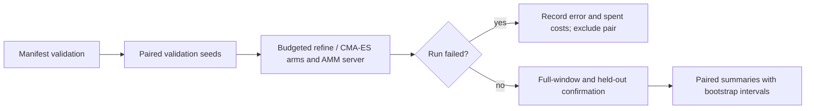

## Summary

Add an opt-in, offline benchmark of local weight optimisers under explicit
evaluation budgets (`lamarck/src/weight_bench/`, the `weight_router_bench`
example), an offline AMM reference driver pinned to the authors' release, and
synthetic evidence. A budget-aware router and its landscape probes were
measured, never beat CMA-ES alone, and were removed; AMM lost in every cell, so
nothing is ported. Nothing in the optimisation loop calls the benchmark and no
default changes. A corpus run records a fingerprint of the model and records
it used. The representative comparison on production inputs is still
outstanding. Part of #266.

This branch is the earlier PR #271 work, squashed onto the current `Develop`
after #271 was closed for a `CHANGELOG.md` conflict. The conflict was two
adjacent `### Added` bullets (#267 and #266); both are kept. Most CI gate
fixes that PR #271 carried are already on `Develop` through #270. One gate fix
is in this diff, outside the benchmark: `.gitleaks.toml` (commit `659f2d7`).

- **`.gitleaks.toml`.** `Develop`'s config held an empty `[allowlist]`
  (`commits = []`). gitleaks 8.30.1 refuses to load it ("`[[allowlists]]`
  must contain at least one check for: commits, paths, regexes, or
  stopwords"), so the secret scan stopped before scanning anything. The new
  config is `[extend] useDefault = true`: the gitleaks default rule set with
  no allowlist, so nothing is exempted. `gitleaks detect --config
  .gitleaks.toml --log-opts="origin/Develop..HEAD"` scans this PR's commits
  and reports "no leaks found".

- [x] Read and pin the full AMM method; check release compatibility.
- [x] Run AMM, CMA-ES and the refinement surrogate on fixed synthetic screening records.
- [x] Correct comparison and accounting defects; validate failure handling.
- [x] Remove the router and probes after the negative finding; regenerate evidence from head.
- [x] Re-land the work on the current `Develop` and pass `./quality.sh`.
- [x] Fix the gitleaks config so the secret scan loads.
- [x] Pin influential-synapse choice, best-point confirmation, per-arm reference comparisons and the committed manifest with tests.
- [x] Record a model/data fingerprint (`corpusFingerprint`) on corpus runs.
- [ ] Establish production-baseline equivalence and run representative inputs.
- [ ] Complete full authoritative confirmation on representative inputs.

## Spec

### Intent and Rationale

- Compare local weight search under explicit budgets without touching production acceptance, so a negative or positive finding costs nothing in the run loop.
- The squash re-lands reviewed work instead of rewriting it; only the changelog conflict needed resolving.

### Essential Design Decisions

- `lamarck-refine` is a random-axis surrogate that reuses `RANDOM_DELTA_HALF_WIDTH` (`candidates.rs`) and `STEP_FRACTIONS` (`followup.rs`); it is not `generate_candidate_batch`, and the docs claim no equivalence.
- The router and probes are removed, not kept: the issue ports only winning probes or routers. With no tuned parameter there is no calibration phase; `Manifest` refuses unknown fields, so a stale `calibrationSeeds` is rejected.
- AMM runs only in a separate, checksum-pinned scratch Python environment (preset `c46`); no dependency is added and it never runs in CI.
- Errored rows never enter paired distributions, while their spent evaluations stay counted.

### Undiscoverable Facts

- The full method in [arXiv:2611.06879v1](https://arxiv.org/pdf/2611.06879v1) was read (Section 3, Algorithms 1–2, Tables 2/6, Appendices A–B). The paper's `v0.3.0` resolves to `c4f0ab160aae912311328145aa5a426b26a06b26`; `v0.3.0` and the pinned `v0.7.0` gave 27 identical rows on one validation seed.
- No authorised production model and corpus pair was found on the host, so representative coverage is zero.
- The worker's pre-push gate reads a SHA-pinned `dtolnay/rust-toolchain` ref as a toolchain (`cargo +29eef336… --version` exits 101). `Develop` routes three jobs through `.github/actions/rust-toolchain`, but `ci.yml`'s `validation` job, `auto-format`, `cargo-audit`, `sbom` and `security` still call the pinned action directly.

## Evidence

CLI/backend only; no UI file is touched.

- `docs/evidence/weight-router/manifest.json`, `summary.json` and `reference-summary.json` come from the current benchmark code (`formatVersion` 2): 648/648 runs, 0 failed, 1,631,615 evaluations. CMA-ES beat the surrogate in 19 of 27 cells, lost 1, and 7 were inconclusive. Over the committed 324 AMM rows, AMM is worse in all 54 comparisons. These are synthetic results, not representative ones.
- `docs/evidence/weight-router/method-check.json` and `amm-runs.jsonl` are router-era output (crate 0.1.46); `docs/weight-optimiser-routing.md` labels them so.
- `Cargo.lock` moves `rustix` 1.1.4 → 1.1.6 for RUSTSEC-2026-0486, which the dependency audit flagged on #271.
- `corpusFingerprint` (FNV-1a hashes of the creature file and of the loaded records, plus the record count) is written to a corpus run's results and `summary.json`. The synthetic suite omits it, so the committed evidence is unchanged.
- `.gitleaks.toml`: the old config fails to load (`FTL Failed to load config`); the new one scans `origin/Develop..HEAD` with "no leaks found".
- #266: Experiment: Benchmark budget-aware routing of local weight optimisers.

```mermaid
flowchart LR
    M[Manifest validation] --> V[Paired validation seeds]
    V --> B[Budgeted refine / CMA-ES arms and AMM server]
    B --> F{Run failed?}
    F -->|yes| E[Record error and spent costs; exclude pair]
    F -->|no| H[Full-window and held-out confirmation]
    H --> S[Paired summaries with bootstrap intervals]
```

## Acceptance Criteria

<!-- vibe-spec-review inputs="diff+issue-body" -->

- **partial** — Use AMM as an offline reference against the current refinement method and CMA-ES on fixed deterministic screening records. — evidence: `lamarck/tests/weight_bench_reference.rs::committed_evidence_parses_and_summarises`, `docs/evidence/weight-router/reference-summary.json` — reviewer: partial — reason: `lamarck-refine` is a random-axis surrogate (`lamarck/src/weight_bench/refine.rs`), not the production `generate_candidate_batch` pipeline.
- **partial** — Test plateaus/kinks and activation families, then full/held-out confirmation. — evidence: `lamarck/tests/weight_bench.rs::confirmation_losses_are_measured_at_the_arms_best_point`, `docs/weight-optimiser-routing.md` (tanh, relu, hard-tanh; per-cell held-out results in `summary.json`) — reviewer: partial — reason: activation families are tested, but (1) full-window confirmation is computed per run and never compared or reported: `summarise_cells` reads only the normalised screening and held-out losses, the verdict ignores the full-window loss, `summary.json` and `reference-summary.json` carry no full-window field and `runs.jsonl` is not committed; (2) no plateau-bearing problem is demonstrated: `select_influential` frees the most loss-sensitive synapses, the plateau/kink probes were removed, and no test or committed evidence shows a plateau axis, so the `hard-tanh` label in `docs/weight-optimiser-routing.md` no longer claims plateaus.
- **partial** — Identify code/model/data versions; separate calibration from untouched validation and count all preparation/search costs. — evidence: `lamarck/tests/weight_bench.rs::corpus_runs_fingerprint_the_model_and_records`, `lamarck/tests/weight_bench.rs::total_evaluations_count_confirmations_and_preparation_once_per_problem` — reviewer: partial — reason: code is named by crate version only (no git commit or neat-core version), no model/data version is frozen for a representative run, and costs are counted in evaluations only, with no wall-clock time.
- **partial** — Deliver a reproducible command/manifest and machine-readable results with paired distributions, uncertainty, failures and actual coverage. — evidence: `lamarck/examples/weight_router_bench.rs`, `docs/evidence/weight-router/manifest.json`, `summary.json` (648/648 runs) — reviewer: partial — reason: `amm-runs.jsonl` and `method-check.json` come from the router-era build 0.1.46 and are not regenerated from head, `runs.jsonl` is not committed, and representative coverage is 0 runs.
- **unrequested** — `.gitleaks.toml` replaces an empty `[allowlist]` with `[extend] useDefault = true` — reviewer: unrequested — reason: gitleaks 8.30.1 refuses to load the old config, so the secret scan could not run.
- **unrequested** — `Cargo.lock` bumps `rustix` 1.1.4 → 1.1.6 — reviewer: unrequested — reason: RUSTSEC-2026-0486, flagged by the dependency audit.
- **unrequested** — `.gitignore` adds `__pycache__/` — reviewer: unrequested — reason: a side effect of the new Python AMM scripts.

## Standards Review

<!-- vibe-standards-review inputs="diff+CODING-STANDARDS.md" -->

The repository has no `CODING-STANDARDS.md`; the reviewer used `CONTRIBUTING.md`, the README development rules, `.codespellrc`, `.markdownlint.json` and the workspace lints. It reviewed up to `cc4adbd`, before the fingerprint commit.

- **violation** — `CONTRIBUTING.md` › Version bumping: "Every binary-affecting change must bump the patch version in `lamarck/Cargo.toml`" — evidence: `lamarck/Cargo.toml:3` (still 0.1.47, equal to `Develop`) — reason: not fixed. The PR workflow's auto-increment bumps an equal version ("Equal versions may still auto-patch-bump"). A local bump would also make the committed evidence's `crateVersion` 0.1.47 differ from the code.
- **clean** — `CONTRIBUTING.md` › Changelog: "Record notable changes under **[Unreleased]**" — evidence: `CHANGELOG.md` `### Security` now records the `.gitleaks.toml` change (the secret scan loads and runs the default rule set) and the `rustix` 1.1.4 → 1.1.6 bump for RUSTSEC-2026-0486, and the benchmark entry records the AMM driver keeping a failed run's row. The earlier review listed this as a violation (not fixed); it is fixed in the review-fix commit.
- **clean** — new tests follow TDD and were red-checked; `cargo fmt --check` passes; codespell and markdownlint are clean on the changed files; no new crate dependency; corpus loading is bounded by `maxRecords`; the README layout lists `weight_bench/`; commits carry the Co-Authored-By trailer.

## Test Plan

- `timeout 1700 ./quality.sh < /dev/null` passed on `e037572`, which carries every code and test change here (exit 0, "All quality checks passed!"): shell and workflow checks, spelling, dependency audit, formatting, Clippy, workspace tests and rustdoc.
- `timeout 1700 ./quality.sh < /dev/null` was re-run on the review-fix working tree (the changes after `e037572` are the AMM driver and its test, `CHANGELOG.md`, `docs/weight-optimiser-routing.md` and this summary) and passed (exit 0, "All quality checks passed!"). markdownlint is clean on the three changed Markdown files.
- `cargo test --test weight_bench --test weight_bench_reference < /dev/null` (from `lamarck/`) passed 22 and 13, with one debug-mode ignore; `cargo test --lib weight_bench` passed 2.
- Tests added by this PR include `lamarck/tests/weight_bench.rs::manifest_rejects_unknown_fields`, `manifest_rejects_duplicate_trial_identifiers` and `extrapolation_flag_marks_rows_and_cells_just_past_the_boundary`; `lamarck/tests/weight_bench_reference.rs::held_out_veto_turns_a_screening_win_inconclusive`, `failed_reference_with_completed_metrics_is_excluded_from_pairs` and `committed_evidence_parses_and_summarises`; `lamarck/src/weight_bench/experiment.rs::tests::failed_confirmations_keep_the_calls_already_spent`; and `lamarck/src/weight_bench/arms.rs::tests::arm_seeds_are_pinned`.
- `scripts/amm-reference.py` now closes the server's stdin after sending `done`, swallows the `BrokenPipeError` there and sets `proc.stdin = None`, so `Popen.__exit__` cannot re-raise past a row already read.
- Behaviour pins added after the pre-PR verifier, each shown red by breaking the code and green when it is restored:
  - `weight_bench.rs::select_influential_picks_the_most_sensitive_synapses` uses a creature whose third hidden neuron reaches the output through a zero weight. It asserts the exact indices returned for every `d`, that the two dead synapses are left out while live ones remain, and that the tied dead pair keeps the lower index. It goes red when the sensitivity comparator in `objective.rs` is reversed, and when the tie-break is reversed.
  - `weight_bench.rs::confirmation_losses_are_measured_at_the_arms_best_point` replays each `run_manifest` row's arm on the same budget and seed. It asserts the final screening, full and held-out losses and both normalised losses equal that best point's losses, on a fixture where the best point's full and held-out losses differ from the start's. It goes red when `finish_row` confirms the start instead of `best_x` on the held-out window, and again on the full window.
  - `weight_bench_reference.rs` fixtures now give CMA-ES (0.7 / 0.86) different values from refine (0.8 / 0.9). The verdict tests assert each comparison's mean, wins and verdict against its own second arm. They go red when `summarise_cells` reads refine rows for every pair.
  - `weight_bench.rs::corpus_runs_fingerprint_the_model_and_records` checks the creature hash against an independent FNV-1a computation. It shows that the same files give the same fingerprint, that one flipped record byte moves only the records hash, that one edited creature weight moves only the creature hash, and that a smaller `maxRecords` changes the count and records hash. Synthetic results serialise without the field. It goes red when the fingerprint is dropped, when only the first record or the first 10 creature bytes are hashed, and when the count is off by one.
  - `committed_evidence_parses_and_summarises` asserts the committed manifest equals `predeclared_manifest()`. It derives the AMM row count from the manifest's planned runs and requires every planned run complete. It goes red when the predeclared seeds or dimensions are changed.
- `scripts/test-amm-reference.py` (offline integration checks against the real pinned AMM and Rust server) was not re-run here: no scratch AMM environment exists, and building one needs network access. Its new case `test_server_error_before_done_keeps_the_real_row` (a server that answers a point with an error, writes its row and exits before `done`; asserts the row keeps `evaluationsUsed`, `preparationEvaluations`, `confirmationEvaluations` and the server's error text) was exercised only through an equivalent harness with stub `numpy` and `amm_optimizer` modules: the driver before the fix returned a zero-cost `BrokenPipeError` failure row, and after the fix returns the real row (7 / 145 / 3 evaluations).
- No existing test assertion is removed relative to `Develop`; the benchmark module and its test files are new.

## Merge verification

- Pushed through the normal guarded `git push`. GitHub CI is not yet verified.

Not done: representative runs on production inputs, production-baseline
equivalence, full authoritative confirmation, and a re-run of the AMM campaign
(its committed rows are re-summarised against the current in-process runs).
These prevent any optimisation-benefit or issue-completion claim.
