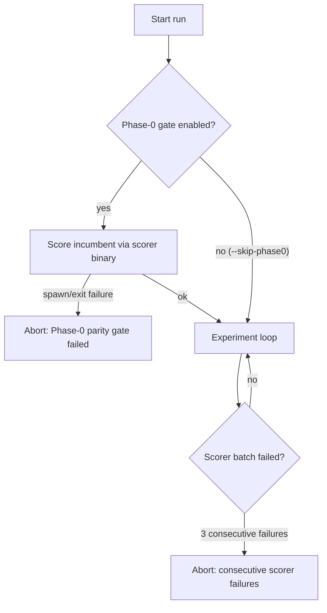

# PR summary — Issue #37

## Summary

The README **Inputs** list described "optional scorer binary path and output
directory". That is wrong: the scorer is mandatory. Safety invariant 3 gives the
scorer sole authority to declare a candidate fitter, so no run can complete
without one — only the `--scorer` *path override* is optional, and it falls back
to `rust_scorer` resolved on `PATH`.

The Inputs section now separates three classes and names each flag and default
so it matches `--help`:

- **required positionals** — creature JSON, training-data directory;
- **required but defaulted** — `--scorer` (`rust_scorer`), `--output-dir` (`.`),
  `--candidates` (`100`), `--timeout-seconds` (`2700`), `--min-improvement`
  (`1e-6`);
- **genuinely optional** — `--seed`, mutation-strategy flags.

Docs-only change; no `lamarck/src/` code touched, so no crate version bump is
required (CONTRIBUTING: "Docs-only or CI-config-only changes do not need a
bump"). A `CHANGELOG.md` **[Unreleased] → Fixed** entry was added.

Closes #37.

## Evidence

Backend/CLI documentation change — no web interface to screenshot.

The "mandatory" claim is verified against the code, not asserted:

- `lamarck/src/main.rs:47-49` — `--scorer` defaults to `rust_scorer`; there is no
  way to run without a scorer.
- `lamarck/src/run.rs:198` — Phase-0 aborts the run when the scorer call fails:
  `Phase-0 parity gate failed (scorer): …`.
- `lamarck/src/run.rs:654` — with `--skip-phase0`, the run aborts after
  `DEFAULT_MAX_CONSECUTIVE_SCORER_FAILURES` (`3`, `lamarck/src/config.rs:41`)
  consecutive scorer failures.
- `lamarck/src/run.rs:1077` — a run with zero successful scorer batches fails
  with "check rust_scorer path/binary".

Documented flag names and defaults were checked against the built binary's
`--help` output:

```text
      --timeout-seconds <TIMEOUT_SECONDS>   [default: 2700]
      --candidates <CANDIDATES>             [default: 100]
      --min-improvement <MIN_IMPROVEMENT>   [default: 0.000001]
      --seed <SEED>                         Optional deterministic random seed
      --scorer <SCORER>                     [default: rust_scorer]
      --output-dir <OUTPUT_DIR>             [default: .]
```

How a missing scorer actually terminates a run:



## Test Plan

- No behaviour change, so no new tests: this PR edits `README.md` and
  `CHANGELOG.md` only.
- `./quality.sh < /dev/null` passes end to end (shellcheck, workflow validators,
  codespell, cargo-deny, `cargo fmt --check`, clippy with warnings denied, the
  full test suite including the 4 `backprop_parity` tests, and rustdoc).
